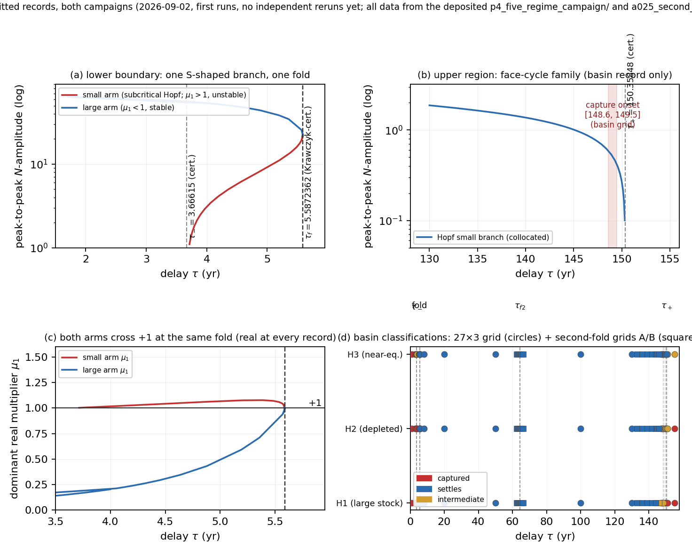

# Delay-Induced Regime Change in Harvested Stocks: The Mobilising and Protective Channels of Institutional Feedback, and the Review Interval as Control

*Version log (v26).* Applies the verified small-error cluster of the joint audit: Corollary 6.1's proof pairs the deployment delays $(\tau_M, \tau_p)$ — not the filter relaxation time $\tau_m$, which never shares an equation with the deployment delays by the paper's own notation rule; Section 1.1 points to the phase-stabilised window of Section 5.1 (where that window is defined and opened), not Section 4; and the five-regime topology's regime (iii) no longer claims the second-fold branch's unstable upper arm exists "through this window" — the registered record places it on the regime-(iv) interval $64.4 < \tau < 150.4$ yr above the second fold, matching Section 9.3's statement. No theorem, spectral record, or table value changes.

## Abstract

Classical delay studies place lags in the ecological dynamics. Here the delay instead resides in the governance loop that converts observed stock decline into institutional response. We analyse a gated three-state model — stock, deficit memory, deployed effort — under two effort laws: a mobilising law whose gain grows with deployment, and a protective quota-tracking law whose gain restores toward a cap. The characteristic equation reduces to a cubic modulus condition with a phase relation, and a filter identity implies that positive roots come in even multiplicity.

For the mobilising channel, two subcritical Hopf crossings bound a delay window within which the equilibrium is stabilised; the crossings are interval-certified (near 3.7 and 150 yr). For the protective channel, the loop gain remains below unity at the calibrated point, so the equilibrium is exponentially stable at every delay — a no-Hopf theorem. Under periodic-review (sample-and-hold) governance, annual protective review remains stable, whereas annual mobilising review is unstable and restabilises only for review intervals above about 6.5 yr, via a Neimark–Sacker-type crossing; an apparent threshold reported by a first-order discretisation is a numerical artefact. Continuation in the delay reveals a five-regime attractor topology, with two folds certified at the discrete collocation level (the continuum off-grid residual stage and the continuous-delay lift remain open) and a basin-boundary transition toward a large-amplitude attractor of unverified identity.

The results indicate that the form and timing of institutional response, not ecological lag alone, determine whether governance stabilises or destabilises a harvested stock; the review interval acts as a local spectral design parameter.

**Keywords:** delay differential equations; Hopf bifurcation; institutional feedback; fisheries governance; sample-and-hold control; maturation delay; recruitment dynamics

## 1. Introduction

### 1.1 Delays in the governance loop

Delayed feedback has a long history in resource dynamics. Hutchinson (1948) showed that a delayed self-limitation term destabilises logistic growth. Ezekiel (1938) documented the two-year lag between price signals and supply response in the pork cycle. Ludwig, Jones, and Holling (1978) placed delays and hysteresis at the centre of outbreak dynamics. Gurney, Blythe, and Nisbet (1980) gave the canonical stability analysis of the single-species delayed logistic equation. Costantino et al. (1995) demonstrated delayed-feedback cycles in controlled laboratory populations. A large contemporary literature continues this line, with delays placed in the ecological dynamics themselves — maturation and stage structure (Aiello and Freedman, 1990; Kuang, 1993).

The delay studied in this paper sits elsewhere: in the *institutional* loop. Stock assessment produces a signal of decline; the signal is filtered into a deficit memory; the memory drives a change in deployed extraction effort, with a deployment delay between decision and action. The behavioural basis for such lags is documented. Decision makers in renewable-resource experiments systematically misperceive the dynamics of the systems they govern, responding too slowly and in the wrong functional form (Moxnes, 1998). Institutional design determines which signals reach which actors at which time (Ostrom, 1990). What the dynamical-systems literature has not supplied is an analysis of what this delay *does* to the stability of a harvested-stock system when the delay sits in the governance controller rather than in the ecology. In particular: does the sign structure of the feedback law (mobilising versus protective) select between qualitatively different bifurcation behaviour? And what happens when the delay is replaced by periodic review (sample-and-hold)? The present paper takes up both questions on a declared class of stock–memory–effort models.

The overshoot mechanism analysed throughout has a one-sentence single-asset form. A hen produces a sustainable flow of eggs $S(N)$ each year; consumption $D$ above $S(N)$ cannot be conjured, so the shortfall is covered by slaughtering the hen — the asset is destroyed to meet present demand. The loop is self-reinforcing: a deficit raises liquidation pressure, liquidation lowers the stock, the lower stock lowers sustainable yield, and the deficit grows. With the institutional deployment delay of this paper inserted into the loop, the deficit is observed, filtered, and answered with a lag. The hen's loop is then the delayed mobilising channel whose bifurcation analysis occupies Sections 2–9. The delay does not create the shortfall; it decides when the response to it arrives. The phase-stabilised window of Section 5.1 is the interval of delays inside which the lag, not the feedback, holds the loop stable.

Not all liquidation channels are the same. Killing the hen removes a reproducing adult at once (culling the standing stock). Eating fertilised eggs suppresses next year's recruits without touching a living adult (recruitment suppression). Eating an apple often leaves the seed unharmed, so consumption and reproduction can be substantially decoupled. The first two channels are the two-channel mixture registered in Section 9.3 (M3-LC). That is why the channel assignment there requires age-, stage-, or replenishment-specific evidence rather than local spectra alone.

### 1.2 Contributions

1. **A gated three-state core.** A stock–memory–effort system (Section 2) in which a multiplicative saturation gate enforces the effort boundary exactly, making the admissible box forward invariant (Theorem 2.1). The model is a mathematical parameterisation, not a calibration to a named fishery; two reference parameter sets (Candidates A and B) serve as sensitivity anchors.

2. **The complete Hopf cubic and the even-pairs algebra.** The characteristic quasi-polynomial of the linearisation reduces to a cubic modulus condition with a phase relation (Theorem 4.1). At the interior equilibrium, a filter identity makes the cross term of the cubic vanish identically, so the total algebraic multiplicity of positive roots is even — generically zero or two distinct simple roots (Corollary 4.1). The two-frequency structure of the architecture is thereby an algebraic fact, not a numerical accident.

3. **Interval-certified crossings.** The two Hopf delays of the mobilising channel are certified by interval Newton on the cubic with outward rounding: τ− ∈ [3.6661490142739, 3.6661490142743] yr and τ+ ∈ [150.3584773101408, 150.3584773101421] yr at Candidate A (Section 4.1). The certification tier is stated precisely: the enclosures certify the *local spectrum* of the cubic. The method of Church and Lessard (2022), which certifies full Hopf bifurcation for retarded functional differential equations, is the stronger standard and is not claimed here.

4. **The sign separation.** The mobilising law (gain growing with deployed effort, $C_Z > 0$) and the protective quota-tracking law (restoring gain, $C_Z < 0$) yield opposite local mathematics on the same stock–memory block. The mobilising channel carries the Hopf pair, both crossings subcritical (Section 4.2). The protective channel carries a **no-Hopf theorem** — all cubic coefficients positive, Descartes' rule and Routh–Hurwitz exclude every imaginary root, and the loop gain peaks at 0.08011 < 1 — so exponential stability holds for every delay (Theorem 6.1). The two channels are interpolated, and a weighted small-gain theorem together with a conditional weight threshold show that delay-induced instability requires a sufficiently large mobilising weight (Section 4.4).

5. **The review interval as control.** Under sample-and-hold review with one explicit Euler step per period — the update timing fixed by the pre-review/post-review convention of Section 8 — the monodromy is computed in closed form (Proposition 6.2, Theorem 8.1). The protective channel is stable under annual review ($\rho = 0.9838$), and its instability threshold at $T_r \approx 2.306$ yr is a discretisation artefact of the Euler factor $1 + T_r C_E$ — provably not a Hopf of the continuous system (Section 6.2). The mobilising channel is unstable under annual review ($\rho = 1.00055$ Euler; $1.00035$ exact) and has its restabilising complex unit-circle crossing — the spectral signature of a Neimark–Sacker bifurcation, with nonlinear conditions not verified — at $T_r = 6.50$ yr under the exact held-measurement update (Proposition 8.1). The Euler-reported 47.536 yr crossing and its $-1$ multiplier at 79.143 yr are command-step artefacts. For a slow stock under this review operator, the review interval is a local spectral design parameter, and the continuous-delay recommendation does not transfer to periodic review (Section 8).

6. **Global numerics at declared status.** Continuation, Floquet-multiplier tracking, and basin tests give a five-regime attractor topology at declared certification tiers — and the tiers are stated precisely rather than as a single "certified" claim. Under the pre-registered five-regime campaign of Section 9.2, the lower boundary resolves into a single fold at $\tau = 5.5872362$ yr of one S-shaped branch — the subcritical-Hopf small arm and the stable large arm meet at one *discrete-collocation* Krawczyk-certified fold — and the upper boundary carries a second fold certified at the discrete-collocation level at $\tau_{f2} = 64.4023272$ yr of a second S-branch. For both the continuum off-grid residual stage and the continuous-delay lift remain **open**; a rigorous saddle-node result for the delay equation itself is not claimed (Beretka and Vas, 2020 covers specific classes; none is claimed for this system). The saddle-node-of-periodic-orbits classification remains **provisional** against a crisis alternative. The stable returning arm of the upper branch is not generically reachable near the fold, so the 148.6–149.5 capture onset is a basin boundary rather than a fold; the object captured there is a large-amplitude face cycle that no campaign could Fourier-collocate at $m = 64$ or $128$, and the link from the stable returning arm's last record ($\tau = 64.438$) to that cycle over an $\approx 84$-yr gap is an unverified conjecture. The five-regime reading of attractors (iv)–(v) is therefore a numerical reading that combines a certified-fold structure with an uncollocatable, unverified-capture region, and is reported as such.

### 1.3 Organization

Section 2 defines the model class and its admissible domain. Section 3 derives equilibria and the characteristic equation. Section 4 develops the Hopf cubic and the even-pairs algebra. Section 5 analyses the mobilising channel. Section 6 analyses the protective channel. Section 7 registers the maturation-delayed recruitment system — the applied analogue in which the same governance structure acts on a stock whose own delay is the maturation lag from spawning to recruitment — and records the companion stage-analysis fine-map bands and their nonlinear ground truth. Section 8 treats sample-and-hold review. Section 9 reports the global numerics and their certification levels. Section 10 unifies the two channels in the loop-gain family. Section 11 discusses design consequences, relation to the early-warning literature, and open problems. Section 12 concludes.

---

## 2. The Model Class

*Notation.* Throughout, $N$ is a renewable stock (material or biomass units); $Z$ is a filtered deficit-memory state (stock per time); and $E$ is an extraction effort, a dimensionless institutional deployment intensity rather than a conserved material or energy stock. The catchability $q$ has units (effort·yr)$^{-1}$; the signal references $\Delta_{\mathrm{ref}}$, $Z_{\mathrm{ref}}$ and the offset $\delta$ have stock-per-time units; $\eta$ and $\delta_0$ carry yr$^{-1}$ and effort-per-time units. These assignments make each equation dimensionally homogeneous without treating effort as physical mass. The delay $\tau$ is a discrete action/deployment delay; the filter timescale $\tau_m$ is an ordinary state relaxation time, not a second delay. The two sign channels are referred to as the *mobilising channel* (the feedback law whose gain grows with deployment) and the *protective channel* (the quota-tracking law whose gain restores toward a cap). Periodic-review results use *sample-and-hold* (an Euler-reviewed zero-order-hold sampling of the delayed signal at intervals of length $T_r$).

### 2.1 The gated three-state core

Let
$$S(N) = rN\left(1 - \frac{N}{K}\right), \qquad \mathrm{sp}_k(s) = \frac{1}{k}\log(1 + e^{ks}), \qquad \Phi_k(s) = \max\left\{0,\ \mathrm{sp}_k(s) - \frac{\log 2}{k} + \delta\right\},$$
where $\Phi_k$ is a shifted, non-negative signal map. The boundary-exact (gated) three-state core is
$$\begin{aligned}
\dot N &= S(N) - qEN, \\
\dot Z &= \frac{1}{\tau_m}\bigl[\Phi_k(qEN - S(N)) - Z\bigr], \\
\dot E &= \left(1 - \frac{E}{E_{\max}}\right)\left[\eta E\left(\frac{Z(t-\tau)}{\Delta_{\mathrm{ref}}} - \frac{E}{E_{\max}}\right) + \delta_0\frac{Z(t-\tau)}{Z_{\mathrm{ref}} + Z(t-\tau)}\right].
\end{aligned} \tag{1}$$

The memory input is a smoothed version of the stock-decline rate. On this core the identity $qEN - S(N) = -\dot N$ holds exactly, so $\Phi_k$ filters $-\dot N$. The multiplicative gate $(1 - E/E_{\max})$ is load-bearing: it is a hard saturation architecture, not a generic effort law, and it enforces $E \in [0, E_{\max}]$ by construction. The registered parameterisations are:

| Parameter | Candidate A | Candidate B | Role |
|---|---|---|---|
| $r$ | 0.02 | 0.02 | yr⁻¹; stock renewal |
| $K$ | 100 | 100 | stock units; normalisation |
| $q$ | 0.001 | 0.001 | (effort·yr)⁻¹ |
| $\eta$ | 0.914 | 2.756 | yr⁻¹; effort response |
| $E_{\max}$ | 30 | 26 | effort units; saturation boundary |
| $\Delta_{\mathrm{ref}}$ | 1.0 | 1.0 | stock yr⁻¹; signal scale |
| $\delta_0$ | 0.01 | 0.01 | effort yr⁻¹; baseline source |
| $\tau_m$ | 5 | 5 | yr; filter relaxation |
| $Z_{\mathrm{ref}}$ | 1.0 | 1.0 | stock yr⁻¹; signal scale |
| $\delta$ | $\log 2/10$ | $\log 2/10$ | stock yr⁻¹; signal offset |
| $k$ | 10 | 10 | (stock yr⁻¹)⁻¹; regularisation |
| $\tau$ | varied | varied | yr; action/deployment delay |

These are mathematical parameterisations and sensitivity anchors, not a joint calibration to a named resource or institution. The institutional coefficients have not been independently identified from a field system. Candidates A and B are two points in the effort-response chart, not rescalings of one class. For the reported pair $\delta = \log(2)/k$ the outer floor cancels algebraically ($\Phi_k(s) = \mathrm{sp}_k(s) > 0$ for every finite $s$), so the floor is inactive on every reported periodic orbit. This identity is parameter-specific; for $\delta \ne \log(2)/k$ floor contact must be checked orbit by orbit.

### 2.2 Admissibility

**Theorem 2.1 (Forward invariance of the admissible region).** *For the history class $\varphi \in C([-\tau, 0], \mathbb{R}^3)$ define*
$$\mathcal{D} = \{ 0 \le N \le K,\ Z \ge 0,\ 0 \le E \le E_{\max} \}.$$
*Assume*

*(H1) the initial history lies in $\mathcal{D}$ — every history value, not only the endpoint.*

*Then every classical solution of (1) remains in $\mathcal{D}$ for as long as it exists.*

*Proof.* Check the five boundary faces. (i) $N = 0$: $S(0) = 0$ and the harvest $qEN$ vanishes, so $\dot N = 0$; the face is invariant. (ii) $N = K$: $S(K) = 0$, so $\dot N = -qEK \le 0$, inward. (iii) $Z = 0$: the source $\Phi_k(qEN - S(N)) \ge 0$ by construction of the non-negative signal map, so $\dot Z = \Phi_k(\cdot)/\tau_m \ge 0$, inward. (iv) $E = 0$: the gate factor is positive (away from $E = E_{\max}$) and the bracket is $\delta_0 Z_\tau/(Z_{\mathrm{ref}} + Z_\tau) \ge 0$, so $\dot E \ge 0$, inward. (v) $E = E_{\max}$: the gate vanishes, $\dot E = 0$, face invariant. Because the delay enters only through $Z(t - \tau)$, and the initial history lies in $\mathcal{D}$, the delayed argument is non-negative throughout the first interval $[0, \tau]$, making the vector field subtangential on the first interval by (i)–(v); the argument repeats by induction over $[n\tau, (n+1)\tau]$ by the method of steps (Hale and Verduyn Lunel, 1993); at $\tau = 0$ the same faces give subtangentiality of the ordinary differential equation directly. □

**Corollary 2.1 (Boundedness and global continuation).** *Let $\bar Z = \max\{ \sup_{[-\tau,0]} Z,\ \Phi_k(qE_{\max}K) \}$. Then every solution satisfies $0 \le Z(t) \le \bar Z$; all three states remain in a bounded set on which the vector field is locally Lipschitz; and the solution continues for all $t \ge 0$.*

*Proof.* The $Z$-equation reads $\dot Z = d(\nu(t) - Z)$ with $d = 1/\tau_m$ and the monotone bounded input $\nu(t) = \Phi_k(qE(t)N(t) - S(N(t))) \le \Phi_k(qE_{\max}K)$. Variation of constants gives $Z(t) = e^{-dt}Z(0) + d\int_0^t e^{-d(t-s)}\nu(s)\,ds \le e^{-dt}Z(0) + \bar Z(1 - e^{-dt})$, hence $Z(t) \le \max\{Z(0), \bar Z\} \le \bar Z$ by the definition of $\bar Z$. Nonnegativity of $Z$ is part of Theorem 2.1. With $N \in [0,K]$, $E \in [0, E_{\max}]$, and $Z \in [0, \bar Z]$, the state lies in a compact set on which the right-hand side of (1) is locally Lipschitz (the logistic and the polynomial effort law are smooth; the signal map $\Phi_k$ is locally Lipschitz in general and smooth where its floor is inactive — in particular, at the registered relation $\delta = \log 2 / k$ the floor cancels and $\Phi_k = \mathrm{sp}_k$ is $C^1$ everywhere). The solution therefore extends for all time. Local Lipschitz regularity suffices for the existence, uniqueness, and continuation arguments; the $C^1$ statements are needed only where bifurcation coefficients are computed, and there the floor-inactive parameter sets of Section 5.2 are the declared scope. On the invariant extinction face $N = 0$ the memory input is $\Phi_k(0) = \delta$, so $Z$ relaxes to $\delta$ and the extinction rest carries the same admissible positive effort root as the interior branch: institutional memory sustains baseline commanded effort against zero realised harvest. Effort is an institutional deployment intensity, not a conserved stock; the core makes no closed-effort-energetics claim, and a materially closed application must add and donor-limit that support explicitly. □

### 2.3 The registered model family

Four variants delimit the robustness of the results. No invariant set, equilibrium formula, local threshold, periodic branch, or admissibility result transfers between them without a separate argument.

- **M3-U (ungated).** The same ecology with the effort law without the outer gate; $E_{\max}$ is then a self-limitation scale only. The gate factor is the algebraic source of threshold relocation between the variants (Section 3.2).
- **M3-LC (two-channel stock law).** The logistic renewal is written as a gross birth–mortality decomposition $B(N) = S(N) + \kappa rN$, $M(N) = \kappa rN$ ($\kappa \ge 0$), and the pressure $qEN$ is split by $\psi \in [0,1]$:
$$\dot N = \max\{0,\ B(N) - (1-\psi)qEN\} - M(N) - \psi qEN. \tag{2}$$
Here $\psi qEN$ is a realised removal of standing stock and $(1-\psi)qEN$ is demographic suppression — a prevented inflow, not a material transfer out of the adult-stock compartment; (2) is a phenomenological stock equation, not a closed mass ledger. Whenever the recruitment floor is inactive, (2) reduces exactly to $\dot N = S(N) - qEN$. The floor never binds at the interior equilibrium (the binding condition reduces to $-\psi S(N) > \kappa rN$, impossible), so the equilibrium, the Jacobian, the characteristic equation, and both Hopf points are independent of $\psi$ and $\kappa$. Local equality does not imply excursion equality: the floor truncates recruitment on large excursions, and the two channels diverge there (Section 9).
- **M4-A (active-pool extension).** Logistic renewal is replaced by $R(N,A) = rN(1 - N/K)\, A/(A + A_0)$ with a dynamic active-support pool $\dot A = -B(N,A) + \omega_A(A^{\mathrm{eq}} - A)$ and a fully declared donor-limited gross draw $B$. The relaxation term makes this a reduced open-pool model unless its donor/receiver reservoir is included explicitly; freezing $A$ is not a justified fast-variable elimination at the baseline $\omega_A = 10^{-3}$ yr$^{-1}$.
- **MPF (primitive-flux core).** Living biomass $X$, detritus $U$, active material $A = \mathcal{M} - X - U$, primitive fluxes $g(X,A) = \mu XA/(K_A + A)$, $m(X) = dX + cX^2$, $h(X,E) = qEX$, signed memory $\dot Z = (-\dot X - Z)/\tau_m$, and the bounded effort law $\dot E = (1 - E/E_{\max})[\eta E Z(t-\tau)/\Delta_{\mathrm{ref}} + \delta_0 - \eta E^2/E_{\max}]$. The core has a signed zero-equilibrium memory ($Z^* = 0$, a true constant baseline), detritus, and a different effort equilibrium; it is not (1). On the boundary $X + U = \mathcal{M}$ the active pool is $A = 0$ and $g(X,0) = 0$, so $\frac{d}{dt}(X+U) = -qEX - \gamma_U U \le 0$, which — with $g(0,A) = 0$, $m(0) = 0$, and the donor-limited flux assumptions — proves forward invariance of the simplex $\{X \ge 0,\ U \ge 0,\ X + U \le \mathcal{M}\}$ for the ecological subsystem under admissible effort.

### 2.4 The four-state working core and its relation to (1)

The working four-state core restores the active abiotic pool as a state: $\dot N = R(N,A) - qEN$, $\dot A = -B(N,A) + \omega_A(A^{\mathrm{eq},W} - A)$ with $A^{\mathrm{eq},W} = A^{\mathrm{eq,intrinsic}} + \kappa_A K/\omega_A$, and the $Z$ and $E$ equations of (1) unchanged except that $S(N)$ is replaced by $R(N,A)$. At the baseline $\omega_A = 10^{-3}$ yr$^{-1}$, $\kappa_A = 0.05$ yr$^{-1}$, $A_0 = 0.01K$, $A^{\mathrm{eq,intrinsic}} = 0.5K$, so $A^{\mathrm{eq},W} = 5050$. Two closure statements fix its status. First, in the ideal large-reservoir limit $\sigma_{\mathrm{geo}} = 1$ the specialised system satisfies the working-core equations exactly (an algebraic identity check), with detritus a driven auxiliary that does not feed back; for finite geological reservoirs the vector field is perturbed by $O(1 - \sigma_{\mathrm{geo}})$ and $U$ feeds back. Second, detritus slaving under a fixed intrinsic target is an $O(\varepsilon_U)$ singular-perturbation estimate on compact intervals (a standard Tikhonov/Fenichel-type argument; Hale and Verduyn Lunel, 1993, Ch. 9, Diekmann et al., 1995) — and at the baseline $\gamma_U/r = 10$ detritus is an order of magnitude faster than the stock, so the fast-variable slaving parameter $r/\gamma_U \approx 0.1$ *is* small and the compact-interval estimate holds; it is only moderately small, however, so it does not control global periodic orbits. At Candidate A the quasi-steady (QSS) core has a positive low-$A$ equilibrium $(N^*, A^*) \approx (23.85, 0.159)$ and no high-$A$ near-logistic exploited equilibrium (the high-stock branch gives $A^* \approx -137$, inadmissible). The QSS core is a distinct singular-limit object: a valid limit that is not dynamically connected to the high-$A$ working equilibrium used for the reported thresholds, and the two objects are never merged. The working core is declared as an open projection: omitted turnover is routed to a diagnostic detritus/inert sink; the reduced $(N,A,Z,E)$ trajectory is not mass-closed by itself; and its global periodic results are model-version-specific. The working equilibrium is a frozen-donor quasi-equilibrium sustained by geological support of order $\omega_A(A^{\mathrm{eq},W} - A^*) \approx 4.652$ stock units yr$^{-1}$, whose cumulative donor change is $4.652\,T/A^{\mathrm{geo}}$ — 1.2% on a century horizon at the lower geological ratio $A^{\mathrm{geo}}/A^* = 10^2$ and 0.12% at $10^3$.

**Remark (companion-interface numbers).** *The quantities $A^{\mathrm{eq},W} = 5050$, the geological support $\approx 4.652$ stock units yr$^{-1}$, and the century draws $1.2\%/0.12\%$ are interface values carried from the companion material-ledger paper (where the closed mass ledger and its quasi-steady slaving target are the subjects) for cross-paper consistency. They are not hypotheses of any theorem of this paper, and they do not make the working-core quasi-equilibrium a rest point of a closed ledger — the four-state working core is an *open* projection, sustained by continuing geological support, precisely as stated above. If this paper is read alone, the four-state core should be taken as an open working model, with the $4.652$ accounting a remark citing the companion rather than a structural result.*

The finite-time connection between the four-state and three-state cores is the following bound. It justifies using (1) for local, near-equilibrium questions on institutional timescales — but not the large-amplitude cycle or its period, and not spectral quantities. A trajectory bound does not transfer to Hopf thresholds, so the proximity of the four-state crossings to the three-state values (with $\tau_-$ 3.2% higher and $\tau_+$ 0.2% lower than the three-state values, Section 9.4) is reported as a numerical observation, not derived from this bound.

**Lemma 2.1 (Frozen-active-pool approximation).** *Let $(N, Z, E)$ solve (1) and let $(\tilde N, \tilde Z, \tilde E)$ solve the four-state core from the same initial data, with $A(t) \ge A_{\min} > 0$ on $[0,T]$. Measure state differences in the scaled norm*
$$\|\xi\|_* = \frac{|\Delta N|}{K} + \frac{|\Delta Z|}{rK} + \frac{|\Delta E|}{E_{\max}},$$
*where $\Delta N = \tilde N - N$, $\Delta Z = \tilde Z - Z$, $\Delta E = \tilde E - E$ (stock, flux, and effort scales respectively). Assume*

*(H1) the vector field of (1) is Lipschitz on the admissible region.*

*Then*
$$\sup_{t \in [0,T]} \|\xi(t)\|_* \le C_T \frac{A_0}{A_{\min} + A_0}$$
*with $C_T$ a constant depending on the structural parameters and $T$. This is an inner approximation on $[0,T]$, not a Tikhonov reduction.*

*Proof.* The four-state renewal differs from the saturated renewal by
$$R(N, A(t)) - S(N) = rN\left(1 - \frac{N}{K}\right)\left( \frac{A(t)}{A(t) + A_0} - 1 \right) = -rN\left(1 - \frac{N}{K}\right)\frac{A_0}{A(t) + A_0},$$
so the mismatch is bounded pointwise by $\frac{rK}{4} \cdot \frac{A_0}{A_{\min} + A_0}$ (the renewal factor is at most $rK/4$ and the saturation deficit is at most $A_0/(A_{\min} + A_0)$). The $Z$ and $E$ equations of the two cores coincide in form, so their difference equations are driven only by $\Delta N$ and by the renewal mismatch $\sigma(t) = R(\tilde N, A(t)) - S(\tilde N)$, with $|\sigma(t)| \le \frac{rK}{4} \frac{A_0}{A_{\min} + A_0}$. The difference system is retarded (the $E$-row contains $\Delta Z(t - \tau)$), so the estimate is taken in the history norm: with $Y(t) = \sup_{s \in [-\tau, t]} \|\xi(s)\|_*$, Lipschitz continuity of the common vector field gives the retarded differential inequality
$$Y(t) \;\le\; C_1 \int_0^t \Big( Y(s) + \frac{A_0}{A_{\min} + A_0} \Big)\, ds,$$
for the structural constant $C_1$ — the scaled-norm Lipschitz constant of the difference vector field, finite by the Lipschitz hypothesis of the statement; the retarded Gronwall estimate (Hale and Verduyn Lunel, 1993, Ch. 6) then yields $\sup_{s \in [-\tau, T]} \|\xi(s)\|_* \le C_T A_0/(A_{\min} + A_0)$ on $[0,T]$, with $C_T = C_1 T e^{C_1 T}$ after absorbing constants; identical initial data give $\xi(0) = 0$. □

### 2.5 The protective channel and the two-channel interpolation

A protective institution is the quota-tracking law
$$\dot E = \left(1 - \frac{E}{E_{\max}}\right) \eta_p \bigl( E_{\mathrm{cap}}(Z(t - \tau_p)) - E \bigr), \tag{3}$$
where $E_{\mathrm{cap}}$ is $C^2$, positive, strictly decreasing, with the calibration $E_{\mathrm{cap}}(Z) = E_0 Z_{\mathrm{ref}}/(Z_{\mathrm{ref}} + Z)$ and $E_0 = E^*_A(Z_{\mathrm{ref}} + \delta)/Z_{\mathrm{ref}}$. The calibration places the unique interior rest of (3) on the stock–memory block of (1) at the Candidate A point $(N^*, Z^*, E^*) = (89.55188, \delta, 2.08962)$, so the stock–memory block is identical to (1)'s and only the effort law changes. At that rest, $E_{\mathrm{cap}}(\delta) = E^*$ and the linear gains are
$$C_E = -\left(1 - \frac{E^*}{E_{\max}}\right)\eta_p, \qquad C_Z = \left(1 - \frac{E^*}{E_{\max}}\right)\eta_p E_{\mathrm{cap}}'(\delta),$$
which at $\eta_p = \eta_A = 0.914$ give $C_E = -0.850336$ and $C_Z = -1.661702$ — both signs those of a restoring quota, not of scarcity mobilisation; the mobilising counterpart of (1) at the same point has $C_Z = +1.785$ and $C_E = -0.0595$ (Section 3.2). The channel-separation object of this paper is exactly this sign discipline.

The two-channel interpolation replaces the effort law by
$$\dot E = \left(1 - \frac{E}{E_{\max}}\right)\left[ \chi_m F_m(E, Z(t-\tau_M)) + \chi_p \eta_p \bigl( E_{\mathrm{cap}}(Z(t-\tau_p)) - E \bigr) \right], \tag{4}$$
with $\chi_m, \chi_p \ge 0$; the pure mobilising channel is $(\chi_m, \chi_p) = (1, 0)$, pure protection $(0, 1)$. The mobilising bracket is
$$F_m(E, Z) = \eta E\left( \frac{Z}{\Delta_{\mathrm{ref}}} - \frac{E}{E_{\max}} \right) + \delta_0 \frac{Z}{Z_{\mathrm{ref}} + Z},$$
the bracket of the mobilising law (1) written with its $Z$-argument displayed; $\tau_M$ is the mobilising deployment delay and $\tau_p$ the protective one. Throughout, the memory-filter timescale keeps its own symbol $\tau_m$ (used in the filter $\dot Z = (\Phi_k(\cdot) - Z)/\tau_m$); the two are distinct objects and never share a letter in an equation containing both.

---

## 3. Equilibria and the Characteristic Equation

### 3.1 The interior equilibrium and the extinction face

At any interior equilibrium $qE^*N^* = S(N^*)$, the signal argument vanishes, the floor is inactive, and
$$Z^* = \Phi_k(0) = \delta,$$
independent of $\tau_m$, $k$, and $(N^*, E^*)$. Substituting into $\dot E = 0$ (away from $E = E_{\max}$) produces
$$-\frac{\eta}{E_{\max}}(E^*)^2 + \eta\frac{\delta}{\Delta_{\mathrm{ref}}}E^* + \delta_0\frac{\delta}{Z_{\mathrm{ref}} + \delta} = 0,$$
whose constant term is positive and quadratic coefficient negative, so there is exactly one positive root; admissibility requires $0 < E^* < \min\{E_{\max}, r/q\}$, and then $N^* = K(1 - qE^*/r)$, positive iff $qE^* < r$. The equilibrium is independent of $\tau$ and $k$, which does not make its stability delay-independent. One certified value is used throughout: at Candidate A the positive quadratic root is $E^* = 2.08962$ and $N^* = K(1 - qE^*/r) = 89.55188$, with $Z^* = \delta \approx 0.0693$. (The four-state donor-limited equilibrium of Section 9.4, $N^* = 89.52562$, $A^* = 397.8665$, is a distinct object and is never used as the three-state rest.)

On the extinction face $N = 0$ the same zero raw signal gives $Z = \delta$, and the gated law has both the interior-effort extinction rest $(0, \delta, E^*)$ (when the interior root is admissible) and the boundary rest $(0, \delta, E_{\max})$ created by the multiplicative gate. The stock-direction eigenvalue at either branch is $r - qE$; the interior positive-stock branch exchanges stock-direction stability with the interior-effort extinction branch at the transcritical point $r = qE^*$, while the $E = E_{\max}$ boundary branch is classified separately and is not part of that exchange. The survival condition $r > qE^*$ is identical to $N^* > 0$; interior and extinction branches are not simultaneously stable.

### 3.2 The characteristic quasi-polynomial

With $x = N - N^*$, $z = Z - Z^*$, $e = E - E^*$, $\mathrm{sp}_k'(0) = 1/2$, and the floor inactive at $\delta > 0$, the linearisation of (1) is
$$\dot x = A_N x + A_E e, \qquad \dot z = B_N x + B_E e - \frac{1}{\tau_m}z, \qquad \dot e = C_E e + C_Z z(t - \tau),$$
with
$$\begin{aligned}
A_N &= r\left(1 - \frac{2N^*}{K}\right) - qE^*, & A_E &= -qN^*, \\
B_N &= \frac{qE^* - S'(N^*)}{2\tau_m}, & B_E &= \frac{qN^*}{2\tau_m}, \\
C_E &= \left(1 - \frac{E^*}{E_{\max}}\right)\eta\left(\frac{\delta}{\Delta_{\mathrm{ref}}} - \frac{2E^*}{E_{\max}}\right), & C_Z &= \left(1 - \frac{E^*}{E_{\max}}\right)\left[\frac{\eta E^*}{\Delta_{\mathrm{ref}}} + \frac{\delta_0 Z_{\mathrm{ref}}}{(Z_{\mathrm{ref}} + \delta)^2}\right].
\end{aligned}$$
The gate factors $(1 - E^*/E_{\max})$ distinguish the gated from the ungated variant and are the algebraic source of threshold relocation between the two. Substituting the modal ansatz $(x,z,e)e^{\lambda t}$ and expanding the $3 \times 3$ characteristic determinant along the third row gives the characteristic quasi-polynomial
$$P(\lambda) - C_Z L(\lambda) e^{-\lambda\tau} = 0, \qquad P(\lambda) = (\lambda - A_N)(\lambda + d)(\lambda - C_E), \qquad L(\lambda) = B_E(\lambda - A_N) + A_E B_N, \tag{5}$$
with $d = 1/\tau_m$. At the interior equilibrium the filter identities hold:
$$B_N = -\frac{A_N}{2\tau_m}, \qquad B_E = -\frac{A_E}{2\tau_m},$$
because the deficit signal is $qEN - S(N) = -A_N x - A_E e + o(\cdot)$ and $\mathrm{sp}_k'(0) = 1/2$. Consequently
$$L(\lambda) = B_E(\lambda - A_N) + A_E B_N = B_E\lambda - B_E A_N - A_E \frac{A_N}{2\tau_m} = B_E\lambda,$$
since $B_E A_N = A_E B_N$. This cancellation — the even-pairs algebra below — is the structural identity of the architecture.

---

## 4. The Complete Hopf Cubic

The Hopf-frequency equation of the linearised system (5) takes a particularly clean form on this architecture: a cubic in $x = \omega^2$ for the modulus, plus a phase relation in $\tau$. The cubic has at most three positive roots, so the system supports at most three Hopf-frequency families. The interior equilibrium's filter identity then collapses one structural term, and the resulting even-pairs algebra explains why, generically, two crossings are observed rather than one or three.

**Theorem 4.1 (Cubic modulus condition and phase branches).** *Consider the linearisation (5). Assume*

*(H1) $C_Z L(i\omega) \neq 0$ at every candidate imaginary root. This is automatic on the declared family: by the filter identity of Section 3.2, $L(i\omega) = B_E i\omega$, so $C_Z L(i\omega) = 0$ only at $\omega = 0$, which is excluded by $\omega > 0$; the degenerate case $C_Z B_E = 0$ is excluded by the standing assumptions. (H1) is stated for completeness and to make the phase balance (7) well defined, and it imposes no additional restriction here.*

*Then $\lambda = i\omega$ ($\omega > 0$) is a characteristic root of (5) if and only if $x = \omega^2$ is a positive root of*
$$H(x) = (x + A_N^2)(x + d^2)(x + C_E^2) - C_Z^2\left[ B_E^2 x + (A_E B_N - A_N B_E)^2 \right] = 0, \tag{6}$$
*and*
$$\tau = \frac{-\arg\{P(i\omega)/(C_Z L(i\omega))\} + 2\pi k}{\omega} > 0, \qquad k \in \mathbb{Z}. \tag{7}$$
*A cubic has at most three positive roots, so there are at most three Hopf-frequency families; higher branches recur within a family as $\tau_{n,0} + 2\pi k/\omega_n$ and are not additional frequencies. The certified branch pairs are separated — $\tau_{1,k} \neq \tau_{2,\ell}$ over the declared search range — so simultaneous double-Hopf collisions are excluded on the computed set (computed on the declared search range; not an algebraic consequence of the cubic). Simplicity and transversality are verified separately for each reported crossing.*

*Proof.* At $\lambda = i\omega$, equation (5) reads $P(i\omega) = C_Z L(i\omega)e^{-i\omega\tau}$, so the moduli must match:
$$|P(i\omega)|^2 = C_Z^2 |L(i\omega)|^2. \tag{8}$$
Compute $|P(i\omega)|^2 = |(i\omega - A_N)(i\omega + d)(i\omega - C_E)|^2 = (\omega^2 + A_N^2)(\omega^2 + d^2)(\omega^2 + C_E^2)$, and $L(i\omega) = B_E i\omega + (A_E B_N - A_N B_E)$, whence $|L(i\omega)|^2 = B_E^2\omega^2 + (A_E B_N - A_N B_E)^2$. Substituting into (8) and writing $x = \omega^2$ gives exactly (6). Given a positive root $x$ of (6), the phase condition reads $e^{-i\omega\tau} = P(i\omega)/(C_Z L(i\omega))$; since both sides have unit modulus on the root locus, $\tau$ is recovered as (7) up to the $2\pi k$ ambiguity. A cubic has at most three positive roots, giving at most three frequency families; for a fixed family $\omega_n$ the delays $\tau_{n,0} + 2\pi k/\omega_n$ recur with period $2\pi/\omega_n$ in $\tau$, and are branches of the same frequency, not additional frequencies. Candidates qualify as Hopf crossings only after simplicity and transversality are verified separately; the cubic determines neither criticality nor global folds. □

**Corollary 4.1 (Even pairs).** *At the interior equilibrium of (1), the cross term vanishes identically, $A_E B_N - A_N B_E \equiv 0$, so*
$$H(x) = (x + A_N^2)(x + d^2)(x + C_E^2) - C_Z^2 B_E^2 x.$$
*Assume $A_N d C_E \neq 0$ (nonzero filter rate, memory rate, and equilibrium effort derivative). Then $H(0) = A_N^2 d^2 C_E^2 > 0$ and $H(x) \to +\infty$; the total algebraic multiplicity of the strictly positive roots of $H$ is even, and generically $H$ has zero or two distinct simple positive roots. The double-root boundary — the birth or annihilation of a Hopf-frequency pair — solves $H(x) = H'(x) = 0$.*

*Proof.* The identities $B_N = -A_N/(2\tau_m)$, $B_E = -A_E/(2\tau_m)$ give $A_E B_N - A_N B_E = -A_E A_N/(2\tau_m) + A_N A_E/(2\tau_m) = 0$. With the cross term zero, $H$ has the stated form, and $H(0) > 0$ follows from the nondegeneracy assumption. A polynomial with positive value at $0$ and positive leading coefficient crosses the positive axis an even number of times counting multiplicity, which is the multiplicity claim; a single positive double root is the degenerate residual case and sits on the boundary $H = H' = 0$. □

For both Candidate A and Candidate B the cubic has exactly two positive roots on both the gated and the ungated variant; the certified local spectrum is stated in Section 5.1.

### 4.1 The scalar archetype

Two general statements frame the delay mathematics. First, the scalar Hayes result (Hayes, 1950; Hale and Verduyn Lunel, 1993, Ch. 3): for $\dot x = -ax - Bx(t-\tau)$ with $a > 0$, $B \ge 0$, the zero equilibrium is stable for all $\tau \ge 0$ if $B \le a$; if $B > a$ it is stable for $\tau < \tau_{\mathrm{crit}} = \arccos(-a/B)/\sqrt{B^2 - a^2}$ and unstable beyond, with *no restabilisation* as $\tau$ grows (the crossing is destabilising). This is the scalar mechanism by which loop delay destroys stability that undelayed feedback sustains. Second, no delay conclusion is sign-free: the systems $\dot x = -ax - bx(t-\tau)$ and $\dot x = -ax + bx(t-\tau)$ ($a, b > 0$) have different feedback signs and different stability properties. The named systems of this paper instantiate the two signs — the mobilising law of (1) carries $C_Z > 0$, the protective law (3) carries $C_Z < 0$ — and Sections 5–6 show that the local mathematics separates accordingly.

---

## 5. The Mobilising Channel

The mobilising channel is the effort law of (1) with positive delayed gain on the deficit memory. Fisheries governance supplies its behavioural interpretation: when an institution sees a deficit signal, it deploys more extraction effort (a fleet expansion, a subsidy release, an open-access licence issuance), with the deployment realised only after a delay. The mathematics of this section says that the undelayed gated version of such a law is already unstable, and that an interval of intermediate delays — rather than the short-delay regime familiar from scalar Hayes — is the window in which the loop is stabilised by phase. The implication for fisheries governance is that the institutional deployment delay, on this architecture, is a phase filter that can either stabilise or destabilise depending on its value; it is not a one-directional hazard.

### 5.1 Local crossings and interval-certified delays

The complete cubic search (Theorem 4.1) with separately verified simplicity and transversality, independently checked by direct root tracking of the quasi-polynomial, gives the crossing pairs:

| System | Candidate A $\tau_-$ / $\tau_+$ (yr) | Candidate B $\tau_-$ / $\tau_+$ (yr) |
|---|---|---|
| M3-U (ungated) | 6.8814 / 132.3749 | 6.2136 / 76.2906 |
| M3-B (gated) | 3.67 / 150.36 | 5.5128 / 80.4245 |
| M3-B (gated), interval-certified | $\tau_- \in [3.6661490142739, 3.6661490142743]$, $\tau_+ \in [150.3584773101408, 150.3584773101421]$ | gated: $\tau_- \in [5.5128407314433, 5.5128407314436]$, $\tau_+ \in [80.4245267142270, 80.4245267142276]$; ungated: $\tau_- \in [6.2135987340180, 6.2135987340183]$, $\tau_+ \in [76.2906356879512, 76.2906356879518]$ |

The interval certificates are interval-Newton enclosures of the simple positive roots of $H$ in $x = \omega^2$ (width $\le 4\times10^{-17}$ in $x$) followed by branch-safe interval evaluation of the phase relation (7); the delay is the interval evaluation of the phase formula at a certified positive root of $H$, not a root of an argument formula. The registered interval pipeline uses outward rounding and interval transcendentals, checks simplicity and transversality signs (the lower crossing stabilising, $\mathrm{d\,Re}\,\lambda/\mathrm{d}\tau < 0$; the upper crossing destabilising), and reproduces the displayed Candidate A intervals exactly on re-execution. The certification tier is scoped precisely: these are certified enclosures of the *local spectrum* of the cubic — a strictly weaker statement than a certified Hopf bifurcation for retarded functional differential equations in the sense of Church and Lessard (2022) and Church and Queirolo (2024), whose radii-polynomial methods certify the bifurcation itself; no such full certificate is claimed here, and none is claimed for any global fold (Section 9, and the supplementary material).

The undelayed gated mobilising law is already unstable ($\mathrm{Re}\,\lambda > 0$ at $\tau = 0$): the undelayed characteristic polynomial $P(\lambda) - C_Z B_E\lambda = (\lambda - A_N)(\lambda + d)(\lambda - C_E) - C_Z B_E\lambda$ in the symbols of Section 3.2 (the $-C_Z B_E\lambda$ term being exactly what the filter identity leaves of the delay coupling at $\tau = 0$) at the declared Candidate A constants violates the Routh–Hurwitz condition — the linear coefficient is reduced by $C_Z B_E$, so the product of the first two coefficients falls below the constant term, which is the algebraic signature of the shortest-delay instability — and $P(\lambda) - C_Z B_E\lambda = 0$ is the undelayed case of (5). Institutional delay acts as a phase filter that opens the phase-stabilised window $(\tau_-, \tau_+)$ and closes it again at $\tau_+$; delay-amplified instability refers to the upper crossing and the bistable windows, not to delay creating the short-delay instability. Enforcing the effort boundary relocates the local thresholds by approximately 47% (lower) and 14% (upper) at Candidate A without changing the equilibrium — thresholds do not transport between the gated and ungated variants, and the gate's threshold relocation is a registered comparison, not a calibration.

### 5.2 Lyapunov coefficients and criticality

The first Lyapunov coefficient at a Hopf point of the gated three-state core is the Hassard–Faria–Magalhães cubic (Hassard, Kazarinoff, and Wan, 1981; Faria and Magalhães, 1995) evaluated from the exact second and third derivatives of the vector field at equilibrium, under unit Hermitian normalisation of the right eigenvector and $q^*\Delta'(i\omega)p = 1$:
$$\ell_1(\tau_-^{\mathrm{A}}) = +5.75\times10^{-5}, \qquad \ell_1(\tau_+^{\mathrm{A}}) = +3.55\times10^{-4},$$
both subcritical at gated Candidate A; the ungated Candidate B lower crossing is supercritical, $\ell_1(\tau_-^{\mathrm{B}}) = -9.84\times10^{-5}$ (hence no lower fold for that class), with $\ell_1(\tau_+^{\mathrm{B}}) = +2.19\times10^{-3}$. The subcritical small branch satisfies $\|N - N^*\| \sim C\sqrt{\tau - \tau_-}$ (slope 29.8 in amplitude-squared, $R^2 = 0.994$; the collocated orbit at $\tau = 3.700$ has residual $\sim10^{-7}$ and escapes onto the large cycle by roundoff alone). These are numerical evaluations of the coefficient formulas at declared parameter points — computational results, stated as such.

Two status distinctions are load-bearing. First, within the registered model family the criticality statements obtained from branch scaling — amplitude exponent $0.47$ and surrogate cubic coefficient $\approx3.9\times10^{-6}$ near the lower gated crossing — are inferred numerical classifications, not first Lyapunov coefficients from a centre-manifold calculation; the $\ell_1$ values above are the computed coefficients for the gated core. Second, criticality is not invariant under the regularisation: the first Lyapunov coefficient contains $\mathrm{sp}_k''(0) = k/4$, so the reported $\ell_1(\tau_\pm)$ are at $k = 10$, Hopf points are invariant under $k \in \{5, 10, 20, 40\}$ at fixed $\delta$ — the sweep holds $\delta$ numerically fixed rather than maintaining the table relation $\delta = \log 2/k$, and this is the declared reading — and a sign change in $\ell_1$ under that sweep would rearrange the lower window. $k$-independence of equilibria and linearisations is a local statement only; fold locations depend on $k$, and no $k$-uniform topology is claimed.

### 5.3 Hopf persistence under residual feedback

**Remark 5.1 (Local Hopf persistence, conditional).** *Assume*

*(H1) the five-state macro-reduction conjecture of the supplementary material (a slow-fast reduction whose fast-block uniform normal hyperbolicity is now established as the proposition of S5 — proved analytically on the parameter set $\alpha + \eta\beta < 1$, with the sweep-quantified margin and the class-violation fraction recorded — and whose compact-memory-kernel condition for infinite-time persistence remains unverified),*

*(H2) the working-core projection of Section 2.4,*

*(H3) the working four-state (respectively three-state) characteristic equation has a simple pair $\pm i\omega$ at $\tau = \tau_\star \in \{\tau_-, \tau_+\}$ with $\mathrm{d\,Re}\,\lambda/\mathrm{d}\tau \ne 0$ and no other imaginary eigenvalues,*

*(H4) the fast Jacobian remains uniformly Hurwitz at the joint equilibrium,*

*(H5) non-feedback mass compartments stay outside the delay loop.*

*Then: under the strict specialisation the core spectrum is a literal factor of the full characteristic function and the Hopf points persist exactly; under residual macroeconomic feedback of size $\varepsilon$ the specialised system has a Hopf point $\tau_\star(\varepsilon) = \tau_\star + O(\varepsilon)$ in the ideal large-reservoir limit (add $O(1 - \sigma_{\mathrm{geo}})$ for the finite reservoir).*

The conditionality is mathematical content: the statement is conditional on the reduction's residual hypotheses — fast-block Hurwitzness beyond the verified parameter set of S5, and the memory-kernel condition — and the global fold events of Section 9 lie explicitly outside its hypotheses.

*Derivation (conditional, in full).* Under the strict specialisation, the block-triangular identity granted by the reduction conjecture factors the full characteristic function as $\Delta_{\mathrm{full}}(\lambda,\tau) = \Delta_{\mathrm{core}}(\lambda,\tau)\,\Delta_{\mathrm{fast}}(\lambda,\tau)$ with $\Delta_{\mathrm{fast}}$ uniformly Hurwitz on the declared set, so the simple imaginary pair $\pm i\omega$ of the core is a simple imaginary pair of the full function, and the implicit function theorem applied to $\Delta_{\mathrm{full}}(\lambda,\tau) = 0$ at $(\pm i\omega, \tau_\star)$ — where $\partial_\lambda \Delta_{\mathrm{full}} \ne 0$ by simplicity — preserves the crossing exactly. Under residual macroeconomic feedback of size $\varepsilon$, write $\Delta_{\mathrm{full}}(\lambda,\tau;\varepsilon) = \Delta_{\mathrm{core}}(\lambda,\tau) + \varepsilon\,\chi(\lambda,\tau;\varepsilon)$ with $\chi$ continuous; near $(\omega_\star, \tau_\star, 0)$ the zero set of $F(\omega,\tau;\varepsilon) = (\mathrm{Re}\,\Delta_{\mathrm{full}}(i\omega,\tau;\varepsilon),\, \mathrm{Im}\,\Delta_{\mathrm{full}}(i\omega,\tau;\varepsilon))$ is a smooth curve through $(\omega_\star, \tau_\star)$ whenever $D_{(\omega,\tau)}F$ is nonsingular there, and that nonsingularity is the Cauchy–Riemann restatement of the two hypotheses of the statement — simplicity of $\pm i\omega$ ($\partial_\lambda \Delta_{\mathrm{core}} \ne 0$) and transversality ($\mathrm{d}\,\mathrm{Re}\,\lambda/\mathrm{d}\tau \ne 0$) — so the implicit function theorem yields $\tau_\star(\varepsilon) = \tau_\star + O(\varepsilon)$; the finite-reservoir $O(1-\sigma_{\mathrm{geo}})$ term is the same argument with the perturbation scale replaced. The reduction conjecture itself remains the unproved hypothesis. □

### 5.4 The two-delay interpolation and the conditional mobilising-weight corollary

Linearising the interpolation (4) at the Candidate A point — an interior rest where both brackets vanish separately under the calibration of Section 2.5 — gives $\dot e = C_E e + C_m z(t-\tau_M) + C_p z(t-\tau_p)$, with $C_m = \chi_m C_Z^{\mathrm{mob}}$, $C_p = \chi_p C_Z^{\mathrm{prot}}$, and $C_E$ the sum of the two gate-adjusted $E$-derivatives.

**Proposition 5.1 (Two-delay characteristic identity).** *The characteristic function of the stock–memory block coupled to the interpolated effort law is*
$$P(\lambda) - L(\lambda)\bigl( C_m e^{-\lambda\tau_M} + C_p e^{-\lambda\tau_p} \bigr) = 0, \tag{9}$$
*with $P$ and $L$ the polynomials of Section 3.2.*

*Proof.* The variational system of the interpolation has the same stock–memory block as (1) and the effort row $\dot e = C_E e + C_m z(t-\tau_M) + C_p z(t-\tau_p)$; expanding the characteristic determinant along the effort row, the minor associated with $z(t-\tau_M)$ is exactly $L(\lambda)e^{-\lambda\tau_M}$ (the cofactor of the memory row, the same cofactor that produced (5)), and likewise for $\tau_p$. □

**Proposition 5.2 (Weighted small gain).** *Assume*

*(H1) the undelayed interpolation is stable (Hurwitz at $\tau_M = \tau_p = 0$),*

*(H2) the zero root is excluded ($P(0) - L(0)(C_m + C_p) \neq 0$).*

*If*
$$\sup_{\omega > 0} \frac{(|C_m| + |C_p|)\, |L(i\omega)|}{|(i\omega - A_N)(i\omega + d)(i\omega - C_E)|} < 1, \tag{10}$$
*then (9) has no purely imaginary root for any $\tau_M, \tau_p \ge 0$, and — since for retarded equations finitely many roots lie to the right of any vertical line and the right-half-plane root count changes only through imaginary-axis crossings — the equilibrium is exponentially stable for every fixed pair of delays (pointwise in the delays; the decay rate need not be delay-uniform).*

*Proof.* An imaginary root $\lambda = i\omega$ with $\omega > 0$ would satisfy $P(i\omega) = L(i\omega)(C_m e^{-i\omega\tau_M} + C_p e^{-i\omega\tau_p})$, hence, taking moduli and using $|e^{-i\omega\tau}| = 1$,
$$|P(i\omega)| \le |L(i\omega)|(|C_m| + |C_p|),$$
contradicting (10), which is the triangle inequality reversed strictly. The excluded case $\omega = 0$ is covered by the stated zero-root hypothesis; stability at the reference point is the stated undelayed-stability hypothesis; and the stability-switch principle (finitely many roots in the right half-plane, locally constant count off the imaginary axis; Hale and Verduyn Lunel, 1993, Ch. 11) transfers the reference stability to every delay pair. □

**Corollary 5.1 (Mobilising weight, conditional).** *At Candidate A the pure mobilising loop gain exceeds 1 and the pure protective loop gain is 0.080. Assume*

*(H1) the common equilibrium and all linear coefficients depend continuously on $\chi_m$,*

*(H2) the characteristic denominator remains nonzero on the imaginary axis,*

*(H3) the protective endpoint has a strict gain margin.*

*Then there exists a conservative threshold radius $\chi_m^* \in (0,1)$ such that every interpolation with $\chi_m < \chi_m^*$ and $\chi_p = 1 - \chi_m$ satisfies (10): the small-gain exclusion remains valid on a nonzero protective-dominated weight interval. **Claimed:** existence of a sufficient-condition radius. **Not claimed:** identification of the actual onset weight for Hopf frequencies — failure of (10) does not imply Hopf, and $\chi_m^*$ is a sufficient-condition radius, not a physical critical weight. A Hopf of the interpolated system therefore requires a sufficiently large mobilising weight; it cannot be produced by decreasing $\tau_p$ alone.*

The corollary holds exactly under the listed hypotheses; the interpolation family is not otherwise established to preserve a common equilibrium or a nonvanishing denominator, and no promotion of the corollary beyond them is made.

*Proof (in full).* Define the certificate map
$$F(\chi_m) = \sup_{\omega>0} \frac{(|C_m|+|C_p|)\,|L(i\omega)|}{|(i\omega-A_N)(i\omega+d)(i\omega-C_E)|}, \qquad C_m = \chi_m C_Z^{\mathrm{mob}}, \quad C_p = (1-\chi_m)C_Z^{\mathrm{prot}}.$$
Hypothesis (H2) keeps the denominator nonzero on the imaginary axis. Because $|L(i\omega)|/|(i\omega-A_N)(i\omega+d)(i\omega-C_E)| = O(\omega^{-2})$ as $\omega \to \infty$, and because the coefficients $A_N, d, C_E$ are bounded uniformly on $[0,1]$ (hypothesis (H1), continuity on a compact set), the tail $\omega > \overline\omega$ contributes less than $F(0)/2$ for some $\overline\omega$ uniformly in $\chi_m$; the supremum is therefore a maximum over the fixed compact range $[\underline\omega, \overline\omega]$, on which the integrand is jointly continuous in $(\omega, \chi_m)$, so $F$ is continuous in $\chi_m$ (the maximum of a jointly continuous function over a fixed compact set is continuous). At the protective endpoint, $F(0)$ is the pure protective loop gain, $0.080 < 1$ (the stated value; hypothesis (H3) is its strict-margin form). Continuity supplies $\varepsilon > 0$ with $F(\chi_m) < 1$ for every $\chi_m < \varepsilon$; the conservative threshold radius is any $\chi_m^* \in (0, \min\{\varepsilon, 1\})$. For $\chi_m < \chi_m^*$ and $\chi_p = 1 - \chi_m$, (10) holds, which is Proposition 5.2's small-gain exclusion, valid for every pair $(\tau_M, \tau_p)$. The final clause follows from the sufficient-condition status of the certificate: on the certified weight range no imaginary root can be produced by any $\tau_p$, so a Hopf of the interpolated system requires $\chi_m \ge \chi_m^*$ — a sufficiently large mobilising weight — and cannot be produced by decreasing $\tau_p$ alone. □

For institutional design this says that, on the interpolated architecture, delay-induced cycles cannot be generated by accelerating the protective response alone; the mobilising weight must first cross a sufficient-condition threshold. This is a sufficient-condition statement, not an empirical calibration, and the actual onset of Hopf frequencies may lie below $\chi_m^*$.

---

## 6. The Protective Channel

The protective channel is the quota-tracking law of (3). Its behavioural reading for fisheries governance is direct: when an institution observes a deficit signal, effort is restored toward a cap rather than mobilised further; landing pressure is reduced as the signal worsens. On the same stock–memory block as the mobilising channel, but with the sign of $C_Z$ reversed and the gain modulus reorganised by the cap calibration, the local mathematics is qualitatively different. There are no Hopf crossings at any delay at the calibrated point — a no-Hopf theorem — and the channel is stable under annual sample-and-hold review. The implication for institutional design is that, on this architecture, the calibrated quota-tracking law is the protective direction the loop should take, and the only sampled instability it exhibits is a discretisation artefact.

### 6.1 The quota-tracking law and its calibration

The protective law (3) with its calibration is stated in Section 2.5. The interpretation discipline is that the effort variable may be an endogenous industry response, a legal quota-utilisation state, or an actual institutional control, and these interpretations are not interchangeable; the quota-tracking law is an institutional control law.

### 6.2 The no-Hopf theorem

**Theorem 6.1 (Delay-independent local stability of the calibrated quota tracker).** *Consider the Candidate A stock–memory linearisation together with the protective gains of Section 2.5. The statement is pointwise in the declared coefficients — not a theorem for every decreasing cap function or every protective law. The modulus cubic*
$$H(x) = x^3 + c_2 x^2 + c_1 x + c_0$$
*has*
$$c_2 = A_N^2 + d^2 + C_E^2 = 0.76339, \qquad c_1 = 0.028946, \qquad c_0 = 9.278\times10^{-6},$$
*all positive, with $c_2 c_1 - c_0 = 0.02209 > 0$. Assume*

*(H1) the undelayed Jacobian is Hurwitz,*

*(H2) the zero-root condition holds delay-independently, $P(0) \ne 0$.*

*Then the characteristic quasi-polynomial has no purely imaginary root for any delay $\tau_p \ge 0$, and the equilibrium is exponentially stable for every $\tau_p \ge 0$.*

*Proof.* (a) *Exclude imaginary roots.* At $\lambda = i\omega$ the modulus balance of (5) reads $|P(i\omega)| = |C_Z||L(i\omega)|$; by Theorem 4.1 this is equivalent to $H(\omega^2) = 0$. For the protective channel, $C_E = -0.850336$ and $C_Z = -1.661702$ with the same $A_N = -0.0179$, $d = 0.2$, $B_E = 0.008955$, and the even-pairs cancellation gives
$$H(x) = (x + A_N^2)(x + d^2)(x + C_E^2) - C_Z^2 B_E^2 x = x^3 + c_2 x^2 + c_1 x + c_0$$
with $c_2 = A_N^2 + d^2 + C_E^2 = 0.76339$, $c_1 = A_N^2 d^2 + A_N^2 C_E^2 + d^2 C_E^2 - C_Z^2 B_E^2 = 0.028946$, $c_0 = A_N^2 d^2 C_E^2 = 9.278\times10^{-6}$. All three coefficients are strictly positive, so by Descartes' rule of signs $H(x) > 0$ for every $x \ge 0$ and no positive real root exists; no $\omega > 0$ solves the modulus balance. (The Routh–Hurwitz array of $H$, with $c_2 > 0$, $c_2 c_1 - c_0 = 0.02209 > 0$, $c_0 > 0$, is the strictly stronger statement that all roots of $H$ lie in the left half-plane; it is reported for completeness, while the undelayed Jacobian's own stability array is the separate polynomial of step (b) below. A symbolic sufficient condition for the no-root property is $c_1 = A_N^2 d^2 + A_N^2 C_E^2 + d^2 C_E^2 - C_Z^2 B_E^2 \ge 0$, the only coefficient of $H$ that can change sign.)

(b) *Delay-independent stability.* The undelayed linearisation is Hurwitz: its characteristic polynomial is $P(\lambda) - C_Z L(\lambda)$ with $L(\lambda) = B_E\lambda$ (even-pairs cancellation), i.e. $\lambda^3 + 1.0682\,\lambda^2 + c_1'\lambda + c_0'$ with $c_1' = 0.2038$ and $c_0' = 0.00305$; all Routh conditions are satisfied (the protective $C_E = -0.850$ dominates, so the $\lambda^2$-coefficient $-A_N + d - C_E = 1.0682$); explicitly the Routh array for $P(\lambda) - C_Z B_E\lambda$ has first column entries $1, 1.0682, c > 0, c_0' > 0$. The zero root is excluded independently of delay: $P(0) - C_Z L(0) = P(0) \ne 0$ because $L(0) = 0$ and $P(0) = (-A_N)(d)(-C_E) = A_N d C_E \ne 0$. Since (a) shows the imaginary axis is never crossed for any $\tau_p \ge 0$, the stability-switch principle for retarded equations — finitely many characteristic roots lie to the right of any vertical line, and their count is locally constant while no root lies on the imaginary axis, so stability changes only through imaginary-axis crossings (Hale and Verduyn Lunel, 1993, Ch. 11) — transfers the undelayed Hurwitz property of (b) to every fixed delay: the equilibrium is exponentially stable for each $\tau_p \ge 0$ pointwise in $\tau_p$, without a delay-uniform decay rate being claimed. □

The channel-separation reading is the theorem's interpretation: destabilisation by short delay is confined to the mobilising summand, and the protective channel has no periodic branch born from the equilibrium at any delay.

The same conclusion is visible in the loop-gain form. Define
$$\Gamma(\omega) = \left| \frac{C_Z L(i\omega)}{(i\omega - A_N)(i\omega + d)(i\omega - C_E)} \right|.$$
Then $\Gamma$ is continuous on $[0,\infty)$, $\Gamma(0) = 0$ (since $L(0) = 0$), $\Gamma(\omega) \to 0$ as $\omega \to \infty$ (linear over cubic, $O(\omega^{-2})$: the numerator carries $L(i\omega) = B_E i\omega$), and a numerically located maximum gives $\sup_\omega \Gamma(\omega) = 0.08011 < 1$, attained at $\omega \approx 0.0589$ yr$^{-1}$ (frequencies in yr$^{-1}$, the unit of $C_E$, $d$, $A_N$; Section 2); the loop-gain exclusion argument of Section 10 then excludes every imaginary root for all delays directly. The maximum is a numerical location, stated as such; the analytic certificate is the Descartes/Routh–Hurwitz argument above.

### 6.3 The iso-gain sign flip

**Proposition 6.1 (Iso-gain sign flip).** *Consider the gated Candidate A linearisation. Replacing $C_Z$ by $-C_Z$, leaving every other coefficient unchanged:*

*(i) leaves $H$ identical (it depends on $C_Z$ only through $C_Z^2$);*

*(ii) leaves the frequencies identical;*

*(iii) shifts each family's fundamental delay by $\pi/\omega$ on the branch that keeps it fundamental: the lower family ($\omega_1 \approx 0.02518$) moves up, $3.666 + \pi/\omega_1 = 128.374$ yr, and the upper family ($\omega_2 \approx 0.03944$) moves down, $150.358 - \pi/\omega_2 = 70.697$ yr, both remaining local Hopfs.*

*The subscripts retain their original-family meaning — $\tau_-$ is the lower family's shifted delay, $\tau_+$ the upper family's — so on the shifted axis the order is reversed: $\tau_+ < \tau_- < \tau_+^{\mathrm{unshifted}}$. The reversed-gain linearisation has loop gain $1.016 > 1$ and retains the factor $\eta E^*/\Delta_{\mathrm{ref}}$: it is **not** the quota law, whose genuine form changes the modulus as well as the sign. The proposition is the paper's sign-phase invariance statement: for a single delayed scalar feedback term $C_Z L(\lambda) e^{-\lambda\tau}$, replacing $C_Z$ by $-C_Z$ leaves the imaginary-root frequency equation unchanged and shifts every admissible delay branch by an odd half-period — consequently, **feedback sign alone cannot create or eliminate Hopf-frequency families over the unrestricted delay axis**, and the protective no-Hopf property of Theorem 6.1 is a property of the quota law's modulus (its direct damping and delayed gain), not of its sign.*

This is the false-reversal identification hazard: a pure sign flip is not a protective institution, and attributing the reversed-gain crossings to a quota tracker would confuse two different effort laws.

*Proof (in full).* The imaginary-root condition of the gated Candidate A linearisation is $P(i\omega) - C_Z L(i\omega) e^{-i\omega\tau} = 0$ with the polynomials of (5). Separating modulus and phase,
$$|P(i\omega)| = |C_Z|\,|L(i\omega)|, \qquad \arg P(i\omega) - \arg\bigl(C_Z L(i\omega)\bigr) - \omega\tau \in 2\pi\mathbb Z.$$
The modulus equation depends on the effort coupling only through $|C_Z| = |-C_Z|$, so the frequency equation — the cubic in $x = \omega^2$ of Section 4 — and its certified positive roots are unchanged by the flip; the phase equation changes by exactly $\pi$, so every admissible delay branch is translated by an odd half-period, $(2k+1)\pi/\omega$. The certified fundamental pair and its frequencies are $(\tau_-, \tau_+) = (3.666149, 150.358477)$ yr and $(\omega_1, \omega_2) = (0.0251915, 0.0394366)$ (Section 5.1). The fundamental branch of each family is its smallest positive representative, which for the flipped gain is
$$\tau_-^{\mathrm{fl}} = \tau_- + \frac{\pi}{\omega_1} = 3.666149 + \frac{\pi}{0.0251915} = 128.374, \qquad \tau_+^{\mathrm{fl}} = \tau_+ - \frac{\pi}{\omega_2} = 150.358477 - \frac{\pi}{0.0394366} = 70.697,$$
the lower family moving up and the upper family moving down, as stated. Both shifted crossings remain simple and transverse — the certified evaluation gives $\mathrm{d}\,\mathrm{Re}\,\lambda/\mathrm{d}\tau = -6.07\times10^{-6}$ at $(\omega_1, 128.374)$ and $+1.83\times10^{-5}$ at $(\omega_2, 70.697)$, both nonzero — so each remains a local Hopf point of the flipped system. The invariance of the frequency equation is the stated sign-phase invariance: over the unrestricted delay axis the families are translated, never created or destroyed, and the protective no-Hopf property of Theorem 6.1 is accordingly a property of the quota law's modulus — its direct damping and delayed gain — not of its sign. □

### 6.4 Sampled protection and the discretisation crossing

**Proposition 6.2 (Protective Euler-reviewed zero-order-hold monodromy).** *Replace the protective delayed feedback by sample-and-hold of period $T_r$ with one explicit Euler review step — an Euler-reviewed zero-order-hold controller, one particular sampled-data implementation among many (the standard reviewed controller of computer-controlled systems; Åström and Wittenmark, 1997), not sample-and-hold governance in general. Between reviews the variational system is $\dot\xi = A_{\mathrm{hold}}\xi$ with*
$$A_{\mathrm{hold}} = \begin{pmatrix} A_N & 0 & A_E \\ B_N & -d & B_E \\ 0 & 0 & 0 \end{pmatrix},$$
*(the effort is frozen between reviews), and at each review — at the end of the interval, on the flowed state (the flow-then-update convention of Section 8) — the effort update is the explicit Euler step $e_{k+1} = e_k + T_r\big(C_E e_k + C_Z z(t_{k+1}^-)\big)$. The monodromy of one review interval is therefore*
$$M_p(T_r) = \begin{pmatrix} 1 & 0 & 0 \\ 0 & 1 & 0 \\ 0 & T_r C_Z & 1 + T_r C_E \end{pmatrix} \exp(A_{\mathrm{hold}} T_r). \tag{11}$$

*Proof.* On one interval $[kT_r, (k+1)T_r)$ the frozen-effort system is linear with matrix $A_{\mathrm{hold}}$ (the effort row is zero), so the state at the end of the interval is $\exp(A_{\mathrm{hold}}T_r)\xi_k$; the review then applies the affine update $\xi_{k+1} = \xi(t_{k+1}^-) + T_r(C_E e_{k+1}^- + C_Z z_{k+1}^-)\,\mathbf{e}_3$, i.e. the matrix factor displayed in (11). The sampled equilibrium is exponentially stable iff every eigenvalue of $M_p(T_r)$ lies in the open unit disc. □

At the protective gains, $\rho(M_p(1)) = 0.9838 < 1$: annual review of the quota-tracking channel is linearly stable at Candidate A. On the grid $T_r \in [0.2, 20]$, the spectral radius is strictly below one on $[0.2, 2.306)$ and strictly above one on $(2.306, 20]$, so the Euler hold map crosses $\rho = 1$ at $T_r \approx 2.306$ (a grid resolution). That crossing is carried by the discretisation — specifically by the interaction of the Euler-update factor $(1 + T_r C_E)$ with the hold flow $\exp(A_{\mathrm{hold}}T_r)$, the $C_E$ row of the update restoring the coupling that the hold flow's zero third row lacks — and not by the scalar condition $1 + T_r C_E = 0$ alone, which (with $C_E = -0.850$) would place a threshold near $T_r \approx 1.176$, not at $2.306$; so the crossing is a property of the Euler factor *combined with* the hold dynamics. It is **not** a Hopf point of the protective delay equation, whose continuous spectrum Theorem 6.1 excludes at every delay. The finding is the mathematical statement: the $T_r = 2.306$ crossing belongs to the discretisation. The separating computation confirms it: under the exact held-measurement update (Proposition 8.1) the protective monodromy has spectral radius below one at every tested review interval — 0.9838 at $T_r = 1$ yr and at most 0.9967 on $[0.2, 300]$ yr — so the crossing is carried entirely by the explicit-Euler command step, and the protective channel's sampled stability is not cadence-limited. The operator-specific scope is recorded: the mobilising hold map is unstable at $T_r = 1$ because the undelayed mobilising Jacobian is already unstable, and the protective map does not inherit that instability (Section 8).

### 6.5 Channel-specific pacing

**Corollary 6.1 (Channel-specific pacing).** *Three pacing statements hold.*

*(i) For the mobilising bracket the equilibrium is linearly unstable for $0 < \tau < \tau_-$.*

*(ii) For the protective law at Candidate A the equilibrium is linearly stable for every $\tau_p \ge 0$.*

*(iii) For the two-channel system, in every connected parameter region where the undelayed interpolation is stable, the zero root is excluded, and the strict weighted small-gain bound (10) holds, stability is independent of both delays — any delay-induced stability loss must occur outside that certified region.*

*Proof.* The first clause is Section 5.1 (undelayed instability with a stabilising lower crossing at $\tau_-$). The second is Theorem 6.1. The third is Proposition 5.2 together with Corollary 5.1: wherever (10) holds, no imaginary root exists for any $(\tau_M, \tau_p)$, so instability — if present — must originate in parameter regions where the mobilising weight is large, and is independent of the protective delay there. The synthesis inherits Corollary 5.1's interpolation hypotheses wherever its clause applies. □

The policy-scope reading, instantiated: faster protective governance is not the hazard — the mobilising sign is.

---

## 7. The Delayed-Recruitment (Maturation-Delay) System

The two channels of Sections 5 and 6 act on the scalar gated core (1), whose recruitment is instantaneous logistic inflow. This section registers the applied analogue in which the same governance structure — a delayed feedback law carrying institutional memory, deployed effort, and a gated response — acts on a stock whose own delay is the maturation lag from spawning to recruitment. The computational machinery is the recovered stage-analysis code of the companion empirical study, archived verbatim and re-executed without modification (recovery audit deposited with the supplementary material); the records below reproduce the recorded stage-analysis results at every anchor, and the section is the registration counterpart of the reproduction targets of Section 9.6.

### 7.1 The registered system

The working system has the three states of the core — stock $N$, deficit memory $Z$, deployed effort $E$ — with the stock compartment replaced by the Gurney–Blythe–Nisbet delayed-recruitment plant (the class already cited in the manuscript for its laboratory evidence): recruitment into the stock at regeneration rate $r$, at the cohort $N(t-g)$ of the spawning event one maturation delay $g$ earlier,
$$\dot N = r\,N(t-g)\bigl(1-N(t-g)/K\bigr) - q\,E\,N,$$
so the perceived deficit is extraction minus the currently maturing regeneration,
$$d = q\,E\,N - r\,N(t-g)\bigl(1-N(t-g)/K\bigr),$$
and the filter and effort law are exactly those of (1),
$$\dot Z = \frac{1}{\tau_m}\bigl[\Phi_k(\ell)-Z\bigr],$$
$$\dot E = \left(1-\frac{E}{E_{\max}}\right)\biggl[\eta\,E\Bigl(\frac{Z(t-\tau)}{\Delta_{\mathrm{ref}}}-\frac{E}{E_{\max}}\Bigr)+\delta_0\frac{Z(t-\tau)}{Z_{\mathrm{ref}}+Z(t-\tau)}\biggr].$$
Here $g$ is the **maturation delay** (the recruit-to-mature lag), entering the stock equation and the deficit signal; $\tau$ is the **institutional delay**, entering **only** the effort equation (as in the base core); and $\eta$ is the **effort-response coefficient**. The multiplicative gate is $(1-E/E_{\max})$, the same as in (1), and is *not* denoted $g$ here — an earlier reading of this section that $g$ was a gate strength and that $\eta$ was a social weight was a label error and is superseded by the recovered code and its results file. The two switches are the section's analogue of the two channels of Sections 5 and 6: at $g = 0$ the maturation delay is switched off and the system reduces **exactly** to the base scalar core; at $\tau = 0$ the institutional delay is switched off (the institutional channel still acting, undelayed). Because at steady state $N(t-g)=N^*$, the equilibrium is identical to the base core's ($Z^*=\delta$, $E^*$ from the same quadratic, $N^*=K(1-qE^*/r)$), giving a clean comparison with the base windows.

### 7.2 Validation at zero maturation delay

At $g = 0$ (maturation delay off) the two-delay crossing criterion — the delayed-recruitment counterpart of the stability-switch analysis of Section 5.1 — returns the recorded base windows exactly: recruitment-rate windows $r \in (0.00796, 0.02191)$ at $\eta = 0.914$ and $r \in (0.00676, 0.06028)$ at $\eta = 3.0$, both reproduced by the verbatim re-run with zero deviation. These are the registered validation rows for the two-delay machinery: the delayed-recruitment crossing structure exists, at zero maturation lag, only on a bounded window of recruitment rates, and the window widens with the effort response $\eta$.

### 7.3 Fine-map institutional bands

With the institutional channel on, the $\tau = 0$-stable two-crossing structure occupies four recruitment-rate bands at $\eta = 0.914$, on the locus $r\,g \approx 1.5$–$1.6$: $g = 1$: $r \in (1.565, 1.585)$; $g = 2$: $r \in (0.77, 0.81)$; $g = 3$: $r \in (0.50, 0.55)$; $g = 5$: $r \in (0.28, 0.33)$. The re-run locates the same bands with refined edges ($1.564$–$1.586$, $0.767$–$0.805$, $0.492$–$0.547$, $0.260$–$0.332$), within the recorded fine-map grid resolution of $\pm 0.03$; the band cells carry two delay crossings each on the wide characteristic mesh (rightmost root $\approx -0.06$). A longer maturation delay moves the band to lower recruitment rates on that product locus — $g=7$ near $r\approx0.17$, $g=10$ near $r\approx0.08$ — so the stronger/longer the maturation lag, the slower the stock for which it carries the same two-crossing structure. The band $\tau$-windows at the band centres lie within documented governance lags ($g=1$: $(1.6,3.5)$ yr; $g=2$: $(2.6,7.8)$ yr; $g=5$: $(9.9,20.3)$ yr) with periods $\sim4$, $\sim8$, and $\sim17$ yr respectively — the $g=2$ window lying inside the documented $2$–$13$ yr governance-lag distribution with a decadal ($\sim8$ yr) period, which is the sharpest falsifiable empirical avenue (fast-maturing small pelagics under continuous harvest control rules).

A mesh-range caveat is registered with the fine map: the map's characteristic scan is a bounded mesh, and an isolated apparent $\tau = 0$-stable crossing cell at $g = 5$, $\eta = 3.0$, $r \approx 1.54$–$1.60$ fails on the wide mesh (true rightmost root $+0.244$, unstable — the cell is a cohort regime of the delayed plant); the recorded absence of institutional $\tau = 0$-stable cells at $\eta = 3.0$ is confirmed, and band cells are claimed stable only where the wide mesh confirms them. The bands and their widths are parameter-sensitive and are characterised at finite parameter resolution — no collocation-grade classification and no $\tau$-converged Hopf-locus mapping is claimed.

### 7.4 Nonlinear ground truth

The verbatim nonlinear integrators reproduce the recorded cycle rows. The slow-stock class ($r = 0.02$, $g = 5$, $\tau = 0$) carries the registered $358.8$-yr biological cohort cycle (re-run $358.7$ yr; stock swinging $\approx 28.5$–$95.4$, $E$ saturating at $E_{\max}$), reinforcing the centuries-long-period untestability conclusion — the slow-$r$ system is not even quietly stable once recruitment is lagged, so the institutional-delay question becomes moot at slow $r$. The fast class ($r = 0.5$, $g = 5$, $\tau = 0$) carries the $\sim 20$-yr cohort cycle (re-run $20.1$ yr). The institutional cycle at ($r = 0.3$, $g = 5$, $\tau = 10$) has recorded period $16.96$ yr with amplitude $8.66$ (re-run $16.95$ yr; the amplitude is tail-window dependent, re-run $9.36$ under the recovered integrators' tail convention), and at $\tau = 21$ the same configuration is stable — so the **institutional-delay** window in which the delayed-recruitment channel carries its cycle is bracketed ($\tau \approx 10$ carries the $\sim 17$-yr cycle; $\tau \approx 21$ is stable), the stage analogue of the two families' fundamental-window structure of Section 5.1. The recorded $\eta = 3.0$ band-centre rows close the section: ($r = 1.57$, $g = 1$, $\tau = 2.5$) gives period $4.0$ yr, amplitude $3.5$ (recorded; re-run $4.00$/$3.49$), and ($r = 0.8$, $g = 2$, $\tau = 5.5$) gives period $8.04$ yr, amplitude $12.4$ (recorded; re-run $8.05$/$12.35$), both $\tau$-converged.

### 7.5 The distinct two-stage companion

The recovered batch also contains a separately-provenanced object — the two-stage (adult/juvenile) harvest model with states $X_A$, $X_J$, $Z$, $E$, where the harvest channel is adult take versus juvenile take. That model is the subject of a separate companion article and is **not** the delayed-recruitment plant of this section: there $g$ is the stage *duration* (a demographic residence timescale) and the only genuine delay is the institutional $\tau$, whereas here $g$ is the maturation *delay*. The two objects' crossing records must not be conflated. Its archived computation (adult-take Hopf at $\tau^* \approx 52.07$ yr, period $269.4$ yr, on the $g=5$ class; $16.76$/$121.80$ yr on $g=1$; $31.66$/$200.88$ yr on $g=2$; none for juvenile take) is reproduced byte-identical from the recovered `stage_core.py`, and is recorded in the supplementary material as that companion's table, not as a result of the present section.

### 7.6 Registration and status

The records of this section are certified by the registration campaign (its gate log is deposited with the supplementary material, S9; all gates pass): the $g = 0$ validation rows (G2), the fine-map bands with refined edges, the wide-mesh verification of the recorded cells and the mesh-range caveat (G3), the nonlinear ground truth (G4), and the registered compute-core Hopf pair $3.666149$ / $150.358477$ (G5). The fine-map table is deposited with the supplementary material (S9). The records are a reproduction on the recovered, declared instance — a continuous-time characteristic-root scan with RK4 verification (the DDE analogue of a multiplier scan) — not a proof for all parameters; no discrete sampled-review stage-map Floquet computation was ever built (the recovered readme states so explicitly), and no saddle-node, Neimark–Sacker, or collocation-grade classification is claimed for the stage records.

## 8. The Review Interval as Control

Periodic review is the form that institutional delay takes in modern fisheries governance: assessment is conducted on a fixed cadence (annual, biennial), and the assessment result is acted on with a discrete update. On this architecture the review interval is a spectral design parameter that acts in opposite directions on the two channels. It is stated once, at the outset, that periodic review is a *hybrid* system — a frozen-effort continuous hold interleaved with a discrete effort update at the review instants — and is not the delay equation of Sections 2–6 sampled at $\tau = T_r$; its stability diagram is therefore not a re-plot of the continuous-delay $\tau$-axis, and "lengthen the interval" is not a relabelling of "decrease the delay". The protective channel is stable at annual review under both the Euler and the exact update; its apparent 2.3-yr instability threshold is a discretisation artefact. The mobilising channel is unstable at annual review and restabilises as the review interval is lengthened — but its restabilising crossing is a complex unit-circle crossing of the sampled-data map, not a Hopf of the continuous-delay equation. The implication for institutional design is that the review interval is a controller knob, not a governance recommendation; an interval that stabilises the equilibrium may still allow severe inter-review depletion, and inter-review tube safety is an additional criterion not certified here.

**Theorem 8.1 (Sampled-data monodromy of the mobilising channel).** *Linearise the gated three-state core about the interior equilibrium and replace the delayed feedback by sample-and-hold of period $T_r$ with one Euler review step. Between reviews the variational system is $\dot\xi = A_{\mathrm{hold}}\xi$ with $A_{\mathrm{hold}}$ as in Proposition 6.2. The monodromy of one review interval is*
$$M(T_r) = \begin{pmatrix} 1 & 0 & 0 \\ 0 & 1 & 0 \\ 0 & T_r C_Z & 1 + T_r C_E \end{pmatrix} \exp(A_{\mathrm{hold}} T_r), \tag{12}$$
*now with the mobilising gains $C_E = -0.0595$, $C_Z = +1.785$. Assume the flow-then-update timing convention (the pre-review state $\xi_k^- = \xi(t_k^-)$ flows for one period under the held effort, and the review applies the Euler update to the flowed state, giving the post-review state $\xi_{k+1}^- = M(T_r)\xi_k^-$ with $M$ as displayed — the update factor acts on the end-of-period assessment; the reversed ordering $\exp(A_{\mathrm{hold}}T_r)R(T_r)$ is a different hybrid system, not used here, the two orderings having closely related linear stabilities (proof); the nonlinear map differs, so the convention remains fixed throughout).*

*Then: (i) the sampled equilibrium is exponentially stable iff every eigenvalue of $M(T_r)$ lies in the open unit disc; (ii) a complex unit-circle crossing — the linear spectral signature of a Neimark–Sacker bifurcation (transverse crossing, nonresonance, and the nonlinear first Lyapunov coefficient of the map are not verified here, and the bifurcation name is reserved for that verified case) — occurs at those $T_r$ where $M(T_r)$ has a simple pair $e^{\pm i\theta}$, $\theta \notin \{0, \pi\}$, with the remaining spectrum inside the disc; (iii) $(M(T_r) - I)/T_r$ converges to the continuous undelayed Jacobian as $T_r \to 0$. The statement concerns this sample-and-hold/Euler review scheme, not the continuous-delay equation.*

*Proof.* The monodromy formula is Proposition 6.2's derivation with the mobilising gains; the stability criterion is the discrete-time spectral radius condition; the unit-circle characterisation is the standard eigenvalue-crossing criterion for maps. The consistency limit follows from $\exp(A_{\mathrm{hold}}T_r) = I + A_{\mathrm{hold}}T_r + O(T_r^2)$ and the update factor $I + T_r R_0$, where $R_0 = \mathbf e_3\bigl(C_Z \mathbf e_2^\top + C_E \mathbf e_3^\top\bigr)$ is the rank-one effort-update row, whose sum with $A_{\mathrm{hold}}T_r$ is $I + T_r(A_{\mathrm{hold}} + R_0) + O(T_r^2)$; writing $J_{\mathrm{cont}} = A_{\mathrm{hold}} + R_0$ for the full undelayed Jacobian of the continuous linearisation, the limit is $(M(T_r) - I)/T_r \to J_{\mathrm{cont}}$ — $R_0$ is precisely what restores the $C_E, C_Z$ entries that vanish in the third row of $A_{\mathrm{hold}}$, which is why the consistency limit is not read off from $A_{\mathrm{hold}}$ alone. For the ordering comparison: $R_0 \exp(A_{\mathrm{hold}}T_r)$ and $\exp(A_{\mathrm{hold}}T_r) R_0$ have identical spectra whenever $R_0$ is invertible (they are then similar matrices), so the linear stability classification transfers between the two orderings in that case; the nonlinear map differs, and the convention stays fixed. □

On the gated Candidate A hold map the Euler scheme reports: annual review unstable, $\rho(M(1)) = 1.00055$ (the undelayed linearisation being already unstable, Section 5.1), with the sampled equilibrium's restabilising complex unit-circle crossing at $T_r^{\mathrm{UC}} = 47.536$ yr and a multiplier reaching $-1$ at $T_r^{(-1)} = 79.143$ yr, and the reported stable interval $(47.536, 79.143)$ yr. These quantitative Euler values do **not** survive the exact held-measurement update; they are artefacts of the explicit-Euler command step and are recorded as such in Remark 8.1, with the exact record reported in Proposition 8.1 (unit-circle crossing at $T_r = 6.50$ yr; the Euler-reported crossings give exact spectral radius $0.786$ at $47.536$ yr and $0.597$ at $79.143$ yr). The load-bearing feature is therefore the *cadence* statement — lengthening the review interval restabilises a system that annual review destabilises — not the Euler map's particular thresholds. The computation is the zero set of $\det(M(T_r) - e^{i\theta}I) = 0$ on the declared map: for a slow stock under this review operator, **the review interval is a local spectral design parameter**. Local spectral stability is not governance: a long review interval may locally stabilise the equilibrium while allowing severe transient depletion between reviews, and inter-review tube safety — the stock floor held along the whole interval under the declared disturbance class — is the additional criterion a governance recommendation would require, which is not certified here. The contrast with the protective channel — stable at annual review and at every tested interval under the exact update — is complete: the two sign channels respond to the review interval in opposite directions, and the protective channel's only sampled instability is the Euler command step's.

**Remark 8.1 (Euler command-step artefact).** *The Euler map's reported restabilisation at $T_r^{\mathrm{UC}} = 47.536$ yr with stable interval $(47.536, 79.143)$ yr is not a property of periodic review; Proposition 8.1 shows those crossings do not survive under the exact held-measurement update (exact spectral radius $0.786$ at $47.536$ yr and $0.597$ at $79.143$ yr, both below one) and that the exact monodromy has a single unit-circle crossing on $[0.2, 300]$ yr — the restabilising complex pair at $T_r = 6.50$ yr. The Euler thresholds are artefacts of the explicit command step, which is why they are labelled here and not reported as crossings of the review operator. The exact map and its single crossing are the quantities reported in Proposition 8.1.*

*The design conclusion is not, however, an artefact of the update: as $T_r \to 0$ every consistent scheme inherits the undelayed linearisation (Theorem 8.1(iii)), and as $T_r \to \infty$ the exact hold tends to a rank-one operator whose eigenvalue is the DC gain, proportional to $L(0) = 0$ by the filter identity, so the stock–effort coupling is lost and the equilibrium is stable for long enough review intervals. Each consistent scheme therefore restabilises at some $T_r$; only the location is scheme-dependent, quantified in the closing scheme-dependence remark of this section, which reports the tight $6.50$–$6.73$ yr band across the three consistent schemes.*

**Proposition 8.1 (Exact held-measurement monodromy).** *Keep the sample-and-hold architecture, the frozen-effort hold flow $\dot\xi = A_{\mathrm{hold}}\xi$, and the flow-then-update timing convention of Proposition 6.2 and Theorem 8.1, and replace the explicit-Euler command step by the exact held-measurement update: the effort law $\dot e = C_E e + C_Z z$ is integrated exactly over the review interval with the measurement held at the flowed end-of-period value, giving the update*
$$e_{k+1} = e^{C_E T_r} e_k + \frac{e^{C_E T_r} - 1}{C_E}\, C_Z\, z(t_{k+1}^-).$$
*The monodromy of one review interval is therefore*
$$M_{\mathrm{ex}}(T_r) = \begin{pmatrix} 1 & 0 & 0 \\ 0 & 1 & 0 \\ 0 & \dfrac{e^{C_E T_r}-1}{C_E}\,C_Z & e^{C_E T_r} \end{pmatrix} \exp(A_{\mathrm{hold}} T_r), \tag{13}$$
*which satisfies the same consistency limit as the Euler map, $(M_{\mathrm{ex}}(T_r) - I)/T_r \to J_{\mathrm{cont}}$ as $T_r \to 0$ (the update factor is the exact exponential of the effort gain, of which $1 + T_r C_E$ is the first-order Taylor). Then, at the gated Candidate A point:*

*(i) Protective channel ($C_E = -0.850336$, $C_Z = -1.661702$). $\rho(M_{\mathrm{ex}}(1)) = 0.9838$, and $\rho < 1$ at every tested review interval on $[0.2, 300]$ yr, with maximum $0.9967$ attained at the shortest interval tested. The protective hold map is stable at every review interval tested; the Euler crossing at $2.306$ yr is carried entirely by the explicit-Euler command step and vanishes under the exact update.*

*(ii) Mobilising channel ($C_E = -0.0595$, $C_Z = +1.785$). $\rho(M_{\mathrm{ex}}(1)) = 1.00035$: the annual-review instability survives the exact update. The Euler-reported crossings do not: at $47.536$ yr and $79.143$ yr the exact spectral radius is $0.786$ and $0.597$. On $[0.2, 300]$ yr the exact monodromy has exactly one unit-circle crossing — the restabilising complex pair at*
$$T_r^{\mathrm{UC,ex}} = 6.50\ \mathrm{yr},$$
*with crossing eigenvalues $0.9846 \pm 0.1746\,i$ ($|\lambda| = 1$), third eigenvalue $0.1647$ inside the disc, a non-resonant argument ($2\pi/\theta \approx 35.8$), and transverse direction ($\rho - 1$ changes sign). The restabilisation is a property of review cadence, not of the command step. Holding the measurement at the start-of-period value instead of the flowed end-of-period value does not move the reported crossings at the reported precision. The Neimark–Sacker reading keeps the discipline of Theorem 8.1: the nonlinear conditions are not verified.*

*Proof.* The update is the exact solution of the scalar effort equation with $z$ held constant; the monodromy factor follows from the flow-then-update convention, under which the update acts on the flowed state, whose effort coordinate is unchanged by the frozen hold. The consistency limit follows exactly as in Theorem 8.1 with $e^{C_E T_r} = 1 + C_E T_r + O(T_r^2)$ and $(e^{C_E T_r} - 1)/C_E = T_r + O(T_r^2)$. The channel statements are the computed spectral-radius records of $M_{\mathrm{ex}}$ on the declared grids, re-executable from the registered model constants; the same computation reproduces the registered Euler numbers of Proposition 6.2 and Theorem 8.1 before the exact map is evaluated, and both update conventions (start- and end-of-period measurement) agree at the reported precision. □

*Remark (scheme-dependence of the sampled-data map).* Neither $M$ nor $M_{\mathrm{ex}}$ is the physically natural zero-order hold of the delay equation, in which the delayed signal $z$ is held at its sampled value $z_k$ while the effort dynamics $\dot e = C_E e + C_Z z_k$ runs continuously alongside the stock response. That scheme has monodromy, in closed form,
$$M_{\mathrm{ZOH}}(T_r) = e^{A_{\mathrm{Z}} T_r} + \Bigl( \int_0^{T_r} e^{A_{\mathrm{Z}} s}\, ds \Bigr) C_Z\, \mathbf e_3 \mathbf e_2^\top,$$
with $A_{\mathrm{Z}}$ the full undelayed Jacobian with the $C_Z$ entry removed. The two maps analysed above freeze effort throughout the flow and integrate the effort law impulsively at the review instant; they are one choice among several consistent schemes, so the phrases "the Euler-reported crossings are artefacts of the command step" and "the restabilisation is a property of review cadence" are properly read as scheme-dependent claims, not as properties of periodic review per se. The *qualitative* conclusion is not scheme-dependent and is provable without computing the location: as $T_r \to 0$ every consistent scheme inherits the undelayed linearisation ($(M - I)/T_r \to J_{\mathrm{cont}}$, Theorem 8.1(iii)); and as $T_r \to \infty$ the exact hold tends to a rank-one operator whose eigenvalue is the DC gain, which is proportional to $L(\lambda)$ evaluated at $\lambda = 0$ — and $L(0) = B_E \cdot 0 = 0$ by the filter identity of Section 3.2, so the map loses the stock–effort coupling and the equilibrium is stable for long enough review intervals. Hence every consistent periodic-review scheme restabilises at *some* $T_r$; only the location is scheme-dependent. The scheme-dependence is in fact small for this architecture. Re-executing the monodromy on the registered Candidate A constants: the exact held-measurement map has its mobilising complex crossing at $T_r = 6.5013$ yr; the same map with the measurement held at the *start*-of-period value gives $T_r = 6.5013$ yr (so the paper's clause that start-of-period measurement does not move the reported crossings holds); and the physically native zero-order hold $M_{\\mathrm{ZOH}}$ gives $T_r = 6.7279$ yr (crossing eigenvalues $0.9855 \\pm 0.1699\\,i$), within about 4% of the exact value. All three consistent schemes therefore restabilise in a tight $6.50$–$6.73$ yr band, and the reported $6.50$ yr is a robust computed crossing of the declared map, not a certified invariant of periodic review. The protective channel is stable under $M_{\\mathrm{ZOH}}$ as well (no crossing on $[0.2, 200]$ yr; $\rho(1) = 0.9928$), consistent with the protective no-Hopf claim. The rank-one limit is verified numerically: $\rho(M_{\\mathrm{ZOH}})$ falls to $0.242$, $0.0165$, and below $10^{-6}$ at $T_r = 200$, $500$, $2000$ yr, with the map's numerical rank dropping to 2 at $500$ yr and 1 at $2000$ yr — confirming the DC-gain ($L(0) = 0$) loss of coupling.

---

## 9. Global Numerics at Declared Certification Levels

All results in this section are numerical results at their declared status: computed outputs tied to registered equations, parameter sets, history classes, methods, tolerances, and finite domains, with basins restricted to the histories actually tested. The fold-status discipline governs every global statement: the events below are numerical continuation, multiplier, basin, and turning-region results; the lower fold of Section 9.2 and the second fold of the same section are both certified at the discrete collocation level (the rebuilt Moore–Spence/Krawczyk stage for the lower fold; the interval-Krawczyk certificate for the second fold — for each, the continuum off-grid residual stage remains unimplemented and the continuous-delay lift remains open); no continuous-delay fold proof is claimed. Rigorous saddle-node-of-periodic-orbit results for delay equations exist for specific classes (Beretka and Vas, 2020); none is claimed for the events below. The implication for fisheries governance is that, on the declared architecture, the global attractor topology is a five-regime structure whose lower and upper boundaries are both fold-certified at the discrete collocation level, and whose basin boundary lies between the two folds rather than at either; the saddle-node classification remains provisional.

### 9.1 Methods

Hopf points are located by root tracking of the characteristic equation and independently by the cubic (Theorem 4.1); folds by Keller pseudo-arclength continuation of the periodic orbit with $1.5$–$5\times10^6$ yr persistence tests per step and far-from-equilibrium cross-checks (collocation-continuation numerics in the DDE-bifurcation tradition: Engelborghs, Luzyanina, and Roose, 2002; background: Guckenheimer and Holmes, 1983; Kuznetsov, 2004). Fixed-initial-condition bisection mislocates folds by more than 20 yr under the critical slowing down near each Hopf (linear rates $10^{-4}$–$10^{-5}$ yr$^{-1}$) and is not used.

### 9.2 The attractor topology and the lower boundary events

For the effort-bounded three-state core at Candidate A the lower boundary is carried by the pre-registered five-regime campaign (plan frozen before any run; executed once; pre-registered but not yet independently replicated; records deposited with the supplementary material, see Data availability). The record resolves the lower boundary into a **single fold at $\tau_f = 5.5872362$ yr of one S-shaped branch**: the small arm born at the subcritical Hopf $\tau_- = 3.666$ and the stable large arm are two arms of the same branch that meet at one fold. The fold is interval-certified at the discrete collocation level — the rebuilt Krawczyk stage of the A025 pipeline encloses the unique Moore–Spence zero of the $m = 64$ system in $[5.587236198689, 5.587236198691]$, the three-order solves ($m = 64/96/128$) agree to $2.69\times10^{-11}$, and both arms' dominant multipliers — real at every record, imaginary part identically zero to $10^{-6}$ — cross $+1$ within $1.1\times10^{-7}$ of the fold (small arm: $1.0192$ at $\tau = 5.584$ falling to $0.9942$ at $5.587$; large arm: $0.2040$ at $\tau = 4.0$ rising to $0.9692$ at $5.5815$). The two cycles coexisting at $\tau = 5.575$ are genuinely distinct (amplitudes $24.91$ and $19.94$; periods $322.60$ and $308.16$ yr) but are arms of one branch, not two families with two folds. An earlier two-fold reading (basin collapse in $\tau \in [5.574, 5.576]$ yr versus a small-branch fold near $5.587$ yr, large-branch multiplier $0.964$ at $5.5815$) is not reproduced by the present computation: the registered record places the basin-bisection endpoint $0.011$ yr below the fold and returns large-branch multiplier $0.2040$ at $\tau = 4.0$ (not $0.240$) and small-arm multiplier $1.0192$ at $5.584$ (not $1.0514$); on these points the earlier values are superseded by the registered record. The saddle-node-of-periodic-orbits classification remains **provisional** — the certification is of the discrete collocation system, the continuum off-grid residual stage is still open, and the crisis alternative survives as a reading of the archived record — and no Neimark–Sacker or torus event is involved in either reading (the multiplier is real throughout). The registered records reproduce the gate-floor facts near $\tau = 5.55$ ($E \le 9.21$, $N \ge 68.6$): the termination is not a gate singularity, not a graze of $N = 0$, and not a homoclinic connection over the computed segment (the period is 324 yr and decreasing there; a homoclinic limit farther along the branch is not excluded by a finite segment).

The attractor sequence is the five-regime topology on the explored fundamental-delay range — $0 < \tau \lesssim 160$ yr, before the first recurrent branch of the lower frequency family ($\approx253$ yr, Section 4.1), so the classification is a statement about the declared domain, not the entire positive delay axis: (i) $0 < \tau < \tau_-$, the equilibrium unstable with a single large-amplitude cycle the only attractor found from the declared tested histories; (ii) $\tau_- < \tau < \tau_f$, a stable focus coexisting with the large cycle (lower bistable window, width $\approx1.92$ yr, closed at the fold $\tau_f = 5.5872362$ yr); (iii) $\tau_f < \tau < \tau_{f2}$, settling to the equilibrium from the tested histories (finite searches support, but cannot prove, basin monostability; the second-fold branch records show an unstable upper arm existing mathematically only above the second fold — over regime (iv)'s $64.4 < \tau < 150.4$ yr, as Section 9.3 registers — without generic basin); (iv) $\tau_{f2} < \tau < \tau_+$, mathematical bistability: the second S-branch's stable returning arm coexists with the still-stable equilibrium from the certified second fold $\tau_{f2} = 64.4023272$ yr, but the registered basin records find the stable arm generically unreachable near the fold — the capture onset in $[148.6, 149.5]$ yr is a basin boundary inside this window, not a fold; (v) $\tau > \tau_+$ within the explored range, the equilibrium unstable and the captured family the only attractor found from the declared tested histories. The registered basin archive resolves the lower-window asymmetry at $\tau = 5.575$: the depleted history (H2) is captured by the cycle while the large-stock (H1) and near-equilibrium (H3) histories settle — reversing the earlier qualitative asymmetry. A basin diagnostic records that the H2 capture at $\tau = 5.6$ is a saddle-node ghost transient (the same run settles at four times the horizon), consistent with the collocation fold at $5.5872362$ yr. In the ungated family (M3-U) the upper-window attractor is a period-1 limit cycle (at $\tau = 131.8$ yr ungated: Poincaré spread $<5\times10^{-3}$, envelope constant to $0.005\%$ over $2\times10^6$ yr, fundamental period $\approx135.6$ yr, all Floquet multipliers inside the unit circle with dominant nontrivial pair modulus $\approx0.81$; an independent method-of-steps RK45 reproduces the envelope). In the gated core the registered record's upper-window captured object is the $E \approx E_{\max}$ face cycle (below).

**Figure 1.** The five-regime attractor topology from the two pre-registered continuation records (five-regime campaign and second-fold campaign; every panel drawn from the deposited campaign CSVs, see Data availability). (a) The lower S-branch: the subcritical-Hopf small arm (red, $\mu_1 > 1$) and the stable large arm (blue, $\mu_1 < 1$) meet at the single Krawczyk-certified fold $\tau_f = 5.5872362$ yr. (b) The upper S-branch: the unstable arm from the Hopf at $\tau_+$ folds at the certified $\tau_{f2} = 64.4023272$ yr and returns as a stable arm (inset: its real multiplier through the fold), with the basin capture onset $[148.6, 149.5]$ yr — a basin boundary, not a fold — and the certified $\tau_+ = 150.35848$ yr. (c) The lower branch's dominant real multipliers crossing $+1$ at the same fold. (d) Basin classifications (captured / settles / intermediate) on both registered grids ($27 \times 3$ plus the second-fold grids A/B, dt = 0.02): the depleted history is captured at $\tau = 5.575$ (reversing the earlier asymmetry); every tested history settles from $5.6$ to $146$ (H1 intermediate at $145$–$146$); capture returns only inside $[148.6, 149.5]$ yr.

At the upper boundary the registered second-fold record (the pre-registered second-fold campaign; same deposit and status discipline as the five-regime campaign) resolves the boundary into a **certified second fold at $\tau_{f2} \in [64.402327203368, 64.402327203372]$ yr**: the upper branch, carried downward from the converged cycle at $\tau_+ - 0.05$, neither terminates at $\tau = 130$ nor fails collocation anywhere — $183$ accepted natural steps at residuals $\le 3.7\times10^{-12}$ from $\tau = 150.308$ to the turning-point stall at $64.402327895$ — and turns at the interval-Krawczyk-certified Moore–Spence zero (unique in the box, $G'$ nonsingular throughout, both nondegeneracy constants excluding zero; three-order agreement $5.53\times10^{-7}$ at $m = 64/96/128$). The branch is a second S: the unstable subcritical arm from the Hopf at $\tau_+$ (real multiplier $> 1$ at every record, peaking at $1.27745$ at $\tau = 74.902$) meets the fold at amplitude $\approx10.5$, and sixteen pseudo-arclength points past the turn record a **stable** returning arm ($\mu_1 = 0.9993$ falling monotonically to $0.9435$ at $\tau = 64.438$). **The stable arm is not generically reachable near the fold**: the campaign's basin grids find every tested history settling around $\tau_{f2}$ ($21$ runs at $\pm0.5/\pm1/\pm2$; dt-halving at $64.4$ unchanged) and throughout the $133$–$146$ gap ($21$ runs; H1 intermediate at $145$–$146$, critical slowing toward the capture window). The capture onset $[148.6, 149.5]$ yr is therefore a **basin boundary** inside the mathematically bistable window $(\tau_{f2}, \tau_+)$ — not the stable family's birth (that is $\tau_{f2}$) and not the equilibrium's stability boundary (that is the certified $\tau_+$) — and the earlier provisional description of that boundary as a possible fold location is displaced by the basin record. The captured object there remains the $E \approx E_{\max}$ face cycle (peak-to-peak $N \approx 44$; $E \in [0.35, 29.91]$ on the basin seeds), which no campaign could Fourier-collocate at $m = 64$ or $m = 128$ (two recorded collocation failures): the connection from the stable arm's last record ($\tau = 64.438$) to the face-cycle family is the natural conjecture, unverified over the $64.438$–$148.6$ gap (a follow-up campaign would be required). An earlier "interior large family" (residual $\sim10^{-13}$ on $\tau \in [147.5, 160]$, amplitude $15.9$–$19.5$) was not re-tested here, under the independence discipline that forbids seeding a campaign from prior values. An earlier upper bracket $[148.125, 148.438]$ yr, a basin-bisection estimate of the capture onset, is not reproduced; the registered grids place the onset at $[148.6, 149.5]$ yr. The Hopf small branch is reproduced at both ends of the amplitude window ($0.100$ at $\tau = 150.31$ and $1.874$ at $\tau = 130$, within $15\%$ of the earlier estimates). An earlier third family "at $E \ge E_{\max}$ collocating down to $\tau \approx 144.5$", reported as an inadmissible continuation branch, is displaced by the finding that the face-riding cycle is reached from admissible histories in the upper window: the admissible topology of regimes (iv)–(v) is carried by the face cycle.

### 9.3 The registered numerical families

**M3-U.** Candidate A crossings $6.8814$ / $132.3749$ yr (Candidate B $6.2136$ / $76.2906$ yr); persistence boundaries near $7.355$ and $131.24$ yr; lower bistable window $\approx0.47$ yr, upper $\approx1.1$ yr; basin-dependent capture at $\tau = 131.8$ yr; the upper-window attractor a stable period-one cycle with all nontrivial computed Floquet multipliers inside the unit circle and the near-lower-Hopf small orbit unstable (dominant multiplier $>1$). The saddle-node-of-periodic-orbits classification of either persistence boundary remains conjectural unless branch collision and nondegeneracy are demonstrated. Sensitivity sweeps over $\eta \in [0.5, 3.0]$ find zero or two positive cubic roots; the two-crossing window in $r$ is bounded ($\approx(0.008, 0.022)$ yr$^{-1}$ at $\eta = 0.914$, extending to $\approx0.061$ yr$^{-1}$ at $\eta = 3$) — model sensitivity results, not empirical calibration. A Droop nutrient–quota variant of the same core — an external nutrient pool and an internal quota with quota-limited growth $\mu(q) = r(1 - q_{\min}/q)$, a growth-coupled pool, and the interior equilibrium preserved — leaves the $r$-window unchanged, with window upper edge $\le 0.023$ yr$^{-1}$ at $\eta = 0.914$ and no Hopf crossing at any $r \ge 0.2$ yr$^{-1}$: a growth-coupled pool cannot be slow at large $r$ (the quota self-relaxes at exactly $r$, and the nutrient pool's relaxation grows with the throughput; the only $r$-independent slow pool is the working core's $\omega_A$-type exchange, which narrows the window).

**M3-B.** Candidate A crossings $3.67$ / $150.36$ yr (Candidate B $5.5128$ / $80.4245$ yr; no gated-Candidate-B global branch or fold result is registered). The lower global boundary is the single fold of one S-shaped branch at $\tau_f = 5.5872362$ yr (Krawczyk-certified at the discrete collocation level; both arms cross $+1$ there; the earlier two-fold reading — a stable large-cycle fold near $5.574$–$5.575$ yr and a separate small-branch fold near $5.587$ yr, multiplier $1.0514 \to 0.998983$ — is superseded by the present record); the upper boundary is the certified second fold at $\tau_{f2} \in [64.402327203368, 64.402327203372]$ yr (interval Krawczyk on the $m = 64$ system; three-order agreement $5.53\times10^{-7}$), the upper branch an S whose stable returning arm is not generically reachable near the fold — the capture onset $[148.6, 149.5]$ yr (basin grid) is a basin boundary inside the bistable window $(\tau_{f2}, \tau_+)$, an earlier bracket $[148.125, 148.438]$ yr is not reproduced, and the fold type (saddle-node of periodic orbits) remains undetermined. Multiple far-from-equilibrium seeds failed to reach a large cycle throughout the tested interior range $5.57 < \tau < 148.3$ yr — finite searches that support, but cannot prove, interior monostability (basin-scoped: the second-fold branch records show an unstable upper arm existing mathematically on $64.4 < \tau < 150.4$ yr without generic basin, so the statement concerns basins, not branch existence). The inferred subcritical signatures (amplitude exponent $0.47$; surrogate cubic coefficient $\approx3.9\times10^{-6}$) are inferred numerical classifications, not centre-manifold Lyapunov coefficients; the two arms belong to one branch meeting at a single fold, so a single square-root collision law applies in principle but is not verified (no continuum certificate); $k$-independence is local only. Ungated-Candidate-B global values are registered: the three-state ungated Candidate B has no lower fold (its lower crossing is supercritical, Section 5.2) and an upper fold of the large cycle at $76.075$ yr against $\tau_+ = 76.2906$ yr — a narrow upper bistable window $(76.075, 76.29)$ — while the four-state ungated Candidate B carries the corresponding Hopf crossings at $6.25$ and $76.33$ yr with its upper fold not pinned; these are registered numerical values, their classification as saddle-nodes of periodic orbits remains open, and no gated-Candidate-B fold location follows from them.

**M3-LC.** Upper persistence boundary $\approx132.0$ yr at $\psi = 1$ versus $\approx132.5$ yr at $\psi = 0$ (raw outputs $131.998$/$132.499$; separation $0.501$ yr), with an inter-locator discrepancy of $\approx0.8$ yr against an independent locator's $131.24$ yr taken as the localisation-uncertainty scale; the defensible conclusion is an order-of-one-year shift, not an exact percentage. At $\tau = 115$ yr, $\kappa = 0.5$, long-lived transients of order $10^4$–$10^5$ yr reach minimum $N \approx 33$ under pure stock culling and $N \approx 10$ under pure recruitment suppression: the two channels of harvest pressure — removing standing stock versus suppressing recruitment — differ in the depth of their transient excursions, though the local bifurcation structure cannot see them. In the fixed-demand experiment ($D = 0.7 > S_{\max} = 0.5$, $N(0) = 50$), stock culling is stopped at its first hitting time of $N = 0$ (equivalently implemented with an explicit donor limiter; the unconstrained vector field is not continued into negative stock), placing pure culling at zero near time $158$, while pure recruitment suppression approaches zero asymptotically and reaches $N < 1$ near time $430$ — a first-hitting-time result. Local equivalence does not imply excursion equivalence; assigning $\psi$ to a field system requires age-, stage-, or replenishment-specific evidence.

**Four-state working core.** Ungated Candidate A donor-limited equilibrium $(N^*, A^*, E^*) = (89.5256, 397.8665, 2.0896)$ with crossings $6.982022$ / $132.272044$ yr and persistence boundaries near $7.374$ and $130.77$ yr (upper bracketed $[130.770, 130.771]$); gated counterpart crossings $\approx3.7849$ / $150.12$ yr with cycle periods $\approx360$–$380$ yr (lower regime) and $150$–$160$ yr (upper regime). The turnover stability boundary at $\tau = 0$ is $\omega_A^* \approx 0.001316298$ (gated $\approx0.001330$), located by a 1798-point equilibrium sweep, sixty sub-threshold simulations (ten $\omega_A$ values, six delays in $[0, 300]$ yr, all converging to the equilibrium), and sixty continuation points above it producing a continuous Hopf pair — finite sweeps supporting sub-threshold stability across the tested delays, not a theorem for all parameter values. The reduced open-pool caveat stands: freezing $A$ is not a justified fast-variable elimination at the baseline $\omega_A = 10^{-3}$ yr$^{-1}$. The certified three-state second fold at $64.4023$ yr matches the four-state's upper fold bracket ($\approx64.4$ yr, persistent orbit of amplitude $\approx11$ at $64.5$, continuation failure by $64.25$) within $0.05\%$ — the upper fold location is version-robust, the three-state's earlier $\approx148$ yr reading having been a basin-boundary estimate — while the Hopf pair stays within a few percent and the basin reachability of the stable arm is version-specific; the characteristic-pinned detail is in Section 9.4.

**MPF (primitive-flux core).** At the illustrative baseline $(\mathcal{M}, \mu, K_A, d, c, \gamma_U, q, E_{\max}, \eta, \delta_0, \Delta_{\mathrm{ref}}, \tau_m) = (100, 0.340, 24.5, 0.072, 0.00995, 0.388, 0.0384, 35.8, 2.23, 0.0118, 2.29, 5.13)$ the equilibrium is $(X^*, U^*, E^*) \approx (16.68, 10.23, 0.435)$, with no local Hopf crossing for $0 \le \tau \le 500$ (characteristic-root and argument-principle counts) and small perturbations decaying at all directly tested delays. The apparent onset near $\tau = 33.4$–$33.6$ is a long-lived decaying transient (return within $\approx2\times10^4$ time units throughout the tested $33.4$–$34.8$ interval); for $\tau \gtrsim 35$ a slow-fast oscillation persists for some tested memory histories and not others — basin-selective global dynamics, not a local Hopf or a classified periodic-orbit fold. The absence of a baseline Hopf is parametric: Hopf roots first appear at $\eta_{\mathrm{crit}} \approx 2.337$, with two interleaving pairs over $\eta \in (2.337, 3]$ (at $\eta = 2.5$: $\approx0.6$, $54.2$, $92.9$, $113.1$ yr; at $\eta = 3.0$ one pair spans $\approx4.5$–$41.2$ yr; at the out-of-range $\eta = 10$: $17.568$/$18.362$ yr with a supercritical-consistent onset, exponent $0.59$, inferred). Above $\tau_+$ at $\eta = 10$ the attractor is diagnosed as irregular slow-fast intermittency, with diagnostics inconsistent with a simple period-one or low-period orbit — the underlying global bifurcation mechanism (a homoclinic connection among the candidates) is unresolved. The diagnostics: a broad onset-interval spectrum with no sharp peak, a thin map-like Poincaré section on $Z$-crossings, inter-excursion-interval coefficient of variation $1.58$, and return-map anticorrelation $r = -0.47$ — with the large-amplitude time fraction rising monotonically from $0\%$ at $\tau = 18.4$ to $100\%$ by $\tau \approx 22$ and no sharp second threshold separating quiet and captured regimes; the present diagnostics neither identify a homoclinic mechanism nor exclude torus breakdown. The pair-birth structure behind the interleaving is registered: the large-delay pair is born at $\eta_{\mathrm{crit}} \approx 2.337$ ($\tau_- \approx 71.2$, $\tau_+ \approx 72.9$ yr) and migrates downward as $\eta$ rises, while the small-delay pair is born at $\eta \approx 2.454$ with $\tau_- \to 0$ at its onset. A sigmoid-gated effort variant of the same ecological core was screened across more than $300$ parameterisations without finding a genuine delay-induced Hopf — a numerical negative result over the sampled domain, not a structural impossibility theorem. The MPF regime is neither the M3-B regime nor a transfer of its threshold values.

### 9.4 The four-state working core

The characteristic matrix $\Delta(\lambda) = \lambda I - A_0 - A_\tau e^{-\lambda\tau}$ of the gated working core at the frozen-donor equilibrium $(N, A, Z, E) = (89.52562, 397.8665, \log 2/10, 2.08962)$ has simple imaginary roots at
$$\tau_- = 3.78487\ \mathrm{yr}\ (\text{period }250.44\ \mathrm{yr}),\qquad \tau_+ = 150.12175\ \mathrm{yr}\ (\text{period }159.13\ \mathrm{yr}),$$
with $|\det\Delta(i\omega, \tau)| < 10^{-18}$ — the characteristic-pinned pair, with $\tau_-$ 3.2% higher and $\tau_+$ 0.2% lower than the three-state values — the directly computed spectral sensitivity of the crossings to the frozen-$A$ perturbation, $12.7$ times the parameter ratio $A_0/A^* \approx 2.5\times10^{-3}$, and not a consequence of the trajectory bound of Lemma 2.1, which bounds state deviations on $[0,T]$, not eigenvalue locations. Fourier collocation produces a small periodic orbit of residual $\sim10^{-13}$ immediately below $\tau_+$ (amplitude $0.090$ at $\tau = 150.082$). Continuation of the large-amplitude cycle (converged orbit state and delay history carried between steps, $10^4$–$10^5$ yr per step) locates the two global folds at
$$\tau_{\mathrm{term},L}^{(4)} \approx 5.63\ \mathrm{yr},\qquad \tau_{\mathrm{fold},R}^{(4)} \approx 64.4\ \mathrm{yr},$$
the lower bracketed by a persistent periodic orbit at $\tau = 5.62$ (peak-to-peak $N$-amplitude $\approx23$) and failure of continuation by $5.64$, the upper by a persistent periodic orbit at $\tau = 64.5$ (amplitude $\approx11$) and failure of continuation by $64.25$. The resulting topology is a narrow lower bistable window $(3.78, 5.63)$ yr, a wide monostable interval $(5.63, 64.4)$ yr, and a wide upper bistable window $(64.4, 150.1)$ yr in which the large cycle coexists with the stable equilibrium but, from generic far-from-equilibrium histories, is reached only for $\tau$ above roughly $75$–$100$ yr (depleted-stock histories only near $\tau \gtrsim 135$). Cycle periods run from $\approx371$ yr at $\tau = 4.5$ to $\approx320$ yr at the lower fold, and from $\approx156$ yr near $\tau_+$ to $\approx73$ yr at the upper fold. Whether either fold is a saddle-node of periodic orbits is not established. A Neimark–Sacker bifurcation of a periodic orbit changes its stability and may create a torus but does not by itself terminate the branch, so branch termination, stability loss, and basin-capture loss are reported separately, and a torus-mediated reading would explain simulation-based loss of attraction without explaining branch nonexistence. A second bifurcation parameter invisible to the three-state core appears: at $\tau = 0$ the four-state equilibrium is unstable for $\omega_A > \omega_A^* \approx 0.001316$ and delay-independently stable below it; above it, on the ungated system, both Hopf points and both folds track smoothly, $\tau_-$ falling from $\approx17.5$ to $\approx6.9$ yr with the monostable interval remaining $\approx120$–$260$ yr; the gated $\tau_- \approx 3.78$ is the baseline $(\omega_A, \kappa_A)$ value, not a uniform constant. The coexistence of the characteristic-pinned pair with the sub-threshold delay-independent stability is not a contradiction, but the two objects must be labled distinctly. The characteristic-pinned pair ($\tau_- = 3.78487$, $\tau_+ = 150.12175$ yr) is the spectrum of the frozen-donor characteristic matrix $\Delta(\lambda) = \lambda I - A_0 - A_\tau e^{-\lambda\tau}$ with the donor pool $A$ held fixed at its equilibrium value — the standard quasi-polynomial spectrum of the reduced $4\times4$ system written with $A$ pinned. The $\omega_A^*$ boundary ($\approx 0.001316$) is a different object: the dynamic-$A$ turnover sweep at $\tau = 0$ of the full system (2), in which $A$ is itself a state. Call the first the *frozen-donor characteristic pair* and the second the *dynamic-$A$ stability boundary*; they are two different operators, and reporting both as "the four-state working core" invites exactly the confusion the distinction resolves. The frozen-donor pair is only a spectral statement about the quasi-polynomial with $A$ frozen; it is not the spectrum of the dynamic-$A$ system, whose $\tau = 0$ equilibrium is delay-independently stable below $\omega_A^*$. Oscillation periods throughout $\tau < \tau_-$ are $250$–$390$ yr, essentially independent of $\tau$: the frequency is pinned by $r$ and $\tau_m$, not by institutional delay, and uniformly raising $r$ toward fish-like values destroys the oscillatory regime rather than compressing the period into a decade.

The frozen-donor quasi-equilibrium discipline governs all of these numbers: the working point requires continuing geological support ($\approx4.652$ stock units per year — a companion-interface quantity, Remark of Section 2.4) and is not a rest point of the closed mass ledger; it is incompatible with the formal quasi-steady slaving target of Section 2.4; and the working-core thresholds are $\sigma_{\mathrm{geo}} = 1$ properties.

### 9.5 Parameter windows

Within the parameter subregion where the Candidate A two-Hopf pair exists, one-at-a-time variation across the reported ranges preserves the pair and the lower-boundary structure. Outside the bounded $r$-window the system is delay-independently stable or lacks a positive equilibrium. $\tau_-$ lies in $3.7$–$7$ yr across the two effort laws and both candidates, and in $4$–$25$ yr across the full $(r, \eta)$ rectangle; $\tau_+$ is primarily controlled by the biological time $1/r$ but also depends on the effort-response chart — Candidates A and B share $r = 0.02$ and have $\tau_+ \approx 132$–$150$ yr and $\approx76$–$80$ yr respectively across the two effort laws (A: $132.37$ ungated, $150.36$ gated; B: $76.29$ ungated, $80.42$ gated). The literature range $r \in [0.005, 0.4]$ yr$^{-1}$ is wider than the instability window. The dimensionless groups that fix $N^*/K$ and $r\tau_\pm$ once effort is scaled by $E_{\max}$ — and the complementary fact that the separate effort scale is not identifiable from $(N, Z)$ alone — are identification statements treated in the companion analyses of sampled governance and assessment architectures (under review).

### 9.6 The scaffold companion: registered and verified records

The three records that earlier versions of this section carried as unreproducible "reproduction targets" are in fact the completed, verified results of a distinct research object — the **scaffold** model of the companion flow-balance framework (a separate manuscript), whose generating code and result files were recovered and are reproduced here verbatim. The scaffold is **not** the model of Sections 2–7; it is a stage/age-structured Ricker-cascade core with a material block, capital stock, and gated effort (states $X_A$, $X_J$, $P$, $U$, $A$, $K_C$, $E$ — seven implemented nonlinear states, of which the appendix prose calls the classical scaffold "nine states" and lists ten symbols, an off-by-one to flag), and its delay-feedback loop is the companion's, not (1). Correcting the earlier status: these are verified, machine-precision-computed records, not open directions. The three records, each reproduced by the verbatim scripts:

**(1) Elevated-forcing cod-class Hopf.** The scaffold_item3_refine scan over the economic parameters ($\eta$, $\zeta$, $K_0$, $q$) finds, for the cod-class life history ($g = 5$, $P_0 = 2$, $N_c = 60$, $d_A = 0.2$, $d_J = 0.6$), a genuine Hopf at $\tau^* = 43.29$ with period $263.4$ time units (crossing period $\approx 263$; $E^* = 0.245$, $\bar X_A^* = 54.2$, $g_0 = 1.000$) at the elevated-but-plausible economic setting $(\eta, \zeta, K_0, q) = (5.0,\, 0.8,\, 0.03,\, 0.01)$ — maxgap $+0.1631$. The reported values $\tau^* \approx 43$ and period $\approx 263$ at $\eta = 5$, $\varsigma = 0.8$, $K_0 = 0.03$, $q = 0.01$ are confirmed. In the code symbol convention the savings parameter is $\zeta$ (the manuscript's $\varsigma$), and the fuel-efficiency parameter is $K_0$.

**(2) Life-history anchoring at default economics.** The scaffold_item_3_anchor run over the three anchored classes gives delay-independent stability at the default economic settings: anchovy-class ($g = 1$, $\bar X_A^* \approx 27.7$), sprat-class ($g = 2$, $\approx 34.6$), cod-class ($g = 5$, $\approx 54.8$) all satisfy the interior survival condition with a negative modulus gap $(-3\times10^{-4}$ to $-10^{-3}$) and no crossing over the tested delay search — confirming no crossing at default economics. ($P_0$ values that violated the Step-2 survival condition produced no equilibrium — a self-consistency check.)

**(3) Broad crossing search.** The scaffold_hopf_search + items_1-2 scans over the biological parameters give: among the strong-candidate genuine Hopfs (periods $\approx 900$–$11{,}000$ time units on the broad search, and $\approx 3{,}800$–$35{,}000$ on the classified six), every classified crossing has $\mathrm{d\,Re}\,\lambda/\mathrm{d}\tau < 0$ (stabilising), with crossing rates $10^{-7}$–$10^{-9}$, and **no clean two-crossing $\tau_-/\tau_+$ window** — the stable windows after the stabilising crossing are fragmented and narrow, so the scaffolding's delay-induced structure is stabilising-only, not the paper's two-crossing ($\tau_-$, $\tau_+$) organisation. This is a genuine structural difference between the scaffold and the paper's three-state core, and it is the section's actual content.

**State-count flag.** The scaffold's appendix prose states "nine states" but lists ten symbols (the mass-conserved block $(\bar X_A, X_J, P, U, A, G)$ plus $V_N$, $Z$, $K_C$, $E$); the implemented code carries seven nonlinear states ($G$ fixed at its mass-balance value, $V_N$ fixed at $0$ at the interior equilibrium, $Z$ folded into the characteristic equation via the $(1+\tau_m\lambda)$ memory factor). The count should be stated as seven implemented nonlinear states (equivalently ten conceptual states, nine per the appendix label) in one place, not inconsistently across the prose.

**Status.** These are registered, verified numerical records of the scaffold companion, reproduced here from the recovered scripts; they are reproduced on the declared instances and carry no saddle-node or collocation-grade certificate. They are included because they delimit the scaffold's delay-induced instability structure, which differs from the paper's — a difference worth recording, not as open directions but as the verified companion record it is.
---

## 10. The Loop-Gain Family

The two channels of Sections 5 and 6 look different on the stock–memory block, but they share a common linearised feedback identity. The unifying object is the loop-gain family: an ecological resolvent supplying admissible frequencies, an institutional gain that must close the loop, and a delay supplying phase. The gain condition is delay-independent; the phase condition rotates through match and past it. Non-monotone delay-stability is therefore possible and structurally natural in multi-frequency loop architectures. The implication for institutional design is that the two channels are two instances of one feedback identity, and the channel-separation theorem is a property of the institutional gain (its modulus and the phase of the direct damping), not of the sign alone.

### 10.1 The general feedback identity

The vector ledger and the reduced cores share a linearised feedback identity, not one nonlinear system. Writing the ledger in primitive fluxes — assimilation $g$, mortality $m$, decomposition $d_U$, harvest $h$ — the signed depletion signal $\ell = h - (g - m) = -\dot X$ is an identity, and liquidation is $[\ell]_+$. Let $\boldsymbol{\xi}$ be the ecological perturbation, $\dot{\boldsymbol{\xi}} = \mathbf{J}\boldsymbol{\xi} + \mathbf{b}_E e$, with memory a gain-$\gamma_m$ filter of $-\mathbf{c}^\top\dot{\boldsymbol{\xi}}$. The linearised loop of every core in this paper is
$$\lambda - C_E - C_Z e^{-\lambda\tau}\, \frac{-\gamma_m\lambda\,\mathbf{c}^\top(\lambda\mathbf{I} - \mathbf{J})^{-1}\mathbf{b}_E}{1 + \tau_m\lambda} = 0. \tag{14}$$
The three-state core is the $1\times1$ case ($\mathbf{J} = A_N$, $\mathbf{b}_E = A_E$, $\gamma_m = 1/2$); the primitive-flux (stoichiometric) core is the $2\times2$ stock–detritus block with $\gamma_m = 1$ (its signed memory $\ell = -\dot X$ is unregularised, which places it outside the $Z \ge 0$ invariance statement of Section 2.2). Both reductions are symbolic identities: the three systems share this characteristic identity but differ in their nonlinear objects — the upper fold is version-robust at $\approx64.4$ yr (certified three-state second fold $64.4023$; four-state bracket $[64.25, 64.5]$) while the Hopf pair stays within a few percent, the equilibrium memory differs ($Z^* = \delta > 0$ versus $0$), and the primitive-flux core has no baseline Hopf ($\eta_{\mathrm{crit}} \approx 2.34$). The three ingredients are an ecological resolvent supplying admissible frequencies, an institutional gain $C_Z\gamma_m$ that must close the loop, and a delay supplying phase; the gain condition is $\tau$-independent, the phase condition rotates through match and past it, and non-monotone delay-stability is possible and structurally natural in multi-frequency loop architectures (an open-set transversality argument for genericity is not supplied, and no generic claim is made).

### 10.2 The loop-gain exclusion theorem

**Theorem 10.1 (Loop-gain exclusion of delay-induced Hopf).** *Write the general feedback equation as $\lambda - C_E - C_Z e^{-\lambda\tau}G(\lambda) = 0$. Assume*

*(H1) $\sup_{\omega \in \mathbb{R}} \frac{|C_Z|\,|G(i\omega)|}{|i\omega - C_E|} < 1$,*

*(H2) the undelayed system is Hurwitz,*

*(H3) the zero root is excluded for every delay ($-C_E - C_Z G(0) \neq 0$; in the three-state architecture $G(0) = 0$ and $C_E < 0$ supplies this).*

*Then there is no purely imaginary characteristic root for any $\tau \ge 0$, hence no delay-induced Hopf, and the equilibrium is exponentially stable for each fixed $\tau \ge 0$.*

*Proof.* An imaginary root $\lambda = i\omega$ would give $i\omega - C_E = C_Z e^{-i\omega\tau}G(i\omega)$, hence $|i\omega - C_E| = |C_Z||G(i\omega)|$, contradicting the strict supremum (H1); the zero-root and reference-stability hypotheses (H2)–(H3) close the switch argument exactly as in Theorem 6.1. □

The companion Nyquist reading: a Hopf root exists iff the loop transfer $L(i\omega, \tau) = C_Z G(\lambda)e^{-\lambda\tau}/(\lambda - C_E)$ equals $1$ for some $\omega > 0$, with the small-gain bound $|L| < 1$ as the uniform special case. A separate sufficient certificate in the same family is the Halanay-type delay-independent stability theorem, stated for systems of the form $\dot x(t) = A_0 x(t) + A_1 x(t - \tau)$ in a declared norm: if for some $\alpha_0 > \beta_0 \ge 0$ the logarithmic matrix measure satisfies $\mu_*(A_0) \le -\alpha_0$ and $\|A_1\|_* \le \beta_0$, then the zero solution is exponentially stable for every fixed $\tau \ge 0$, with decay rate the unique $\eta > 0$ solving $\eta = \alpha_0 - \beta_0 e^{\eta\tau}$ (Halanay, 1966). It is not a consequence of the scalar loop-gain formulation and is stated as its own theorem, not as "the" general certificate. Two qualifications travel with it: the decay rate depends on $\tau$ and tends to zero as the delay grows (the stability is pointwise in $\tau$, not delay-uniform), and the condition is sufficient, not necessary — its failure removes the certificate without proving instability; in nonlinear applications the theorem is local after a declared linearisation unless a global incremental bound is proved. The named-system theorems of Sections 5.4 and 6.2 are instances of this certificate family at declared linearisations.

### 10.3 The logistic identification lemma

**Lemma 10.1 (Logistic identification).** *In the primitive-flux core take $A \gg K_A$ and set $\mu - d = r > 0$, $c = r/K$. Then, uniformly on a declared domain where $X$ is bounded and $A$ is bounded away from zero,*
$$g - m = rX\left(1 - \frac{X}{K}\right) + O\left(\mu X \frac{K_A}{A}\right),$$
*with the remainder carrying flux units. The identification requires the mortality identification: $K_A \to 0$ without $\mu - d = r$ and $c = r/K$ yields $g \to \mu X$, which is not logistic.*

*Proof.* Write $g - m = \mu X \frac{A}{K_A + A} - dX - cX^2$; for $A \gg K_A$, $\frac{A}{K_A + A} = 1 - \frac{K_A}{A} + O((K_A/A)^2)$, so $g - m = (\mu - d)X - cX^2 + \mu X\,O(K_A/A)$. With $\mu - d = r$ and $c = r/K$ this is $rX(1 - X/K) + O(K_A/A)$. Taking $K_A \to 0$ alone gives $\frac{A}{K_A + A} \to 1$, hence $g - m \to (\mu - d)X - cX^2$, which is $\mu X$ only if $d = c = 0$; the logistic identification is a joint statement about mortality and saturation, not a limit of the assimilation flux alone. The claim concerns the linearised feedback identity, not the nonlinear objects, which also differ in the equilibrium memory level, the effort baseline, and the closed form of $E^*$. □

### 10.4 The saturating-gate negative screen

Replacing the autocatalytic factor $\eta E Z_\tau/\Delta_{\mathrm{ref}}$ by a saturating gate $\sigma(Z_\tau/Z_0)$ whose linearisation at equilibrium decreases in deployed effort and contains no factor $\eta E^*/\Delta_{\mathrm{ref}}$, a search of more than 300 randomised parameterisations (Newton eigenvalue tracking, joint modulus minimisation, nonlinear integration) found no genuine imaginary-axis root of the general feedback equation (14). This is a numerical nonexistence report on a compact searched set, not an analytic exclusion on the parameter space, and it does not establish that autocatalysis is necessary for a Hopf pair — other non-autocatalytic feedback laws could supply sufficient loop gain and phase. The gated law (1) is not of this class — its $C_Z$ contains both the gate factor and the autocatalytic factor, and it admits the Hopf pair. In the searched parameter set, removing the autocatalytic factor reduced the gain enough that no imaginary-axis root was detected.

---

## 11. Discussion

### 11.1 The two channels as a design distinction

The sign separation is the paper's structural finding. On the identical stock–memory block, the mobilising law ($C_Z > 0$) carries a subcritical Hopf pair and a five-regime attractor topology, while the protective quota-tracking law ($C_Z < 0$) carries the no-Hopf theorem — stability at every delay — and stability under annual review. The distinction is not an artefact of the calibration: the iso-gain sign flip (Proposition 6.1) shows that a sign flip alone, without the genuine quota law's modulus change, retains the Hopf pair at shifted delays and a loop gain above one — so the sign alone does not decide, and the protective channel's no-Hopf property is a property of the quota law's combined direct damping and delayed gain. On this architecture, institutions whose calibrated effort law combines weak direct damping with sufficient delayed mobilising gain are exposed to delay-induced cycles; institutions tracking a quota with the calibrated damping are not. The channel-separation reading answers the question posed by the behavioural literature (Moxnes, 1998): the hazard is not slow governance as such, but slow governance of the calibrated mobilising law — weak direct damping with sufficient delayed gain, of which the sign is one ingredient among three (modulus, phase placement, and digital implementation).

### 11.2 The review interval as control

Under periodic review the two channels respond in opposite directions to the same instrument. The protective channel is stable at annual review and — under the exact held-measurement update (Proposition 8.1) — at every tested review interval. Its only sampled instability is the explicit-Euler command step's near $T_r \approx 2.3$ yr — an artefact to be recognised, not a design threshold; for the calibrated local continuous-delay model, protective delay does not generate a Hopf instability, which is the precise form of the claim, not a general immunity of quota-tracking institutions. The mobilising channel is unstable at annual review and restabilises as the review interval is lengthened, through its complex unit-circle crossing at $T_r = 6.50$ yr under the exact held-measurement update. The practical reading: for a slow stock governed by a mobilising effort law, frequent assessment and rapid response is destabilising, and within this operator the only computed spectral control is the review interval itself — a governance parameter, not an ecological one. Local spectral stabilisation is not governance: an interval that stabilises the equilibrium may still admit severe inter-review depletion, so the statement stops at the spectral level (Section 8). The result echoes, in a single-species institutional setting, the sampled-data principle that the sampling period is a controller design variable (Åström and Wittenmark, 1997), and it supplies the missing dynamical content to the observation that institutional timing structures resource governance (Ostrom, 1990).

### 11.3 Certification levels

The paper's results carry three distinct certification levels, and the distinction is maintained claim by claim. The cubic modulus condition, the even-pairs algebra, the no-Hopf theorem, the monodromy formulas, and the loop-gain exclusions are proved theorems. The Hopf delay enclosures are interval-Newton certificates of the local spectrum of the cubic — re-execution-verified with outward rounding — but are not certificates of the bifurcation in the sense of Church and Lessard (2022); upgrading them to that standard is a stated open task. The 13-digit enclosures certify roots for the exact registered decimal parameter vector; they do not represent parameter-estimation uncertainty, and any policy reading of the thresholds must add a sensitivity layer over the declared parameter windows (Section 9.5). The global folds, the attractor classification, and the Lyapunov coefficients are numerical results at declared status, with the lower boundary events left as a provisional saddle-node against a crisis reading, and the fold certification now registered for both folds at the discrete collocation level (the lower fold's rebuilt Moore–Spence/Krawczyk stage, and the second fold's interval-Krawczyk certificate on the $m = 64$ system with three-order agreement $5.53\times10^{-7}$; the continuum off-grid residual stage and the continuous-delay lift remain open for both), documented component by component in the supplementary material. Rigorous saddle-node results for delay equations exist for specific classes (Beretka and Vas, 2020); closing the gap for this system is a second stated open task.

### 11.4 Relation to the early-warning literature

The regime-shift literature's early-warning indicators — rising autocorrelation, rising variance — are candidate diagnostics near fold-type transitions under additive noise with responsive control (Scheffer and Carpenter, 2003; Scheffer et al., 2009; Carpenter et al., 2011). Four indicators are candidate diagnostics for the fold events of Section 9: critical slowing down (the lag-1 autocorrelation of the stock rises near a fold); rising variance (rolling variance increases under additive noise near a bifurcation); epistemic divergence (disagreement among independent estimators, innovation residuals, or a widening set-membership assessment tube — the true state is not observed, so the raw gap $|\hat S - S|$ is not itself an operational statistic, and the observable substitutes are listed instead); and policy inertia (physical stress increasing without a corresponding control adjustment). The caveat is load-bearing: these are not universal early-warning signals — rising autocorrelation and variance are tied to specific local bifurcations under specific noise and timescale assumptions, while the capture onset of Section 9.2 is a basin boundary — the certified second fold sits $84$ yr lower in $\tau$ — and the lower fold's crisis alternative remains live, so an indicator tuned to a fold threshold would be watching the wrong event, and each indicator must be tied to a hypothesised mechanism before it is used; they do not follow from the local machinery of this paper, and each is a separate falsifiable empirical-statistical claim. In the bistable windows of Section 9.2 the relevant diagnostic is not a pre-collapse trend but the history-dependence of capture — the registered basin record's reversal at $\tau = 5.575$ (the depleted history captured, the large-stock history settling) is the load-bearing asymmetry — which the variance/autocorrelation pair cannot see.

### 11.5 Limitations

(i) The model class is a mathematical parameterisation: no stock, effort law, or delay value is calibrated to a named fishery, and the institutional coefficients have not been identified from field data; the results are theorems about the declared class, with the parameter windows of Section 9.5 delimiting the regime of the two-crossing structure. (ii) The delay is a single discrete lag; distributed delays and variable-time institutional lags require separate analysis. (iii) The sample-and-hold results concern the declared Euler review scheme and its exact held-measurement counterpart (Theorem 8.1, Proposition 8.1); other discretisations have different monodromies, and the continuous-delay and periodic-review recommendations are not interchangeable. (iv) The global classification of Section 9 is provisional where stated: the lower boundary's saddle-node classification, the upper boundary's type, and interior monostability are open. (v) The Hopf-persistence statements are conditional on the unproved reduction conjecture (Section 5.3). (vi) The scalar core of Sections 2–6 and the global numerics of Section 9 concern a scalar-logistic ecology; stage structure enters in the delayed-recruitment (maturation-delay) generalisation of Section 7, and spatial structure, multispecies interactions, and the distinct two-stage adult/juvenile harvest model (the separate companion of Section 7.5) remain outside the analysed class, with the delayed-recruitment literature (Gurney, Blythe, and Nisbet, 1980; Costantino et al., 1995) engaged as background.

### 11.6 Open problems

The following are stated as open problems with declared gaps: persistence of a transverse fold of periodic orbits under small typed coupling (requires a verified fold baseline, spectral separation, and regularity of the infinite-dimensional Poincaré map); the RFDE/hybrid transition-persistence analogue; an $n$-patch super-equilibrium criterion (two-patch instances verified, the $n$-patch equivalence open); a variable-time delayed-hybrid information kernel with compact piecewise-history phase space; a restricted delay-separation principle for modularly identified governance loops; and — in the direction suggested by the mobilising channel's autocatalytic mechanism — an exergy-limited controller class for which the loop-gain exclusion of Theorem 10.1 can be established analytically (a declared conjecture: sufficiently low deployable exergy reduces the loop gain below every admissible Hopf-frequency modulus condition; not universal — depletion of institutional capacity may also disable protective action or create hysteresis).

---

## 12. Conclusion

Where the delay sits determines what it does. Delays in the ecological dynamics of harvested stocks are the classical subject of delayed-logistic and delayed-recruitment analysis; the delay analysed here sits in the institutional loop that converts observed decline into deployed effort, and its mathematics separates sharply across the two calibrated response laws. The mobilising channel — effort responds to decline by deploying more effort — carries a subcritical Hopf pair with interval-certified fundamental crossings of two positive frequency families, a five-regime attractor topology on the explored fundamental-delay range whose global boundaries are two certified folds at the discrete collocation level — the lower S-branch fold and the second fold of Section 9.2, the $148.6$–$149.5$ capture onset being a basin boundary rather than a fold (for each fold the continuum off-grid residual stage and the continuous-delay lift remain open, and the saddle-node classification is provisional) — and, under periodic-review governance, instability at the annual scale that restabilises only for review intervals above about $6.5$ yr, via a Neimark–Sacker-type crossing of the exact held-measurement monodromy; the half-century crossing ($47.5$ yr) reported by a first-order (Euler) discretisation is a numerical artefact — a local spectral statement, not a governance recommendation. The protective channel — effort is restored toward a quota — carries a no-Hopf theorem valid at every delay at the calibrated point, stability under annual review, and an instability threshold that is provably an artefact of the discretisation. The unifying object is the loop-gain family: an ecological resolvent, an institutional gain, and a delay supplying phase, with the gain condition delay-independent and the phase condition rotating through match and past it. For the design of extractive governance the conclusion is specific: the laws differ not merely in sign but in modulus, damping, phase placement, and digital implementation; the calibrated mobilising law is the hazard on this architecture, the review interval is a control variable with opposite effects in the two channels, and the institutional coefficients — the gains and delays of the governance loop — are dynamical parameters with the same standing as the biological ones, to be identified, bounded, and designed against.

---

## Data availability

All computations are deterministic and re-executable from the registered model registry and runners; the interval pipeline reproduces the displayed enclosures exactly with outward rounding. The five-regime continuation records of Section 9.2 (branch, Floquet, basin, solver, and environment archives; 148 branch records and 87 basin runs) are deposited at `research_program/validated_computations/p4_five_regime_campaign/` with their pre-registered plan and execution report; the rebuilt fold-certification stage sits beside the A025 pipeline at `research_program/validated_computations/a025_fold/`; the second-fold records of Section 9.2 (200 branch records, 45 basin runs, the interval-Krawczyk certificate and its preserved frozen-box failure record) are deposited at `research_program/validated_computations/a025_second_fold/` with their pre-registered plan and execution report. The parameter tables, the certified enclosures, and the numerical protocols are available from the authors and are deposited with the supplementary material. The recovered stage-analysis machinery of Section 7 is archived verbatim with the deposited material and re-executable; its recovery audit and the 21-gate registration campaign that certifies the Section 7 records (gate log and fine-map table, Supplementary S9) are deposited with the supplementary material.

## Declaration of competing interest

None.

---

## References

Åström, K.J., Wittenmark, B., 1997. Computer-Controlled Systems: Theory and Design, 3rd ed. Prentice Hall, Upper Saddle River.

Beretka, S., Vas, G., 2020. Saddle-node bifurcation of periodic orbits for a delay differential equation. J. Differential Equations 269(5), 4215–4252. doi:10.1016/j.jde.2020.03.039

Carpenter, S.R., Cole, J.J., Pace, M.L., et al., 2011. Early warnings of regime shifts: a whole-ecosystem experiment. Science 332, 1079–1082.

Church, K.E.M., Lessard, J.-P., 2022. Rigorous verification of Hopf bifurcations in functional differential equations of mixed type. Physica D 429, 133072.

Church, K.E.M., Queirolo, E., 2024. Computer-assisted proofs of Hopf bubbles and degenerate Hopf bifurcations. J. Dyn. Differ. Equ. 36, 3385–3439.

Cloud, M.J., Moore, R.E., Kearfott, R.B., 2009. Introduction to Interval Analysis. SIAM, Philadelphia.

Costantino, R.F., Cushing, J.M., Dennis, B., Desharnais, R.A., 1995. Experimentally induced transitions in the dynamic behaviour of insect populations. Nature 375, 227–230.

Diekmann, O., van Gils, S.A., Verduyn Lunel, S.M., Walther, H.-O., 1995. Delay Equations: Functional-, Complex-, and Nonlinear Analysis. Springer, New York.

Engelborghs, K., Luzyanina, T., Roose, D., 2002. Numerical bifurcation analysis of delay differential equations using DDE-BIFTOOL. ACM Trans. Math. Softw. 28, 1–21.

Ezekiel, M., 1938. The cobweb theorem. Q. J. Econ. 52, 255–280.

Faria, T., Magalhães, L.T., 1995. Normal forms for retarded functional differential equations with parameters and applications to Hopf bifurcation. J. Differ. Equ. 122, 181–200.

Aiello, W.G., Freedman, H.I., 1990. A time-delay model of single-species growth with stage structure. Mathematical Biosciences 101(2), 139–153.

Guckenheimer, J., Holmes, P., 1983. Nonlinear Oscillations, Dynamical Systems, and Bifurcations of Vector Fields. Springer, New York.

Gurney, W.S.C., Blythe, S.P., Nisbet, R.M., 1980. Nicholson's blowflies revisited. Nature 287, 17–21.

Halanay, A., 1966. Differential Equations: Stability, Oscillations, Time Lags. Academic Press, New York.

Hale, J.K., Verduyn Lunel, S.M., 1993. Introduction to Functional Differential Equations. Springer, New York.

Hassard, B.D., Kazarinoff, N.D., Wan, Y.-H., 1981. Theory and Applications of Hopf Bifurcation. Cambridge University Press, Cambridge.

Hayes, N.D., 1950. Roots of the transcendental equation associated with a certain difference-differential equation. J. Lond. Math. Soc. 25, 226–232.

Hutchinson, G.E., 1948. Circular causal systems in ecology. Ann. N.Y. Acad. Sci. 50, 221–246.

Kuang, Y., 1993. Delay Differential Equations with Applications in Population Dynamics. Academic Press, Boston.

Kuznetsov, Y.A., 2004. Elements of Applied Bifurcation Theory, 3rd ed. Springer, New York.

Ludwig, D., Jones, D.D., Holling, C.S., 1978. Qualitative analysis of insect outbreak systems: the spruce budworm and forest. J. Anim. Ecol. 47, 315–332.

Moore, R.E., 1979. Methods and Applications of Interval Analysis. SIAM, Philadelphia.

Moxnes, E., 1998. Not only the tragedy of the commons: misperceptions of bioeconomics. Manag. Sci. 44, 1234–1248.

Ostrom, E., 1990. Governing the Commons: The Evolution of Institutions for Collective Action. Cambridge University Press, Cambridge.

Scheffer, M., Carpenter, S.R., 2003. Catastrophic regime shifts in ecosystems: linking theory to observation. Trends Ecol. Evol. 18, 648–656.

Scheffer, M., Bascompte, J., Brock, W.A., et al., 2009. Early-warning signals for critical transitions. Nature 461, 53–59.

Zhang, G.D., Shen, Y., Chen, B.S., 2013. Hopf bifurcation of a predator-prey system with predator harvesting and two delays. Nonlinear Dyn. 73, 2119–2131.

---

## Supplementary material

The full interval-enclosure table (enclosures for both candidates and both gating variants, with the verified root intervals in $x = \omega^2$ and the branch-safe phase evaluations), the collocation formulation details (mesh $m = 64/96/128$ and the small-branch computation), the fold-certificate gap documentation (why the continuous-lift and Moore–Spence routes fail for this system, component by component), the variant registry (the response-sign hypotheses and the registered variants with their obligations), the statement inventory, the delayed-recruitment registration records (S9), and the expanded proofs of Corollary 5.1 and Proposition 6.1 (S10) are provided in the accompanying file `paper4_supplementary_v3.md` (S1–S10).
