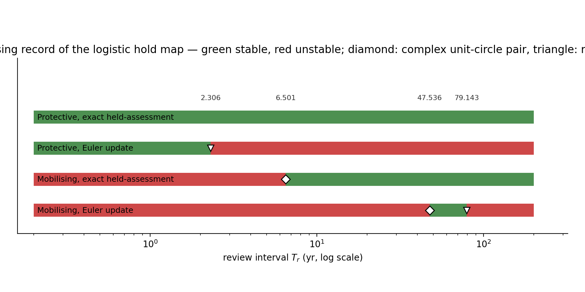

# Periodic Review as Sampled Governance: Sample-and-Hold Dynamics of Assessment-Driven Effort Control, a Selected 42-Stock Spectral Screen, and the Northern Cod Case

*Methodology and case study — prepared in the style of the ICES Journal of Marine Science*

## Abstract

Fisheries governance is periodic: assessments are compiled at intervals, decisions made at reviews, controls held till the next review — a sampled-control problem. In the sample-and-hold model a logistic stock evolves under held effort between reviews, a filtered deficit signal carries institutional memory, and a projected Euler update resets effort each review. The sampled process is forward invariant by induction; the rapid-review limit is a finite-horizon consistency statement implying nothing about stability at any positive interval, stability persisting only under additional hyperbolicity assumptions (the logistic hold-map core stays unstable at small intervals). The stage-structured review map shows exploratory response windows near 3–4 and 6–12 yr; the logistic hold map's annual-review equilibrium has a complex unit-circle crossing near 6.5 yr under the exact held-assessment update (Euler's 47.5 yr crossing a command-step artefact; spectral signature of a Neimark–Sacker bifurcation, nonlinear conditions not verified), with the crossing record and comparators in Section 3.4, which supplies the stage operator's boundary record via a new pre-registered reconstruction (archived windows provisional). The maps are distinct operators; no stability statement transfers between them. A multiplicity-controlled Lomb–Scargle screen of 42 annually assessed stocks finds no target-band discoveries under declared robustness and multiplicity filters (a null, not disconfirmation). A structured search across thirty-plus systems returns zero eligible cases under four confound-exclusion criteria. The northern cod case yields a descriptive split: the crash interpretation is formulation-dependent, and post-collapse dynamics expose a second identification problem the mortality-allocation comparison does not resolve, with a phase-line obstruction showing why no fixed scalar autonomous model produces these reversals.

**Keywords:** periodic review; sample-and-hold governance; review interval; institutional delay; fisheries management; stability

## 1 Introduction

Fisheries governance is periodic. Surveys are scheduled, assessments are produced at fixed cadences, advice is delivered at review points, and the resulting catch or effort controls are held in force until the next review — sometimes for a single year, sometimes for a multi-year plan, sometimes for a moratorium of indefinite length (Punt and Donovan, 2007; DFO, 2016). The formal literature treats this institutional clock in two ways, neither of which matches the operating object. Population-dynamic theory models institutional response either as a continuous-time lag — a delayed signal entering an evolving control law, in the lineage of Gurney, Blythe, and Nisbet (1980) — or as an annual discrete-time decision appended to a surplus-production model, in which the between-decision dynamics are compressed into a single annual step. Real institutions do neither: they observe and assess at discrete times, choose a rule-based command, and then hold or interpolate that command until the next decision opportunity.

Two failure modes follow from this mismatch. The first is *architecture substitution*: replacing the sample-and-hold architecture by a continuous delay (or by an annual difference equation) can move or delete stability boundaries, so that conclusions about a governance system depend on an operator that the institution does not implement. The second is *causal promotion*: spectral peaks, cohort cycles, and crisis-driven monitoring records circulate as evidence for institutional-feedback mechanisms when they carry no information about the controller's sign, cadence, or timing at all. The marine-science literature already contains the disciplinary template for resisting this promotion — the skeptical re-analysis of the Russell Cycle (McManus, Licandro, and Coombs, 2016), in which an 88-year zooplankton series long treated as a cycle failed to show a resolvable true periodicity — and this article extends that discipline from climate-forced cycles to governance-feedback claims.

The contribution is fivefold. First, a sample-and-hold model of periodic review is specified, in which the governance clock is decomposed into seven time objects (observation interval, assessment interval, review interval, decision lag, deployment lag, ecological response lag, and memory timescale) and the extractive controller is an explicit discretisation with declared comparator classes. Second, two properties of the sampled process are established exactly: forward invariance of the sampled state space, and the precise scope of the rapid-review limit — a finite-horizon numerical-consistency statement that implies nothing about stability at positive review intervals. Third, the review-interval spectrum is computed under the discipline that the sample-and-hold map and the continuous-delay equation are *different operators*: a stability window located on one map does not transfer to the other, and the paper states which operator carries which statement. Fourth, an empirical layer is reported at its exact evidential status: a multiplicity-controlled spectral screen of 42 annually assessed stocks, a power analysis of that screen, and a structured case search across more than thirty resource systems. Fifth, the northern cod case (NAFO 2J3KL) is carried through the resulting falsification discipline, and the paper's constructive content is the prospective programme — five identification designs and a closed-loop evaluation design specified as preregistration targets — that could convert or refute the mechanism.

The model class examined here is the extractive controller: a rule that raises extraction effort in response to a perceived decline. This is the demand-side form of the overshoot loop, in which the response to a perceived shortfall falls on the productive stock itself rather than on its regeneration — extraction is raised precisely because the base has declined, which accelerates the decline it is reacting to. Its protective counterpart (effort reduced in response to decline), fixed multi-year plans, and hybrid rules are declared as comparators; conclusions drawn inside the extractive class are not generalised to governance as a whole, and the screen below asks whether such a channel is empirically resolvable at all.

## 2 Material and methods

### 2.1 The sample-and-hold model of periodic review

Seven time objects are kept distinct, and no two are collapsed into a single "governance lag" unless the empirical record cannot resolve them and the aggregation rule is declared (Table 1).

**Table 1.** The governance-time ontology.

| Object | Definition |
|---|---|
| Observation interval $T_{\rm obs}$ | Time between raw measurements |
| Assessment interval $T_{\rm assess}$ | Time between formal state estimates |
| Review interval $T_r$ | Time between opportunities to change the command |
| Decision lag $\tau_{\rm dec}$ | Assessment completion to formal decision |
| Deployment lag $\tau_{\rm dep}$ | Decision to implemented change in extraction pressure |
| Ecological response lag $\tau_{\rm eco}$ | Implementation to detectable ecological response |
| Memory timescale $\tau_m$ | Relaxation time of a filtered institutional signal; not a discrete delay |

The separation is not decorative. Reviews can be annual while deployment is delayed; observations can be frequent while decisions are legally fixed for several years; and stock and realised-effort series alone may identify only a combined closed-loop phase shift rather than the separate $\tau_{\rm dec}$ and $\tau_{\rm dep}$. Separating them empirically requires dated observation releases, assessment products, commands, and implementation records — or a proved structural-identifiability argument for the declared observation model. Two further conventions are registered. The review opportunity is not the same as the response sign: the extractive command studied here raises effort in response to a perceived decline, and the protective controller enters only as a comparator. And the fixed-$\tau$ form is an idealisation: real institutions confronting visible scarcity typically change their instrument set (buyouts, engineered transfers, new infrastructure) rather than hold a single response law with constant delay, so any estimated $\tau$ summarises a changing control architecture, not a structural constant.

Let review times be $t_n=nT_r$. Between reviews, extraction effort is held at $E_n$ and the resource stock follows the logistic process under held effort:

$$
\dot N(t)=rN(t)\left(1-\frac{N(t)}{K}\right)-qE_nN(t),\qquad t\in[t_n,t_{n+1}),
\tag{1}
$$

while the institutional signal $Z$ is the filtered nonnegative deficit

$$
\dot Z(t)=\frac{\Phi\bigl(qE_nN(t)-S(N(t))\bigr)-Z(t)}{\tau_m},\qquad \tau_m>0,
\tag{2}
$$

with $S(N)=rN(1-N/K)$ the surplus production and $\Phi\ge 0$ a nonnegative signal map with memory timescale $\tau_m$. The assessment available at review $n$ is

$$
\widehat Z_n=\mathcal A_n\!\left(\{Y_j:t_j\le t_n-\tau_{\rm dec}\}\right),\qquad
Y_j=\mathcal O\bigl(N(t_j)\bigr)+\varepsilon_j,
\tag{3}
$$

which separates the latent process $N$, the observations $Y$, and the assessments $\widehat Z$; measurement and assessment errors need not be independent or Gaussian, but the admissible error support is restricted to $\widehat Z_n \ge 0$ (the multiplicative-error robustness experiment of Section 3.3 satisfies this by construction): the effort law's rational term is undefined at $\widehat Z_n = -Z_{\mathrm{ref}}$ and changes sign beyond it, and projection of the final command does not repair an undefined update. In the baseline deterministic record the assessment operator is exact and contemporaneous, $\widehat Z_n = Z(t_n^-)$. The review map is the projected forward-Euler step

$$
E^{\rm cmd}_{n+1}=\Pi_{[0,E_{\max}]}\left\{E_n+T_rF_B(E_n,\widehat Z_{n+1})\right\},
\tag{4}
$$

— one specific reviewed controller among many (direct command rules, exact integration under held assessment, incremental rules with fixed step), and because the increment scales with $T_r$, a sweep in $T_r$ changes both the hold duration and the accumulated gain per review; the separating computation is the exact held-assessment update, reported in Section 3.4 with attribution to the companion delay study — with the effort law

$$
F_B(E,Z)=\left(1-\frac{E}{E_{\max}}\right)
\left[
\eta E\left(\frac{Z}{\Delta_{\rm ref}}-\frac{E}{E_{\max}}\right)
+\delta_0\frac{Z}{Z_{\rm ref}+Z}
\right],
$$

together with the shifted, floored softplus signal map

$$
\Phi_k(s)=\max\left\{0,\ \frac{1}{k}\log\!\bigl(1+e^{ks}\bigr)-\frac{\log 2}{k}+\delta\right\}.
$$

Equations (1)–(4) with $\Phi=\Phi_k$ constitute the extractive controller studied throughout; it is an explicit controller discretisation, not a generic harvest-control rule and not a model of protective quota reduction. Three comparators receive distinct declarations: the protective controller (the same machinery with the response to decline entering with the opposite sign), the fixed-plan controller (no state-responsive update between scheduled resets), and the hybrid controller (annual-change limits, emergency triggers, or legal overrides). The comparators are declared for the prospective management-strategy evaluation (Section 4.5), not presented as completed experiments; a fixed plan and a state-responsive plan with the same nominal review period are not the same intervention. The model-level run of the comparator evaluation on the logistic hold-map core — the plant of the closed-form operator results — is executed and reported in Section 3.4 at the declared evidential status (deterministic, seed-fixed, on the declared architecture only); the prospective real-system design of Section 4.5 remains unexecuted.

### 2.2 Registration conventions

The deterministic record fixes a one-step flow-then-update convention, stated in pre-review/post-review terms: on $[t_n, t_{n+1})$ effort is held at $E_n$; at the review instant $t_{n+1}$ the contemporaneous, exact assessment $\widehat Z_{n+1} = Z(t_{n+1}^-)$ of the flowed state is read ($\tau_{\rm dec}=\tau_{\rm dep}=0$), and equation (4) computes the command $E_{n+1}$ held on the following interval. The pre-review state is $X_n^-=(N(t_n^-),Z(t_n^-),E_{n-1})$ and the recorded map is the pre-review Poincaré map $X_{n+1}^-=\mathcal P_{T_r}(X_n^-)$; the reversed ordering (command first, flow second) is a different hybrid system and is not used. No decision or deployment queue is present, and multiplicative assessment error enters only the designated robustness experiment; a positive $\tau_{\rm dep}$ requires an explicitly registered hold or interpolation rule. The computational status of the response-region records is stated with the same care: classification used long-horizon trajectories, tail amplitudes, multiple histories, and integration-step refinement — not Poincaré-map multipliers, monodromy matrices, or Floquet multipliers. The reported bands are therefore finite-grid, trajectory-classified response regions, and no Neimark–Sacker, flip, or other multiplier-crossing classification is claimed. The solver configuration and initial histories are a declared registration requirement, and until that computational record is complete the stage-output values carry provisional status. For the logistic hold-map core that boundary calculation is now reported in Section 3.4; for the stage-structured map the boundary record is supplied by the labelled reconstruction of Section 3.4 — a newly declared, pre-registered object whose full specification (flow/update ordering, information pattern, derivative construction, multiplier trajectories, nonlinear trajectories, solver configuration) is on the record there. The original stage record remains unattached, and its output values keep provisional status.

### 2.3 The review-map operators

Three objects are in play: the continuous-delay equation, the logistic hold map, and the stage-structured review map. The continuous delay equation and the logistic sample-and-hold map are the same feedback loop under two delay operators; the stage-structured map is a different ecological plant (delayed-recruitment stage structure against scalar logistic surplus production) with a different state dimension, not an operator substitution on the logistic plant. A valid architecture comparison holds the ecological plant, controller linearisation, equilibrium, and parameter vector fixed while changing only the timing operator, so the 3–4 yr windows and the 6.5 yr exact-hold crossing below are reported as a comparison across plants and operators, and the operator effect is not claimed to be isolated by it. Changing the operator can move or delete a crossing, and that relocation is a property of the review map's spectrum, not a demolition of the loop. The discipline throughout is that every stability statement names its operator, and statements computed on the hold map, on the stage-structured review map, and on the continuous-delay equation do not transfer to one another: the operative condition is $\det(M-e^{i\theta}I)=0$ on the map to which the statement refers.

For a deterministic sampled system, the inter-review flow and the review update combine into a Poincaré map $X_{n+1}=\mathcal P_{T_r}(X_n)$, where $X_n$ includes the ecological state, memory, held command, and any explicitly modelled queue. A fixed point is locally asymptotically stable if and only if every eigenvalue of $D\mathcal P_{T_r}(X^*)$ lies inside the unit disk. A verified crossing through the unit circle as the fixed parameter $T_r$ changes is a sampled-data parameter bifurcation; it is not rate-induced tipping, which requires a nonautonomous parameter path and a loss of tracking as the ramp speed changes (Ashwin, Wieczorek, Vitolo, and Cox, 2012).

### 2.4 The cross-sectional spectral screen

The screen's input layer is a frozen 42-stock cohort of the RAM Legacy Stock Assessment Database v4.66 (Ricard, Minto, Jensen, and Baum, 2012), selected by a separate annual-review eligibility criterion. The release records stock and assessment metadata and series such as biomass, fishing mortality or exploitation rate, total allowable catch, catch advice, and effort; it does not encode controller sign, the decision rule, or dated decision and deployment queues. The annual-review designation is therefore an analysis-side cohort criterion, not a database classification of a stock as extractive or protective. The RAM stock identifiers and the eligibility table are a declared registration requirement.

For each eligible biomass and exploitation/effort proxy series, the analysis detrends according to a declared rule, computes a Lomb–Scargle periodogram (Lomb, 1976; Scargle, 1982), integrates power in the predeclared bands (4–8 yr for biomass, 12–60 yr for effort) — the tested statistic is band-integrated power, and a peak is separately classified for robustness — and compares it with a per-series AR(1) red-noise null. P-values are adjusted across the declared family (stocks, observables, and bands) by the Benjamini–Hochberg false-discovery-rate procedure (Benjamini and Hochberg, 1995), which controls the false discovery rate, not the familywise error rate; dependence across stocks and observables (shared climate forcing, shared assessment methods) is acknowledged, and the Benjamini–Yekutieli procedure under arbitrary dependence is the declared fallback; the reported zero count is the BH-adjusted result. The full null-calibration record — AR(1) coefficient estimation, detrending inside each null replicate, missing-data treatment, and the number of Monte Carlo replicates — is a registered requirement attached with the computational archive, as is the caveat that the 12–60 yr band is poorly resolved on records shorter than about three candidate periods: at the long-period end, band power is partly a trend test. A peak is classified as robust only if it survives the null comparison, the multiplicity adjustment, and sensitivity to detrending and endpoint choices.

### 2.5 Power analysis

Power experiments inject the model-generated effort signal into AR(1)-type noise and apply the same band-power statistic (the conventional power-analysis framing of Cohen, 1988). Power is estimated on 100–200 yr synthetic records across noise scales; the simulation code and seeds are a declared registration requirement.

### 2.6 The structured case search

The case search is an author-curated inventory, not a systematic review; it considered more than thirty systems spanning fisheries, aquaculture, groundwater, surface water, rangeland, wildlife harvest, forestry, and produced-capital markets, under four criteria: (i) a responsive institutional feedback rather than a one-time cap or ban; (ii) an independently dateable response or implementation lag; (iii) no major environmental, biological, or structural driver empirically supported as generating the same outcome — the comparative rule being that a candidate institutional mechanism must outperform preregistered alternatives on held-out prediction, phase ordering, or intervention response, since "capable of generating" is not a falsifiable exclusion in open ecological systems; and (iv) individual-resource or individual-station data rather than an aggregate series. Behind criterion (iii) stands a named enumeration of the alternative mechanisms that can mimic or replace an institutional cycle — stage/maturation delays and cohort resonance; recruitment suppression versus stock culling; support-pool/nutrient limitation; pollution/waste feedback; predator–prey or climatic forcing; and direct abiotic mining and slow-store exhaustion — with the rule that a candidate institutional mechanism must be compared with these alternatives rather than identified from periodicity alone.

### 2.7 The northern cod case: constitutive model and evidence

The northern cod case (NAFO 2J3KL) is carried as a bounded empirical object with the strong-Allee surplus equation as its illustrative constitutive model:

$$
\frac{dS}{dt}=rS\left(1-\frac{S}{K}\right)\frac{S-\mathfrak s}{K-\mathfrak s}-C(t),
\tag{5}
$$

with $S$ the spawning stock biomass, $r$ the intrinsic growth rate, $K$ the unexploited carrying capacity, $\mathfrak s$ the unstable threshold, and $C(t)$ the removals. The Schaefer model is the degenerate member of this family in which the factor $(S-\mathfrak s)/(K-\mathfrak s)$ is replaced by $1$: no value of $\mathfrak s$ makes the displayed factor identically $1$ (it tends to $1$ only in the limit $\mathfrak s\to-\infty$), so the Schaefer comparison is a change of growth law, not a parameter specialisation. The constitutive assumption stands as such — the equation is an illustrative model, not a fit — and the obstruction class is the one-dimensional autonomous equation with fixed parameters and fixed removals: the displayed equation is autonomous exactly when removals are fixed.

**Proposition (phase-line obstruction).** *A nonconstant solution of a locally Lipschitz scalar autonomous ODE $\dot x=f(x)$ is strictly monotone; it never attains an equilibrium value and cannot cross an equilibrium in either direction. Consequently, an exact path that repeatedly rises and falls across a common interval is incompatible with any single fixed scalar autonomous model.*

*Proof.* If $x$ is nonconstant on an interval and $x(t_1)=x(t_2)$ with $t_1<t_2$, then by Rolle's theorem there exists $\tau\in(t_1,t_2)$ with $\dot x(\tau)=0$, i.e. $f(x(\tau))=0$; by uniqueness the solution through $(\tau,x(\tau))$ is the constant equilibrium solution, a contradiction. So every solution is strictly monotone or constant. If a trajectory met an equilibrium value $x^*$ at any time it would be constant thereafter and, by uniqueness applied backwards, before; hence a nonconstant solution never attains an equilibrium value and cannot cross one in either direction. A path that rises and falls across a common interval attains some level twice with opposite directions, contradicting monotonicity. ∎

**Lemma (extra-loss threshold shift, conditional).** *(i) Constant loss. In the constitutive model with an additional constant removal $C>0$, the production function is replaced by $f_C(S)=f(S)-C$; the positive equilibria of the modified function are the solutions of $f(S)=C$, the smaller one (the effective threshold) lies to the right of $\mathfrak s$, and at the production maximum the two positive equilibria coalesce and beyond it disappear — all conditional on the solutions existing, i.e. $C$ below the production maximum. (ii) Proportional mortality. With extra mortality $M_x>0$ the modified production is $f_M(S)=f(S)-M_xS$; positive equilibria solve $f(S)/S=M_x$, $S=0$ remains an equilibrium (unlike case (i), where $\dot S|_0=-C<0$ drives the model below zero unless the removal is constrained near zero or the state equation is modified), and the same threshold-shift reading applies to the modified positive roots.*

The argument is elementary: case (i) subtracts a fixed term, case (ii) subtracts a term proportional to stock, and in each case the smaller positive root of the modified production function moves rightward; at the production maximum the two positive equilibria coalesce and beyond it they disappear. An effective threshold is not automatically a shifted structural parameter, and the coalescence/disappearance case is part of the statement.

*Proof.* The constitutive production $f(S) = rS(1-S/K)(S-\mathfrak s)/(K-\mathfrak s)$ vanishes exactly at $0$, $\mathfrak s$, $K$; it is negative on $(0,\mathfrak s)\cup(K,\infty)$, positive on $(\mathfrak s,K)$, and its derivative vanishes exactly at
$$S_{\pm} = \frac{K+\mathfrak s \pm \sqrt{K^2-\mathfrak s K+\mathfrak s^2}}{3}, \qquad 0 < S_- < \mathfrak s < S_+ < K,$$
so $f$ has exactly one critical point in $(\mathfrak s,K)$ — the unique maximum $S^* = S_+$ with value $M = f(S^*) > 0$ — and $f$ is strictly increasing on $(\mathfrak s,S^*)$ and strictly decreasing on $(S^*,K)$. (i) The equilibria of $f_C(S) = f(S) - C$ solve $f(S) = C$, so none lie outside $(\mathfrak s,K)$, where $f \le 0 < C$. For $0 < C < M$, the intermediate value theorem on $[\mathfrak s, S^*]$ ($f(\mathfrak s) = 0 < C < M = f(S^*)$) and on $[S^*, K]$ ($f(K) = 0 < C < M$) supplies one root in each interval, and strict monotonicity makes each root unique; the smaller root satisfies $S_1(C) \in (\mathfrak s, S^*)$ — the effective threshold lies strictly to the right of $\mathfrak s$. As $C \uparrow M$ the two roots approach $S^*$ from either side (coalescence), and for $C > M$ the equation $f(S) = C$ has no solution: the two positive equilibria have disappeared. (ii) Write $f_M(S) = f(S) - M_x S = S\, (h(S) - M_x)$ with $h(S) = f(S)/S = \frac{r}{K-\mathfrak s}(1-S/K)(S-\mathfrak s)$, a quadratic with roots $\mathfrak s$ and $K$, negative on $(0,\mathfrak s)\cup(K,\infty)$, and unique maximum $H = h(S_h)$ at the vertex $S_h = (\mathfrak s+K)/2$. Then $f_M(0) = 0$: zero remains an equilibrium in every case. The positive equilibria solve $h(S) = M_x$; for $0 < M_x < H$ the same two-interval argument gives exactly two roots, the smaller in $(\mathfrak s, S_h)$ — the threshold shift — with coalescence at $M_x = H$ and disappearance for $M_x > H$, where $f_M(S) = S(h(S)-M_x) < 0$ on $(0,\infty)$. In case (i), by contrast, $f_C(0) = -C < 0$, so $\dot S|_0 = -C$ drives the state below zero unless the removal is constrained near zero or the state equation is modified — the stated distinction. $\square$

The case evidence is the assessment record: the crash window (1991–1995) and the subsequent windows are documented by the assessment table of DFO CSAS SAR 2016/026 (Table A2), produced by the Northern Cod Assessment Model (NCAM; Cadigan, 2016), together with the dated governance events (the moratorium announcement of 2 July 1992; the reopening of 26 June 2024 with a total allowable catch of 18 kt). The displayed values are rounded renderings of the assessment table, and the survival column $\exp(-M)$ is a transformation of the reported instantaneous mortality estimate, not an independently observed survival series.

## 3 Results

### 3.1 Forward invariance of the sampled process

**Proposition (forward invariance).** *Suppose $N(0)\ge 0$, $Z(0)\ge 0$, $E_0\in[0,E_{\max}]$, and $\Phi$ is non-negative. Let every effort command be projected by $\Pi_{[0,E_{\max}]}$, and let any between-review deployment interpolation remain in the convex interval joining consecutive commands. Then $N(t)\ge 0$, $Z(t)\ge 0$, and $E(t)\in[0,E_{\max}]$ for every time at which the sampled solution exists.*

*Proof.* Proceed by induction over review intervals. Suppose at a review time $t_n$ that $N(t_n)\ge 0$, $Z(t_n)\ge 0$, and the command to be held or interpolated lies in $[0,E_{\max}]$. Projection places the next command in the same closed interval; a hold retains an endpoint of that interval, and any convex interpolation $E(t)=(1-\theta(t))E_n+\theta(t)E_{n+1}$ with $0\le\theta(t)\le 1$ also remains in $[0,E_{\max}]$. On $[t_n,t_{n+1}]$, Eq. (1) gives

$$
N(t)=N(t_n)\exp\left\{\int_{t_n}^{t}\left[r\left(1-\frac{N(s)}{K}\right)-qE(s)\right]ds\right\}>0
$$

for a positive initial value, while if $N(t_n)=0$, uniqueness gives the identically zero solution on the interval; $N$ cannot become negative. Set $\nu(t)=\Phi(qE(t)N(t)-S(N(t)))\ge 0$. Variation of constants in Eq. (2) with $\tau_m>0$ gives

$$
Z(t)=e^{-(t-t_n)/\tau_m}Z(t_n)+\frac{1}{\tau_m}\int_{t_n}^{t}e^{-(t-s)/\tau_m}\nu(s)\,ds\ \ge 0 .
$$

Boundedness from above is automatic on the stock equation and is used implicitly in the induction: on $[t_n, t_{n+1})$ the stock solves the logistic equation under held effort, and $\dot N \le 0$ at $N = K$ (the harvest term is non-negative), so $N(t) \le \max\{N(t_n), K\}$ throughout the interval. All three inequalities therefore hold through $t_{n+1}$; they hold at $t_0=0$ by hypothesis, and induction proves them on every review interval for which the sampled solution exists. ∎

Positivity, boundedness, persistence above a threshold, and viability are distinct properties; the proposition establishes positivity and effort admissibility only.

### 3.2 The rapid-review limit and what it does not establish

Define $u=(N,Z,E)$ and the continuous no-delay system $\dot u=G(u)$ assembled from Eqs. (1)–(2) with the effort law evaluated continuously. Suppose $G$ is continuously differentiable with bounded derivative on a compact neighbourhood containing the compared trajectories on $[0,T]$, assessments equal the contemporaneous state, no additional decision or deployment queue is present, projection is inactive, and the sampled and continuous systems share the initial state. The frozen-effort flow followed by the explicit effort step then has a one-step defect of order $O(T_r^2)$ relative to the exact flow of $G$; the usual discrete Gronwall estimate yields an $O(T_r)$ review-time error and uniform convergence on every fixed finite horizon as $T_r\to 0$ (the sampled-data approximation framework of Nešić and Teel, 2004).

This is a numerical-approximation property, not a finite-review stability theorem. It gives no uniform-in-time estimate, does not preserve stability automatically, and does not control any trajectory-classified response region reported below. It excludes active projection, delayed or erroneous assessment, a deployment queue, and stochastic updates. In particular, it neither identifies a finite $T_r$ with a continuous discrete delay nor implies that sufficiently small positive $T_r$ is stable when the continuous target is unstable; the converse caution is equally load-bearing — under the additional assumptions of hyperbolicity of the continuous equilibrium and $C^1$-consistency of the sampled map with projection inactive locally, the multipliers satisfy $\mu_j(T_r) = 1 + T_r\lambda_j(A) + O(T_r^2)$ and local stability persists for all sufficiently small positive review intervals, so the finite-horizon result neither proves nor refutes stability transfer, and the transfer hypotheses are what any such claim would have to supply.

### 3.3 Response regions of the delayed-recruitment review maps

The delayed-recruitment records, classified from long-horizon trajectories on the stage-structured review map, locate exploratory response regions by stock class (the delayed-recruitment oscillation lineage of Gurney, Blythe, and Nisbet, 1980, supplies the classical reference point):

- **Anchovy-class:** persistent tail oscillation near $T_r\approx 3$–$4$ yr, with a weak response at $T_r=2$ yr; annual-review trajectories converge over the tested grids for every tested effort-response value.
- **Sprat-class:** persistent tail oscillation near $T_r\approx 6$–$12$ yr.
- **Cod-class:** trajectories converge to equilibrium for every tested $T_r\in[1,20]$ yr, although the corresponding continuous-delay calculation has an oscillatory interval — a convergence-over-tested-grid record, not a stability theorem for every history.
- **Slow-stock class:** for $r\in(0.01,0.05)$ yr$^{-1}$, oscillation over part of the tested grid below approximately 20–30 yr and convergence at longer review intervals, with transition brackets between approximately 30 and 50 yr depending on $r$. This one-sided pattern does not contradict rapid-review consistency: the continuous no-delay target is itself unstable over part of the slow-$r$ regime, so small-$T_r$ trajectories may approximate an unstable target on finite horizons. The record is conditional on the delayed-recruitment variant and is not a general claim that slower review stabilises governance; the dominant timescales are centuries, beyond the length needed to resolve multiple cycles in most institutional records.

The corresponding continuous-delay calculations locate response regions near $rg\approx 1.5$–$1.6$: for $g=2$ yr, $r\in(0.77,0.81)$ yr$^{-1}$ at $\eta=0.914$ with a delay interval of approximately 2.6–7.8 yr; for $g=1$ yr, the high-$r$ interval is approximately 1.565–1.585 yr$^{-1}$ with a delay interval of 1.6–3.5 yr. These are finite-grid trajectory summaries, not closed analytical stability regions.

Multiplicative assessment-error experiments retain the anchovy-class trajectory region through 30% error and produce no noise-induced persistent tail oscillation at annual review in the tested ensemble — a robustness summary for the declared multiplicative perturbation only. The archived diagnostics carry observable-specific dominant peaks — approximately 4 yr in anchovy-class biomass with 12 yr in effort, and approximately 8 yr in sprat-class biomass with 60 yr in effort. These are retained only as observable-specific dominant peaks over the analysed windows: components of one stationary periodic orbit cannot have different fundamental periods, and harmonics, subharmonics, modulation, or transient spectral content are unresolved; no decomposition has established whether the baseline term, signal regularisation, or another controller component dominates these responses. The archived amplitudes indicate percent-scale biomass excursions and order-one effort excursions relative to equilibrium; the exact percentages are not used as effect-size estimates, because the available convention does not distinguish peak-to-peak range from half-range and the approach to the large effort response contains a long transient.

### 3.4 The operator spectra

The logistic hold-map core carries the declared computation objects in closed form. With effort held at $E$, the logistic flow over one review interval is, for $a(E) = r - qE \ne 0$,
$$N(t_{n+1}^-) = \frac{a(E)\,N(t_n^-)\,e^{a(E)T_r}}{a(E) + \tfrac{r}{K}N(t_n^-)\bigl(e^{a(E)T_r} - 1\bigr)},$$
and $N(t_n^-)\big/\!\bigl(1 + \tfrac{r}{K}N(t_n^-)T_r\bigr)$ for $a(E) = 0$; the signal flow enters through equation (2) with this forcing, and the linearised pre-review monodromy is assembled from the held-flow state transition, the assessment derivative at $Z(t_{n+1}^-)$, and the update derivative of equation (4). The exact held-assessment controller — the separating comparator that isolates the Euler step — is the exponential update $e_{n+1} = e^{C_E T_r}e_n + \tfrac{e^{C_E T_r}-1}{C_E}C_Z z_n$ for $C_E \ne 0$; comparing its monodromy with the forward-Euler map's separates review cadence, zero-order holding, and Euler discretisation, and that comparison is now reported: executed and verified on the companion delay study's identical hold map (same effort-law bracket, same softplus signal, same forward-Euler monodromy reproducing the 47.54 yr crossing reported here), the exact-hold annual spectral radius is $\rho = 1.00035$ (Euler 1.00055); the 47.5 yr and 79.1 yr crossings are command-step artefacts; the exact map's single unit-circle crossing is $\approx 6.5$ yr; and the restabilising direction survives.

On the logistic hold-map core, the undelayed equilibrium is already unstable, so annual review is unstable; on the computed crossing set, the sampled equilibrium has a complex unit-circle crossing — the spectral signature of a Neimark–Sacker bifurcation, nonlinear nondegeneracy not verified — at $T_r^{\rm UC}=47.54$ yr under the forward-Euler command step and at $\approx 6.5$ yr under the exact held-assessment update, with the same restabilising direction: the 47.54 yr crossing and its $-1$ multiplier at 79.1 yr are command-step artefacts, not a review-cadence property (Section 4.1). **The complete crossing record (reported).** On the logistic hold-map core the unit-circle crossing record over $[0.2, 200]$ yr is now complete, computed from the linearised pre-review monodromy on a 200,001-point scan with bisection refinement (seed-free; the record reproduces the registered numbers before extension). The forward-Euler update crosses twice on the mobilising channel — a complex pair at $T_r = 47.536$ yr (unstable $\to$ stable) and a real $-1$ multiplier at 79.143 yr (stable $\to$ unstable), stable band $[47.54, 79.14]$ yr — and once on the protective channel — a real $-1$ at 2.306 yr (stable $\to$ unstable), stable only on $[0.2, 2.31]$ yr. The exact held-assessment update crosses once on the mobilising channel — a complex pair at 6.501 yr (unstable $\to$ stable), stable on $[6.50, 200{+}]$ yr — and never on the protective channel, which is stable at every tested interval with maximum spectral radius 0.9967. Both Euler crossings of the mobilising channel are therefore command-step artefacts relative to the exact map's single crossing, and the Euler protective instability beyond 2.31 yr is likewise an artefact: the exact protective map is stable throughout.

**Figure 1.** Registered crossing record of the logistic hold map: stable (green) and unstable (red) review-interval ranges for the four update pairs, with crossing markers (diamond: complex unit-circle pair; triangle: real −1 multiplier). Annual review is unstable on both mobilising updates; the Euler-reported 47.536 and 79.143 yr crossings are command-step artefacts relative to the exact update's single 6.501 yr crossing, and the protective Euler crossing at 2.306 yr is likewise an artefact — the exact protective map is stable at every tested interval (maximum spectral radius 0.9967).

**The one-plant operator contrast.** With the crossing record complete, the operator comparison can be made on one plant rather than across plants. The same mobilising loop under continuous delay carries the companion delay study's certified Hopf pair at 3.666 and 150.358 yr; the sampled operator's exact crossing sits at 6.50 yr. Annual review is unstable under sampling (\rho = 1.00035) but stable under continuous delay ($\tau = 1$ yr $< \tau_-$); at $T_r = 8$ yr the ordering reverses (sampled stable, continuous delay inside its unstable window). The operator moves the stability window on the same plant — the cross-plant observation of Section 2.3 is now a same-plant one.

**The protective controller on the same maps.** The declared comparator run (protective, sign-reversed response) on the same plant gives exact-hold spectral radius 0.9838 at annual review and stability at every $T_r \in [0.2, 200]$ yr (maximum 0.9967); the Euler-run protective instability is an artefact band, not a property of the protective architecture.

**Executed comparator evaluation at model level.** The declared protective and fixed-plan comparators are run through the closed loop on the logistic hold-map core (nonlinear plant, $N_0 = 0.95\,N^*$, 800 reviews, metrics on the last 60%, multiplicative assessment error $\{0, 0.3\}$, seeds fixed; the certified object remains the spectral record, and the prospective real-system design of Section 4.5 is untouched). Under 30% assessment error with ten seeds per cell: the extractive Euler core crashes to extinction in all ten seeds at $T_r = 8$, 12, and 20 yr, and at annual review its mean depletion frequency (fraction of post-transient reviews with $N < N^*/2$) is 0.22 with mean minimum stock $0.22\,N^*$; the extractive exact update never crashes, with mean depletion falling from 0.07 ($T_r = 1$) to 0.001 ($T_r = 20$); the protective exact update holds the equilibrium at every interval (depletion 0, mean minimum $0.89\,N^*$, rms stock deviation $\le 0.001K$); the protective Euler update crashes in all ten seeds at $T_r = 20$ yr and shows depletion 0.9996 at $T_r = 12$ — the artefact operating at the trajectory level; the fixed plan is the equilibrium rest point (zero deviation). The linear trajectory distortion between the Euler and exact updates grows with $T_r$ (scaled-norm RMSD $\approx 2$ at $T_r = 0.5$ yr, $10^4$–$10^5$ at $T_r = 5$–$40$ yr, with the Euler path diverging in its artefact bands): the command step is not a small distortion. On the stage-structured review map, annual review is stable at every tested response value — all declared annual-review trajectories converged at every tested response value — the anchovy-class window relocates to $T_r\approx 3$–$4$ yr, and the sprat-class window to $T_r\approx 6$–$12$ yr, robust to 30% multiplicative assessment error. Both statements are $\det(M-e^{i\theta}I)=0$ on the map to which they refer; neither transfers to the other operator.

Two consequences follow. First, in the reported simulations relative effort excursions were larger than relative biomass excursions, and any quota-utilisation reading of the signal would require a quota, realised catch, and compliance model, which are not part of the declared core. Second, no qualifying example was found in the declared case search (Section 2.6) of a real small-pelagic system operating a responsive 3–4 yr review, so the window prediction is untested, not falsified; the corresponding qualitative test for slow-regenerating resources is whether a responsive multi-year plan, adjusted against measured change, produces large-amplitude extraction cycles that a frozen multi-year cap does not (Section 4.5).

**The stage-map reconstruction record.** The stage-output values carry a declared limitation: the stage map's computational record — solver configuration, initial histories, stage registration — is not attached, so those values are not reproducible numerical propositions (Section 2.2). Rather than leave the stage operator without any boundary record, a new stage map was declared, pre-registered (plan dated and frozen 2026-09-01, before any run; parameter values and comparison criteria fixed in the plan), and its complete multiplier and trajectory records are reported here. The reconstruction is a labelled new object: it is not claimed to be the object that produced the archived windows, and the comparison below is a post-hoc consistency check, not a validation of those windows.

**Plant.** A two-stage delayed-recruitment map with annual steps, $A_{t+1} = s_A A_t + s_J J_t - qE A_t$, $J_{t+1} = f(A_{t-\tau})$ with Beverton–Holt recruitment $f(A) = \alpha A/(1+\beta A)$, $s_A = s_J = e^{-M}$, and the pair $(\alpha, \beta)$ fixed by steepness and scale: $\beta = (c-1)/A_0$, $\alpha = c(1-s_A)/s_J$, $c = 4h/(1-h)$, $A_0 = 100$ — a declared scale convention matching the logistic core's carrying capacity. Surplus production $S(A) = s_J f(A) - (1-s_A)A$ replaces the logistic surplus in the deficit signal of equation (2). Every parameter is a cited literature value or a declared convention; none was chosen with reference to the archived windows. The class parameter sets: anchovy $M = 0.90$ yr⁻¹ and recruitment delay $\tau = 1$ yr (Pauly and Tsukayama, 1987); sprat $M = 0.40$ yr⁻¹ (mid-range of the Baltic SMS keyrun values, 0.3–0.8 yr⁻¹; ICES, 2020) and $\tau = 2$ yr (age at 50% maturity in the Baltic sprat assessment); cod $M = 0.20$ yr⁻¹ (the fixed cod-assessment convention; ICES, 2021) and $\tau = 5$ yr (northern cod age at 50% maturity; DFO, 2011); slow-stock $M = 0.045$ yr⁻¹ and $\tau = 25$ yr (orange roughy; Branch, 2001). Steepness $h = 0.75$ throughout — the standard default convention when no stock-specific estimate is available — with a declared sensitivity layer $h \in \{0.6, 0.9\}$. The controller is the paper's declared object unchanged: equations (1)–(4) in annual discrete form, softplus sharpness $k = 10$ (the comparator machinery's value), contemporaneous exact assessment, and catchability $q = 0.001$ (the hold-map core's value) with a declared sensitivity $q = 0.1$ (the paper declares no $q$ for the stage map; both values are reported). The derivative construction is central finite differences of the review map at the fixed point (step $10^{-6}$, chain-rule cross-check to $10^{-4}$), and the scan grid is $T_r \in \{1,\ldots,50\}$ yr at annual internal steps — finite-grid by construction, as the archived record itself was. The extractive channel is primary; the protective channel is computed with the paper's declared quota-tracking gains in the linearised review map, the same convention as the logistic protective record.

**Records.** At the declared controller value every class is stable at annual review — spectral radii $\rho(1) = 0.895$ (anchovy), 0.923 (sprat), 0.956 (cod), 0.994 (slow-stock) — reproducing the archived stage map's annual stability at the tested response value. The protective channel is stable everywhere on the grid (maximum spectral radius 0.968), mirroring the logistic protective record. The extractive channel's only instability at the declared value is a long-horizon band from $T_r = 34$–35 yr to the grid's end for the three faster classes (maximum spectral radius $\approx 1.98$ at $T_r = 50$), with no crossings anywhere for the slow-stock class ($\rho(50) = 0.67$); the band is insensitive to the steepness layer. The trajectory classification (2000 review-steps from the declared initial condition — plant at the unfished equilibrium, memory filled, effort at half the equilibrium — tail of 500, relative tail standard-deviation thresholds 2% and 0.1%) agrees with the spectral record: anchovy, sprat, and cod converge at every $T_r \in [1,20]$; the slow-stock class shows a persistent oscillation at $T_r = 10$ yr only (relative tail standard deviation 5.5%; dominant period $\approx 24$ yr in both stock and effort; effort excursion 537% against a biomass excursion of 18%), converging at every other grid point. Under 30% multiplicative assessment error the anchovy and sprat cells remain converged (maximum relative tail standard deviation 0.0009); the cod cells weaken at $T_r = 10$ and 20 yr (converged $\to$ weak, maximum 0.0025) while its annual-review cell stays converged (0.0004); and the slow-stock class oscillates persistently at the long-horizon cells $T_r = 30$–50 yr (2.1–2.6%, against a stable multiplier record without error) while its $T_r = 10$ cell weakens from its error-free oscillation and its $T_r = 20$ cell weakens (0.017). The declared catchability sensitivity is informative: at $q = 0.1$ every class is unstable at annual review ($\rho(1) \ge 1.29$); the three faster classes destabilise on $[1, 18{-}31]$ yr, restabilise, and re-enter an unstable band at 36–42 yr, while the slow-stock class is unstable across the entire grid ($\rho(50) = 7.8$) — the reconstructed stage loop's stability profile is a strong function of the catchability scale the paper leaves undeclared for this plant.

**Comparison with the archived windows** (criteria pre-registered; the verdict is the first complete run's record):

| Criterion (archive) | Reconstruction | Verdict |
|---|---|---|
| anchovy persistent oscillation at $T_r = 3$–4 yr | converged at both | MISMATCH |
| anchovy weak response at $T_r = 2$ yr | converged | MISMATCH |
| anchovy annual convergence | $\rho(1) = 0.895$ | MATCH |
| sprat persistent oscillation at $T_r = 6$–12 yr | converged throughout | MISMATCH |
| cod convergence for every $T_r \in [1,20]$ | converged throughout | MATCH |
| slow-stock oscillation below 20–30 yr, convergence at 30–50 yr | oscillation at $T_r = 10$, convergence at 30–50 | MATCH |

**Reading.** The reconstruction reproduces the archived record's qualitative features — annual stability on the stage map, the protective channel's stability, cod-class convergence over the 1–20 yr grid, the slow-stock oscillation-then-convergence pattern, and the effort-versus-biomass excursion ordering — but does not reproduce the anchovy 3–4 yr or the sprat 6–12 yr response regions: on this declared plant family those classes converge at every review interval, and the only instability the reconstructed loop produces is its own long-horizon band, entering at 34–42 yr and extending to the grid's end, which has no counterpart among the archived windows. A match is a consistency statement about the archived record; the mismatches do not adjudicate the archived values, whose generating computation is not available — they establish only that this declared family does not reproduce those windows. The reconstruction therefore supplies the stage operator's boundary record as a new, fully specified object, whose comparison with the archived windows is a consistency check rather than a validation.

### 3.5 The selected 42-stock spectral screen

No stock in the screened cohort has a peak in the declared biomass or effort band meeting all robustness criteria. Baltic sprat, for example, has a biomass coefficient of variation of 0.40, but its variation is low-frequency and regime-dominated rather than a robust target-band peak. The null carries its three-way restriction on the line: it is not proof of absence, not a comparison of controller signs, and not causal evidence that annual review stabilises anything. On the stage-structured review map, annual-review stability at every tested response value is consistent with this null; consistency is not a test.

### 3.6 Power of the injected-signal screen

On 100–200 yr synthetic records, the sprat-class signal has estimated power 1.0 at noise scale $\sigma=0.1$ and approximately 0.24–0.58 at $\sigma=0.3$; the anchovy-class effort signal has power approximately 0.02–0.14 over the tested horizons and noise levels — its longer effort peak and slow amplitude growth can offset its larger relative excursion. These are conditional simulations: no minimum-power guarantee holds per empirical stock, and the 100–200 yr horizons exceed many eligible series. The anchovy-class null is consequently weakly informative under the declared test, and the sprat-class result is informative only in favourable noise and record-length regimes; the empirical screen is a selected-cohort consistency check and the baseline for a prospective design, not a general test of the extractive mechanism.

The evidentiary separation is total: the stage-dependent regions, noise experiments, and power estimates do not establish population-wide frequencies or policy effects and cannot be transferred to the extractive hold-map controller or to protective control. A complementary prospective design estimates resolvable gain and phase rather than waiting for several complete endogenous cycles: for a locally linear registered model, the empirical target is the frequency response from an independently timed assessment or command perturbation to realised effort and stock response over the annual-to-decadal band the data support; identification requires exogenous excitation, an intervention design, or a justified closed-loop method (Forssell and Ljung, 1999); the analysis reports phase margin and uncertainty, compares alternative ecological and controller factorisations, and rejects the mechanism when no admissible factorisation reproduces the preregistered gain–phase curve. For the anchoveta–ENSO association of Section 3.7, the registered strengthening tests are: the era-split attribution — explaining the post-1985 attenuation of the ENSO–catch coupling (management change, reporting regime, or biological reorganisation) — as the focal test; a mechanistic pathway model from the SOI through coastal temperature and upwelling to recruitment; and the index–lag specification (SOI, lags zero to two, both stocks), now fixed by the executed battery rather than selected after the fact.

### 3.7 The zero-count case search

No candidate satisfied all four criteria after primary-source and station-level review. Bangkok (durably) and La Mancha Oriental (on the stabilising side before its 2019–2023 extraction relapse) are the closest cases; the unconfounded delay oscillators identified in produced-capital systems (livestock and electricity-capacity cycles) do not contain the autonomously regenerating stock the resource model assumes. The per-system calculations are author calculations from registered input series and are recorded at that status in the Supplementary material; three illustrate the screening logic. Sheridan-6 groundwater shows a decline–recovery–decline pattern with precipitation explaining approximately half the index-well variance ($R^2\approx0.47$), and the official programme record establishes a 55 acre-inch block allocation over the five-year first period rather than a continuously adjusted feedback. Icelandic cod under the 1995 harvest-control rule (annual total allowable catch at 25% of fishable biomass, subject to a minimum catch provision) has an author-calculated post-rule coefficient of variation of 0.387 with a 10–15 yr fluctuation, but the estimated implementation lag is approximately 0.2–0.3 yr — a lag that is not a review interval — and cohort resonance supplies an alternative mechanism, its period 15–25 times shorter than the four-state prediction; Icelandic haddock under a related rule has a post-implementation coefficient of variation of 0.143, lower despite higher recruitment variability. Peruvian anchoveta provides a further discriminator: the 1950–2019 catch series has a robust period near 3.7 yr, matching ENSO recurrence as a candidate driver, with cross-correlation $|r|\approx0.31$ for ENSO leading catch. A registered-data battery on the Sea Around Us series behind that figure (Peru and Chile, 1950–2019; Supplementary S4) reproduces the 3.7-yr peak (3.70 yr, co-dominant with 7.96 yr in a flat multi-peak spectrum) and resolves the association to the Southern Oscillation Index: Peru–SOI $r=+0.51$ contemporaneous ($p<0.0001$) and $+0.42$/$+0.40$ at one- and two-year lags, with the Chilean series replicating ($r=+0.39$ at lag two, $p=0.001$); all ten of the ninety tested index–lag cells that survive the Benjamini–Hochberg bound are SOI cells, so the SOI association is multiplicity-robust where no other index is. Bivariate Granger tests find one-sided ENSO-to-catch dependence in both stocks (Peru $p=0.00009$, Chile $p=0.00016$, at lag two; reverse directions $p\ge0.19$). The association is not era-invariant: split-half analysis confines it to 1950–1984 (lag-one $r=+0.42$, $p=0.013$; after 1985 it is absent, $r=+0.13$, n.s., with the lag-two cell reversing sign), and the early-period strength survives both the exclusion of the three collapse years and a reported-catches-only sensitivity on the Chilean series, so the attenuation is not a reconstruction artefact. Convergent cross mapping remains directionally inconclusive even at seventy annual points, and the post-1985 attenuation is registered as a focal test rather than claimed as a regime effect, so the association is evidence of shared, era-bounded periodicity, not an identified mechanism — its mechanistic-scale support is the documented El Niño–anchoveta pathway (Chávez et al., 2003) and the sediment fish-scale records (Gutiérrez et al., 2009) — and the subannual review regime lies below the anchovy-class response region, so controller nonclassification prevents that comparison from testing the mechanism.

Two structural hypotheses may help explain the zero count. The long records needed to test the claim exist primarily for visible crises, and visibility is correlated with a fast non-institutional driver; and on the continuous-delay parameterisation that produces the instability window ($rg \approx 1.5$–$1.6$) the predicted period is centuries — longer than any institution has held a fixed response rule — while the 3–12 yr windows belong to the stage-structured map, so the two period scales are properties of different operators and should not be read as one prediction. The visible-record pattern — long series repeatedly associated with climate variability, cohort effects, infrastructure changes, or emergency interventions — suggests, without establishing, a selection mechanism in which systems receive intensive monitoring after complex crises; the retrospective search cannot distinguish that hypothesis from the null of coincidental association, and no causal identification of selection bias is claimed.

One documented system sits at the window's edge rather than inside it. The spruce budworm's 30–40 yr outbreak cycle maps to an effective regeneration rate $r \approx 0.025$–$0.033$ yr⁻¹ under a $1/\mathrm{period}$ reading (Ludwig, Jones, and Holling, 1978) — above the upper edge of the companion delay study's baseline instability window ($\approx 0.022$ yr⁻¹ at $\eta = 0.914$) and inside it only at elevated effort response, whose window extends to $\approx 0.061$ yr⁻¹ at $\eta = 3$ — and the cycle is endogenous predator–prey outbreak dynamics rather than institutionally driven: the system corroborates the mechanism class, not the institutional claim.

### 3.8 The northern cod two-window split

The case's positive content is a descriptive partition: **the exact data split the phenomenon into two events — the crash interpretation is formulation-dependent, and the post-collapse dynamics expose a second identification problem not resolved by the mortality-allocation comparison. The split is the positive content, not a new mechanism.**

The crash window (1991–1995) is documented by the assessment table (DFO CSAS SAR 2016/026, Table A2; Table 2): spawning stock biomass falls from 735 to 10 kt across the five calendar years 1991–1995 while estimated natural mortality reaches 2.2–2.6 yr$^{-1}$, roughly ten times pre-collapse levels (the pre-collapse reference period, estimator, and uncertainty interval for this ratio are registered with the assessment table's documentation; Table 2 begins in 1991). The displayed values are rounded renderings of the assessment table (the underlying values are 381.95, 101.05, 30.55 kt, and so on), and the survival column $\exp(-M)$ is a transformation of the reported instantaneous mortality estimate, not an independently observed survival series. The interpretation of the crash is a formulation attribution, not a causal claim: the NCAM M-shift formulation allocates most estimated mortality to natural death, and NCAM's $M$ is an estimated unobserved-death component conditional on model structure — assessment-framework proceedings explicitly caution that unreported fishing deaths may enter de-facto $M$ (Cadigan, 2016) — while the constrained-M formulation attributes the crash to unreported catch. The constrained-M quantities (crash window $M=0.46$, $F=1.37$, unreported catch $257.8$ kt yr$^{-1}$ — $1.025$ yr$^{-1}$ relative to mean spawning biomass (a yearly flow divided by a stock); non-recovery window $M=0.43$, $F=0.25$, $3.7$ kt yr$^{-1}$) are unreproduced: they are reproduction targets requiring equations, source series, code, units, windows, and uncertainty, registered on the open-problem docket and stated here as hypotheses, not results.

**Table 2.** Northern cod spawning stock biomass (SSB) and estimated instantaneous natural mortality ($M$) from DFO CSAS SAR 2016/026 (Table A2, NCAM M-shift formulation), rounded from the assessment table. The survival column $\exp(-M)$ is a transformation of the reported $M$ — annual survival conditional on the estimated natural-mortality component alone, since fishing mortality and other modelled removals also apply — not an independently observed survival series.

| Year | SSB (kt) | $M$ (yr$^{-1}$) | $\exp(-M)$ |
|---|---|---|---|
| 1991 | 735 | 1.002 | 0.367 |
| 1992 | 382 | 2.214 | 0.109 |
| 1993 | 101 | 2.575 | 0.076 |
| 1994 | 31 | 2.331 | 0.097 |
| 1995 | 10 | 0.288 | 0.750 |
| 1996 | 16.05 | 0.341 | 0.711 |
| 2000 | 34.42 | 0.717 | 0.488 |
| 2004 | 20.07 | 0.362 | 0.696 |
| 2005 | 25.18 | 0.288 | 0.750 |
| 2010 | 96.91 | 0.696 | 0.499 |
| 2015 | 298.65 | 0.278 | 0.757 |

The non-recovery window is the second event: after the moratorium, the series both rises and falls across tens of thousands of tonnes — 16.05, 34.42, and 20.07 kt in 1996, 2000, and 2004, before the recovery window of 25.18, 96.91, and 298.65 kt in 2005, 2010, and 2015 (selected years; the full annual record with uncertainty intervals is the assessment table). The phase-line obstruction of Section 2.7 applies as a model-class diagnostic: an error-free trajectory with repeated direction reversals cannot arise from a fixed scalar autonomous model with constant removals. The assessment record does not satisfy the diagnostic's two conditions — the SSB series is an assessment estimate rather than an exact trajectory, and removals were not fixed through the window — so the proposition is a statement about model adequacy for this class, not a direct empirical rejection. Two scope statements govern the result. The reliable contradiction is repeated direction reversal: convergence toward $K$ can be arbitrarily slow near degeneracy, so failure to reach an unspecified biomass by an unspecified deadline is not a contradiction. And the obstruction must be separated from rejection under measurement error, process noise, age structure, migration, time-varying mortality, and state-space observation models — the incompatibility is a property of the exact trajectory class, nothing broader.

The subsequent record does not close the second window. Rose (2026), comparing two surplus-production reconstructions spanning 1983–2023 (Rose and Walters, 2019; DFO, 2024), documents that surplus production and stock growth stalled after 2015, with some years negative, and that the stall-point biomass remains controversial; structural-equation analyses in the same review attribute the production deficit to capelin limitation and harp seal predation rather than fishing alone. For the present analysis the decisive point is the persistence of the non-recovery: a decade after the rebound reported by Rose and Rowe (2015), the post-2015 production stall is inconsistent with the simplest fixed-parameter surplus-production interpretation considered here, which is precisely what the split's second window — a second identification problem not resolved by the mortality-allocation comparison — states.

The ecosystem context is background only: between 1985–87 and 2013–15, harp seal biomass rose from 49,600 t to 161,183 t (a 3.2-fold increase) and capelin biomass fell from 13.77 to 4.97 t km$^{-2}$ (a 64% decline) in the mass-balance record (Tam and Bundy, 2019). These are descriptive mass-balance inputs, not causal tests.

## 4 Discussion

### 4.1 Architecture substitution: what changes when the operator changes

The operator-spectra results of Section 3.4 are the paper's core methodological finding. The same feedback loop — surplus production, an institutional deficit signal, an effort law — exhibits an instability crossing near 3–4 yr of review under the stage-structured map (a different ecological plant, Section 2.3; the plant–operator confound is kept adjacent — the operator effect is not claimed to be isolated by this comparison; the provisional status of those windows and the labelled reconstruction's comparison with them are stated in Section 3.4), convergence over a 1–20 yr grid under the cod-class parameterisation of that same map, and instability at annual review with a complex unit-circle crossing near 6.5 yr under the exact held-assessment update — the Euler-reported 47.5 yr crossing being a command-step artefact — under the logistic hold map. With the complete crossing record in hand the operator finding sharpens: on one plant the exact update has exactly one crossing (mobilising, 6.50 yr) and none (protective), while the Euler update reports artefact bands — the review cadence is a local spectral design parameter, and the command step is a second, independent one. None of these statements can be obtained from the continuous-delay equation, and none transfers to it. Any empirical or theoretical claim about institutional feedback must therefore state its operator; a stability window located under continuous delay is not a prediction about an institution that reviews periodically, and an annual-review result does not generalise to multi-year plans. The governance architecture itself is a testable component of the hypothesis, not a re-parameterisation detail.

### 4.2 What the null does and does not establish

The 42-stock screen returns a spectral null, and its value lies in what it refutes: the claim, implicit in treating periodicity as evidence, that robust target-band cycles are common in assessed-stock records. It does not establish the contrary. With anchovy-class power between 0.02 and 0.14 across tested noise and record-length regimes, the screen cannot adjudicate the extractive mechanism for that class; the sprat-class result is informative only in favourable regimes; and no screen of retrospective series can compare controller signs, because the sign is not in the data. This is the same null discipline that the skeptical re-analysis of the Russell Cycle applied to climate-forced cycles (McManus, Licandro, and Coombs, 2016), transferred to governance-feedback claims: a diagnostic is not a causal claim, and no accumulation of diagnostics converts to causal evidence.

### 4.3 The cod case at its exact status

The cod case contributes a descriptive partition, not a mechanism. The crash-window mortality is formulation-dependent because the NCAM M-shift allocation is exactly that — an allocation of unobserved deaths conditional on model structure (Cadigan, 2016); the post-collapse record is not resolved by either mortality-allocation formulation because no single fixed-regime model reproduces the repeated reversals of the post-moratorium record (the phase-line obstruction, applied as a model-class diagnostic under Section 3.8's two conditions), and the post-2015 production stall documented by Rose (2026) shows the second window persisting under independent reconstructions. The obstruction mathematics is likewise bounded: it concerns exact trajectories of the fixed-parameter, fixed-removals autonomous class and is not a rejection under measurement error, process noise, age structure, migration, time-varying mortality, or state-space observation models. What the case supplies is a falsification benchmark: a well-documented collapse-and-stall record against which prospective designs can be powered and scored.

### 4.4 A falsification standard for institutional-feedback claims

The model family gains empirical content by specifying the outcomes that count against its mechanism and parameterisation. Five declared outcomes:

1. If independently measured implementation and deployment lags do not covary with the instability bands predicted under fitted resource parameters, the quantitative delay claim is weakened.
2. If an observed oscillation remains after climate, cohort, and regime forcing are modelled, but its phase relation between decline signal, effort, and biomass contradicts the controller's causal ordering, the mechanism is rejected for that case.
3. If sampled-data analysis removes a continuous-delay band under realistic review rules, the continuous model cannot be used for that institution.
4. If a protective controller dominates the extractive controller across uncertainty without inducing the claimed volatility, no anti-regulation conclusion may be retained.
5. If realistic record lengths have low power for the predicted signal, field spectral nulls cannot adjudicate the mechanism; prospective or experimental evidence is required.

### 4.5 Prospective designs

The retrospective evidence does not identify the institutional mechanism; the constructive content of this paper is the programme that could. Five designs are specified as preregistration targets; none has been executed, and each is intended for preregistration before outcome inspection — no registration identifier or archived protocol exists yet, and none is claimed.

**Governance-event panels.** For each resource–jurisdiction unit, construct a source-linked event record containing the raw-observation date, the public or scientific recognition date, assessment completion, scheduled review, formal decision, legal adoption, physical deployment, compliance, realised-pressure change, and subsequent ecological-response dates. Date uncertainty, interval censoring, revisions, missing stages, and overlapping interventions are retained rather than collapsed to one lag. Such a panel estimates component-specific delay distributions only for stages actually observed; otherwise the estimand is a combined interval or a closed-loop phase, not separate $\tau_{\rm dec}$ and $\tau_{\rm dep}$ values. The cod case supplies two dated decision events for such a panel — the moratorium announcement of 2 July 1992 and the reopening of 26 June 2024 with an 18 kt total allowable catch — and its discipline is negative: no governance lead is inferred from annual biomass data, and a fast response does not establish adequacy.

**Quasi-experimental timing.** Candidate interventions include staggered adoption, discontinuities in review schedules, rule changes, jurisdictional borders, phased quota systems, and administrative reforms whose timing is plausibly independent of the outcome innovation. An event study, difference-in-differences design, synthetic control, interrupted time series, or state-space intervention model is chosen according to its assumptions, not merely data availability. Two coding rules are binding: a change in implementation lag is not coded as a change in $T_r$, and a nominal schedule change is not a treatment unless it changes a responsive decision opportunity.

**Out-of-sample mechanism comparison and the displacement discipline.** For each candidate system, compare at least an environmental-forcing model, a cohort- or demographic-resonance model, an institutional-delay model with registered controller sign, a combined model, and a null time-series model. Models make predictions before the held-out block is scored, using declared predictive and calibration criteria; model weights or posterior probabilities require an explicit likelihood and prior, and predictive ranking alone does not identify a causal mechanism. The displacement rule: a delay explanation is weakened when it cannot reproduce the preregistered phase ordering, and it is displaced when a competing mechanism predicts the held-out observations better — complexity is retained only on scored evidence, never by accumulation.

**Controlled and randomized human-in-the-loop experiments.** A minimum design places participants in the same simulated renewable-resource environment and randomises review cadence and the timing or sign of decision feedback in a simulated environment, with ecological shocks held common across arms where appropriate. Primary endpoints include realised pressure, threshold crossings, recovery time, variability, and the gain–phase relation between assessments, commands, and actions — the gain–phase signature being the more diagnostic empirical target than periodicity alone, since a spectral peak cannot identify the loop direction. Treatment rules, stopping and safety criteria, sample size, exclusions, and analysis are intended for preregistration; field pilots that would randomise extractive response to decline require viability constraints and stopping rules before controller-sign randomisation is considered, and the randomisation described is a laboratory or advisory-interface design, not a field intervention on a live stock. Agent-based institutional experiments, digital-twin exercises, and carefully governed field pilots complement this design; extrapolation from a laboratory or simulated resource to a field institution remains a separate external-validity claim. Mechanism-class precedent exists — controlled population and resource-management experiments show that delay- and parameter-driven transitions can be empirically studied (Costantino, Cushing, Dennis, and Desharnais, 1995), and commons-free fishery-management experiments in which subjects overshoot by approximately 60% from stock-and-flow misperception show the behavioural substrate (Moxnes, 1998) — but precedent for the mechanism class is not validation of the institutional equations.

**Closed-loop management strategy evaluation.** Because retrospective evidence does not identify the mechanism, policy comparison must be conducted in a closed loop that keeps process, observation and assessment, parameter, structural-model, decision, and implementation uncertainty distinct (the management-procedure tradition: Punt and Donovan, 2007). Each simulation replicate contains: an operating model (age- or stage-structured or other resource dynamics, environmental forcing, density dependence, structural alternatives); an observation model (survey and catch observations, missingness, bias, autocorrelated error); an assessment model (estimator, update frequency, retrospective bias, uncertainty); a decision rule (extractive, protective, fixed-plan, or hybrid, including caps on change and emergency clauses); an implementation model (compliance, deployment lag, effort creep, realised versus commanded pressure); and performance metrics (threshold risk, yield and service delivery, variability, closure frequency, effort cost, recovery time, distributional impacts). The core experimental design crosses

$$
T_r\times\tau_{\rm dec}\times\tau_{\rm dep}\times\text{controller sign}\times\text{observation/assessment error}\times\text{parameter draw}\times\text{operating-model class}\times\text{process-noise regime}.
$$

At minimum, responsive extractive, responsive protective, and fixed-plan controllers are compared; a conclusion that compares only two review intervals inside the extractive class cannot be generalised to governance as a whole. Parameter uncertainty varies quantities within a declared operating model; process uncertainty governs stochastic state evolution; observation and assessment uncertainty govern the information supplied to the rule; and structural uncertainty varies the operating-model class itself, represented by multiple operating models rather than one parameter covariance matrix around a fitted model. Model-class worst-case, distributionally robust, and model-averaged performance answer different questions and are reported separately.

### 4.6 Distributive constraints where reproducible

Where the social side of the cod case can be carried, it is carried at measurement level. The worst-off relevant population is a modelling choice — a named constituency — and the declared candidate constituency for 2J3KL is the registered inshore harvesters and licence holders. The measurement record against that candidate is the following mismatch table, each row declared rather than resolved:

| Object | Candidate definition | Available measure | Mismatch | Required data |
|---|---|---|---|---|
| Population | registered licence holders | census-subdivision residents | not the same population | licence microdata |
| Income | fishing income | all-resident sector income (incl. aquaculture, processing) | includes non-fishing income | administrative income |
| Floor | declared cutoff $(I_k, c_k)$ | none operational | not declared | declared instrument and cutoff |

The available community-level series (Statistics Canada tables 38-10-0167-01 and 38-10-0168-01; mean income from fishing falling from 32.2% to 25.6% across 43 fishing-dependent census subdivisions, 2016–2021) is all-resident employment income including aquaculture and processing, so the constituency must either be redefined to the census-subdivision populations or licence-holder microdata or administrative data obtained — the community table is not a licence-holder panel. A measured floor is a pair $(I_k,c_k)$ — an instrument and a cutoff — a measurement object distinct from the norm that motivates it, and the componentwise rule is that the arrangement fails as soon as any measured margin $m_k(G,t)=I_k(G,t)-c_k$ is negative; the conjunction admits no compensatory master scalar. Non-decline is a normative rule, not automatically an empirically justified floor: baseline, cohort, inflation and purchasing-power treatment, uncertainty, attrition, acceptable variation, authority, and structural diversification all require declaration before a floor measures anything. The instruments admitted as world-hooks (the global Multidimensional Poverty Index of Alkire and Foster, 2011; the World Bank Poverty and Inequality Platform) carry release and vintage locks, and what they cannot capture — who pays for persistence, who may use remaining variety, whose knowledge counts, future persons — is stated as a boundary and left open rather than filled with a scalar score. The full instrument detail and the unreproduced pipeline register are in the Supplementary material.

### 4.7 Limitations

(i) Diagnostics are not causal claims: the spectral null, the response regions, the power values, the case calculations, and the cod split carry their declared types and no more. (ii) The stage-structured response regions are exploratory finite-grid, trajectory-classified records pending complete stage registration and multiplier analysis; the logistic hold-map multiplier record is complete (Section 3.4), and the stage operator's multiplier and trajectory record is supplied by the labelled reconstruction of Section 3.4 — a new declared object whose comparison with the archived windows is a consistency check, not a validation. No Poincaré-map multiplier classification is claimed for the archived stage-output values, and they are not reproducible numerical propositions until the original computational record is attached. (iii) The two review-map operators are distinct: statements computed on the hold map, on the stage-structured map, and on the continuous-delay equation do not transfer to one another. (iv) The screen is a selected-cohort consistency check whose power is high only in favourable noise and record-length regimes; the null is not proof of absence and adjudicates nothing about controller sign. (v) The zero-count case search is not independent disconfirmation under its own eligibility criteria. (vi) The cod case establishes a descriptive partition, and no mechanism is identified. (vii) The obstruction mathematics concerns exact trajectories of the fixed-parameter, fixed-removals autonomous class and is not a rejection under measurement error, process noise, age structure, migration, time-varying mortality, or state-space observation models. (viii) The social object is not operationalised: the human series is not assembled, the normative floors are unoperationalised, and the gap is the result. (ix) The prospective designs are preregistration targets, not executed studies, and they convert nothing retroactively.

## 5 Conclusion

Periodic review is the operating architecture of fisheries governance, and it is not well represented by either of its standard formalisations. The sample-and-hold model specified here makes the governance clock an explicit object: seven time objects, a projected explicit controller, and a spectrum computed per operator rather than per loop. Its empirical layer, reported at exact evidential status, contains one case whose positive content is a descriptive split — the northern cod two-window partition — and a discipline for everything else: a selected-cohort screen with no target-band discoveries and declared power, a zero-count case search with its structural hypotheses, and a falsification standard with five outcomes that count against the mechanism. The mechanism is falsifiable, and the five prospective designs specify how it would be falsified, comparatively supported, or left unresolved; until those designs are executed, the summary of the empirical layer is the one stated here — a well-posed mechanism, an exploratory computational record, a selected-cohort screen with limited power, a zero-count case search that is not disconfirmation, and one case whose positive content is a descriptive split.

## Data availability

The stock and assessment series analysed in the spectral screen are drawn from the RAM Legacy Stock Assessment Database v4.66 (public release). The northern cod assessment values are published in DFO CSAS SAR 2016/026. The computational record of the response-region analyses (solver configuration, initial histories, stage registration), the exact-hold assessed-controller comparison of Section 3.4, the RAM stock identifiers and eligibility table, the processed spectral series and routines, the power-simulation code and seeds, and the case-screening table and query log are declared registration requirements; the corresponding stage-output values carry provisional status until those artifacts are attached. The stage-map reconstruction of Section 3.4 is fully specified and deposited with the article: the dated pre-registration plan (parameter table, comparison criteria), the campaign code, and the five output tables (equilibria, multiplier record, trajectory classification, robustness experiment, steepness sensitivity). Community-level social values are drawn from Statistics Canada tables 38-10-0167-01 and 38-10-0168-01 with the population-mismatch caveat stated in the text.

## Author contributions

[To be completed at submission.]

## Funding

[To be completed at submission.]

## Conflicts of interest

The authors declare no competing interests.

## References

Alkire, S., and Foster, J. 2011. Counting and multidimensional poverty measurement. Journal of Public Economics, 95: 476–487.

Ashwin, P., Wieczorek, S., Vitolo, R., and Cox, P. 2012. Tipping points in open systems: bifurcation, noise-induced and rate-dependent examples in the climate system. Philosophical Transactions of the Royal Society A, 370: 1166–1184.

Benjamini, Y., and Hochberg, Y. 1995. Controlling the false discovery rate: a practical and powerful approach to multiple testing. Journal of the Royal Statistical Society B, 57: 289–300.

Branch, T. A. 2001. A review of orange roughy Hoplostethus atlanticus fisheries, estimation methods, biology and stock structure. South African Journal of Marine Science, 23: 181–203.

Cadigan, N. G. 2016. A state-space stock assessment model for northern cod, including under-reported catches and variable natural mortality rates. Canadian Journal of Fisheries and Aquatic Sciences, 73: 296–308.

Chávez, F. P., Ryan, J., Lluch-Cota, S. E., and Niquen, M. 2003. From anchovies to sardines and back: multidecadal change in the Pacific Ocean. Science, 299: 217–221.

Cohen, J. 1988. Statistical Power Analysis for the Behavioral Sciences, 2nd edn. Lawrence Erlbaum, Hillsdale, NJ.

Costantino, R. F., Cushing, J. M., Dennis, B., and Desharnais, R. A. 1995. Experimentally induced transitions in the dynamic behaviour of insect populations. Nature, 375: 227–230.

DFO. 2011. Recovery potential assessment for the Newfoundland and Labrador Designatable Unit (NAFO Divs. 2GHJ, 3KLNO) of Atlantic Cod. DFO Canadian Science Advisory Secretariat Science Advisory Report 2011/037.

DFO. 2016. Stock Assessment of Northern cod (NAFO Divs. 2J3KL) in 2016. DFO Canadian Science Advisory Secretariat Science Advisory Report 2016/026.

DFO. 2022. Stock Assessment of Northern cod (NAFO Divs. 2J3KL) in 2022. DFO Canadian Science Advisory Secretariat Science Advisory Report 2022/041.

DFO. 2024. NAFO Divisions 2J3KL Northern cod (Gadus morhua) stock assessment to 2024. DFO Canadian Science Advisory Secretariat Science Advisory Report.

Forssell, U., and Ljung, L. 1999. Closed-loop identification revisited. Automatica, 35: 1215–1241.

Gurney, W. S. C., Blythe, S. P., and Nisbet, R. M. 1980. Nicholson's blowflies revisited. Nature, 287: 17–21.

Gutiérrez, D., Sifeddine, A., Field, D. B., Ortlieb, L., Vargas, G., Chávez, F. P., Velazco, F., Ferreira, V., Tapia, P., Salvatteci, R., Boucher, H., Morales, M. C., Valdés, J., Reyss, J.-L., Campusano, A., Boussafir, M., Mandeng-Yogo, M., García, M., and Baumgartner, T. 2009. Rapid reorganization in ocean biogeochemistry off Peru towards the end of the Little Ice Age. Biogeosciences, 6: 835–848.

ICES. 2020. Inter-Benchmark Process on BAltic Sprat (Sprattus sprattus) and Herring (Clupea harengus) (IBPBash). ICES Scientific Reports. 2:34. 44 pp.

ICES. 2021. Arctic Fisheries Working Group (AFWG). ICES Scientific Reports. 3:58. 817 pp.

Lomb, N. R. 1976. Least-squares frequency analysis of unequally spaced data. Astrophysics and Space Science, 39: 447–462.

Ludwig, D., Jones, D. D., and Holling, C. S. 1978. Qualitative analysis of insect outbreak systems: the spruce budworm and forest. Journal of Animal Ecology, 47: 315–332.

McManus, M. C., Licandro, P., and Coombs, S. H. 2016. Is the Russell Cycle a true cycle? Multidecadal zooplankton and climate trends in the western English Channel. ICES Journal of Marine Science, 73: 227–238.

Moxnes, E. 1998. Not only the tragedy of the commons: misperceptions of bioeconomics. Management Science, 44: 1234–1248.

Nešić, D., and Teel, A. R. 2004. A framework for stabilisation of nonlinear sampled-data systems based on their approximate discrete-time models. IEEE Transactions on Automatic Control, 49: 1103–1122.

Pauly, D., and Tsukayama, I. (eds) 1987. The Peruvian anchoveta and its upwelling ecosystem: three decades of change. ICLARM Studies and Reviews, 15.

Punt, A. E., and Donovan, G. P. 2007. Developing management procedures that are robust to uncertainty: lessons from the International Whaling Commission. ICES Journal of Marine Science, 64: 603–612.

Ricard, D., Minto, C., Jensen, O. P., and Baum, J. K. 2012. Examining the knowledge base and status of commercially exploited marine species with the RAM Legacy Stock Assessment Database. Fish and Fisheries, 13: 380–398.

Rose, G. A. 2026. Northern cod comeback: 10 years after. Canadian Journal of Fisheries and Aquatic Sciences, 83: 1–14. https://doi.org/10.1139/cjfas-2025-0141

Rose, G. A., and Rowe, S. 2015. Northern cod comeback. Canadian Journal of Fisheries and Aquatic Sciences, 72: 1789–1798.

Rose, G. A., and Walters, C. J. 2019. The state of Canada's iconic Northern cod: a second opinion. Fisheries Research, 219: 105314.

Scargle, J. D. 1982. Studies in astronomical time series analysis. II. Statistical aspects of spectral analysis of unevenly spaced data. The Astrophysical Journal, 263: 835–853.

Statistics Canada. Tables 38-10-0167-01 and 38-10-0168-01, CANSIM database. Statistics Canada, Ottawa.

Tam, J. C., and Bundy, A. 2019. Mass-balance models of the Newfoundland and Labrador Shelf ecosystem for 1985–1987 and 2013–2015. Canadian Technical Report of Fisheries and Aquatic Sciences, 3328.

World Bank. Poverty and Inequality Platform. World Bank, Washington, DC.

---

**Supplementary material** is deposited with this article: the statement inventory with the status of every main-text statement (S1), the remaining proofs and identification results, including the dimensionless identifiability chart (S2), the epistemic-layer results (S3), the case-screening records at full detail (S4), the ecosystem context and toy tests (S5), the distributive-layer detail (S6), the empirical hypotheses with declared tests (S7), and the reproducibility register (S8). The register itself accompanies the article; the computational artifacts it inventories (stage registration, solver configuration, screening log, exact-hold comparison) are the declared registration requirements that the register tracks. The stage operator's boundary record is supplied by the labelled pre-registered reconstruction of Section 3.4 — a new declared object with registered plan, code, and outputs — while the archived stage-output values keep their provisional status until the original computational record is attached.
