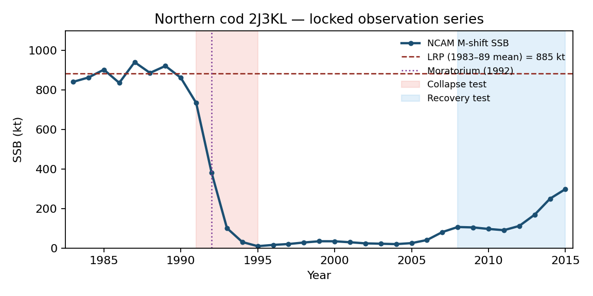
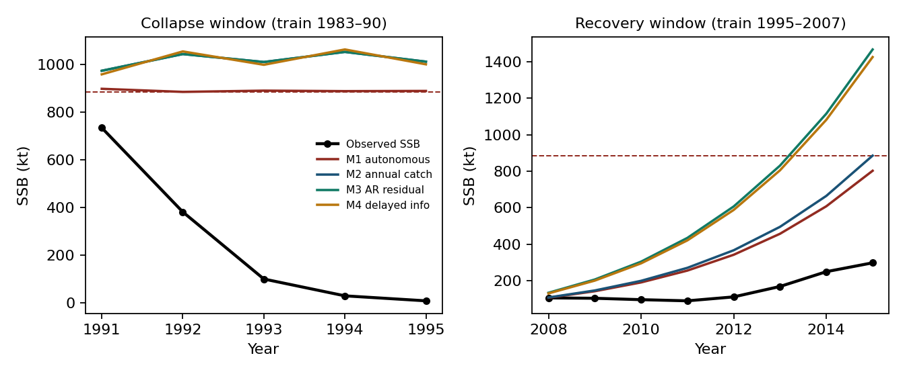
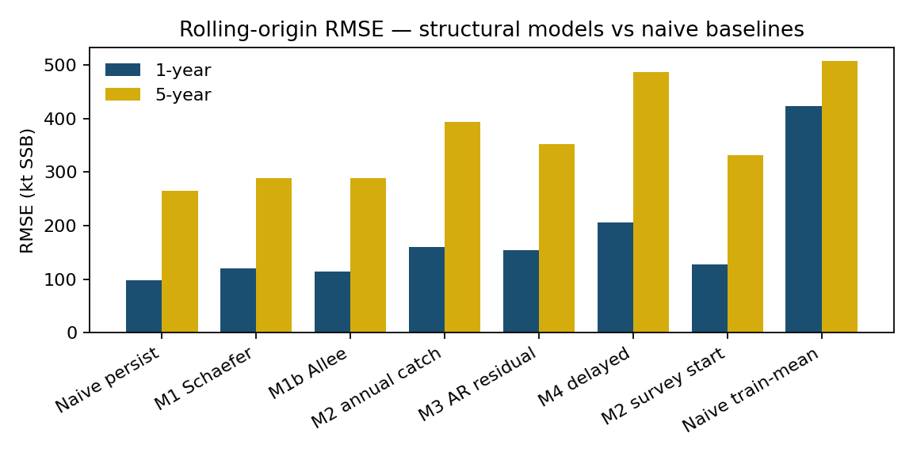
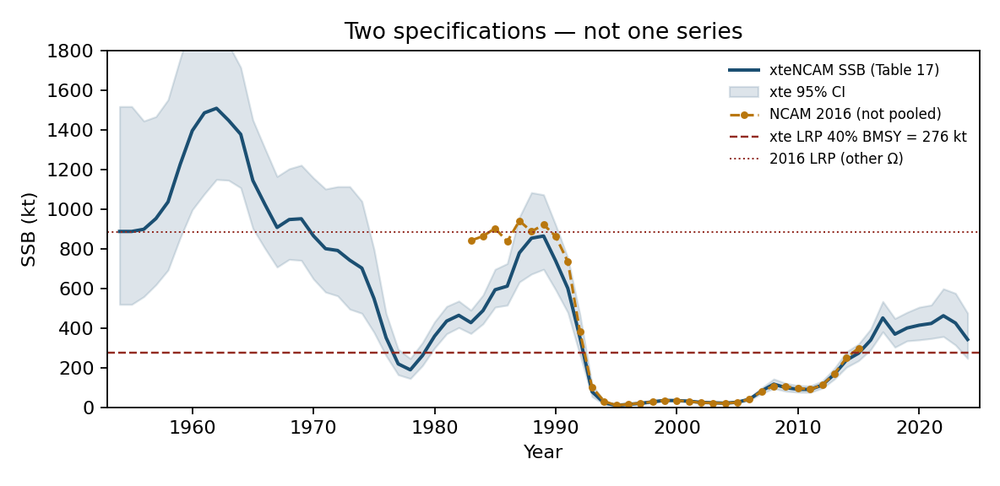

# Does a surplus-production ladder improve forecasts of Northern cod? A scored test on NAFO 2J3KL

**Prepared in the format of Fisheries Research**

## Highlights

- A seven-model ablation ladder forecasts Northern cod SSB on two assessment specifications
- No structural model beats last-value persistence on the primary out-of-sample score
- The 1991–1995 collapse is missed by every model under both catch treatments
- A negative certificate is issued for the autonomous surplus-production model class
- Post-2015 production stall reconstructions and the forecast ladder fail in the same place

## Abstract

This evaluation follows a preregistered retention rule: model structure is retained only when it improves early warning, out-of-sample prediction, or intervention selection. The test is applied to Northern cod in NAFO divisions 2J3KL. The primary predictand is the NCAM M-shift spawning-stock biomass (SSB) series of DFO (2016, Table A2) (the state-space assessment model of Cadigan, 2016) for 1983–2015, with the 2016 limit reference point (LRP) at the 1983–1989 mean SSB of 884.6 kt. Nested surplus-production models and two naive baselines issue fixed-window and rolling-origin forecasts. Catch enters as a coarse regime (240/120/5 kt) and as year-by-year landings (Schijns et al., 2021). No structural model has lower primary RMSE than last-value persistence. One-year rolling RMSE is 98 kt for persistence versus 115–196 kt for the surplus-production ladder under the coarse catch regime (115–206 kt across both catch treatments); year-by-year landings do not change the ranking (stock-flow RMSE 160 kt). Five-year RMSE is 265 kt versus 289–488 kt. The collapse window is missed by every model (RMSE 694–819 kt): a constant-productivity surplus model with a 1992 catch drop cannot produce the observed crash; neither an AR residual nor a one-year information delay reduces that error, and the delay raises it. On the recovery window the autonomous Allee fit has the lowest structural RMSE (90 kt) but is unidentified. The evaluation yields a negative certificate — a machine-verified non-retention finding, distinct from a statistical null result — rather than a forecast gain: the autonomous surplus-production model class is incompatible with the observed path; catch-regime stock-flow is not sufficient for collapse; and modules not identified on the training window increase error. The same retention rule holds on a second, unpooled specification (xteNCAM, 1954–2024, LRP 276 kt): persistence one-year RMSE 88 kt versus 120 kt for the autonomous Schaefer model. Capelin-informed productivity is not retained on the primary score. The series are not mixed.

**Keywords:** forecast evaluation; Northern cod; surplus production; model ablation; persistence; negative certificate

---

## 1. Introduction

Fisheries assessment builds structure by default: state-space age-structured assessments, surplus-production models, and ecosystem-linked extensions each add parameters, state variables, or couplings in the hope of better advice. Whether that structure improves out-of-sample forecasts — as opposed to in-sample fit — is a separate, testable question, and on it the burden of proof sits with the added structure. Northern cod (*Gadus morhua*) in NAFO divisions 2J3KL is the canonical demanding case. The late-1980s and early-1990s collapse — a spawning stock falling from a high, weakly trending phase to a few percent of its 1980s mean — occurred under an assessment and management regime whose failures were dissected in the canonical post-mortems (Hutchings and Myers, 1994; Walters and Maguire, 1996), and the non-recovery that followed the July 1992 moratorium has kept the depensation question open for three decades (Shelton and Healey, 1999). A partial rebuilding was documented in the 2010s (Rose and Rowe, 2015), but surplus production has since stalled, some years being negative (Rose, 2026). Any model family proposed for this stock must therefore first clear a minimal bar: it must at least beat the forecast that nothing changes.

This evaluation follows a preregistered retention rule: additional model structure is retained only when it improves early warning, out-of-sample prediction, or intervention selection. The instrument is a scored model-ablation framework — a ladder of nested surplus-production models evaluated against two naive baselines. The ladder is output-only, stock-and-flow, residual, then delay and observation. A module is kept only if it improves a preregistered score. This paper is that empirical evaluation.

It asks whether stock-flow, residual, delay, or prey-informed modules reduce SSB forecast error relative to last-value persistence and to the autonomous surplus-production model. The scope is deliberately narrow: this paper does not estimate an Allee threshold, identify the cause of the 1990s collapse, or evaluate whether the 1992 moratorium was adequate.

The stock was selected because of its data availability (a full state-space assessment series), its policy relevance, and the sharpness of its collapse-and-stall trajectory. A companion study under separate review applies the same scored design to a groundwater system (the Edwards Aquifer, Texas); the two systems' series are never pooled, and no retention verdict is transferred between them.

The remainder of the article is organized as follows. Section 2 states the data, the two assessment specifications, the model ladder, and the evaluation design. Section 3 reports the results: the primary specification (3.1), annual landings and the survey-start variant (3.2), the alternative assessment specification (3.3), and prey-informed productivity (3.4). Section 4 discusses the findings, the identification limits, the reconstruction-level corroboration, and the freeze-discipline record. Section 5 concludes.

## 2. Material and methods

### 2.1 Data and specifications

The specification tables type each field as follows: D, data; E, empirical construct; M, model; N, normative threshold.

**Table 1.** Primary specification — Specification A (the 1983–2015 NCAM M-shift SSB series of DFO, 2016, Table A2).

| Field | Contents | Type |
|---|---|---|
| System | Northern cod, NAFO 2J3KL, as represented by NCAM M-shift SSB | D |
| Interest | Continuity of a spawning stock on the 2016 precautionary-approach cautious or healthy side of the 2016 LRP | N |
| Domain | Stock area in DFO (2016) Figure 1; calendar years 1983–2015 | D |
| Safe set | $S_t \ge \mathrm{LRP} = 884.6$ kt (1983–1989 mean of Table A2) | N |
| Disturbance | Unspecified productivity shocks; not a fitted $M(t)$ | M |
| Theoretical catch | Any $C_t \ge 0$ | M |
| Implementable catch | Pre-1992 directed fishery; post-2 July 1992 moratorium and low inshore removals | E |
| Horizon | Hindcast 1983–2015; two fixed test windows and rolling origin | D |
| Food web | Capelin excluded from the primary pass; tested as a variant in Section 3.4 | M |
| Norm | 2010/2016 DFO precautionary-approach LRP (1980s mean SSB), not the 2023 40% $B_{\mathrm{MSY}}$ LRP | N |

Table A2 also reports fishing mortality $F$ and natural mortality $M$. They are joint outputs with SSB and are not used as exogenous inputs.

Regular et al. (2025) extend the assessment to 1954, revise the LRP to 276 kt (95% interval 180–423 kt; 40% of $B_{\mathrm{MSY}}$), and estimate 2024 SSB at 342 kt. That is a second specification — Specification B (the 1954–2024 extended xteNCAM series; Section 3.3). The two objects differ in four specification fields: the dynamics map (xteNCAM versus NCAM M-shift; start year 1954 versus 1983), the safe-set map (276 kt versus 884.6 kt), the treatment of catch, and the horizon. The two SSB columns are not mixed. Under the study's specification-matching discipline, a retention verdict does not transfer between objects whose dynamics map or safe-set map differs; here both differ, so the two specifications are evaluated separately and neither verdict imports the other.

### 2.2 Forecast models

Discrete surplus production, with $S$ in kt and $C$ in kt yr⁻¹:

$$
S_{t+1}=\bigl[S_t+g(S_t)-C_t+\varepsilon_t\bigr]_+,
\qquad
g(S_t)=rS_t\bigl(1-S_t/K\bigr)\,a(S_t),
\qquad
a(S_t)=
\begin{cases}
1 & \text{(Schaefer; no Allee term declared)},\\[2pt]
\dfrac{S_t-\mathfrak s}{K-\mathfrak s} & \text{(depensation term active, $\mathfrak s>0$)}.
\end{cases}
$$

The factor is a multiplicative depensation term, not a parameter switch: setting $\mathfrak s=0$ gives $a(S_t)=S_t/K$ (a cubic modification of the logistic surplus), not the Schaefer law — the Schaefer model is the separate member of the family in which the factor is replaced by $1$ (a companion governance study under separate review makes the same point).

**Table 2.** Model ladder.

| ID | Class | Free on the training window | Frozen into the test window |
|---|---|---|---|
| persist | baseline | — | $\hat S_{t+h}=S_t$ |
| mean | baseline | training mean | $\hat S_{t+h}=\bar S_{\mathrm{train}}$ |
| M1 | autonomous | $r,K,C$ constant | same $C$ |
| M1b | autonomous with Allee | $r,K,\mathfrak s,C$ | same |
| M2 | stock-flow | $r,K$; $C_t$ prescribed | prescribed $C_t$ |
| M3 | residual | M2 + AR(1) residual | $\phi$ persisted |
| M4 | delay | M3 | forecast starts from $S_{t-1}$ |

The coarse catch regime, taken from DFO (2016) prose (the precautionary-approach framework of DFO, 2009, governs the critical-zone vocabulary used below), is $C_t=240$ kt for $t\le 1991$, $C_t=120$ kt for $t=1992$, and $C_t=5$ kt for $t\ge 1993$. Year-by-year landings (Schijns et al., 2021, Table 1) replace that regime in Section 3.2. Regular et al. (2025) Table 1 matches Schijns exactly on 1983–1993 (11 years, maximum absolute difference 0 t); STATLANT matches Schijns on 1983–1993, so the STATLANT-versus-Schijns sensitivity is closed for the collapse window (they are the same column there). A 1956 discrepancy between those sources (236,210 t versus 263,210 t) lies outside 1983–2015 and is unused. The coarseness of the regime series is a declared limitation.

Parameters are estimated by one-step least squares on the training window only. Bounds: $r\in(0.001,2]$, $K$ above the training maximum.

A survey-start variant replaces the surplus initial condition by $\hat q\,I_t$, where $I_t$ is the autumn research-vessel abundance index and $\hat q$ is the training-window median of $\mathrm{SSB}/I$. The index is an NCAM input, not an independent stock.

Prey-informed variants (Section 3.4) scale surplus production by a 1991 capelin regime or by the tabulated 3L spring acoustic index. Pre-1991 acoustic values are not carried across 1991. Missing survey years are not interpolated.

### 2.3 Evaluation design

Fixed windows on Specification A: collapse, train 1983–1990, test 1991–1995; recovery, train 1995–2007, test 2008–2015. Rolling origin: minimum eight training years; horizons $h=1$ and $h=5$.

The primary score is RMSE of SSB (kt). Secondary scores are mean absolute error, RMSE on $\log S$, the Brier score for $\mathbf{1}\{\hat S<\mathrm{LRP}\}$, and the sign-hit rate of $\Delta S$ on fixed windows.

A module is retained only if it reduces primary RMSE relative to the next-simpler model and relative to persistence. Retention is decided separately on each specification.

On Specification B the collapse window is train 1954–1989, test 1990–1995, and the recovery-stall window is train 1995–2012, test 2013–2024. Catch is Table 1 landings (2024 persisted from 2023). No row is taken from NCAM 2016. The ladder's rolling origin on Specification B uses a minimum of twelve training years ($n=59$ at $h=1$, $n=55$ at $h=5$); the naive baselines retain the eight-year minimum ($n=63$ and $n=59$).

## 3. Results

### 3.1 Primary specification



**Figure 1.** NCAM M-shift SSB (DFO, 2016, Table A2). Dashed line: 2016 LRP = 884.6 kt. 2015 SSB is 33.8% of that LRP, matching the advisory report statement of 34%.



**Figure 2.** Multi-step forecasts from the end of each training window. Recovery is under-predicted when an AR residual fitted on a slow early-recovery train is persisted.

**Table 3.** Fixed-window scores (RMSE in kt).

| Window | Model | RMSE | MAE | log-RMSE | Brier | Direction |
|---|---|---:|---:|---:|---:|---:|
| Collapse | M1 | 694 | 638 | 2.73 | 1.00 | 0.50 |
| | M1b | 694 | 636 | 2.73 | 0.80 | 0.00 |
| | M2 | 819 | 751 | 2.85 | 1.00 | 0.25 |
| | M3 | 819 | 751 | 2.85 | 1.00 | 0.25 |
| | M4 | 819 | 750 | 2.85 | 1.00 | 0.25 |
| Recovery | M1 = M2 | 120 | 105 | 0.61 | 0.00 | 0.57 |
| | M1b | **90** | 55 | 0.52 | 0.00 | 0.57 |
| | M3 | 220 | 200 | 0.92 | 0.00 | 0.57 |
| | M4 | 214 | 195 | 0.91 | 0.00 | 0.57 |

On collapse, fitted $r$ saturates at the upper bound ($\approx 2$). The 1983–1990 window is a high, weakly trending stock. Surplus production does not identify the 1992–94 mortality pulse, and dropping $C$ from 240 to 5 raises forecast SSB. If the crash were a catch-regime event in this accounting, M2 would improve on M1. It does not.

On recovery, M1 and M2 coincide because $C_t\equiv 5$ kt on both train and test. M1b reports a lower RMSE, but $\mathfrak s\to 0$ and $K$ collapses to the training range: an unidentified Allee parameter, not a biological threshold. M3's $\phi=0.95$ persists a negative residual and increases error.



**Figure 3.** Rolling-origin RMSE. Persistence is the best one-year and five-year point forecast.

**Table 4.** Rolling-origin summary, Specification A, coarse catch regime.

| Model | $h=1$ RMSE | $h=1$ MAE | $h=1$ log-RMSE | $h=5$ RMSE |
|---|---:|---:|---:|---:|
| persist | **98** | **48** | **0.52** | **265** |
| M1 | 121 | 80 | 8.02 | 289 |
| M1b | 115 | 80 | 8.70 | 289 |
| M2 | 144 | 61 | 0.59 | 398 |
| M3 | 135 | 53 | 3.39 | 366 |
| M4 | 196 | 82 | 0.76 | 488 |
| mean | 424 | 375 | 2.35 | 507 |

Log-RMSE for M1 and M1b is large because some origins produce trajectories that hit the numerical floor. M2 keeps the state off zero and stabilizes the log score, but loses on raw RMSE. M4, the only model that imposes a one-year assessment delay, is the worst structural model on raw RMSE. The difference measures the information cost of the one-year delay.

No module M2–M4 is retained on Specification A. Persistence is the lowest-RMSE forecast.

### 3.2 Annual landings and survey start

Year-by-year landings for 2015 are 4.436 kt, matching DFO reported landings. Pre-collapse catches are 172–269 kt, not a flat 240. The 1992 drop is to 41 kt, then 11 kt, then 0.4–1.9 kt.

**Table 5.** Rolling-origin RMSE (kt) with annual landings.

| Model | $h=1$ | $h=5$ |
|---|---:|---:|
| persist | **98** | **265** |
| M1 | 121 | 289 |
| M1b | 115 | 289 |
| M2 | 160 | 394 |
| M3 | 154 | 352 |
| M4 | 206 | 486 |
| M2, survey start | 128 | 331 |

Annual landings make M2 worse than the coarse regime on one-year RMSE (160 versus 144 kt). Collapse-window RMSE remains about 821 kt. On the annual-catch recovery window (train 1995–2007, test 2008–2015) the ladder scores M1 264, M1b 78, M2 303, M3 609, and M4 586 kt, against a frozen-persistence error of 104 kt (forecast held at the 2007 level of 81 kt): annual landings do not repair the recovery-window fit, the residual-persistence models deteriorate severely (609 and 586 kt against 220 and 214 kt under the coarse regime), and M1b's 78 kt carries the same unidentified-Allee caveat as its regime-window fit. Apparent net production $S_{t+1}-S_t+C_t$ is strongly negative in 1991–93 even after subtracting reconstructed catch. A more accurate $C_t$ cannot produce the crash in a constant-$r$ surplus model, because the observed $\Delta S$ is far larger than $C_t$.

Starting from $\hat q I_t$ instead of SSB: one-year RMSE 128 kt (still worse than persist 98); one-year log-RMSE 0.49 versus persist 0.52; five-year RMSE 331 versus persist 265. On the primary score the variant is not retained. The log-score difference is recorded and not used for selection. A set-valued conservative filter is not instantiated: there is no observation fibre — no independent observation channel — outside NCAM.

### 3.3 Alternative assessment specification



**Figure 4.** The two specifications. Overlap 1983–2015 RMSE = 126 kt (2015: NCAM 299 kt, xteNCAM 273 kt). Different safe sets. Not pooled.

Checkpoints from Regular et al. (2025) Table 17: 2005 SSB = 26 kt (95% interval 22–31), 2017 = 451 kt (381–534), 2021 = 423 kt (NCAM and xteNCAM said to agree), 2024 = 342 kt (246–475), 2024/LRP = 1.24. The 2005 values (26 kt versus NCAM 25.18 kt) can agree on a low year without the two series sharing a reference point; agreement on a low year does not warrant splicing the two columns. The same late-period biomass is 34% of the old LRP and above the new one after 2016.

**Table 6.** Rolling-origin RMSE on Specification B (kt).

| Model | $h=1$ | $h=5$ |
|---|---:|---:|
| persist | **88** | **318** |
| M1 | 120 | 432 |
| M1b | 152 | 446 |
| M2 | 166 | 1059 |
| M3 | 127 | 930 |
| M4 | 206 | 1031 |
| mean | 449 | 506 |

Collapse window (train 1954–89, test 1990–95): M1 RMSE 817 kt; M2 1898 kt. Official landings worsen the crash forecast. No module is retained. Persistence remains the lowest-RMSE forecast. That is the second independent negative certificate — a machine-verified finding of non-retention or certified non-existence, distinct from a statistical null result — under the same rule on a different specification. The longer series and the revised LRP do not justify retaining the additional modules.

Recovery-stall window (train 1995–2012, test 2013–2024; $n=12$): M1 254 kt, M1b 178 kt, M2 269 kt, M3 268 kt, M4 269 kt. The 2013–2024 test path rises from 167 to 462 kt, all above the 112 kt training-end value, so a persistence forecast frozen at that value errs by 262 kt — more than M1 and M1b on this single origin. This fixed-origin comparison does not enter the retention rule, which is decided on rolling-origin primary RMSE (Table 6, where persistence is not beaten at either horizon). M1b's window fit carries the identification fragility familiar from its other window fits: a small fitted Allee parameter ($\mathfrak s = 5.3\times10^{-3}$) with a carrying capacity ($K=500$ kt) extrapolated far beyond the training range (maximum 117 kt).

On the rolling Brier score for $\mathbf{1}\{\hat S<\mathrm{LRP}\}$ on Specification B (the secondary score declared above; LRP = 276 kt): persistence 0.06 at $h{=}1$ and 0.27 at $h{=}5$; M1 0.05 and 0.45; M1b 0.15 and 0.47; M2 0.07 and 0.36; M3 0.02 and 0.31; M4 0.07 and 0.38. M1 and M3 improve the one-year Brier score over persistence (0.05 and 0.02 versus 0.06); no model improves it at $h{=}5$, and no model improves the primary RMSE score at either horizon (Table 6), so the retention verdict is unchanged. For reference, the same secondary score on Specification A is 0.00 at both horizons for persistence (every target year 1991–2015 is below the 884.6-kt LRP, so the persistence indicator is always correct), with M1 0.04/0.05, M1b 0.00/0.05, M2 0.08/0.14, M3 0.08/0.10, M4 0.08/0.14 — unbeatable there, and reported only to keep the two specifications' records separate and complete.

Regular et al. assign the 1992–94 disappearance primarily to $M$ (peak $\approx 2.5$), informed by tagging and a capelin/cod predictor, and note that some of that $M$ could still be unreported $F$. That split is the same as the surplus residual after subtracting official $C_t$.

### 3.4 Prey-informed productivity

Murphy et al. (2025) report a 1991 acoustic collapse (1985–90 median 3704 kt versus 1991–2022 median 174 kt). A two-regime $r$ with break 1991 uses the high regime only for forecasts issued before 1991. Capelin enters as a candidate disturbance class, not as a fitted parameter.

**Table 7.** Rolling RMSE, two-regime $r$.

| Specification | Model | $h=1$ | $h=5$ |
|---|---|---:|---:|
| A | persist | **98** | **265** |
| A | M_cap | 154 | 334 |
| B | persist | **88** | **318** |
| B | M_cap | 147 | 894 |

On post-break origins only (Specification B, $h=1$; $n=33$): M_cap 107 versus persistence 75 on the identical origin set (the 88 of Table 7 is the all-origins value). Not retained. On Specification A post-break origins ($n=24$) the corresponding M_cap value is 149 kt.

The year-by-year 3L spring acoustic biomass is tabulated in Zenodo 10.5281/zenodo.17515115, with 2023 = 331.3 kt from Murphy et al. (2025). Surplus is scaled by $(I_{\mathrm{known}}/I_{\mathrm{ref}})^{b}$, where $I_{\mathrm{known}}(t)$ is the last observation at or before $t$, $I_{\mathrm{ref}}$ is the training-window median of the observed index, and $b$ is a third free parameter fitted jointly with $r$ and $K$ by one-step least squares on the training window. Survey years are unobserved in part of the record, so the index-forecast origins number $n=24$ ($h=1$) and $n=20$ ($h=5$) on Specification A and $n=36$ and $n=32$ on Specification B, against the SSB-based rolling-origin counts ($n=25$ at $h=1$ and $n=21$ at $h=5$ on Specification A; Section 4).

**Table 8.** Rolling RMSE, observed acoustic index.

| Specification | Model | $h=1$ | $h=5$ |
|---|---|---:|---:|
| A | persist | **98** | 265 |
| A | M_cap_index | 150 | 262 |
| B | persist | **88** | **318** |
| B | M_cap_index | 132 | 492 |

On Specification A, five-year RMSE is a near-tie (262 versus 265 kt). One-year RMSE is worse. The module is not retained.

## 4. Discussion

The observed path is non-monotone. An exact fixed autonomous scalar trajectory cannot reproduce it; M1's collapse failure is the finite-sample face of that obstruction — the incompatibility of the observed path with the autonomous surplus-production model class.

Under both the coarse catch regime and official landings, lowering $C$ in 1992 cannot generate the crash. Collapse on these specifications is a productivity, unallocated-mortality, or observation event, not a surplus-production response to the declared catch drop. That is compatible with DFO's caution that NCAM $M$ can absorb unreported deaths: the crash remains such an event under the best available public catch reconstruction, which tightens that limitation rather than relaxing it.

Unidentified extra structure increases error. Autoregressive residuals fitted on short, regime-changing windows persist the wrong sign. An Allee parameter goes to the boundary. A one-year delay removes information. These modules stay descriptive unless the conditions under which a module's contribution could be certified rather than merely scored hold; M3 and M4 are not certificates here.

The 2016 LRP is the 1980s mean SSB. Slack to that bound is near zero by construction throughout the training window that precedes collapse. A leading-indicator claim that uses this safe set is circular for 1983–1990.

The moratorium is a change in implementable catch and is already in $C_t$. A separate delay switch does not add a degree of freedom beyond stock-flow. Whether the 1992 architecture has an empty viability kernel is a viability statement, not a one-year RMSE statement.

One-dimensional surplus production is not NCAM: age structure, migration, and survey catchability are omitted. The test is whether this ladder is retained under the preregistered score, not whether the assessment is a good filter. M4 is a delay, not a Kalman filter. Recreational catch remains incompletely measured. Sample sizes are small ($n=33$ years on Specification A; rolling $n=25$ at $h=1$ and $n=21$ at $h=5$). They suffice to rank models and do not suffice to certify a small skill difference. Repeating the ladder under the 2023 40% $B_{\mathrm{MSY}}$ LRP requires the xteNCAM series and a fresh specification-matching review.

**Reconstruction-level corroboration.** An independent, assessment-level record sharpens the same boundary. Rose (2026) compares two surplus-production reconstructions of the stock spanning 1983–2023 — the Rose and Walters (2019) model and the DFO (2024) assessment model — and documents that surplus production and stock growth stalled after 2015, with some years negative, the stall-point biomass being controversial between the two reconstructions and well below historical norms. The recovery-stall window of Specification B (train 1995–2012, test 2013–2024) spans exactly that period. A stock whose biomass continues to rise while its surplus production stalls — the configuration Rose (2026) reports — is precisely the configuration a constant-productivity surplus law cannot reproduce, and the ladder's single-origin comparison on that window (M1 254 kt, M1b 178 kt against persistence 262 kt, with no retention on the rolling score) shows the same failure on the forecast side. The two reconstructions' disagreement at the stall point is moreover the assessment-level twin of the ladder's own non-uniqueness: M1b's apparent recovery-window skill is carried by a carrying capacity extrapolated far beyond the training range, exactly the extrapolation on which the two reconstructions diverge. Rose (2026) also documents the limit-reference-point trajectory — successive downward revisions to just over 0.3 Mt, then to about 0.25 Mt in 2025 — which is the norm-field drift that separates the two specifications evaluated here (884.6 kt versus 276 kt) and the reason their columns are never pooled.

**Attribution and the prey modules.** Rose (2026) infers from structural-equation models that the post-2015 production deficit is limited by capelin and amplified by harp seal predation, with fishing almost certainly not the sole cause. That attribution is consistent with the ladder's two negative findings, and it sharpens both. First, it matches the catch-treatment null: no catch treatment repairs the collapse, because the missing term is not catch. Second, it draws the identification boundary inside the prey results: capelin limitation can be a real production driver — the 1991 acoustic collapse is large (1985–90 median 3704 kt versus 1991–2022 median 174 kt) — while the corresponding forecast modules still fail the preregistered score. A driver's reality at the reconstruction level does not make it a usable forecast module at the surplus-production level; the two-regime and acoustic-index variants were not identified on their training windows, and the retention rule keeps them out for exactly that reason.

**Freeze discipline.** The evaluation windows and scoring rules were fixed in the analysis scripts before execution; the design is a fixed computational protocol rather than a prospective clinical-style registration. Unlike the companion evaluation on the Edwards Aquifer (under separate review), whose protocol files are dated and locked before scoring, the cod side carries no dated pre-score protocol file: the passes evolved (primary, annual-landings, survey-start, capelin, Specification B) with each extension declared in the manuscript rather than preregistered — a freeze-discipline caveat, recorded so that the evidentiary asymmetry between the two studies is visible.

The scores do not transfer to an interval-verified linear template (a companion methodological study; that template is a linear $(S,K)$ construction, not this SSB series), do not instantiate a closed-loop information filter (registered as the framework's next structural addition), and do not mix the two assessment specifications. The delay instantiated here is a one-year information delay, not a retarded functional differential equation; community-level early-warning margins are not used (the underlying extract is not archived). No framework result is treated as established without specification matching and independent verification.

On this evidence, modules that are not identified on the training data do not reduce forecast error. The retained forecast is persistence, together with the negative certificate for the autonomous scalar class.

## 5. Conclusions

On locked NCAM M-shift SSB for 1983–2015, last-value persistence is more accurate than surplus production, catch-driven stock-flow, autoregressive residuals, delayed information, and prey-informed productivity. The crash is not a catch-drop event in this accounting. Extra modules that fail identification increase error. The same retention outcome holds on the unpooled xteNCAM series, whose post-2015 stall period fails in the same way the reconstructions stall.

The paper reports a forecast comparison. It does not conclude that the stock is unsustainable, and it does not conclude that the evaluation framework is empirically confirmed on this stock.

## Data availability

All input data, analysis scripts, and result files are archived in the public repository at https://github.com/MIKEAA2020/general-sustainability; the frozen model specification is archived with them. Primary spawning-stock-biomass series: DFO (2016), Table A2. Alternative assessment series and landings: Regular et al. (2025), Tables 17 and 1. Historical landings: Schijns et al. (2021). Capelin acoustic index: Murphy et al. (2025), Zenodo repository 10.5281/zenodo.17515115. All computations are deterministic: within a fixed interpreter and library stack, repeated executions reproduce every result file byte for byte, and an independent re-execution of the scoring runners verified all 29 recorded output checksums (29/29 pinned) and regenerated all 30 result files byte-identically (30/30). Across environments the record is: the intervention runners and the OLS-based prediction runners regenerate their outputs byte for byte, while the four optimizer-based forecast runners (L-BFGS-B fits) reproduce every scored row at printed precision except the M1b rolling row on Specification B, whose Allee optimum is environment-sensitive at the ±17 kt level (h=1: 151.6 versus 153.2 kt; h=5: 445.5 versus 462.5 kt, on Python 3.12/numpy 2.1.3/scipy 1.14.1 versus the recorded original environment) — consistent with that model's declared identification fragility ($\mathfrak s\to 0$, $K$ at bound), and immaterial to the retention verdict, which persistence wins at both horizons by margins far larger than the instability. The archive records the checksums of the original-environment outputs; the deterministic-in-environment claim and this sensitivity note together are the reproducibility statement. The two assessment specifications (NCAM and xteNCAM) were analysed throughout as separate, unpooled series.

```
python3 src/run_ladder.py && python3 src/run_xte.py
python3 src/run_capelin_regime.py && python3 src/run_capelin_index.py
python3 src/compare_catch.py && python3 src/make_figures.py
```

## CRediT authorship contribution statement

[To be completed at submission.]

## Declaration of competing interest

The authors declare that they have no known competing financial interests or personal relationships that could have appeared to influence the work reported in this paper.

## References

Cadigan, N.G., 2016. A state-space stock assessment model for northern cod, including under-reported catches and variable natural mortality rates. Can. J. Fish. Aquat. Sci. 73, 296–308.

DFO, 2009. A fishery decision-making framework incorporating the Precautionary Approach. Fisheries and Oceans Canada, Ottawa.

DFO, 2010. Proceedings of the Newfoundland and Labrador Regional Atlantic cod Framework Meeting. DFO Can. Sci. Advis. Sec. Proceed. Ser. 2010/053.

DFO, 2016. Stock Assessment of Northern cod (NAFO Divs. 2J3KL) in 2016. DFO Can. Sci. Advis. Sec. Sci. Advis. Rep. 2016/026.

DFO, 2024. NAFO Divisions 2J3KL Northern Cod stock assessment to 2024. DFO Can. Sci. Advis. Sec. Sci. Advis. Rep. 2024/049.

DFO, 2024. Assessment of capelin in NAFO Divisions 2J3KL. DFO Can. Sci. Advis. Sec. Sci. Advis. Rep. 2024/050.

Hutchings, J.A., Myers, R.A., 1994. What can be learned from the collapse of a renewable resource? Atlantic cod, Gadus morhua, of Newfoundland and Labrador. Can. J. Fish. Aquat. Sci. 51, 2126–2146.

Murphy, H.M., Adamack, A.T., Lewis, R.S., Bourne, C.M., 2025. Assessment of capelin in NAFO Divisions 2J+3KL to 2023. DFO Can. Sci. Advis. Sec. Res. Doc. 2025/022.

Northwest Atlantic Fisheries Centre, 2025. 2J3KL cod and capelin biomass indices. Zenodo. https://doi.org/10.5281/zenodo.17515115

Regular, P.M., et al., 2025. Assessment of the Northern Cod stock in NAFO Divisions 2J3KL in 2024. DFO Can. Sci. Advis. Sec. Res. Doc. 2025/048.

Rose, G.A., 2026. Northern cod comeback: 10 years after. Can. J. Fish. Aquat. Sci. 83, 1–14. https://doi.org/10.1139/cjfas-2025-0141

Rose, G.A., Rowe, S., 2015. Northern cod comeback. Can. J. Fish. Aquat. Sci. 72, 1789–1798.

Rose, G.A., Walters, C.J., 2019. The state of Canada's iconic Northern cod: a second opinion. Fish. Res. 219, 105314.

Schijns, R., Froese, R., Hutchings, J.A., Pauly, D., 2021. Five centuries of cod catches in Eastern Canada. ICES J. Mar. Sci. 78, 2675–2683.

Shelton, P.A., Healey, B.P., 1999. Should depensation be dismissed as a possible explanation for the lack of recovery of the northern cod (Gadus morhua) stock? Can. J. Fish. Aquat. Sci. 56, 1521–1524.

Walters, C., Maguire, J.-J., 1996. Lessons for stock assessment from the northern cod collapse. Rev. Fish Biol. Fish. 6, 125–137.
