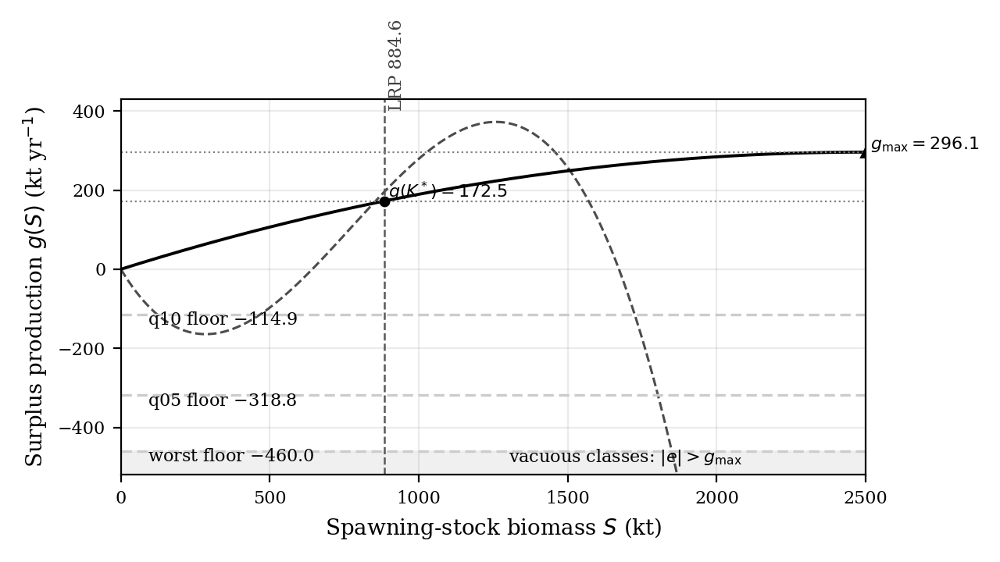
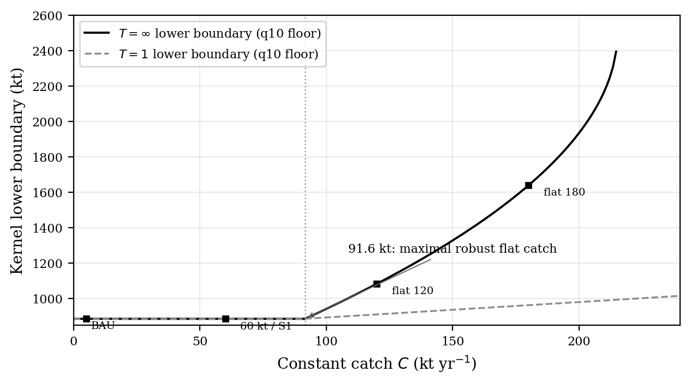
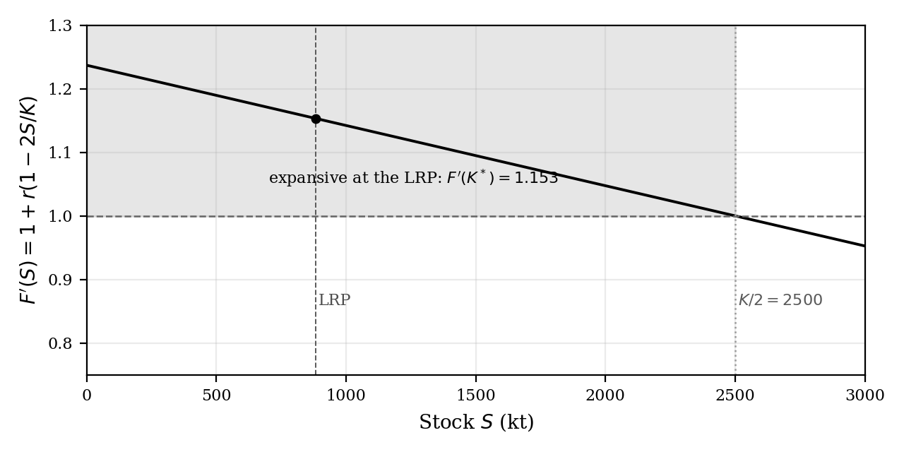
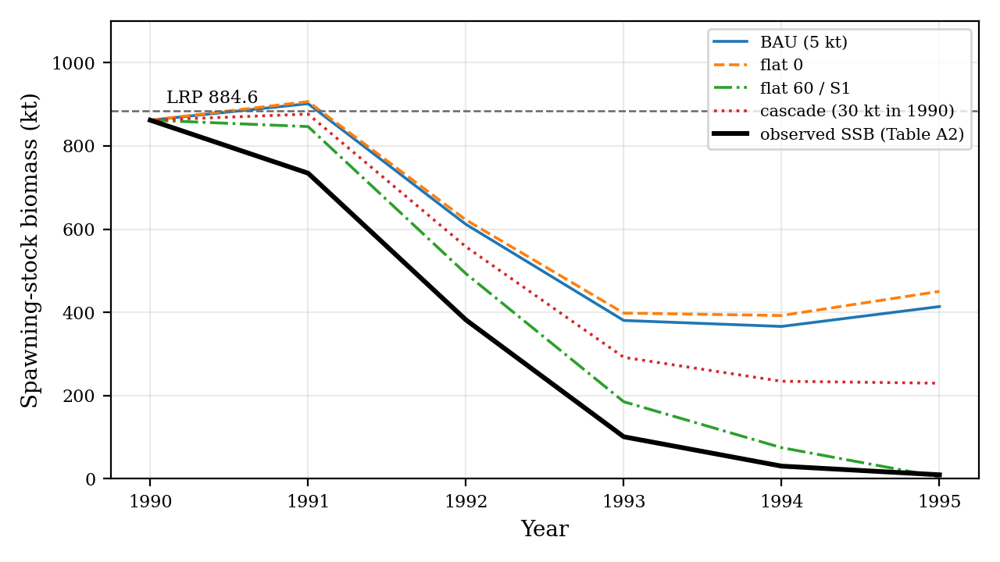
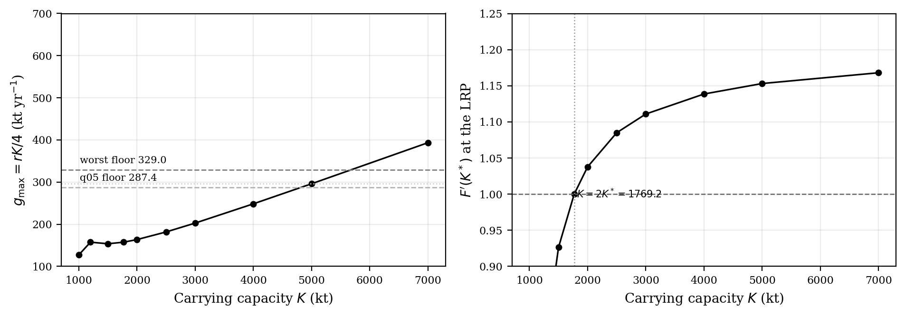
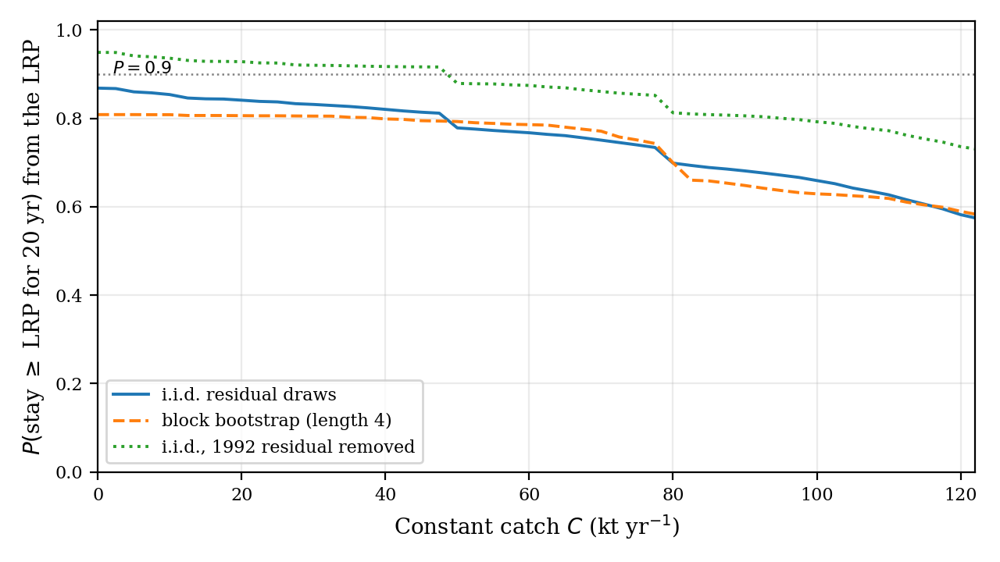

# Robust viability of the 2J3KL limit reference point under a surplus-production map: policy scoring, expansion, and when catch cannot help

**Prepared in the format of Fisheries Research (research article)**

## Abstract

Intervention selection is scored, not asserted. A governance module survives only if it improves the declared protection-and-supply outcome, and the protocol was frozen before any kernel was computed. The governed object is the one-step least-squares surplus-production map on the 1983–2007 Northern cod (NAFO 2J3KL) SSB series ($r = 0.2369$; $K = 5000$ kt at its bound; residual SD $135.0$ kt; lag-1 autocorrelation $0.65$). It is scored on the declared catch-policy family (moratorium removals, flat caps, the DFO-2009 critical-zone rule, a cascade) against the 2016 reference point ($884.6$ kt) under persistent productivity floors. The stochastic, finite-duration, carrying-capacity, and bootstrap layers are post-freeze. (1) Under the informative floor, moratorium and zero catch hold the safe set at every horizon; the largest robust constant catch is $57.6$ kt; boundary-harvesting rules are less protective by the declared geometry. (2) The two harsher floors exceed maximum surplus ($296$ kt yr⁻¹). Emptiness holds for every policy in that case, which is vacuous robustness rather than a productivity finding. (3) The map is expansive at the LRP ($F' = 1.153$). The certified conversion's contraction form fails, and certified kernels are empty beyond five years. The expansion is data-selected ($F' \ge 1$ above $2K^*$), and contraction ($F' = 0.61$–$0.93$) returns only where the certificates collapse. (4) Stochastic viability on the residuals gives a 20-year survival from the LRP of $0.87$ (zero catch) down to $0.58$ ($120$ kt). The $57.6$ kt boundary carries $0.77$–$0.88$, and the constructive bound's $90\%$ bootstrap interval is $[0, 84.8]$ kt. (5) The data-preferred depensatory refit (SSE $7690$ vs $12{,}772$ kt²) leaves the constructive, selection, and expansion certificates intact; only the vacuous 5th-percentile class reverses. On this map the LRP is protected by good years rather than by catch management. The certificate is scoped to this fitted map, these declared classes, and this rule; the paper asserts no such conclusion for Northern cod or harvest-control rules in general.

**Keywords:** northern cod; surplus production; viability; harvest control rules; limit reference point

## 1. Introduction

After the 1992 moratorium, Northern cod (NAFO divisions 2J3KL) posed a clean governance question. Can any catch policy hold a collapsed stock's spawning biomass above its limit reference point when productivity is depressed? Or is the reference point instead protected by good years rather than by demand management? Viability analysis supplies the natural instrument for such questions. It asks which states admit controls that keep every constraint satisfied over time, rather than which policy maximizes an objective (Aubin, 1991). It has been applied to fisheries in exactly this register: bioeconomic viability constraints (Béné, Doyen, and Gabay, 2001); viable recovery paths after collapse (Martinet, Thébaud, and Doyen, 2007); stochastic co-viability for ecosystem-based management (Doyen et al., 2012); and the numerical computation of viability kernels for fishery case studies (Krawczyk, Pharo, Serea, and Sinclair, 2013; Krawczyk and Pharo, 2013). The reference point is a floor on the productive stock itself, namely the spawning biomass whose regeneration underwrites future yield. The question is therefore whether adjustments to the draw on that stock can hold the base that regenerates the yield, or whether the reference point is protected only by favourable productivity. This study answers the question by scoring rather than assertion.

Four questions organize the results. (Q1) Under which productivity regimes does any catch policy — zero catch included — hold the LRP, and where is the question vacuous because the floor exceeds the map's maximum surplus? (Q2) Under the informative regime, what is the largest constant catch whose worst-case equilibrium remains at or above the LRP, and how do reactive rules fare against it under the declared retention rule? (Q3) How fast does model error of the declared magnitude erode the certified safety margin when the governed map is expansive at the reference point? (Q4) Which answers are geometric properties of the rule and the threshold, which are identified properties of the fitted map, and which are sensitive to the model form or the carrying capacity?

The object is the governed surplus-production model fitted in a companion forecast-evaluation study (under separate review), which ended in a negative certificate with last-value persistence unbeaten on out-of-sample RMSE. Here the same fitted model, on the primary assessment specification (the 1983–2015 NCAM M-shift SSB series of DFO, 2016, Table A2, with LRP $884.6$ kt), is scored as a closed-loop governance object. The deliverables are robust viability kernels of the LRP for a declared catch-policy family under persistent productivity-shock floors, plus a certified layer that converts the declared model defect into a safety-margin erosion. The intervention protocol — object, defect declaration, disturbance classes, policy family, and retention rule — was frozen (dated 2026-08-26) before any kernel, boundary, replay, or retention score was computed. The frozen protocol document is archived with the analysis code. Section 2 states the methods. Section 3 reports the kernels, the two negative certificates, the constructive boundary, the certified layer, and the stress replay. Section 4 discusses limitations.

## 2. Methods

### 2.1 Operating model and data

All inputs are public and the analysis is deterministic. The stock series is the Northern cod (NAFO 2J3KL) spawning-stock biomass of DFO (2016), Table A2. Annual landings are Schijns et al. (2021), Table 1. The fit window is 1983–2007 (24 one-step transitions; the out-of-sample audit runs 2008–2015), and the protocol was frozen on 2026-08-26, before any kernel, boundary, replay, or retention score was computed. The training-window residuals of the fitted map have mean $-20.4$ kt, SD $135.0$ kt, range $[-460.0, +179.8]$ kt, and lag-1 autocorrelation $0.65$. The 1992 transition residual is the minimum ($-460.0$ kt). The training-window maximum stock is $940.75$ kt, which is why the fitted carrying capacity, pinned at its $5000$ kt optimization bound, sits above the observed range (the declared optimization box runs from just above the training maximum to $5000$ kt). A companion forecast-evaluation study scored the same point-estimate map against persistence on the same series and issued a negative certificate (persistence unbeaten out of sample). That certificate is scored there, not here, and the closed-loop object below is the same fitted map by construction.

All analyses beyond the frozen kernel tables — the carrying-capacity grid, the stochastic viability layers, the finite-duration floors, and the bootstrap bands of Sections 3.7–3.10 — are additional scored objects executed after the freeze on the declared machinery. None of them replaces or alters the frozen family, the frozen floor classes, or the retention rule.

### 2.2 The governed object and the scoring rule

The governed object is the companion forecast-evaluation study's own stock-flow class.

$$S_{t+1}=\bigl[S_t+rS_t(1-S_t/K)-C_t+e_t\bigr]_+$$

The Allee term is off. The map is fitted by one-step least squares on 1983–2007 with annual landings (Schijns et al., 2021), giving $r = 0.2369$ and $K = 5000$ kt (pinned at its optimization bound; the series never approaches carrying capacity, a declared defect; the LRP-boundary results depend chiefly on the identified $r$). Fit residual SD is $135.0$ kt. The defect declaration is $\varepsilon = 460.0$ kt yr⁻¹ (the 1992 collapse transition). The out-of-sample audit on 2008–2015 gives a maximum of $47.1$ kt, which does not exceed the declared defect (by contrast, the groundwater object of the companion intervention study exceeds its declared defect out of sample).

The declared formal objects are stated as definitions and propositions so that the empirical content can be read off cleanly.

**Definition 2.1 (Governed surplus-production map).** The governed object is the one-step map above with parameters $(r, K) = (0.2369, 5000\text{ kt})$ fitted by one-step least squares on 1983–2007, Allee term off, and the declared defect declaration $\varepsilon = 460.0$ kt yr⁻¹.

**Definition 2.2 (Safe set).** The single declared threshold is $K^* = \mathrm{LRP} = 884.6$ kt (the 1983–1989 mean of Table A2). The safe set is $[K^*, \infty)$. No row on the second assessment specification (the 1954–2024 extended xteNCAM series, LRP $276$ kt) enters the frozen primary protocol. The labelled post-freeze row of Section 3.11 reports that specification separately, unpooled, against its own reference point, and no verdict transfers between the two.

**Definition 2.3 (Disturbance classes).** The disturbance classes are persistent additive productivity floors from the fit-window residual distribution: (i) the perpetual worst observed one-step shock ($-460.0$ kt yr⁻¹), (ii) the 5th-percentile class ($-318.8$ kt yr⁻¹), and (iii) the 10th-percentile class ($-114.85$ kt yr⁻¹). Because this object has no independent input channel (unlike the recharge series of the companion groundwater study), the disturbance classes and the defect declaration are the same measured quantity in two roles.

**Definition 2.4 (Governance family).** The governance family consists of the following declared policies. BAU has $C \equiv 5$ kt (moratorium-level inshore removals, the declared implementable use post-1992). Flat caps are $\rho \cdot 240$ kt with $\rho \in \{1.0, 0.75, 0.5, 0.25, 0.0\}$ (i.e. $240, 180, 120, 60, 0$ kt; every member is scored). S1 is the DFO-2009 critical-zone rule (DFO, 2009) at a declared $60$ kt cap ($60$ above the LRP, $0$ below). The cascade is $60/30/5/0$ kt at LRP/$0.75\cdot$LRP/$0.5\cdot$LRP/below; the sub-LRP stages are declared scenarios, not verified institutions.

**Definition 2.5 (Robust viability kernel, closed-loop reading).** For each policy and disturbance class, the robust viability kernel is the set of initial SSB values from which the closed-loop path keeps the stock at or above the LRP under the persistent floor. Table 1 reports kernel lower boundaries at $T=1$ and $T=\infty$, with "empty" denoting that no state is robustly viable. The term is used in its closed-loop reading — the robust positively invariant set of a fixed declared policy — not in the classical viability reading of Aubin (1991), which is existential over controls. No control choice enters the kernel computation; only the evaluation of declared rules under the disturbance floor enters. The word is retained because the object answers the same question ("from which states can the constraint be held") in the policy-fixed form.

**Definition 2.6 (Retention rule).** A non-BAU policy is retained only if all three of the following hold.

- (H1) Its kernel is at least as protective as BAU's at every reading (compared on the kernel lower boundary; empty = worst).
- (H2) It improves on BAU somewhere.
- (H3) At some reading where it improves, its mean allowed catch exceeds that of every at-least-as-protective flat cap.

**Definition 2.7 (Certified layer conversion).** The certified layer applies the defect-to-margin conversion in the form the fitted map admits. If the closed loop contracts with rate $a < 1$ on the safe domain, the erosion margin is $r_T = \varepsilon(1-a^T)/(1-a)$. Otherwise the expansive form $r_T = \varepsilon(a_{\max}^T - 1)/(a_{\max} - 1)$ applies with $a_{\max} = \sup|F'|$ over the safe domain, and the certified kernel is the nominal kernel of $K^* + r_T$.

## 3. Results

### 3.1 Robust kernels (nominal)

**Table 1.** Lower boundaries of the robust viability kernels of the LRP (kt) under the declared catch-policy family and disturbance classes. The harsh-class rows read "empty" at every reported horizon, including $T=\infty$. The infinite-horizon emptiness stated in Section 3.2 is recorded in the table, not only in prose, and holds for every policy, zero catch included.

| Policy | Worst, T=1 | q05, T=1 | q10, T=1 | q10, T=∞ |
|---|---:|---:|---:|---:|
| BAU (5 kt) | 1141.0 | 1016.5 | **884.6** | **884.6** |
| flat 240 kt | 1351.1 | 1224.4 | 1043.8 | empty |
| flat 180 kt | 1297.1 | 1171.0 | 991.2 | 2338.3 |
| flat 120 kt | 1243.4 | 1117.8 | 938.8 | 1363.0 |
| flat 60 kt / S1 / cascade | 1189.9 | 1064.9 | 886.7 | 900.3 |
| flat 0 kt | 1136.6 | 1012.1 | **884.6** | **884.6** |

Under the 10th-percentile class the moratorium (BAU) and zero catch hold the entire safe set $[884.6, 10^4]$ kt at every horizon. Every nonzero cap lifts the kernel's lower edge above the LRP. The 60-kt rules lift it by $2.1$ kt at $T=1$ and by $15.7$ kt at $T=\infty$. Under the perpetual-worst and 5th-percentile classes the infinite-horizon kernel is empty for every policy. The reason is arithmetic: the maximum surplus $g_{\max} = rK/4 = 296$ kt yr⁻¹ lies below the persistent floor, so every trajectory declines monotonically.

The critical-floor axis makes the qualification explicit. At zero catch, $\bar e = g_{\max} = 296$ kt yr⁻¹ separates vacuous from informative classes. Both harsh floors ($-460$ and $-318.8$) sit beyond it. Only the 10th-percentile class ($-114.85$) lies on the informative side, which is why the constructive boundary of Section 3.3 exists only for that class.

**Figure 1.** Surplus production of the registered fit with the three persistent floors; the two harshest floors sit beyond $g_{\max} = 296.1$ kt yr⁻¹, which is why their emptiness is vacuous .

**Figure 2.** Kernel lower boundary versus constant catch under the 10th-percentile class: the $T=\infty$ boundary leaves the LRP at the constructive $57.6$ kt .

### 3.2 The two negative certificates

The first certificate concerns selection; the second concerns the vacuous classes. Both are negative and both are scoped to the declared rule and disturbance classes.

**Proposition 3.1 (Selection).** Under the frozen retention rule of Definition 2.6, no non-BAU policy is retained.

*Proof.* The reactive rules S1 and the cascade fail clause (H1). Their 60-kt cap removes catch exactly where the moratorium already sits at 5 kt, so their kernels are strictly smaller at the boundary; they improve on BAU under no disturbance class. The mechanism is the declared geometry of the rule rather than an empirical verdict on reactive management. Clause (H1) compares kernel lower boundaries against the moratorium's. On a single lower threshold, any harvest at or above the boundary is less protective there, with no sub-boundary compensation possible once a violation is fatal (Section 4 states the same geometry as the rule's declared design). The companion groundwater evaluation retained its reactive rules at $3.3$–$50.6\%$ higher permitted supply (its span-mean margins carry three decimal digits; this evaluation's are exact); this evaluation retains none. □

Which governance architecture justifies its additional structure is system-dependent. The framework's deliverable is the scored comparison, not a universal architecture verdict.

**Proposition 3.2 (Vacuous classes).** Under the two harshest classes, no catch policy — zero catch included — holds the LRP. This statement is vacuous as a productivity finding.

*Proof.* Both floors ($-460$ and $-318.8$ kt yr⁻¹) exceed the map's maximum surplus ($g_{\max} = 296$ kt yr⁻¹). Every trajectory therefore declines for every catch, zero included. This is an arithmetic identity of the declared disturbance classes, not an empirical finding about Northern cod productivity (the critical-floor axis $\bar e = g_{\max}$ is stated in Section 3.1). The analogy to the companion groundwater institutional certificate is one of form only. That certificate is institutional; this one is a floor-above-surplus identity, and the two are not pooled. □

The reference point is protected by good years, not by demand management — on this map and under these classes.

### 3.3 Constructive boundary

The maximal robust flat catch is the largest constant catch whose worst-case low equilibrium stays at or above the LRP. Under the 10th-percentile class, this constructive boundary is **57.6 kt**.

**Proposition 3.3 (Constructive boundary).** Under the 10th-percentile class, the maximal robust constant catch is $57.6$ kt yr⁻¹. Under the 5th-percentile and perpetual-worst classes it is zero: no positive catch is robust.

*Proof.* The value is $24\%$ of the declared $240$ kt family scaling. This is a scaling, not a historical mean, since the 1960s landings recorded by Schijns et al. (2021) run considerably higher. The arithmetic is $g(K^*) - |e_{q10}| = 172.47 - 114.85 = 57.62$ kt yr⁻¹. □

This is certification geometry at one declared shock class, not a harvest rule. The stochastic analogue of the bound is reported in Section 3.8.

Supply replays report mean allowed catch over the observed 1983–2006 states. BAU gives $5$ kt. S1 gives $10.0$ kt (the critical-zone cut is active in $83\%$ of observed years — the stock was below the LRP for almost the entire history, a fact about the collapsed-era estimation window rather than about the rule's post-recovery supply properties, and the two regimes are not mixed). The cascade gives $16.3$ kt. Flat-60 gives $60$ kt. Flat-0 gives $0$ kt.

### 3.4 Certified layer: the expansion obstruction

The conversion of Definition 2.7 needs the closed loop's contraction rate. The next proposition shows that no such contraction is available at the declared safe set, and that the certified kernel is therefore empty beyond five years.

**Proposition 3.4 (Expansion obstruction).** On the governed surplus-production map of Definition 2.1, the certified kernel is empty beyond $T = 5$ years for every declared policy, zero catch included. At $T = 5$ the certified set is $[4005, 10^4]$ kt.

*Proof.* Here $F'(S) = 1 + r(1-2S/K)$ is increasing as $S$ falls. At the LRP, $F'(K^*) = 1.153 > 1$. The governed surplus map is therefore expansive at the declared safe set, contracting only above $K/2 = 2500$ kt — a stock level the series never approaches. The contraction form of the conversion is therefore inapplicable. The expansive form $r_T = \varepsilon(a_{\max}^T - 1)/(a_{\max} - 1)$ grows without bound: $r_1 = 460.0$, $r_2 = 990.5$, $r_3 = 1602.1$, $r_5 = 3120.5$, $r_8 = 6385.9$ kt. The certified kernel — the nominal kernel of $K^* + r_T$ — is empty beyond $T = 5$ years for every policy, zero catch included. At $T=5$ the certified set is $[4005, 10^4]$ kt, above the entire observed range of the stock. □

On this object the binding obstruction to certified intervention claims is the expansion rate itself, not the defect magnitude. This is a failure mode qualitatively different from the companion groundwater object, where the governed map is contracting and the certified horizon is defect-bound to $T \le 3$ years.

**Figure 4.** The closed loop's slope $F'(S)$; the map is expansive at the LRP and contracts only above $K/2 = 2500$ kt . The expansion classification is not an artifact of the pinned carrying capacity: the grid of Section 3.7 shows $F' \ge 1.000$ at every admissible $K \ge 2K^*$, with contraction ($F' = 0.61$–$0.93$) restored only below $2K^*$ — exactly where the informative certificates of Sections 3.2–3.3 collapse and the fit cost rises — and the residual bootstrap of Section 3.10 gives $F'$ a $90\%$ interval of $[1.001, 1.177]$.

### 3.5 Stress replay and classification

The stress replay runs the closed loop from the observed 1990 SSB ($861.9$ kt — already below the LRP, so the replay starts outside the safe set and is uncontrolled shock accounting rather than a kernel-membership test) with the observed 1991–1995 residuals. Under every flat cap of $60$ kt and larger, and under the cascade (whose 1990 stage prescribes $30$ kt), the path is below the LRP already in 1991 ($876.5$ kt under the cascade, whose 30-kt stage engages only after the constraint is already lost and is therefore not scored as LRP protection). Zero catch, business-as-usual, and S1 — which cuts catch to zero on observing the 1990 stock below the LRP — hold 1991 above the limit ($906.5$ kt for flat-0 and S1, $901.5$ kt for BAU). Yet every policy falls below it by 1992. Zero catch exits in the same year as business-as-usual ($622.3$ versus $611.5$ kt; BAU reaches $366.3$ kt by 1994). The crash is a productivity event, not a catch event — exactly the catch-insufficiency certificate of the companion forecast-evaluation study.

At the $T=5$ classification under the 10th-percentile class, only the 1980s peak years of the 33 observed states lie inside the nominal kernels — {1985, 1987, 1989} for the 60-kt rules and additionally 1988 for BAU. The entire post-1990 history and most of the 1980s are outside. Under the two harsher classes all 33 are outside.

**Figure 3.** Closed-loop replay from the observed 1990 stock with the observed residuals .

### 3.6 Model-form comparison: the depensatory refit and the Fox form as co-equal specifications

The primary kernels are Schaefer-form (Allee term off). The depensation sensitivity refits the same object with the Allee term on, on the same 1983–2007 window with the same annual landings. The refit gives $r = 2.0$ (pinned at its optimization bound, the mirror image of the registered $K$), $K = 1671.7$ kt, and $s_0 = 642.3$ kt — $242$ kt below the LRP, inside the observed range — with residual SSE $7690.1$ kt² against $12{,}772.2$ kt² for the registered Schaefer form. The depensatory form is therefore the better-fitting of the two, under identification caveats of the same kind as the registered fit.

The two forms are reported side by side as co-equal primary specifications in Table 2. The identification caveats apply symmetrically: the Schaefer form pins $K$ at its bound, the depensatory form pins $r$ at its bound ($2.0$), and neither pin is a biological finding. Table 2 reports the row at the class endpoints.

**Proposition 3.5 (Form sensitivity).** The certificate directions survive the data-preferred depensatory refit. Only the vacuous 5th-percentile class reverses.

*Proof.* Under the 10th-percentile class the BAU and zero-catch certificates are exactly unchanged — lower boundary $884.6$ kt at every horizon, $T=\infty$ included — and the critical-zone rule becomes protective of the entire safe set at that class ($884.6$ kt at $T=\infty$ against the registered $900.3$ kt). The constructive boundary of Section 3.3 and the retention verdict of Section 3.2 are therefore unaffected: S1 still fails the protective clause at the harsher classes, where its kernel is empty or strictly smaller than BAU's. Under the perpetual-worst floor the emptiness survives and arrives sooner in horizon — the BAU kernel is empty already at $T=5$ (against the registered $1956.4$ kt) because the refit's maximum surplus ($356.2$ kt) still lies below the floor. The 5th-percentile emptiness does not survive: the refit's maximum surplus exceeds the $318.8$ kt floor, and the BAU kernel is nonempty with infinite-horizon lower boundary $1077.4$ kt (registered: empty). The only certificate direction the refit reverses is the vacuous one — the class whose emptiness rested on the bound-pinned carrying capacity's maximum surplus (Section 3.2), not on the identified productivity. The expansion obstruction is not a Schaefer-form artifact: the refit raises the expansion rate at the LRP from $1.153$ to $1.782$. A declared-strength alternative ($s_0 = 0.5K^* = 442.3$ kt) is harsher than both at the informative class (BAU $T=\infty$ boundary $2298.8$ kt) and brackets the identified row. □

The third co-equal form is the Fox surplus law $g(S) = rS\ln(K/S)$, refitted one-step on the same window with the same landings and the same declared box, in the same fit convention. The refit gives $r = 0.1044$, $K = 5000$ kt pinned at its bound, residual MSE $13{,}873.1$ kt² (Schaefer $12{,}772.2$; Allee $7690.1$). The Fox form is the worst-fitting of the three, and the Allee form remains the data-preferred one. The certificate directions survive the form. The expansion at the LRP is preserved ($F' = 1.0764 > 1$, weaker than the registered $1.1531$). The constructive 10th-percentile bound is $45.1$ kt ($g(K^*) = 159.9$ kt less the $114.85$ kt floor). The BAU and zero-catch certificates under the informative class are exactly unchanged (lower boundary $884.6$ kt at every horizon, $T=\infty$ included). The 60-kt rule's infinite-horizon lower boundary rises to $1119.0$ kt against the registered $900.3$ kt (S1's harvest regime is the 60-kt rule above the LRP, and S1 shares the $1119.0$ kt boundary). The 120-kt rule's kernel is empty. The two harsh classes keep their empty infinite-horizon kernels ($g_{\max} = 192.0$ kt $< 318.8$ kt). Table 2 carries the Fox row.

**Table 2.** Depensation and form sensitivity: kernel lower boundaries (kt) at the declared class endpoints.

| Form | BAU, q05 T=1 | BAU, q05 T=∞ | BAU, q10 T=∞ | BAU, worst T=5 | S1, q10 T=∞ |
|---|---:|---:|---:|---:|---:|
| Committed Schaefer | 1016.5 | empty | **884.6** | 1956.4 | 900.3 |
| Allee refit ($s_0$ = 642.3) | 957.8 | 1077.4 | **884.6** | empty | **884.6** |
| Declared $s_0$ = 0.5K* (442.3) | 1174.2 | empty | 2298.8 | 2717.7 | empty |
| Fox refit ($r = 0.1044$, $K$ pinned) | 1038.0 | empty | **884.6** | 2275.0 | 1119.0 |

### 3.7 Carrying-capacity sensitivity

The registered fit pins $K$ at its optimization bound, and the expansion classification of Section 3.4 inherits the question of how much of the result is carried by that pin. The sensitivity refits $r$ by one-step least squares at each $K$ on the same window, with the floors frozen at the registered classes.

**Table 3.** Carrying-capacity sensitivity: $r$ refit at fixed $K$, floors frozen. Kernel intervals are the BAU lower boundary under the 10th-percentile class.

| $K$ (kt) | $r$ | SSE (kt²) | $g_{\max}$ | $F'(K^*)$ | Constructive (kt) | BAU q10, $T=1$ | BAU q10, $T=\infty$ |
|---|---:|---:|---:|---:|---:|---:|---:|
| 1000 | 0.5094 | 521,053 | 127.4 | 0.6082 | 0 | [1009.2, 1953.8] | empty |
| 1200 | 0.5248 | 407,523 | 157.4 | 0.7511 | 7.2 | [884.6, 2604.9] | [884.6, 2604.9] |
| 1500 | 0.4099 | 356,392 | 153.7 | 0.9264 | 33.9 | [884.6, 4305.6] | [884.6, 4305.6] |
| 1769.2 ($=2K^*$) | 0.3559 | 338,773 | 157.4 | 1.0000 | 42.6 | [884.6, 5892.7] | [884.6, 5892.7] |
| 2000 | 0.3273 | 330,318 | 163.7 | 1.0378 | 46.6 | [884.6, 7266.0] | [884.6, 7266.0] |
| 2500 | 0.2908 | 320,230 | 181.7 | 1.0850 | 51.4 | [884.6, 10⁴] | [884.6, 10⁴] |
| 3000 | 0.2704 | 314,899 | 202.8 | 1.1109 | 53.8 | [884.6, 10⁴] | [884.6, 10⁴] |
| 4000 | 0.2485 | 309,371 | 248.5 | 1.1386 | 56.3 | [884.6, 10⁴] | [884.6, 10⁴] |
| 5000 (registered) | 0.2369 | 306,532 | 296.1 | 1.1531 | 57.6 | [884.6, 10⁴] | [884.6, 10⁴] |
| 7000 (out of box) | 0.2248 | 303,643 | 393.5 | 1.1680 | 58.9 | [884.6, 10⁴] | [884.6, 10⁴] |

**Proposition 3.6 (Carrying-capacity grid: three readings).** The grid of Table 3 supports three readings.

(i) The expansion obstruction is the data-selected regime, not a bound artifact. The fit cost falls monotonically toward the registered end of the box (SSE $521{,}053$ at $K = 1000$ kt against $306{,}532$ at $K = 5000$ kt), and $F' \ge 1.000$ at every $K \ge 2K^*$ — exactly $1.0000$ at $K = 2K^*$, rising to $1.1531$ at the registered $K$.

(ii) Contraction is restored only below $2K^*$ ($F' = 0.61$–$0.93$). It is restored exactly where the informative certificates collapse: the constructive bound falls to $0$–$34$ kt, the kernel gains an upper cap (states above it crash through the negative surplus), and at $K = 1000$ kt the BAU kernel under the 10th-percentile class is empty at $T = \infty$ with the $T = 1$ boundary raised to $1009.2$ kt — the moratorium itself no longer holds the reference point.

(iii) The vacuity structure is $K$-robust. Both harsh floors exceed $g_{\max}$ at every in-box $K$, and the 5th-percentile class becomes informative only at the out-of-box $K = 7000$ kt ($g_{\max} = 393.5$ kt), reported as a sensitivity outside the declared box, not as a fit.

**Figure 6.** The two panels of the carrying-capacity sensitivity of Section 3.7.

### 3.8 Stochastic viability

Persistent floors are a worst-case layer. The empirical residual pool supplies the stochastic counterpart, with the 1992 draw treated both as a member of the pool and as a removed one-off. For each policy and initial stock, $20{,}000$ trajectories resample the 24 training residuals (i.i.d., and in moving blocks of four, respecting the residual autocorrelation of $0.65$). Viability is scored as the probability of remaining at or above the LRP.

**Table 4.** Probability of remaining at or above the LRP over 20 years ($N = 20{,}000$ per cell; seed fixed; draws shared across policies).

| Policy | from the LRP, i.i.d. | from the LRP, blocks-4 | from the LRP, i.i.d. without 1992 | from 1500 kt, i.i.d. | from 2500 kt, i.i.d. |
|---|---:|---:|---:|---:|---:|
| zero catch | 0.870 | 0.808 | 0.949 | 1.000 | 1.000 |
| BAU (5 kt) | 0.859 | 0.807 | 0.941 | 1.000 | 1.000 |
| 60 kt / S1 / cascade | 0.766 | 0.784 | 0.873 | 0.999 | 1.000 |
| 120 kt | 0.580 | 0.585 | 0.732 | 0.990 | 1.000 |

From 1980s-peak starts ($1500$ kt and above) survival is near certain under every scheme and policy — the peaks sit far above the LRP. From the 1990 stock ($861.9$ kt, already below the LRP) the probabilities fall below the LRP-start column (e.g. $0.714$ for the 60-kt rules under i.i.d.).

The constructive boundary of Section 3.3 carries a stochastic reading. At $C = 57.6$ kt the 20-year survival probability from the LRP is $0.770$ under i.i.d. draws, $0.787$ under blocks, and $0.876$ when the 1992 residual is removed. The $0.9$ bar is not attained by any tested constant catch under i.i.d. resampling — the 1992 draw recurs with probability $1/24$ per year — and is attained only in the no-1992 scheme, at an interpolated $48.6$ kt. The one-off treatment of 1992 is reported as a declared sensitivity, not as an identified break. A Chow-type break test at the 1992 transition on the 24 training residuals gives $F = 3.68$ (permutation $p = 0.062$, $10^5$ draws, seed fixed) on a mean shift of $-106.1$ kt ($1984$–$1991$ mean $+50.3$ kt against $1992$–$2007$ mean $-55.8$ kt), and the lag-1 autocorrelation of $0.65$ makes the shift a candidate regime change rather than a proven one. The $P \ge 0.8$ crossings are $48.4$ kt (i.i.d.), $38.9$ kt (blocks), and $95.1$ kt (no-1992): the stochastic and worst-case readings of the constructive boundary agree on an order of $40$–$60$ kt under the declared class.

**Figure 5.** The three trade-off curves: 20-year survival probability from the LRP against constant catch, by resampling scheme (i.i.d. draws, blocks, no-1992).

### 3.9 Finite-duration floors

A perpetual floor is a new stationary climate. The finite-duration variant asks how long a poor-productivity episode must last before the safe set contracts, with the floor active for $n$ years and zero residual thereafter. The boundaries are computed by exact backward recursion on the monotone map. The $n = 5$ worst-floor BAU boundary reproduces the registered $T = 5$ boundary ($1956.4$ kt) as a built-in check.

**Table 5.** Infinite-horizon lower boundary (kt) after a finite floor of $n$ years followed by zero residual; empty = no state is robustly viable.

| Policy | q05, $n=5$ | q05, $n=10$ | q05, $n=15$ | worst, $n=5$ | worst, $n=10$ | worst, $n=15$ |
|---|---:|---:|---:|---:|---:|---:|
| zero catch | 1394.2 | 1705.0 | 1922.2 | 1936.2 | 2769.7 | 3777.4 |
| BAU (5 kt) | 1412.5 | 1737.1 | 1967.3 | 1956.4 | 2815.1 | 3881.7 |
| 60 kt / S1 / cascade | 1617.7 | 2113.6 | 2534.4 | 2184.2 | 3364.1 | 5505.7 |
| 120 kt | 1851.0 | 2584.1 | 3380.3 | 2444.6 | 4103.8 | empty |
| 180 kt | 2129.2 | 3178.3 | 4827.8 | 2759.4 | 5173.4 | empty |
| 240 kt | 2774.7 | 4507.6 | empty | 3521.3 | 9427.0 | empty |

**Proposition 3.7 (Finite-duration floors).** Two readings hold for the finite-duration grid.

(i) Duration is informative. A five-year 5th-percentile episode already lifts the BAU boundary from the LRP to $1412.5$ kt, and a fifteen-year episode lifts it to $1967.3$ kt. The safe set contracts as the episode lengthens, without the arithmetic vacuity of the perpetual classes.

(ii) The ordering across policies is the same as in Table 1. Moratorium-level removals dominate every harvesting rule at every duration, and the reactive rules coincide with their 60-kt cap throughout because on the kernel domain their catch is exactly the cap's.

### 3.10 Uncertainty bands

The $57.6$ kt constructive boundary is an analytic limit. Its sampling distribution is reported because a point would overstate the precision of the identified $r$. A parametric residual bootstrap ($B = 2000$, seed fixed) generates synthetic one-step series on the registered map with resampled training residuals and refits $r$ at $K = 5000$ kt on each. The refits give $r$ a median of $0.207$ ($90\%$ interval $[0.001, 0.274]$), $g(K^*)$ a median of $150.5$ kt yr⁻¹ ($[0.7, 199.6]$), and the constructive bound a median of $35.6$ kt with $90\%$ interval $[0.0, 84.8]$ kt. Of these refits, $71.3\%$ retain a positive constructive bound. The expansion classification survives the resampling: $F'(K^*)$ has median $1.134$ and $90\%$ interval $[1.001, 1.177]$. The constructive boundary is therefore best read as order $40$–$60$ kt under the declared 10th-percentile class, not as a quota figure.

### 3.11 Second specification (xteNCAM): a labelled sensitivity row

The registered object is the NCAM series. The second, unpooled specification is the xteNCAM series (Regular et al., 2025, Table 17; 1954–2024; LRP $= 276$ kt; 2024 landings persisted from 2023), refitted in the registered convention on 1954–2007 with the same box rule and the safe set written against its own reference point. The floor classes are not transferred from the NCAM fit (different series scale): the row declares its own classes from its own training residuals, and no verdict transfers between the specifications. The fit gives $r = 0.5023$, $K = 4812.9$ kt (unpinned), MSE $18{,}028$ kt², and expansion at the LRP $F' = 1.4447$ — the expansion classification is preserved and stronger than on the registered series.

The informative certificate does not survive. Under the fit's own 10th-percentile class the constructive bound is negative ($g(\mathrm{LRP}) = 130.7$ kt against $|e_{q10}| = 178.7$ kt). The zero-catch kernel does not hold the LRP from the LRP itself ($T=1$ lower boundary $309.4$ kt against the $276$-kt reference point; business-as-usual at $5$ kt needs $312.9$ kt). The infinite-horizon zero-catch boundary under that class is $386.9$ kt — the reference point is not robustly viable from itself on the second specification, and every positive constant catch raises the $T=1$ boundary further ($351.2$ kt at $60$ kt, $393.4$ kt at $120$ kt). The harsh classes are not vacuous there ($g_{\max} = 604.4$ kt $> 470.8$ kt), and their $T=1$ boundaries run $515.7$ kt (zero catch) to $602.3$ kt ($120$ kt).

The row is a labelled sensitivity with opposite structure at its own reference point. The two specifications agree on the expansion classification and on the kernel ordering across the declared catches (zero catch ≤ business-as-usual ≤ 60 kt ≤ 120 kt at $T=1$ on both). They disagree on the reference point's self-viability. The 2024 xteNCAM stock ($342$ kt) sits between the second specification's $T=1$ ($309$ kt) and $T=5$ ($368$ kt) 10th-percentile zero-catch boundaries.

| Object | $r$ | $K$ (kt) | $F'(\mathrm{LRP})$ | Constructive (kt) | zero-catch q10, $T=1$ | zero-catch q10, $T=\infty$ |
|---|---:|---:|---:|---:|---:|---:|
| NCAM (registered) | 0.2369 | 5000 (pinned) | 1.1531 | 57.6 | 884.6 | 884.6 |
| xteNCAM (this row) | 0.5023 | 4812.9 | 1.4447 | −48.0 | 309.4 | 386.9 |

## 4. Discussion

Two layers of negative content must be kept distinct. The productivity negative certificate (Section 3.2) is a robust-layer statement: under the perpetual-worst and 5th-percentile persistent floors, no catch policy — zero catch included — holds the LRP. The certified-layer emptiness beyond $T = 5$ years (Section 3.4) is a different statement, about the conversion's expansive form: the governed map's expansion rate ($F' = 1.153$ at the LRP) empties every certified kernel beyond five years. Neither result paraphrases the other. The productivity certificate's 5th-percentile half is form-sensitive — the data-preferred depensatory refit restores a nonempty kernel at that class (Section 3.6) — and its perpetual-worst half is not.

Three classes of findings must also be kept distinct. The form and specification sensitivities carry the same division. The Fox form preserves every certificate direction at a higher fit cost (Section 3.6), and the second specification preserves the expansion classification and the policy ordering while reversing the informative certificate at its own reference point (Section 3.11). The geometric findings are form- and specification-independent; the identified findings are not; the scope is exactly as stated.

*Geometric* findings are properties of the rule and the threshold. The boundary comparison of clause (H1) makes any harvest at or above the LRP less protective than the moratorium, and sub-boundary cuts cannot compensate once a violation is fatal (Section 3.2). *Identified* findings are properties of the fitted map. The constructive boundary, the expansion rate at the LRP, and the stochastic survival probabilities of Section 3.8 all move with $r$ and $K$. *Form-sensitive* findings reverse under the data-preferred depensatory refit — only the vacuous 5th-percentile class — and the carrying-capacity grid of Section 3.7 shows the identified findings survive $K$ within the declared box while the geometric ones are $K$-independent by construction.

The expansion obstruction is also the contribution to the viability-methods record. The certified-layer machinery used in the companion studies assumes a contracting closed loop, and the by-catch fishery case that anchors kernel computation in the fisheries literature (Krawczyk et al., 2013) is likewise a contracting setting. This cod object is the first scored instance in which the contraction form is provably inapplicable at the declared safe set — the map's steepest growth occurs exactly where the stock is scarcest, at the boundary the governance question is about. For a collapsed stock below half its estimated carrying capacity, every governance statement that survives certification must therefore be time-bounded and expansion-bound, not defect-bound.

Three consequences for the methods record follow from the new layers. First, the carrying-capacity grid shows the expansion classification is the data-selected regime, not an artifact of the pinned bound, so the certified-layer emptiness is a property of the identified map rather than of the conversion's tuning. Second, the finite-duration floors separate the perpetual-class vacuity from a duration-respecting robustness question that remains informative. Third, the stochastic layer converts the worst-case certificates into survival probabilities on the empirical residual pool — the quantity a harvest-control discussion can actually weigh.

The map is one-pool surplus production on annual means. There is no age structure, migration, or survey catchability (the model-type limitations of the companion forecast-evaluation study carry over). $K$ is pinned at its optimization bound. The expansive classification at the LRP inherits that defect: $F'(K^*) = 1 + r(1 - 2K^*/K)$ exceeds 1 only while $K > 2K^* = 1769.2$ kt, so any data-supported $K$ below twice the LRP would make the closed loop contract at the boundary and restore the contraction form of the conversion; the expansion obstruction is therefore conditional on the bound-pinned carrying capacity, not on the identified $r$. The residual conflates productivity shock and model error (no observation-model separation). The closed loop observes the stock exactly at the decision instant; real governance operates under assessment lags (the one-year delay module of the companion forecast-evaluation study), so the reported kernels are upper bounds for a perfect-observation controller, and delay-aware kernels would be smaller or empty. The persistent-shock classes are deliberately harsh (a perpetual floor, not an independent draw). The 10th-percentile class is the mildest with non-vacuous content, and the harsh classes sit beyond the map's maximum surplus (Section 3.2), which is what makes their emptiness vacuous as a productivity statement.

The retention rule's protective clause is structurally conservative toward the moratorium. Any rule that harvests at or above the boundary is less protective at exactly those readings, and sub-boundary cuts cannot compensate on a threshold constraint because a violation is already fatal — the mechanism of Section 3.2, stated here as the rule's declared geometry rather than as an empirical verdict on reactive management. The Allee term is off in the primary specification; the depensation sensitivity of Section 3.6 shows the certificate directions are stable under the data-preferred Allee refit — the constructive boundary, the selection verdict, and the certified-layer emptiness all survive — with the single reversal confined to the vacuous 5th-percentile class and the expansion obstruction worsening. The safe set's upper edge ($10^4$ kt, twice $K$) is never approached and exists only so that kernels can be written $[s, \infty)$; the positive-part floor $[\cdot]_+$ never binds on any reported kernel path. Sub-LRP cascade stages are declared scenarios, not verified institutions. The certified layer is vacuous at observed stock levels.

Nothing here promotes or demotes any forecast module, transfers numbers from an interval-verified linear template (a companion methodological study, under review), or pools the extended xteNCAM series. The $57.6$ kt boundary is not a quota recommendation; it is the analytic limit of robustness at one declared shock class. For management, the deliverable is the risk statement rather than the point: on this map the moratorium-level removals and zero catch are the only policies that hold the safe set under the informative class, the largest robust constant catch is of order $40$–$60$ kt, and the stochastic layer puts a probability on holding the line ($0.86$–$0.87$ at zero-to-moratorium removals, falling with catch) that the persistent floors cannot express. The result does not transfer to Northern cod productivity or to harvest-control rules in general; it is a scored comparison on one fitted map, and the LRP's protection in good years is the property of that map and those classes.

## 5. Conclusions

Scored intervention selection on the fitted Northern cod surplus-production map yields five conclusions, stated at their actual strength.

(1) Under the informative 10th-percentile productivity class, moratorium-level removals and zero catch hold the entire safe set at every horizon, and the largest robust constant catch is $57.6$ kt yr⁻¹ — an analytic limit whose bootstrap $90\%$ interval is $[0, 84.8]$ kt and whose stochastic reading is a 20-year survival probability of $0.77$–$0.88$, so the operational reading is order $40$–$60$ kt, not a quota.

(2) Under the two harsher floors the emptiness holds for every policy, zero catch included, but is vacuous as a productivity statement: the floors exceed the map's maximum surplus, and the finding is an arithmetic identity of the declared classes, reported as such.

(3) No declared harvesting policy is retained against the moratorium under the frozen rule: on a single lower threshold, the rule's protective clause makes any harvest at the boundary less protective there — the declared geometry of the rule, not an empirical verdict on reactive management.

(4) The certified layer is empty beyond five years because the map is expansive at the reference point, and the carrying-capacity grid shows this is the data-selected regime: contraction is restored only below twice the LRP, where the informative certificates themselves collapse.

(5) The certificates survive the data-preferred depensatory refit, with the single reversal confined to the vacuous 5th-percentile class.

The methodological content is the protocol itself — frozen scoring, layered certificates, and the separation of geometric from identified findings — applied to a collapsed-stock reference point. The empirical content is scoped to the map, the classes, and the rule declared above. On that object the LRP is protected by good years, not by catch management.

## Data availability

The analysis is fully deterministic (no random components). All input data, analysis scripts, and result files are archived in the public repository at https://github.com/MIKEAA2020/general-sustainability. Re-executing the registered intervention runner regenerates both output files (the results archive and the kernel-boundary table); a verification re-execution in a fresh environment reproduced both files byte for byte. The flat-180-kt infinite-horizon boundary reported in Table 1 ($2338.3$ kt) is the converged fixed point of the infinite-horizon recursion, computed by a runner with the iteration cap raised to $20{,}000$ and an explicit convergence assertion. The critical-zone rule and cascade vocabulary follows the DFO precautionary-approach framework (DFO, 2009); the SSB series and LRP are DFO (2016) Table A2; the catch series is Schijns et al. (2021). The elevation layers of Sections 3.7–3.10 (carrying-capacity grid, stochastic viability, finite-duration floors, bootstrap bands, and Figures 1–6) are produced by the repository script `rerun_campaigns/campaign_e2_elevation.py` with fixed seeds, and their outputs are archived alongside it; re-execution regenerates them exactly. The Section 3.6 Fox form, the Section 3.11 xteNCAM row, and the Section 3.8 breakpoint test are produced by `rerun_campaigns/campaign_e2_fox_form.py`, `campaign_e2_xteNCAM_row.py`, and `e2_breakpoint_1992.py`, likewise archived and deterministic.

## CRediT authorship contribution statement

[To be completed at submission.]

## Declaration of competing interest

The authors declare that they have no known competing financial interests or personal relationships that could have appeared to influence the work reported in this paper.

## References

Aubin, J.-P., 1991. Viability Theory. Birkhäuser, Boston.

Béné, C., Doyen, L., Gabay, D., 2001. A viability analysis for a bio-economic model. Ecol. Econ. 36, 385–396.

DFO, 2009. A fishery decision-making framework incorporating the Precautionary Approach. Fisheries and Oceans Canada, Ottawa.

DFO, 2016. Stock Assessment of Northern cod (NAFO Divs. 2J3KL) in 2016. DFO Can. Sci. Advis. Sec. Sci. Advis. Rep. 2016/026.

Doyen, L., Thébaud, O., Béné, C., Martinet, V., Gourguet, S., Bertignac, M., Fifas, S., Blanchard, F., 2012. A stochastic viability approach to ecosystem-based fisheries management. Ecol. Econ. 75, 32–42.

Krawczyk, J.B., Pharo, A., 2013. Viability theory: an applied mathematics tool for achieving dynamic systems' sustainability. Math. Appl. 41, 97–126.

Krawczyk, J.B., Pharo, A., Serea, O.S., Sinclair, S., 2013. Computation of viability kernels: a case study of by-catch fisheries. Comput. Manag. Sci. 10, 365–396.

Martinet, V., Thébaud, O., Doyen, L., 2007. Defining viable recovery paths toward sustainable fisheries. Ecol. Econ. 64, 411–422.

Schijns, R., Froese, R., Hutchings, J.A., Pauly, D., 2021. Five centuries of cod catches in Eastern Canada. ICES J. Mar. Sci. 78, 2675–2683.
