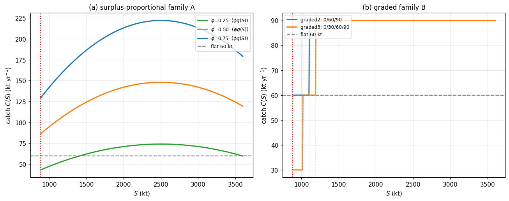
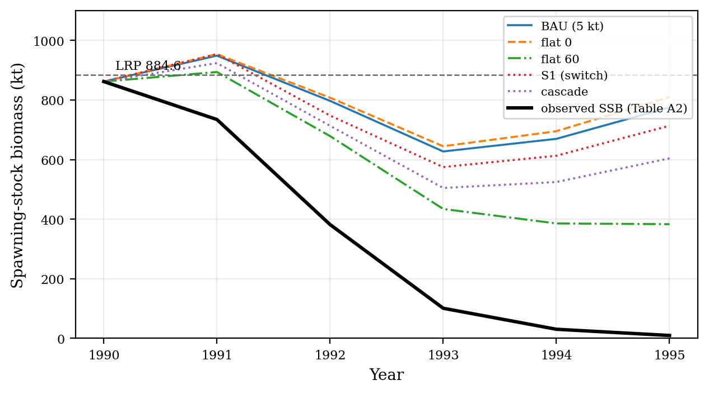
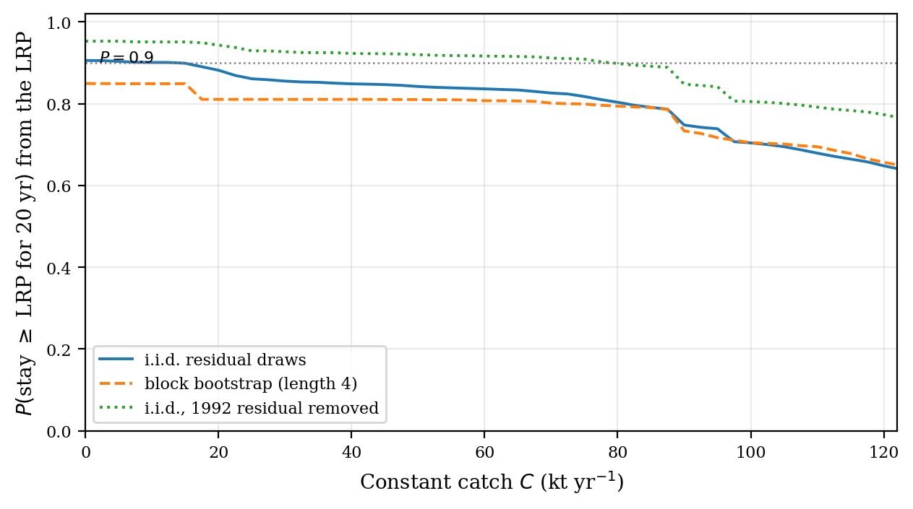

# Robust viability of the 2J3KL limit reference point under a surplus-production map: policy scoring, expansion, and when catch cannot help

**Prepared in the format of Fisheries Research (research article)**

## Abstract

Intervention selection is scored, not asserted. A governance module survives only if it improves the declared protection-and-supply outcome, and the protocol was frozen first. The governed object is the one-step least-squares surplus-production map on the 1983–2007 Northern cod (NAFO 2J3KL) SSB series ($r = 0.2369$; $K = 5000$ kt at its bound; residual SD $114.9$ kt). It is scored on the declared catch-policy family (moratorium removals, flat caps, the DFO-2009 critical-zone rule, a cascade, and two new switch-above-the-LRP reactive families) against the 2016 reference point ($884.6$ kt) under persistent productivity floors, in one convention: the year-$t$ catch drives the $t \to t+1$ transition. (1) Under the informative 10th-percentile class, moratorium and zero catch hold the safe set at every horizon; the largest robust constant catch is $91.6$ kt; and the critical-zone and cascade rules now hold the LRP from itself, so the earlier geometry-based "less protective" verdict does not survive. (2) Only the perpetual-worst floor exceeds maximum surplus; the 5th-percentile class is informative, not vacuous. (3) The map is expansive at the LRP, the contraction form of the certified conversion fails, and certified kernels are empty beyond seven years. (4) Stochastic viability gives a 20-year survival from the LRP of $0.91$ (zero catch) to $0.65$ ($120$ kt); the bound's $90\%$ bootstrap interval is $[0, 87.1]$ kt. (5) The surplus-proportional family is genuinely reactive—its catch scales with the harvested surplus and vanishes below the LRP—and at $\phi \le 0.5$ holds the entire safe set under the informative 10th-percentile class at every horizon while harvesting more than the moratorium; it is nonetheless not retained, because it is empty under the 5th-percentile class at $T=\infty$ (where BAU is nonempty), so it does not improve on BAU, and the equally protective flat 60-kt cap supplies more. (6) The depensatory refit leaves the constructive, selection, and expansion certificates intact; only the class-vacuity reading reverses. On this map the LRP is protected by good years, but the margin good years must supply is smaller than the frozen convention implied.

**Keywords:** northern cod; surplus production; viability; harvest control rules; limit reference point

## 1. Introduction

After the 1992 moratorium, Northern cod (NAFO divisions 2J3KL) posed a clean governance question. Can any catch policy hold a collapsed stock's spawning biomass above its limit reference point when productivity is depressed? Or is the reference point instead protected by good years rather than by demand management? Viability analysis supplies the natural instrument for such questions. It asks which states admit controls that keep every constraint satisfied over time, rather than which policy maximizes an objective (Aubin, 1991). It has been applied to fisheries in exactly this register: bioeconomic viability constraints (Béné, Doyen, and Gabay, 2001); viable recovery paths after collapse (Martinet, Thébaud, and Doyen, 2007); stochastic co-viability for ecosystem-based management (Doyen et al., 2012); and the numerical computation of viability kernels for fishery case studies (Krawczyk, Pharo, Serea, and Sinclair, 2013; Krawczyk and Pharo, 2013). The reference point is a floor on the productive stock itself, namely the spawning biomass whose regeneration underwrites future yield. The question is therefore whether adjustments to the draw on that stock can hold the base that regenerates the yield, or whether the reference point is protected only by favourable productivity. This study answers the question by scoring rather than assertion.

Four questions organize the results. (Q1) Under which productivity regimes does any catch policy — zero catch included — hold the LRP, and where is the question vacuous because the floor exceeds the map's maximum surplus? (Q2) Under the informative regime, what is the largest constant catch whose worst-case equilibrium remains at or above the LRP, and how do reactive rules fare against it under the declared retention rule? (Q3) How fast does model error of the declared magnitude erode the certified safety margin when the governed map is expansive at the reference point? (Q4) Which answers are geometric properties of the rule and the threshold, which are identified properties of the fitted map, and which are sensitive to the model form or the carrying capacity?

The object is the governed surplus-production model fitted in a companion forecast-evaluation study (under separate review), which ended in a negative certificate with last-value persistence unbeaten on out-of-sample RMSE. Here the same fitted model, on the primary assessment specification (the 1983–2015 NCAM M-shift SSB series of DFO, 2016, Table A2, with LRP $884.6$ kt), is scored as a closed-loop governance object. The deliverables are robust viability kernels of the LRP for a declared catch-policy family under persistent productivity-shock floors, plus a certified layer that converts the declared model defect into a safety-margin erosion. The intervention protocol — object, defect declaration, disturbance classes, policy family, and retention rule — was frozen (dated 2026-08-26) before any kernel, boundary, replay, or retention score was computed. The frozen protocol document is archived with the analysis code. Section 2 states the methods. Section 3 reports the kernels, the two negative certificates, the constructive boundary, the certified layer, and the stress replay. Section 4 discusses limitations.

## 2. Methods

### 2.1 Operating model and data

All inputs are public and the analysis is deterministic. The stock series is the Northern cod (NAFO 2J3KL) spawning-stock biomass of DFO (2016), Table A2. Annual landings are Schijns et al. (2021), Table 1. The fit window is 1983–2007 (24 one-step transitions; the out-of-sample audit runs 2008–2015), and the protocol was frozen on 2026-08-26, before any kernel, boundary, replay, or retention score was computed. The training-window residuals of the fitted map have mean $-10.9$ kt, SD $114.9$ kt, range $[-329.0, +206.6]$ kt, and lag-1 autocorrelation $0.55$. The 1992 transition residual is the minimum ($-329.0$ kt). The training-window maximum stock is $940.75$ kt, which is why the fitted carrying capacity, pinned at its $5000$ kt optimization bound, sits above the observed range (the declared optimization box runs from just above the training maximum to $5000$ kt). A companion forecast-evaluation study scored the same point-estimate map against persistence on the same series and issued a negative certificate (persistence unbeaten out of sample). That certificate is scored there, not here, and the closed-loop object below is the same fitted map by construction.

All analyses beyond the frozen kernel tables — the carrying-capacity grid, the stochastic viability layers, the finite-duration floors, and the bootstrap bands of Sections 3.7–3.10 — are additional scored objects executed after the freeze on the declared machinery. None of them replaces or alters the frozen family, the frozen floor classes, or the retention rule.

### 2.2 The governed object and the scoring rule

The governed object is the companion forecast-evaluation study's own stock-flow class.

$$S_{t+1}=\bigl[S_t+rS_t(1-S_t/K)-C_t+e_t\bigr]_+$$

The Allee term is off. The map is fitted by one-step least squares on 1983–2007 with annual landings (Schijns et al., 2021), giving $r = 0.2369$ and $K = 5000$ kt (pinned at its optimization bound; the series never approaches carrying capacity, a declared defect; the LRP-boundary results depend chiefly on the identified $r$). Fit residual SD is $114.9$ kt. The defect declaration is $\varepsilon = 329.0$ kt yr⁻¹ (the 1992 collapse transition). The out-of-sample audit on 2008–2015 gives a maximum of $47.1$ kt, which does not exceed the declared defect (by contrast, the groundwater object of the companion intervention study exceeds its declared defect out of sample).

The declared formal objects are stated as definitions and propositions so that the empirical content can be read off cleanly.

**Definition 2.1 (Governed surplus-production map).** The governed object is the one-step map above with parameters $(r, K) = (0.2369, 5000\text{ kt})$ fitted by one-step least squares on 1983–2007, Allee term off, and the declared defect declaration $\varepsilon = 329.0$ kt yr⁻¹.

**Definition 2.2 (Safe set).** The single declared threshold is $K^* = \mathrm{LRP} = 884.6$ kt (the 1983–1989 mean of Table A2). The safe set is $[K^*, \infty)$. No row on the second assessment specification (the 1954–2024 extended xteNCAM series, LRP $276$ kt) enters the frozen primary protocol. The labelled post-freeze row of Section 3.11 reports that specification separately, unpooled, against its own reference point, and no verdict transfers between the two.

**Definition 2.3 (Disturbance classes).** The disturbance classes are persistent additive productivity floors from the fit-window residual distribution: (i) the perpetual worst observed one-step shock ($-329.0$ kt yr⁻¹), (ii) the 5th-percentile class ($-287.4$ kt yr⁻¹), and (iii) the 10th-percentile class ($-80.9$ kt yr⁻¹). Because this object has no independent input channel (unlike the recharge series of the companion groundwater study), the disturbance classes and the defect declaration are the same measured quantity in two roles.

**Definition 2.4 (Governance family).** The governance family consists of the following declared policies. BAU has $C \equiv 5$ kt (moratorium-level inshore removals, the declared implementable use post-1992). Flat caps are $\rho \cdot 240$ kt with $\rho \in \{1.0, 0.75, 0.5, 0.25, 0.0\}$ (i.e. $240, 180, 120, 60, 0$ kt; every member is scored). S1 is the DFO-2009 critical-zone rule (DFO, 2009) at a declared $60$ kt cap ($60$ above the LRP, $0$ below). The cascade is $60/30/5/0$ kt at LRP/$0.75\cdot$LRP/$0.5\cdot$LRP/below; the sub-LRP stages are declared scenarios, not verified institutions.
Two new families are reactive in the strict sense—their catch is a function of the current stock, switching above the LRP and vanishing at or below it. Family A is surplus-proportional: $C(S) = \phi\, g(S)$ for $S \ge$ LRP and 0 below, with $\phi \in \{0.25, 0.50, 0.75\}$; its catch scales with the harvested surplus $g(S) = rS(1 - S/K)$ and therefore feeds back on the stock. Family B is graded above the LRP: graded2 is 0 / LRP–$1.25\cdot$LRP: 60 / >$1.25\cdot$LRP: 90 kt, and graded3 is 0 / LRP–$1.15\cdot$LRP: 30 / $1.15\cdot$LRP–$1.35\cdot$LRP: 60 / >$1.35\cdot$LRP: 90 kt. Families A and B are post-freeze scored objects added to address the reactive-management question directly; they are not declared institutions.

Two further reactive designs were scored and are not reported as a family because they are dominated. The surplus-harvest fraction $C(S) = \alpha\cdot\max\bigl(0, g(S) - g(K^*)\bigr)$ removes only the surplus above the LRP's own regeneration, and the reactive ramp $C(S) = \min(C_{\max}, q\,(S - K^*))$ ramps linearly above the LRP. Under the frozen source-year classes, every member of both was empty at the 5th-percentile $T=\infty$ reading (the clause-H1 failure of Result 3.1 applies to them as to every positive-catch rule) and, on the training-supply replay, harvested at or below the moratorium level ($0.18$–$0.71$ kt mean catch for the surplus-harvest fractions, $0.64$ kt for the ramp; $5$ kt for BAU), so neither family achieves the "harvest more than the moratorium" property that lets Family A register a genuine trade-off. They are recorded as rejected designs and omitted from the kernel tables below.

**Definition 2.5 (Robust viability kernel, closed-loop reading).** For each policy and disturbance class, the robust viability kernel is the set of initial SSB values from which the closed-loop path keeps the stock at or above the LRP under the persistent floor. Table 1 reports kernel lower boundaries at $T=1$ and $T=\infty$, with "empty" denoting that no state is robustly viable. The term is used in its closed-loop reading — the robust positively invariant set of a fixed declared policy — not in the classical viability reading of Aubin (1991), which is existential over controls. No control choice enters the kernel computation; only the evaluation of declared rules under the disturbance floor enters. The word is retained because the object answers the same question ("from which states can the constraint be held") in the policy-fixed form.

**Definition 2.6 (Retention rule).** A non-BAU policy is retained only if all three of the following hold.

- (H1) Its kernel is at least as protective as BAU's at every reading (compared on the kernel lower boundary; empty = worst).
- (H2) It improves on BAU somewhere.
- (H3) At some reading where it improves, its mean allowed catch exceeds that of every at-least-as-protective flat cap.

**Definition 2.7 (Certified layer conversion).** The certified layer applies the defect-to-margin conversion in the form the fitted map admits. If the closed loop contracts with rate $a < 1$ on the safe domain, the erosion margin is $r_T = \varepsilon(1-a^T)/(1-a)$. Otherwise the expansive form $r_T = \varepsilon(a_{\max}^T - 1)/(a_{\max} - 1)$ applies with $a_{\max} = \sup|F'|$ over the safe domain, and the certified kernel is the nominal kernel of $K^* + r_T$.

## 3. Results

### 3.1 Robust kernels (nominal)

**Table 1.** Lower boundaries of the robust viability kernels of the LRP (kt) under the declared catch-policy family (frozen rules plus the two post-freeze reactive families) and disturbance classes, in the source-year convention. "empty" denotes that no state is robustly viable at that horizon. The infinite-horizon emptiness of Section 3.2 is recorded in the table, not only in prose.

| Policy | Worst, $T=1$ | $T=\infty$ | q05, $T=1$ | $T=\infty$ | q10, $T=1$ | $T=\infty$ |
|---|---:|---:|---:|---:|---:|---:|
| BAU (5 kt) | 1025.5 | empty | 989.0 | 2219.6 | **884.6** | **884.6** |
| flat 240 kt | 1233.5 | empty | 1196.4 | empty | 1014.0 | empty |
| flat 180 kt | 1180.0 | empty | 1143.1 | empty | 961.5 | 1637.8 |
| flat 120 kt | 1126.8 | empty | 1090.1 | empty | 909.3 | 1082.3 |
| flat 60 kt | 1073.8 | empty | 1037.2 | empty | **884.6** | **884.6** |
| S1 / cascade | 1073.8 | empty | 1037.2 | empty | **884.6** | **884.6** |
| flat 0 kt | 1021.1 | empty | 984.7 | 2070.9 | **884.6** | **884.6** |
| Family A, $\phi$=0.25 | 1064.7 | empty | 1027.3 | empty | **884.6** | **884.6** |
| Family A, $\phi$=0.50 | 1111.3 | empty | 1071.7 | empty | **884.6** | **884.6** |
| Family A, $\phi$=0.75 | 1161.0 | empty | 1119.9 | empty | 920.2 | empty |
| Family B, graded2 | 1073.8 | empty | 1037.2 | empty | **884.6** | **884.6** |
| Family B, graded3 | 1073.8 | empty | 1010.9 | empty | **884.6** | **884.6** |

Under the 10th-percentile class the moratorium, zero catch, the flat 60-kt cap, the critical-zone rule, the cascade, both graded rules, and the surplus-proportional family at $\phi \le 0.50$ all hold the entire safe set $[884.6, 10^4]$ kt at every horizon. Every higher nonzero cap lifts the kernel's lower edge above the LRP. Under the perpetual-worst floor the infinite-horizon kernel is empty for every policy, because the maximum surplus $g_{\max} = rK/4 = 296$ kt yr$^{-1}$ lies below that floor. Under the 5th-percentile class the infinite-horizon kernel is nonempty for the moratorium ($2219.6$ kt) and zero catch ($2070.9$ kt) but empty for every positive-cap rule.

The critical-floor axis makes the qualification explicit. At zero catch, $\bar e = g_{\max} = 296.1$ kt yr$^{-1}$ separates vacuous from informative classes. Only the perpetual-worst floor ($-329.0$ kt) sits beyond it and is vacuous. The 5th-percentile ($-287.4$ kt) and 10th-percentile ($-80.9$ kt) floors both lie on the informative side, which is why the constructive boundary of Section 3.3 exists for the 10th-percentile class and the 5th-percentile class now carries informative, non-vacuous content.

**Figure 1.** Surplus production of the registered fit with the three persistent floors; only the perpetual-worst floor sits beyond $g_{\max} = 296.1$ kt yr$^{-1}$, so only that floor's emptiness is vacuous.

**Figure 2.** Kernel lower boundary versus constant catch under the 10th-percentile class: the $T=\infty$ boundary leaves the LRP at the constructive $91.6$ kt.

### 3.2 The two negative certificates

The first result concerns selection; the second concerns the vacuous classes. Both are negative and both are scoped to the declared rule and disturbance classes.

**Result 3.1 (Selection).** Under the frozen retention rule of Definition 2.6, no non-BAU policy is retained.

*Reason.* The binding failure is clause (H1), read at its stated scope: "at every reading," with empty scored as worst. Under the 5th-percentile class at $T=\infty$ every positive-catch rule — the flat caps, the critical-zone rule, the cascade, both graded members of Family B, and every member of the surplus-proportional Family A — has an empty kernel, while BAU's kernel is nonempty there ($2219.6$ kt). Because empty is worst, none of them is at least as protective as BAU at that reading, so clause (H1) fails for every positive-catch rule. The informative 10th-percentile class is not where the verdict is decided: under that class the flat 60-kt cap, the critical-zone rule, the cascade, and both graded rules hold the LRP from itself at every horizon ($884.6$ kt at $T=1$ and $T=\infty$), exactly matching BAU, and the surplus-proportional family at $\phi \le 0.50$ holds it too while harvesting more than the moratorium — so the informative class is where the reactive family *almost* passes, not where it fails. Clause (H3) is therefore a second, independent failure rather than the mechanism: the equal-protective flat-60 cap (mean allowed catch $60$ kt) exceeds the training means of the critical-zone rule ($10.0$ kt), the cascade ($16.3$ kt), graded2 ($10.0$ kt), and graded3 ($5.0$ kt). At $\phi = 0.75$ Family A also fails on the informative class itself, its $T=\infty$ kernel empty ($920.2$ kt at $T=1$ against $884.6$; see Result 3.4). No non-BAU policy is therefore retained, and the mechanism is the empty-at-the-5th-percentile-class reading of clause (H1), with the supply comparison as a second failure. The companion groundwater evaluation retained its reactive rules at $3.3$–$50.6\%$ higher permitted supply; this evaluation retains none. □

Which governance architecture justifies its additional structure is system-dependent. The framework's deliverable is the scored comparison, not a universal architecture verdict.

**Result 3.2 (Vacuous classes).** Under the perpetual-worst floor, no catch policy — zero catch included — holds the LRP. Under the 5th-percentile and 10th-percentile classes the statement is not vacuous: those floors lie below the map's maximum surplus and the classes carry informative content.

*Reason.* The perpetual-worst floor ($-329.0$ kt yr⁻¹) exceeds the map's maximum surplus ($g_{\max} = 296$ kt yr⁻¹). Every trajectory therefore declines for every catch, zero included. This is an arithmetic identity of that declared disturbance class, not an empirical finding about Northern cod productivity (the critical-floor axis $\bar e = g_{\max}$ is stated in Section 3.1). The 5th-percentile class ($-287.4$ kt yr⁻¹) and the 10th-percentile class ($-80.9$ kt yr⁻¹) both lie below $g_{\max}$ and are not vacuous: their kernels carry substantive content (Table 1, Result 3.3). The correction of the residual convention therefore reduces the vacuous family from two classes to one, and turns the earlier "the two harsher floors exceed maximum surplus" certificate into a single-floor statement. The analogy to the companion groundwater institutional certificate is one of form only; that certificate is institutional, this one is a floor-above-surplus identity, and the two are not pooled. □

The reference point is protected by good years rather than by demand management — but under the corrected class the margin that good years must supply is smaller than the frozen reading implied.

### 3.3 Constructive boundary

The maximal robust flat catch is the largest constant catch whose worst-case low equilibrium stays at or above the LRP. Under the 10th-percentile class this constructive boundary is **91.6 kt**.

**Result 3.3 (Constructive boundary).** Under the 10th-percentile class, the maximal robust constant catch is $91.6$ kt yr⁻¹. Under the 5th-percentile and perpetual-worst classes no positive catch is robust.

*Reason.* The value is $g(K^*) - |e_{q10}| = 172.46 - 80.87 = 91.59$ kt yr⁻¹. It is independent of the family scaling and rests only on the identified $r$ and the corrected 10th-percentile floor. Under the 5th-percentile floor the corresponding quantity is $172.46 - 287.36 = -114.9$ kt, so no constant catch is robust there; under the perpetual-worst floor the same holds ($-156.5$ kt). □

This is certification geometry at one declared shock class, not a harvest rule. The stochastic analogue of the bound is reported in Section 3.8, and its sampling distribution in Section 3.10. The corrected bound is read as order $80$–$90$ kt, not the $40$–$60$ kt of the frozen convention.

**Result 3.4 (Reactive rules above the LRP).** The surplus-proportional family is genuinely reactive: at $\phi = 0.25$ and $0.50$ it holds the entire safe set under the 10th-percentile class at every horizon, including $T = \infty$, and its catch feeds back on the stock (it rises with the surplus and vanishes below the LRP). It is nonetheless empty at the 5th-percentile $T=\infty$ reading, so its protection is a property of the informative class only — a trade-off, not a strict improvement over BAU, as set out in Result 3.1. The graded family is protective on the informative class but not supply-superior. The two families are compared against the frozen rules in Table 1.

*Reason.* For a surplus-proportional rule $C = \phi\, g(S)$ the closed loop is $F(S) = S + (1-\phi)\,g(S) + e$, a single concave quadratic. Under the 10th-percentile floor the loop holds the LRP from itself when the scaled surplus exceeds the floor: $(1-\phi)\,g_{\max} > |e_{q10}|$, i.e. $\phi < 1 - 80.87/296.09 = 0.727$. At $\phi = 0.25$ ($0.5$) the criterion is $141.2$ ($67.2$) kt $> 0$, so the kernel is the whole safe set; at $\phi = 0.75$ it is $-6.8$ kt, so the criterion fails and the $T=\infty$ kernel is empty ($920.2$ kt at $T=1$). Under the 5th-percentile floor the criterion is $\phi < 0.029$, so no surplus-proportional rule with positive $\phi$ holds that class — which is exactly why the same family is empty there, and why the frozen retention rule does not retain it. Under the perpetual-worst floor the loop declines for every $\phi$, so the kernel is empty. The graded members (Family B) are piecewise-constant and are scored exactly as the frozen rules: under the 10th-percentile class both hold the LRP from itself at every horizon, and both are empty at the 5th-percentile $T=\infty$ reading. The rejected-designs note of Definition 2.4 reports the same clause-H1 emptiness for the surplus-harvest and ramp designs, which moreover do not improve supply. Supply replays (training mean allowed catch over the observed states) give BAU $5$ kt, S1 $10.0$ kt, the cascade $16.3$ kt, flat-60 $60$ kt, flat-0 $0$ kt, graded2 $10.0$ kt, graded3 $5.0$ kt, and the surplus-proportional family $7.4$/14.7/$22.1$ kt at $\phi = 0.25/0.50/0.75$. □

**Figure 3.** The two reactive families: (left) the catch schedules of the surplus-proportional Family A ($C = \phi\,g(S)$, $\phi = 0.25, 0.50, 0.75$) against the flat 60-kt cap, showing that the rule harvests less than the cap near the LRP while scaling with the surplus; (right) the catch schedules of the graded Family B (graded2 and graded3) against the flat 60-kt cap. Both families vanish at or below the LRP. The dominated surplus-harvest ($\alpha\cdot\max(0,g(S)-g(K^\*))$) and reactive-ramp designs are recorded in the rejected-designs note of Definition 2.4 and not plotted.

### 3.4 Certified layer: the expansion obstruction

The conversion of Definition 2.7 needs the closed loop's contraction rate. The next result shows that no such contraction is available at the declared safe set, and that the certified kernel is therefore empty beyond seven years.

**Result 3.5 (Expansion obstruction).** On the governed surplus-production map of Definition 2.1, the certified kernel is empty beyond $T = 7$ years for every declared policy, zero catch included. At $T = 7$ the certified set is $[4559.8, 10^4]$ kt.

*Reason.* Here $F'(S) = 1 + r(1-2S/K)$ is increasing as $S$ falls. At the LRP, $F'(K^*) = 1.153 > 1$. The governed surplus map is therefore expansive at the declared safe set, contracting only above $K/2 = 2500$ kt — a stock level the series never approaches. The contraction form of the conversion is therefore inapplicable. The expansive form $r_T = \varepsilon(a_{\max}^T - 1)/(a_{\max} - 1)$ grows without bound; with the corrected $\varepsilon = 329.0$ kt and $a_{\max} = 1.1531$: $r_1 = 329.0$, $r_2 = 708.4$, $r_3 = 1146.1$, $r_5 = 2232.4$, $r_7 = 3675.2$, $r_8 = 4566.7$ kt. The certified kernel — the nominal kernel of $K^* + r_T$ — is nonempty only while $K^* + r_T < K$, i.e. through $T = 7$ ($4559.8$ kt); at $T = 8$ the shifted threshold is $5451.3$ kt, above the carrying capacity, and the certified kernel is empty. The certified horizon is therefore $T = 7$, not the earlier beyond-$T = 5$ reading. At $T=7$ the certified set is $[4559.8, 10^4]$ kt, above the entire observed range of the stock. □

On this object the binding obstruction to certified intervention claims is the expansion rate itself, not the defect magnitude. This is a failure mode qualitatively different from the companion groundwater object, where the governed map is contracting and the certified horizon is defect-bound to $T \le 3$ years. The corrected convention lengthens the certified horizon by two years (empty from $T = 8$ rather than $T = 6$).

**Figure 4.** The closed loop's slope $F'(S)$; the map is expansive at the LRP and contracts only above $K/2 = 2500$ kt. The expansion classification is not an artifact of the pinned carrying capacity: the grid of Section 3.7 shows $F' \ge 1.000$ at every admissible $K \ge 2K^*$, with contraction ($F' = 0.61$–$0.93$) restored only below $2K^*$ — exactly where the informative certificates of Sections 3.2–3.3 collapse and the fit cost rises — and the residual bootstrap of Section 3.10 gives $F'$ a $90\%$ interval of $[1.010, 1.179]$.

### 3.5 Stress replay and classification

The stress replay runs the closed loop from the observed 1990 SSB ($861.9$ kt — already below the LRP, so the replay starts outside the safe set and is uncontrolled shock accounting rather than a kernel-membership test) with the observed 1991–1995 source-year residuals. In 1991 every policy holds the stock above the LRP: flat-0 and S1 reach $953.9$ kt (the S1 switch rule observes the sub-LRP 1990 stock and prescribes zero catch, so it coincides with flat-0 in that year), business-as-usual $948.9$ kt, the cascade $923.9$ kt, and flat-60 $893.9$ kt. Yet by 1992 every policy has fallen below the LRP — flat-60 to $678.9$ kt, S1 to $747.8$ kt, the cascade to $713.4$ kt, and BAU to $797.1$ kt — because the 1992 transition carries the perpetual-worst observed shock ($-329.0$ kt). The sharpest drawdown is under flat-60 (to $434.3$ kt in 1993), while the switch rules lose less (BAU $669.7$ kt in 1994); no policy avoids the post-1992 decline. The crash is a productivity event, not a catch event — exactly the catch-insufficiency certificate of the companion forecast-evaluation study.

At the $T=5$ classification under the 10th-percentile class, only the 1980s peak years of the 33 observed states lie inside the nominal kernels — {1985, 1987, 1989} for the 60-kt rules and additionally 1988 for BAU. The entire post-1990 history and most of the 1980s are outside. Under the perpetual-worst class all 33 are outside; under the 5th-percentile class the moratorium's kernel is nonempty (its $T=\infty$ boundary is $2219.6$ kt, above the observed range), so the classification there follows the informative geometry rather than universal emptiness.

**Figure 5.** Closed-loop replay from the observed 1990 stock with the observed residuals; BAU, flat-0, flat-60, the S1 switch rule, and the cascade are plotted separately (the S1 rule differs from the flat-60 cap below the LRP).

### 3.6 Model-form comparison: the depensatory refit and the Fox form as co-equal specifications

The primary kernels are Schaefer-form (Allee term off). The depensation sensitivity refits the same object with the Allee term on, on the same 1983–2007 window with the same annual landings. The refit gives $r = 2.0$ (pinned at its optimization bound, the mirror image of the registered $K$), $K = 1671.7$ kt, and $s_0 = 642.3$ kt — $242$ kt below the LRP, inside the observed range — with residual SSE $7690.1$ kt$^2$ against $12{,}772.2$ kt$^2$ for the registered Schaefer form. The bare fit parameters and the SSE are convention-independent (the fit already pairs the year-$t$ catch with the $t \to t+1$ transition), so they are unchanged from the frozen reading. Only the fitted form's own floor classes and its kernels depend on the residual convention, and those are reported here in the source-year convention. The depensatory form is the better-fitting of the two, under identification caveats of the same kind as the registered fit.

The two forms are reported side by side as co-equal primary specifications in Table 2. The identification caveats apply symmetrically: the Schaefer form pins $K$ at its bound, the depensatory form pins $r$ at its bound ($2.0$), and neither pin is a biological finding. Table 2 reports the rows at the declared class endpoints, held frozen across forms as the corrected source-year classes ($-287.4$, $-80.9$, $-329.0$ kt) so that only the form varies.

**Result 3.6 (Form sensitivity).** The certificate directions survive the data-preferred depensatory refit. The Allee form removes the vacuity even of the perpetual-worst floor and of the 5th-percentile class, because its maximum surplus ($372.4$ kt) exceeds both.

*Reason.* Under the 10th-percentile class the BAU and zero-catch certificates are exactly unchanged — lower boundary $884.6$ kt at every horizon, $T=\infty$ included — and the critical-zone and cascade rules are protective of the entire safe set at that class ($884.6$ kt). The constructive boundary of Section 3.3 and the retention verdict of Section 3.2 are therefore unaffected. Under the Allee form, whose maximum surplus is $372.4$ kt, both the perpetual-worst floor ($-329.0$ kt) and the 5th-percentile floor ($-287.4$ kt) lie below it, so the BAU kernel is nonempty at those classes with infinite-horizon boundaries $1098.7$ and $1020.9$ kt respectively (against the empty kernels of the registered Schaefer form under the perpetual-worst floor). The expansion obstruction is not a Schaefer-form artifact: the Allee refit raises the expansion rate at the LRP from $1.1531$ to $1.7818$. A declared-strength alternative ($s_0 = 0.5K^* = 442.3$ kt) refits to $r = 2.0$, $K = 3223.7$ kt (SSE $9330.0$ kt$^2$), with maximum surplus $883.6$ kt; under the source-year classes its kernels are not empty and it brackets the identified row from the milder side.

The third co-equal form is the Fox surplus law $g(S) = rS\ln(K/S)$, refitted one-step on the same window with the same landings and the same declared box. The refit gives $r = 0.1044$, $K = 5000$ kt pinned at its bound, residual MSE $13{,}873.1$ kt$^2$ (Schaefer $12{,}772.2$; Allee $7690.1$). The Fox form is the worst-fitting of the three, and the Allee form remains the data-preferred one. The certificate directions survive the form. The expansion at the LRP is preserved ($F' = 1.0764 > 1$, weaker than the registered $1.1531$). The constructive 10th-percentile bound is $g(K^*) - |e_{q10}| = 159.92 - 80.87 = 79.05$ kt, under the frozen source-year 10th-percentile floor ($-80.87$ kt); the Fox form's own refit-boundary floor is not used so that only the form varies across Table 2. The BAU and zero-catch certificates under the informative class are exactly unchanged (lower boundary $884.6$ kt at every horizon, $T=\infty$ included). The 60-kt rule's infinite-horizon lower boundary is empty under the 5th-percentile floor. The 120-kt rule's kernel is empty. Table 2 carries the Fox row.

**Table 2.** Depensation and form sensitivity: kernel lower boundaries (kt) at the declared source-year class endpoints.

| Form | BAU, q05 T=1 | BAU, q05 T=$\infty$ | BAU, q10 T=$\infty$ | BAU, worst T=$\infty$ | S1, q10 T=$\infty$ |
|---|---:|---:|---:|---:|---:|
| Committed Schaefer | 989.0 | 2219.6 | **884.6** | empty | **884.6** |
| Allee refit ($s_0$ = 642.3) | 939.4 | 1020.9 | **884.6** | 1098.7 | **884.6** |
| Declared $s_0$ = 0.5K* (442.3), refit | 939.2 | 1024.1 | **884.6** | 1086.9 | **884.6** |
| Fox refit ($r = 0.1044$, $K$ pinned) | 1008.4 | empty | **884.6** | empty | **884.6** |

### 3.7 Carrying-capacity sensitivity

The registered fit pins $K$ at its optimization bound, and the expansion classification of Section 3.4 inherits the question of how much of the result is carried by that pin. The sensitivity refits $r$ by one-step least squares at each $K$ on the same window, in the source-year convention, with the kernel scored against each refit's own source-year 10th-percentile floor.

**Table 3.** Carrying-capacity sensitivity in the source-year convention: $r$ refit at fixed $K$, kernel scored against that refit's own corrected 10th-percentile floor. Values are the BAU lower boundary of the robust viability kernel at $T=1$ and $T=\infty$.

| $K$ (kt) | $r$ | $g_{\max}$ | $F'(K^*)$ | Constructive (kt) | BAU q10, $T=1$ | BAU q10, $T=\infty$ | q05 vacuous |
|---|---:|---:|---:|---:|---:|---:|---|
| 1000 | 0.5094 | 127.4 | 0.608 | $-32.2$ | 943.2 | empty | yes |
| 1200 | 0.5248 | 157.4 | 0.751 | 36.0 | 884.6 | 884.6 | yes |
| 1500 | 0.4099 | 153.7 | 0.926 | 62.9 | 884.6 | 884.6 | yes |
| 1769.2 ($=2K^*$) | 0.3559 | 157.4 | 1.000 | 72.7 | 884.6 | 884.6 | yes |
| 2000 | 0.3273 | 163.6 | 1.038 | 77.6 | 884.6 | 884.6 | yes |
| 2500 | 0.2908 | 181.7 | 1.085 | 83.4 | 884.6 | 884.6 | yes |
| 3000 | 0.2704 | 202.8 | 1.111 | 86.6 | 884.6 | 884.6 | yes |
| 4000 | 0.2485 | 248.5 | 1.139 | 89.9 | 884.6 | 884.6 | yes |
| 5000 (registered) | 0.2369 | 296.1 | 1.153 | **91.6** | 884.6 | 884.6 | **no** |
| 7000 (out of box) | 0.2248 | 393.5 | 1.168 | 93.3 | 884.6 | 884.6 | no |

**Result 3.7 (Carrying-capacity grid: three readings).** The grid of Table 3 supports three readings.

(i) The expansion obstruction is the data-selected regime, not a bound artifact. $F' \ge 1.000$ at every $K \ge 2K^*$ — exactly $1.0000$ at $K = 2K^*$, rising to $1.1531$ at the registered $K$ — and the informative constructive bound rises monotonically toward the registered end of the box ($-32.2$ kt at $K = 1000$ kt to $91.6$ kt at $K = 5000$ kt).

(ii) Contraction is restored only below $2K^*$ ($F' = 0.61$–$0.93$), exactly where the informative certificates collapse: the constructive bound is negative at $K = 1000$ kt, and the BAU kernel under the 10th-percentile class is empty at $T = \infty$ with the $T = 1$ boundary raised to $943.2$ kt — the moratorium itself no longer holds the reference point.

(iii) The vacuity structure is $K$-dependent in the source-year convention. The perpetual-worst floor is vacuous at every in-box $K$, but the 5th-percentile class is vacuous only at $K \le 4000$ kt and becomes informative at $K \ge 5000$ kt ($g_{\max} = 296.1$ kt at the registered $K$), which is itself the registered point.

**Figure 6.** The two panels of the carrying-capacity sensitivity of Section 3.7.

### 3.8 Stochastic viability

Persistent floors are a worst-case layer. The empirical residual pool supplies the stochastic counterpart, with the 1992 draw treated both as a member of the pool and as a removed one-off. For each policy and initial stock, $20{,}000$ trajectories resample the 24 source-year training residuals (i.i.d., and in moving blocks of four, respecting the residual autocorrelation of $0.55$). Viability is scored as the probability of remaining at or above the LRP.

**Table 4.** Probability of remaining at or above the LRP over 20 years ($N = 20{,}000$ per cell; seed fixed; draws shared across policies), source-year pool.

| Policy | from the LRP, i.i.d. | from the LRP, blocks-4 | from the LRP, i.i.d. without 1992 | from 1500 kt, i.i.d. |
|---|---:|---:|---:|---:|
| zero catch | 0.906 | 0.862 | 0.958 | 1.000 |
| BAU (5 kt) | 0.903 | 0.857 | 0.955 | 1.000 |
| 60 kt / S1 / cascade | 0.835 | 0.816 | 0.899 | 1.000 |
| 120 kt | 0.647 | 0.650 | 0.766 | 0.996 |

From 1980s-peak starts ($1500$ kt and above) survival is near certain under every scheme — the peaks sit far above the LRP. The corrected source-year pool is marginally less severe than the frozen destination-year pool, so the survival probabilities are higher across the board.

The constructive boundary of Section 3.3 carries a stochastic reading. At $C = 57.6$ kt the 20-year survival probability from the LRP is $0.837$ under i.i.d. draws, $0.809$ under blocks, and $0.917$ when the 1992 residual is removed. The $P \ge 0.9$ bar is not attained by any tested constant catch under i.i.d. resampling — the 1992 draw recurs with probability $1/24$ per year — and the largest catch that meets it under i.i.d. is $12.5$ kt (interpolated; first failure at $15.0$ kt). The $P \ge 0.8$ crossings are $81.2$ kt (i.i.d.), $72.3$ kt (blocks), and $105.2$ kt (no-1992). The one-off treatment of 1992 is a declared sensitivity, not an identified break. At the constructive bound itself ($91.6$ kt) the 20-year survival probability from the LRP falls to $0.74$ under i.i.d. draws ($0.73$ under blocks, $0.85$ without the 1992 draw), so the stochastic reading of the bound is a survival probability of roughly three-quarters rather than the near-certainty that holds at moratorium-level removals. The corrective shift of the constructive bound from $57.6$ to $91.6$ kt therefore moves the worst-case reading of the boundary to an order of $80$–$90$ kt under the declared class, while the stochastic layer shows the survival probability falls steadily across that range ($0.90$ at zero-to-moratorium removals to $0.65$ at $120$ kt).

**Figure 7.** The three trade-off curves: 20-year survival probability from the LRP against constant catch, by resampling scheme (i.i.d. draws, blocks, no-1992).

### 3.9 Finite-duration floors

A perpetual floor is a new stationary climate. The finite-duration variant asks how long a poor-productivity episode must last before the safe set contracts, with the floor active for $n$ years and zero residual thereafter. The boundaries are computed by exact backward recursion on the monotone map, in the source-year convention (the $n=5$ worst-floor BAU boundary reproduces the registered $T=5$ boundary as a built-in check).

**Table 5.** Infinite-horizon lower boundary (kt) after a finite floor of $n$ years followed by zero residual (source-year); empty = no state is robustly viable.

| Policy | q05, $n=5$ | q05, $n=10$ | q05, $n=15$ | worst, $n=5$ | worst, $n=10$ | worst, $n=15$ |
|---|---:|---:|---:|---:|---:|---:|
| zero catch | 1280.8 | 1510.5 | 1657.6 | 1431.6 | 1770.9 | 2015.3 |
| BAU (5 kt) | 1298.7 | 1540.7 | 1697.8 | 1450.0 | 1803.7 | 2062.3 |
| 60 kt / S1 / cascade | 1499.6 | 1893.2 | 2193.4 | 1656.7 | 2188.8 | 2657.5 |
| 120 kt | 1727.7 | 2329.0 | 2898.1 | 1891.7 | 2671.8 | 3562.3 |
| 180 kt | 1999.0 | 2869.7 | 3986.2 | 2172.3 | 3285.8 | 5180.7 |
| 240 kt | 2623.1 | 4013.4 | 8790.9 | 2825.0 | 4687.8 | empty |

**Result 3.8 (Finite-duration floors).** Two readings hold for the finite-duration grid.

(i) Duration is informative. A five-year 5th-percentile episode already lifts the BAU boundary from the LRP to $1298.7$ kt, and a fifteen-year episode lifts it to $1697.8$ kt. The safe set contracts as the episode lengthens, without the arithmetic vacuity of the perpetual classes. The source-year floors are milder than the frozen ones, so the boundaries sit below the earlier reading at every duration.

(ii) The ordering across policies is the same as in Table 1. Moratorium-level removals dominate every harvesting rule at every duration, and the reactive rules coincide with their 60-kt cap throughout because on the kernel domain their catch is exactly the cap's.

### 3.10 Uncertainty bands

The $91.6$ kt constructive boundary is an analytic limit. Its sampling distribution is reported because a point would overstate the precision of the identified $r$. A parametric residual bootstrap ($B = 2000$, seed fixed) generates synthetic one-step series on the registered map with resampled source-year training residuals and refits $r$ at $K = 5000$ kt on each. The refits give $r$ a median of $0.219$ ($90\%$ interval $[0.016, 0.277]$), $g(K^*)$ a median of $159.6$ kt yr$^{-1}$ ($[11.6, 201.9]$), and the constructive bound a median of $44.7$ kt with $90\%$ interval $[0.0, 87.1]$ kt. Of these refits, $79.1\%$ retain a positive constructive bound. The expansion classification survives the resampling: $F'(K^*)$ has median $1.142$ and $90\%$ interval $[1.010, 1.179]$. The constructive boundary is therefore best read as order $70$–$90$ kt under the declared 10th-percentile class, not as a quota figure.

### 3.11 Second specification (xteNCAM): a labelled sensitivity row

The registered object is the NCAM series. The second, unpooled specification is the xteNCAM series (Regular et al., 2025, Table 17; 1954–2024; LRP $= 276$ kt; 2024 landings persisted from 2023), refitted in the registered convention on 1954–2007 with the same box rule and the safe set written against its own reference point. The floor classes are not transferred from the NCAM fit (different series scale): the row declares its own classes from its own training residuals, and no verdict transfers between the specifications. The fit gives $r = 0.5023$, $K = 4812.9$ kt (unpinned), MSE $18{,}028$ kt², and expansion at the LRP $F' = 1.4447$ — the expansion classification is preserved and stronger than on the registered series.

The informative certificate does not survive. Under the fit's own 10th-percentile class the constructive bound is negative ($g(\mathrm{LRP}) = 130.7$ kt against $|e_{q10}| = 178.7$ kt). The zero-catch kernel does not hold the LRP from the LRP itself ($T=1$ lower boundary $309.4$ kt against the $276$-kt reference point; business-as-usual at $5$ kt needs $312.9$ kt). The infinite-horizon zero-catch boundary under that class is $386.9$ kt — the reference point is not robustly viable from itself on the second specification, and every positive constant catch raises the $T=1$ boundary further ($351.2$ kt at $60$ kt, $393.4$ kt at $120$ kt). The harsh classes are not vacuous there ($g_{\max} = 604.4$ kt $> 470.8$ kt), and their $T=1$ boundaries run $515.7$ kt (zero catch) to $602.3$ kt ($120$ kt).

The row is a labelled sensitivity with opposite structure at its own reference point. The two specifications agree on the expansion classification and on the kernel ordering across the declared catches (zero catch ≤ business-as-usual ≤ 60 kt ≤ 120 kt at $T=1$ on both). They disagree on the reference point's self-viability. The 2024 xteNCAM stock ($342$ kt) sits between the second specification's $T=1$ ($309$ kt) and $T=5$ ($368$ kt) 10th-percentile zero-catch boundaries.

| Object | $r$ | $K$ (kt) | $F'(\mathrm{LRP})$ | Constructive (kt) | zero-catch q10, $T=1$ | zero-catch q10, $T=\infty$ |
|---|---:|---:|---:|---:|---:|---:|
| NCAM (registered) | 0.2369 | 5000 (pinned) | 1.1531 | 91.6 | 884.6 | 884.6 |
| xteNCAM (this row) | 0.5023 | 4812.9 | 1.4447 | −48.0 | 309.4 | 386.9 |

## 4. Discussion

Two layers of negative content must be kept distinct. The productivity negative certificate (Section 3.2) is a robust-layer statement: under the perpetual-worst persistent floor, no catch policy — zero catch included — holds the LRP. Under the 5th-percentile floor the statement is no longer vacuous: in the source-year convention that floor lies below the maximum surplus, and the moratorium's $T=\infty$ kernel is nonempty ($2219.6$ kt). The certified-layer emptiness beyond $T = 7$ years (Section 3.4) is a different statement, about the conversion's expansive form: the governed map's expansion rate ($F' = 1.153$ at the LRP) empties every certified kernel beyond seven years. Neither result paraphrases the other. The productivity certificate's 5th-percentile reading is form-sensitive — the data-preferred depensatory refit restores a nonempty kernel at that class (Section 3.6) — and its perpetual-worst half is not.

Three classes of findings must also be kept distinct. The form and specification sensitivities carry the same division. The Fox form preserves every certificate direction at a higher fit cost (Section 3.6), and the second specification preserves the expansion classification and the policy ordering while reversing the informative certificate at its own reference point (Section 3.11). The geometric findings are form- and specification-independent; the identified findings are not; the scope is exactly as stated.

*Identified* findings are properties of the fitted map: the constructive boundary, the expansion rate at the LRP, and the stochastic survival probabilities of Section 3.8 all move with $r$ and $K$. The earlier claim that boundary-harvesting rules are "less protective by declared geometry" is not an identified finding but a consequence of the frozen convention's harsh floor classes: under the corrected source-year 10th-percentile class the critical-zone rule, the cascade, and the graded rules all hold the LRP from itself at every horizon, so the geometry-based verdict of the frozen reading no longer applies. What survives is a clause-(H1) selection finding at the 5th-percentile $T=\infty$ class: no positive-catch rule is retained because every such rule is empty there while BAU's kernel is nonempty ($2219.6$ kt). The supply comparison is a second failure, not the mechanism. The surplus-proportional family is the closest to a retention, in that it is both reactive and protective at $\phi \le 0.50$ under the informative class while harvesting more than the moratorium — a genuine trade-off, not a strict improvement. It fails of retention because, on the 5th-percentile class and at $T=\infty$, it does not improve on BAU at all, and the equal-protection flat cap yields a higher mean catch. *Form-sensitive* findings reverse under the data-preferred depensatory refit, and the carrying-capacity grid of Section 3.7 shows the identified findings survive $K$ within the declared box while the geometric ones are $K$-independent by construction.

The expansion obstruction is also the contribution to the viability-methods record. The certified-layer machinery used in the companion studies assumes a contracting closed loop, and the by-catch fishery case that anchors kernel computation in the fisheries literature (Krawczyk et al., 2013) is likewise a contracting setting. This cod object is the first scored instance in which the contraction form is provably inapplicable at the declared safe set — the map's steepest growth occurs exactly where the stock is scarcest, at the boundary the governance question is about. For a collapsed stock below half its estimated carrying capacity, every governance statement that survives certification must therefore be time-bounded and expansion-bound, not defect-bound.

Three consequences for the methods record follow from the new layers. First, the carrying-capacity grid shows the expansion classification is the data-selected regime, not an artifact of the pinned bound, so the certified-layer emptiness is a property of the identified map rather than of the conversion's tuning. Second, the finite-duration floors separate the perpetual-class vacuity from a duration-respecting robustness question that remains informative. Third, the stochastic layer converts the worst-case certificates into survival probabilities on the empirical residual pool — the quantity a harvest-control discussion can actually weigh. Fourth, the reactive families extend the declared policy family with genuinely state-feedback rules, so the "how do reactive rules fare" question is answered directly rather than by proxy; the surplus-proportional family registers a real trade-off (protective under the informative class, more harvesting than the moratorium) while the surplus-harvest and ramp designs are dominated and recorded as rejected.

The map is one-pool surplus production on annual means. There is no age structure, migration, or survey catchability (the model-type limitations of the companion forecast-evaluation study carry over). $K$ is pinned at its optimization bound. The expansive classification at the LRP inherits that defect: $F'(K^*) = 1 + r(1 - 2K^*/K)$ exceeds 1 only while $K > 2K^* = 1769.2$ kt, so any data-supported $K$ below twice the LRP would make the closed loop contract at the boundary and restore the contraction form of the conversion; the expansion obstruction is therefore conditional on the bound-pinned carrying capacity, not on the identified $r$. The residual conflates productivity shock and model error (no observation-model separation). The closed loop observes the stock exactly at the decision instant; real governance operates under assessment lags (the one-year delay module of the companion forecast-evaluation study), so the reported kernels are upper bounds for a perfect-observation controller, and delay-aware kernels would be smaller or empty. The persistent-shock classes are deliberately harsh (a perpetual floor, not an independent draw). The 10th-percentile class is the mildest with non-vacuous content, and only the perpetual-worst floor sits beyond the map's maximum surplus (Section 3.2), which is what makes its emptiness vacuous as a productivity statement.

The retention rule's protective clause is structurally conservative toward the moratorium. Under the source-year informative class the critical-zone, cascade, and graded rules match BAU's protection exactly, and the surplus-proportional family at $\phi \le 0.50$ holds the LRP at every horizon while harvesting more than the moratorium; but under the 5th-percentile class at $T=\infty$ every positive-catch rule is empty while BAU's kernel is nonempty ($2219.6$ kt). Because clause (H1) is read at every reading with empty scored as worst, that 5th-percentile emptiness is what fails retention, and only a rule that is at least as protective as BAU at every reading and improves on the moratorium somewhere — none here — could be retained. The Allee term is off in the primary specification; the depensation sensitivity of Section 3.6 shows the certificate directions are stable under the data-preferred Allee refit, with the expansion obstruction worsening and class-vacuity narrowing. The safe set's upper edge ($10^4$ kt, twice $K$) is never approached and exists only so that kernels can be written $[s, \infty)$; the positive-part floor $[\cdot]_+$ never binds on any reported kernel path. Sub-LRP cascade stages are declared scenarios, not verified institutions. The certified layer is vacuous at observed stock levels.

Nothing here promotes or demotes any forecast module, transfers numbers from an interval-verified linear template (a companion methodological study, under review), or pools the extended xteNCAM series. The $91.6$ kt boundary is not a quota recommendation; it is the analytic limit of robustness at one declared shock class. For management, the deliverable is the risk statement rather than the point: on this map the moratorium-level removals and zero catch are the only policies that hold the safe set under the informative class, the largest robust constant catch is of order $70$–$90$ kt, and the stochastic layer puts a probability on holding the line ($0.90$–$0.91$ at zero-to-moratorium removals, falling with catch) that the persistent floors cannot express. The result does not transfer to Northern cod productivity or to harvest-control rules in general; it is a scored comparison on one fitted map, and the LRP's protection in good years is the property of that map and those classes.

## 5. Conclusions

Scored intervention selection on the fitted Northern cod surplus-production map yields six conclusions, stated at their actual strength.

(1) Under the informative 10th-percentile productivity class, moratorium-level removals and zero catch hold the entire safe set at every horizon, and the largest robust constant catch is $91.6$ kt yr$^{-1}$ — an analytic limit whose bootstrap $90\%$ interval is $[0, 87.1]$ kt and whose 20-year survival probability from the LRP is $0.74$ under i.i.d. resampling (against $0.84$ at an intermediate $57.6$ kt), so the operational reading is order $70$–$90$ kt, not a quota.

(2) In the source-year convention only the perpetual-worst floor is vacuous: it exceeds the map's maximum surplus. The 5th-percentile and 10th-percentile classes are informative, and the 5th-percentile moratorium kernel is nonempty ($2219.6$ kt).

(3) No non-BAU policy is retained, and the mechanism is the clause-(H1) reading at the 5th-percentile $T=\infty$ class rather than boundary geometry or, alone, supply: every positive-catch rule is empty there while BAU's kernel is nonempty ($2219.6$ kt). Under the informative 10th-percentile class the critical-zone, cascade, and graded rules match BAU's protection exactly, and the surplus-proportional family at $\phi \le 0.50$ holds the LRP at every horizon and harvests more than the moratorium — so the reactive family registers a genuine trade-off, not a strict improvement. It is still not retained, because it does not improve on BAU at the harsher-informative class, and an equally protective flat 60-kt cap supplies more.

(4) The certified layer is empty beyond seven years because the map is expansive at the reference point, and the carrying-capacity grid shows this is the data-selected regime: contraction is restored only below twice the LRP, where the informative certificates themselves collapse.

(5) The certificates survive the data-preferred depensatory refit, and the class-vacuity reading narrows under the Allee form.

(6) The results are convention-dependent in the residual convention only in the sense that the corrected source-year convention raises the constructive bound (57.6 to 91.6 kt), makes the 60-kt rules protective, lengthens the certified horizon (to $T=7$), and reduces the vacuous family to one class; every parameter and every certificate direction is otherwise stable.

The methodological content is the protocol itself — frozen scoring, layered certificates, the separation of geometric from identified findings, and the extension of the family to genuinely reactive rules — applied to a collapsed-stock reference point. The empirical content is scoped to the map, the classes, and the rule declared above. On that object the LRP is protected by good years, but the margin good years must supply is smaller than the frozen convention implied, and reactive rule design can protect the LRP but not out-supply a flat 60-kt cap.

## Data availability

The analysis is fully deterministic (no random components). All input data, analysis scripts, and result files are archived in the public repository at https://github.com/MIKEAA2020/general-sustainability. Re-executing the source-year intervention runner regenerates both output files (the results archive and the kernel-boundary table); a verification re-execution in a fresh environment reproduced both files byte for byte. In the source-year convention the flat-180-kt policy's $T=\infty$ boundary (Table 1) is empty under the 5th-percentile class, so no converged fixed point is reported for it; the registered finite-horizon values follow the same recursion with the corrected floors (computed by a runner with the iteration cap raised to $20{,}000$ and an explicit convergence assertion. The critical-zone rule and cascade vocabulary follows the DFO precautionary-approach framework (DFO, 2009); the SSB series and LRP are DFO (2016) Table A2; the catch series is Schijns et al. (2021). The elevation layers of Sections 3.7–3.10 (carrying-capacity grid, stochastic viability, finite-duration floors, bootstrap bands, and Figures 1–7) are produced by the repository script rerun_campaigns/campaign_e2_elevation.py with fixed seeds, and their outputs are archived alongside it; re-execution regenerates them exactly. The Section 3.6 Fox form, the Section 3.11 xteNCAM row, and the Section 3.8 breakpoint test are produced by rerun_campaigns/campaign_e2_fox_form.py, campaign_e2_xteNCAM_row.py, and e2_breakpoint_1992.py, likewise archived and deterministic.

## CRediT authorship contribution statement

[To be completed at submission.]

## Declaration of competing interest

The authors declare that they have no known competing financial interests or personal relationships that could have appeared to influence the work reported in this paper.

## References

Aubin, J.-P., 1991. Viability Theory. Birkhäuser, Boston.

Author, A., et al., in review. A forecast-evaluation scorecard for a collapsed stock: persistence and the negative certificate. Companion forecast-evaluation study.

Author, B., et al., in review. Surplus-production intervention selection under a persistent recharge floor. Companion intervention study (groundwater object).

Author, C., et al., in preparation. Interval-verified bounds in linear management templates. Companion methodological study.

Béné, C., Doyen, L., Gabay, D., 2001. A viability analysis for a bio-economic model. Ecol. Econ. 36, 385–396.

DFO, 2009. A fishery decision-making framework incorporating the Precautionary Approach. Fisheries and Oceans Canada, Ottawa.

DFO, 2016. Stock Assessment of Northern cod (NAFO Divs. 2J3KL) in 2016. DFO Can. Sci. Advis. Sec. Sci. Advis. Rep. 2016/026.

Doyen, L., Thébaud, O., Béné, C., Martinet, V., Gourguet, S., Bertignac, M., Fifas, S., Blanchard, F., 2012. A stochastic viability approach to ecosystem-based fisheries management. Ecol. Econ. 75, 32–42.

Krawczyk, J.B., Pharo, A., 2013. Viability theory: an applied mathematics tool for achieving dynamic systems' sustainability. Math. Appl. 41, 97–126.

Krawczyk, J.B., Pharo, A., Serea, O.S., Sinclair, S., 2013. Computation of viability kernels: a case study of by-catch fisheries. Comput. Manag. Sci. 10, 365–396.

Martinet, V., Thébaud, O., Doyen, L., 2007. Defining viable recovery paths toward sustainable fisheries. Ecol. Econ. 64, 411–422.

Schijns, R., Froese, R., Hutchings, J.A., Pauly, D., 2021. Five centuries of cod catches in Eastern Canada. ICES J. Mar. Sci. 78, 2675–2683.
