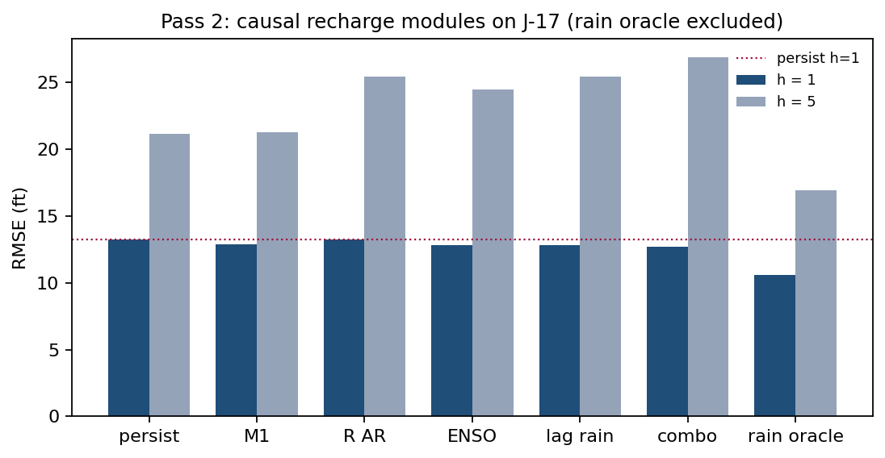

# Does a one-pool water-balance model improve forecasts of Edwards Aquifer head? A scored test at J-17

**Prepared in the format of Groundwater (Wiley/NGWA)**

*Version log (v11).* Implements the joint external audit of this manuscript. Changes are presentation, disclosure, and a labelled post-freeze uncertainty layer; no frozen verdict, no reported score, and no archived number changed. (1) Abstract, Impact Statement, and Conclusions now lead with the result the audit identified (causal stock-flow loses; the AR(1) margin is a coin-flip; the oracle is a nowcast; climatology wins at five years) instead of the 0.39-ft retention. (2) The M2m decline is disclosed as a protocol clause not contained in the frozen retention rule, with the frozen rule quoted verbatim and the deviations listed in one place; the climate comparison now reports margins against both M2m and M1. (3) A post-freeze Diebold–Mariano / moving-block-bootstrap layer attaches uncertainty to every load-bearing margin. (4) The [610, 710] clip is reported as binding on the recovery-window causal forecast paths (never on the observed record). (5) The Comal section is restated as a rating-curve redundancy check with the tail-failure direction corrected. (6) The pumpage-counterfactual readings are corrected (closest-path statement, 5.2-ft arithmetic, coefficient comparison, window labelling). (7) Notation unified (H throughout; M4 labelled a symmetry control); propositions that read tables are converted to result sentences. The v10 narrative remains available as the baseline.

## Abstract

**Problem.** Index-well head forecasting is a recurring operational groundwater management need, yet deliberately simple process-based water-balance models are rarely tested against naive benchmarks under a locked retention rule.

**Approach.** Using the 1934–2023 annual-mean J-17 Edwards Aquifer head record, a fixed model ladder was scored by rolling and fixed-window out-of-sample RMSE: last-value persistence, training-mean climatology, univariate AR(1), a one-pool stock-flow water balance, residual/delay variants, and climate-informed recharge modules. A causal module was retained only if it beat both persistence and the next-simpler causal model under a scoring protocol frozen and dated before any score was computed.

**Results.** The causal stock-flow map that persists last year's recharge loses to persistence at the one-year horizon (14.70 versus 13.23 ft), because annual recharge is near-white: corr(R_t, R_{t−1}) = 0.17 against corr(ΔH_t, R_t) = 0.74. The univariate AR(1) improves one-year RMSE by 0.39 ft (12.84 ft; mean absolute error a tie; loses at five years) — a margin whose bootstrap interval covers zero, so the retention is a coin-flip recorded by a point-RMSE rule, not a skill claim. The water-balance-identified affine map with climatological fluxes (M2m) is the best one-step forecaster tested (12.28 ft, the only margin that separates from noise against persistence); it is listed and then declined by a protocol class clause recorded outside the frozen retention rule. Given realized future recharge and pumpage, the same map reaches 7.55 ft — a nowcast, not a forecast; no signal available at the annual forecast origin recovers that gap. Climate modules beat persistence and the AR(1) by at most 0.13 ft and lose to climatological fluxes; none is retained. At five years, the training mean (16.80 ft) beats persistence (21.11 ft) with an interval excluding zero.

**Implications.** For annual J-17 head forecasts, simple persistence and a univariate AR(1) are difficult to beat; the one-pool balance, given the year's fluxes, nowcasts the current year rather than forecasting the next. Multi-year planning should prefer climatological baselines over persisted recharge.

**Keywords:** Edwards Aquifer; groundwater level forecasting; forecast evaluation; persistence benchmark; prediction skill

**Article Impact Statement.** Annual J-17 head forecasts: persistence and AR(1) beat the one-pool water balance because recharge is not persistent at the annual origin; with realized fluxes the map nowcasts (7.6 ft), it does not forecast; five-year planning should use climatology.

## 1. Introduction

Forecasting aquifer heads at index wells is a recurring operational problem of groundwater management. Drought-stage declarations, springflow protection, and permit adjustments all key on forecasted water levels. The methodological literature has responded with an increasingly rich inventory of groundwater-level forecasting models, from conceptual water balances to data-driven regressions and, prominently, artificial-neural-network and wavelet–neural-network conjunction models trained on measured heads (Daliakopoulos, Coulibaly, and Tsanis 2005; Adamowski and Chan 2011). The field has also begun to institutionalize benchmark culture. GEMS-GER, the first machine-learning benchmark dataset for long-term groundwater levels, standardizes 32 years of weekly observations from 3,207 German wells together with three benchmark models of increasing complexity (Ohmer et al. 2026). Systematic comparisons of nine machine-learning and deep-learning architectures on a karst catchment now anchor the karst groundwater forecasting literature (Zhu et al. 2026).

Three hydrological objects are worth separating, because they are read off the same number. The head record is observed at an access point, the index well. That head indexes a store of water in the aquifer, which is the resource. The store is replenished and drawn by fluxes, which are the flow. The one-pool water balance (a lumped stock-flow model with head change equal to weighted fluxes plus a linear drain) closes this loop approximately. The term "water balance" is used throughout in its increment-structure sense: head change equals weighted fluxes plus a linear drain, with the spring-discharge series stored but deliberately excluded from the forecasting equation, and a [610, 710] clip standing in for a physical storage floor. The map is not a closed mass balance; this qualification is stated here once and travels with the term.

Whether added structure improves out-of-sample forecasts — as opposed to in-sample fit — is a separate, testable question. The general forecasting literature has made the benchmark discipline explicit: across the M4 competition's 100,000 series, sophisticated methods did not uniformly beat simple statistical baselines (Makridakis, Spiliotis, and Assimakopoulos 2020). The minimal bar for any proposed module is therefore the forecast that nothing changes — last-value persistence — together with the training mean. Yet the groundwater benchmark studies above compare model families against one another. They do not subject each module to a retention gate against the naive baselines, and none subjects a deliberately simple process-based water balance to a scored ablation against those baselines. This paper supplies that missing test. It applies a scored model-ablation design in which a scored ladder (a forward-ordered set of models evaluated by a fixed retention rule) of incrementally structured one-pool models is evaluated against the two naive baselines. Complexity is kept only if it improves the stated score, decided on out-of-sample error on the predictand itself.

The San Antonio Pool of the Edwards (Balcones Fault Zone) Aquifer, Texas, indexed by the J-17 well, is the natural test bed. Its 1934–2023 daily head record is among the longest managed groundwater series in North America. Its institutional thresholds (the 660-ft Stage I line of the Edwards Aquifer Authority) and its physical threshold (the ≈618-ft level at which Comal Springs approaches cessation) are explicit and dated. Recharge and pumpage series exist that are constructed independently of the head series. The aquifer is also a karst system in which regional flow has long been represented — and debated — through equivalent porous media and lumped approaches (Scanlon et al. 2003, for the Barton Springs segment; the lumped-versus-EPM question is inherited by the San Antonio Pool, not settled by that citation). For this reason, the fate of a deliberately simple one-pool water-balance map is a live hydrogeologic question rather than a straw man.

The question is whether stock-flow, residual, delay, or climate-informed recharge modules reduce forecast error of J-17 annual-mean head relative to last-value persistence and to a univariate AR(1). The climate modules enter because El Niño/Southern Oscillation (ENSO) phases shift North American precipitation patterns (Ropelewski and Halpert 1986): September–November Niño 3.4 and lagged climate-division precipitation are precisely the signals observable at an annual forecast origin.

A companion study under separate review applies the same scored design to a marine fishery stock (Northern cod, NAFO 2J3KL); the analogy between the two systems is that the identified driver is not persistent at the forecast origin (Author et al., in review; Author et al., in review). The two systems' scores are never pooled, and no retention verdict is transferred between them. This paper does not assess whether the aquifer is sustainable and does not treat springflow or reconstructed storage as co-primary predictands; a two-pool exchange module was specified and not fitted.

## 2. Data and Specification

The predictand is a measured well series. The specification separates data fields from empirical constructs, models, and normative thresholds, so that the scored object is unambiguous.

**Table 1.** The San Antonio Pool specification: J-17 annual-mean elevation, 1934–2023.

| Field | Contents | Type |
|---|---|---|
| System | Edwards Aquifer, San Antonio Pool, indexed by J-17 | D |
| $H_t$ | Calendar-year mean of daily-high J-17 elevation (ft AMSL) | D |
| Well | TWDB 6837203 / EAA AY-68-37-203 | D |
| Domain | San Antonio Pool; calendar years 1934–2023 | D |
| Physical threshold | Head high enough that Comal Springs does not cease (≈618 ft; 1956 daily minimum 612.51 ft) | N / E |
| Institutional threshold | EAA Stage I, 10-day mean J-17 < 660 ft (in force after 2007) | N |
| Disturbance | Recharge pulses; unmodeled karst; Uvalde–San Antonio exchange | M |
| Implementable use | Pre-EAA pumping; post-1996/2007 permits and critical-period management | E |
| Service series | USGS 08168710 Comal Springs annual mean discharge (cfs) | D |

Field types: D = data, E = empirical construct, M = model, N = normative threshold. The predictand is a measured well series. It is not a GRACE or G3P storage reconstruction, a MODFLOW or GWSIM inversion, EAA reconstructed storage, the J-27 Uvalde index, San Marcos Springs, or total spring discharge. The predictand is the calendar-year mean of daily *highs*; a daily-mean convention would sit slightly lower and matters near the 660/618-ft lines, and the Authority's Stage I rule is a 10-day mean — the annual-mean proxy is flagged where used.

Stage I at 660 ft is a 2007 institutional rule and is not applied as if it existed in 1956. Cessation of Comal Springs near 618 ft is a physical service bound. The indicator 1{H < 660} on the annual mean is a coarse proxy for the Authority's 10-day declaration, not the declaration itself.

Annual means use all available daily highs. Years with fewer than 240 observations are dropped. No year falls below the floor (minimum n = 242, 1939), so the rule never binds on this panel; 1935 (n = 258) and 1939 (n = 242) are retained as incomplete-coverage means; missing days are not interpolated. The published pre-continuous composite (Beverly Lodges extension) is used as issued. The complete estimation panel ends in 2023, whose values carry provisional TWDB status.

Recharge R is USGS total San Antonio-area recharge (10³ acre-ft yr⁻¹), estimated by the Puente (1978) stream-loss method and constructed independently of J-17 (Umphres and Choi 2025). Pumpage P is well discharge from Edwards Aquifer Authority Table 1 (Edwards Aquifer Authority 2024/25, covering 1934 onward). R and P are constructed fluxes, not observations of J-17. Total spring discharge is stored and is not used as a driver. Climate predictors, used only in Section 5.4, are September–November Niño 3.4 (HadISST, anomaly relative to 1991–2020) and calendar-year precipitation in Texas climate divisions 06 and 07 (NCEI nClimDiv).

## 3. Forecast Models

The forecast models form a fixed ladder. Each rung adds structure to the previous rung, and each causal rung is scored against the next-simpler rung under the retention rule of Section 4.

**Definition 3.1 (One-pool water-balance map).** With head clipped to [610, 710] ft, the one-pool map is

$$H_{t+1}=\bigl[H_t+\alpha+\beta\tilde R_{t+1}+\gamma\tilde P_{t+1}+\delta H_t\bigr]_{\mathrm{clip}},$$

where $\tilde R$ and $\tilde P$ are the flux values a forecast substitutes for the (unknown) year $t+1$ fluxes. Forecasts are issued at the end of year $t$ from (H, R, P) through $t$.

**Table 2.** Model ladder.

| ID | Class | Fluxes at $t+h$ | Role |
|---|---|---|---|
| persist | baseline | — | $\hat H_{t+h}=H_t$ |
| mean | baseline | — | training-window mean |
| M1 | autonomous | — | $H_{t+1}=a+\varphi H_t$ |
| M2 | causal stock-flow | last $(R_t,P_t)$ persisted | candidate for retention |
| M2m | climatological stock-flow | training-mean $(R,P)$ | affine AR(1) |
| M3 | residual | as M2 | AR(1) residual on $\Delta H$ |
| M4 | delay | as M2 | symmetry control with the companion fisheries evaluation; not a monitoring constraint of this system |
| M2_oracle | diagnostic | realized future $R,P$ | excluded from retention |

**Remark 3.1 (Class reduction of M2m).** Under constant fluxes $\tilde R_{t+1}=\bar R$, $\tilde P_{t+1}=\bar P$, M2m reduces to $H_{t+1}=(1+\delta)H_t+\mathrm{const}$ and therefore shares M1's forecast function class — but not its estimator. M2m pins its intercept from the in-sample mean fluxes, an additional identifying use of the recharge and pumpage records in training; the persistence coefficient $(1+\delta)$ is not mean-flux dependent. The decline of M2m is a protocol choice recorded in the frozen documents, not a theorem, and it is not part of the retention rule itself (Section 4.1).

Climate-informed variants (Section 5.4) replace persisted R by a one-step forecast of R from information known at t: AR(1) on R, lagged Niño 3.4, lagged climate-division precipitation, or all three. A precipitation-oracle variant uses year $t+h$ precipitation and is excluded from retention. For horizons $h>1$, the one-step recharge forecast is held constant.

## 4. Evaluation Design

The evaluation design fixes the scoring rule before any score is computed. The retention rule (a module is kept only if it beats both persistence and the next-simpler causal model) is the gate against which every causal rung of the ladder is judged.

**Definition 4.1 (Primary and secondary scores).** The primary score is RMSE of annual-mean J-17, in feet. Secondary scores are mean absolute error and the Brier score for $\mathbf{1}\{\hat H < 660\}$, interpreted only for origins at or after 2007; for deterministic 0/1 forecasts this score is a misclassification rate. A sign-hit rate of $\Delta H$ was listed in an earlier design iteration and is struck: no value is reported for it, and it is not part of any retention decision.

**Definition 4.2 (Retention rule, frozen verbatim).** Let $\mathrm{RMSE}(\cdot)$ denote the primary rolling-origin RMSE at a fixed horizon $h$. A causal module $M$ is retained only if:

(H1) $\mathrm{RMSE}(M) < \mathrm{RMSE}(\text{persist})$, i.e. it beats last-value persistence, and

(H2) $\mathrm{RMSE}(M) < \mathrm{RMSE}(M_{\text{next-simpler causal}})$, i.e. it beats the next-simpler causal model.

Retention is decided at $h=1$ on the point-RMSE comparison; no tie tolerance and no minimum margin is imposed. Diagnostic oracles are excluded from retention. The Comal series is excluded from retention. Retention is decided on the head series only; the service series is scored after that decision is frozen.

### 4.1 Protocol record and deviations

The scoring protocols for the primary pass and the climate pass were frozen and dated (2026-08-25) before the corresponding RMSE tables were computed, and are archived with the analysis code in the public repository. The design is a fixed computational protocol rather than a prospective clinical-style registration; the phrase "pre-registered" is avoided for that reason. The frozen retention rule is Definition 4.2, verbatim above. Three protocol elements sit outside that rule and are therefore recorded here as deviations, in one place:

1. **The M2m class clause.** M2m is listed and then declined on class grounds (Remark 3.1). The clause is in the frozen protocol document, but it is not in Definition 4.2; under the rule as written, M2m satisfies (H1) and (H2) at h = 1.
2. **The M2m-as-comparator rule.** The climate rung's (H2) comparator is M2m — a model the protocol declines (a protocol kink). Section 5.4 therefore reports the climate margins against both M2m and M1.
3. **The struck sign-hit score** (Definition 4.1).

Post-freeze objects, labelled as such: the climate-pass fixed-window scores, the pumpage counterfactuals of Section 5.6, the Comal service-series scoring, and the uncertainty layer of Section 5.3.1. None replaces or alters a frozen verdict.

Fixed windows: (1) drought-of-record drawdown, train 1934–1950, test 1951–1956; (2) drought-of-record recovery, train 1934–1956, test 1957–1961; (3) pre-permit wet interval, train 1980–1990, test 1991–1995; (4) critical-period era, train 1997–2014, test 2015–2023.

Rolling origin: minimum 15 training years; horizons h = 1 and h = 5; n = 75 and n = 71 origins respectively (every model in Tables 4 and 6 is scored on the identical origin sets; M2m uses the same n = 75 / n = 71). The fixed windows train on 16, 22, 10, and 17 transitions respectively and fit four parameters; early rolling origins with the 15-year floor give 14 transitions, so the causal family's rolling scores carry unstable early-window coefficients (Section 5.2).

## 5. Results

### 5.1 The series

**Figure 1.** J-17 annual mean and daily-high range. 1956 mean 623.15 ft, daily minimum 612.51 ft. 1992 mean 691.96 ft, daily maximum 703.31 ft. 2023 mean 635.68 ft. The annual mean is below 660 ft in 31 of 90 years; the daily minimum is below 618 ft in one year (1956).

### 5.2 Fixed windows

**Figure 2.** Multi-step forecasts from the end of each training window. The oracle (dashed) is diagnostic and uses realized future R, P.

**Table 3.** Fixed-window RMSE (ft). Bold marks the lowest RMSE of the window including the diagnostic oracle.

| Window | persist | mean | M1 | M2 | M2m | M3 | M4 | oracle |
|---|---:|---:|---:|---:|---:|---:|---:|---:|
| Drawdown 1951–56 | 23.75 | 35.19 | 30.94 | **18.11** | 27.44 | 18.12 | 18.23 | 19.69 |
| Recovery 1957–61 | 43.62 | 14.07 | 56.24 | 55.32 | 37.74 | 55.28 | 55.12 | **12.26** |
| Pre-permit wet 1991–95 | 30.13 | 18.24 | 20.02 | 16.67 | 23.47 | 16.41 | 15.26 | **7.18** |
| Critical-period era 2015–23 | 27.41 | 14.77 | 15.62 | 23.37 | 14.79 | 22.84 | 22.17 | **8.70** |

Fixed windows are diagnostic, not retention. On the drawdown window the bolded M2 is a continuing-drought artefact, not a forecasting merit: the last observed R is already low, and the map trained on 1934–1950 has the wrong sign on pumpage (γ = +0.021; Table 3 footnote) — pumping rose as the drought deepened, so least squares aliases the human response into the state transition (simultaneity bias; the short window compounds the identification failure). That identification failure is why M2 "beats" the oracle there. The train-mean baseline is the best non-oracle forecast on the recovery window (14.07 ft) and the critical-period era (14.77 ft), consistent with its rolling five-year win; the residual-persistence rungs M3/M4 track M2 on the drawdown (18.12/18.23 versus 18.11 ft); M4 is the best causal model on the pre-permit wet window (15.26 ft); and both fail with the causal family on the recovery and critical-period windows. The recovery window is also where the [610, 710] clip binds on forecast paths: the M2 trajectory with persisted (R, P) = (43.7, 321.1) runs 617.1 → 611.6 → 606.8 → 605.3 → 605.3 ft, reaching the 610-ft floor from 1959 onward. The clip never binds on the observed record (annual means 623–692 ft); it binds only on these persisted-drought forecast paths, and it is doing work exactly there.

The 1957–61 recovery is a recharge pulse (R₁₉₅₆ = 43.7, R₁₉₅₇ = 1142.6 × 10³ acre-ft). Persistence stays at the 1956 floor (RMSE 44 ft). Causal M2 persists drought recharge and falls further (RMSE 55 ft, into the clip). The oracle, given the 1957 flood year, tracks the rise (RMSE 12 ft). Recoveries on this specification are recharge events, not autonomous mean reversion — although the training mean (mean reversion) scores 14.07 ft, second only to the oracle, in this institutionally bounded, rapidly recharged system. The 1992 peak and the 2015–23 window repeat the same split: the oracle follows the recharge year; persistence and persisted recharge do not.

### 5.3 Rolling origin

**Figure 3.** Rolling-origin RMSE. The oracle is excluded from retention.

**Table 4.** Rolling-origin summary (ft).

| Model | h=1 RMSE | h=1 MAE | h=5 RMSE |
|---|---:|---:|---:|
| persist | 13.23 | 10.73 | 21.11 |
| mean | 16.17 | 13.17 | **16.80** |
| M1 | 12.84 | 10.72 | 21.25 |
| M2 | 14.70 | 11.45 | 33.49 |
| M2m | 12.28 | 10.22 | 17.44 |
| M3 | 14.46 | 11.12 | 33.46 |
| M4 | 14.30 | 11.17 | 33.39 |
| M2_oracle | 7.55 | 5.79 | 10.87 |

**Table 5.** Retention on rolling h = 1 RMSE (point rule; margins vs persist and vs M1 both shown).

| Model | vs persist | vs M1 | Distinct structure | Decision |
|---|---:|---:|---|---|
| M1 | 12.84 < 13.23 (−0.39) | — | output only | retained (point rule; margin within noise) |
| M2 | 14.70 > 13.23 (+1.47) | +1.86 | causal fluxes | reject |
| M2m | 12.28 < 13.23 (−0.95) | −0.56 | no (affine AR(1) function class) | listed; declined by protocol class clause |
| M3, M4 | worse than persist | worse | yes | reject |
| M2_oracle | 7.55 | — | uses future R, P | excluded |

**Retention verdict (rolling h = 1).** Applying Definition 4.2 to the h = 1 column of Table 4: M1 satisfies (H1) (12.84 < 13.23); as the simplest autonomous model it has no next-simpler causal comparator, so (H2) is vacuous and M1 is retained by the point rule. M2 (14.70), M3 (14.46), and M4 (14.30) each fail (H1). M2m satisfies (H1) (12.28 < 13.23) and, against its class-relative comparator M1, also satisfies the (H2) comparison (12.28 < 12.84); it is listed and then declined by the class clause of Section 4.1 — a protocol choice, not an outcome of the retention rule. M2_oracle is excluded as a diagnostic oracle. No stock-flow, residual, or delay module is retained; on the rule as written, the verdict "no stock-flow module is retained" is an artefact of the M2m class clause, since the water-balance-identified affine map with climatological fluxes is the best one-step forecaster tested. What the ladder actually shows is that persisting last year's recharge is the failure (Section 5.4: persisted-R RMSE 702 versus climatological 556 × 10³ acre-ft on the recharge target).

M1 is retained by the point-RMSE rule at the one-year horizon. The margin is 0.39 ft on n = 75 and is not a significance claim; its bootstrap interval covers zero (Section 5.3.1), MAE is a tie (10.72 versus 10.73 ft), and at h = 5 M1 (21.25 ft) does not beat persistence (21.11 ft) while the training mean (16.80 ft) beats both. The retention is therefore explicitly a one-year, RMSE-level statement — provisional, a coin-flip recorded by a point rule — and it records a slightly mean-reverting head series, not a confirmation of stock-flow structure. At the decision scale of annual drought-stage declarations the difference is operationally nil. The M2m decline and its 0.56-ft advantage over M1 are likewise within noise (Section 5.3.1): the estimator-level advantage of water-balance identification is visible in the point scores but not separated from zero at this sample size.

### 5.3.1 Uncertainty on the retention margins (post-freeze layer)

A post-freeze uncertainty layer attaches Diebold–Mariano tests (Newey–West HAC, lag h − 1) and moving-block bootstrap intervals (block length 8, 10,000 replications, seeded) to every load-bearing margin, computed from the archived per-origin forecast files. It is labelled post-freeze and changes no frozen verdict.

| Comparison (rolling, h = 1 unless noted) | RMSE margin (ft) | DM statistic | DM p | 95% block-bootstrap CI (ft) | Separates from zero |
|---|---:|---:|---:|---|---|
| M1 − persist | −0.39 | −0.85 | 0.40 | [−1.51, +0.71] | no |
| M2m − persist | −0.95 | −3.07 | 0.003 | [−1.45, −0.68] | **yes** |
| M2m − M1 | −0.56 | −1.61 | 0.11 | [−1.53, +0.13] | no |
| M2 − persist | +1.47 | +1.27 | 0.21 | [−0.02, +3.40] | no (borderline) |
| mean − persist (h = 5) | −4.30 | −1.65 | 0.10 | [−9.72, −2.09] | **yes** |
| M1 − persist (h = 5) | +0.15 | +0.06 | 0.95 | [−5.57, +4.94] | no |
| M2_combo − M1 (climate) | −0.13 | −0.21 | 0.83 | [−1.37, +1.31] | no |
| M2_combo − M2m (climate gate) | +0.43 | +0.74 | 0.46 | [−0.56, +1.57] | no |

Three readings. First, the retention margin itself (M1 − persist, 0.39 ft) is within noise, as is the M2m-over-M1 estimator margin and the M2 causal loss (the last only borderline, its interval touching zero). Under the frozen point-RMSE rule the verdicts stand as frozen; under uncertainty, the only one-year margin that separates from noise is M2m over persistence (−0.95 ft, p = 0.003). Second, the five-year climatology win (−4.30 ft) is robust: its bootstrap interval excludes zero. The h = 5 DM statistic (p = 0.10 with HAC lag 4) is known to be undersized under overlapping origins, and the bootstrap interval is the primary evidence. Third, the climate-gate margin (combo − M2m, +0.43 ft) is itself within noise: the climate rejection is a point-RMSE rule outcome, not a significance finding.

### 5.4 Climate-informed recharge

Information known at 31 December of year t comprises R_t, the September–November Niño 3.4 anomaly of year t, and calendar-year precipitation in Texas climate divisions 06 and 07. December–February precipitation that includes January of t+1 is not used.

**Figure 4.** Rolling RMSE on J-17 for climate-informed recharge. The precipitation oracle uses year t+h precipitation and cannot be retained.

**Table 6.** Rolling RMSE, climate-informed recharge (same origin sets as Table 4; margins vs M1 and vs the M2m gate both shown for the h = 1 column).

| Model | H, h=1 (ft) | margin vs M1 | H, h=5 (ft) | R, h=1 (10³ acre-ft) |
|---|---:|---:|---:|---:|
| persist H / persist R | 13.23 | +0.39 | **21.11** | 702 |
| M1 | 12.84 | — | 21.25 | — |
| M2_Rar | 13.25 | +0.41 | 25.38 | 561 |
| M2_Renso | 12.82 | −0.02 | 24.42 | 528 |
| M2_Rprecip | 12.80 | −0.04 | 25.38 | 545 |
| M2_combo | 12.71 | −0.13 | 26.88 | 538 |
| M2m (the declined gate) | 12.28 | −0.56 | 17.44 | — |
| rain climatology | — | — | — | 556 |
| rain oracle | 10.56 | — | 16.91 | **354** |

Same-year corr(R, precipitation) = 0.78, which is why the precipitation oracle reduces head RMSE to 10.56 ft; it remains worse than the full (R, P) oracle (7.55 ft) because the linear rain map misses 1957-scale extremes. That last clause is a result: the oracle gap is not closed by knowing precipitation alone.

Lagged precipitation and September–November Niño 3.4 have modest skill on R relative to climatology (528–545 versus 556 × 10³ acre-ft), and they do not constitute forecast structure on head: the point-RMSE rule lists ENSO, lagged precipitation, and the combination — each beats persist and M1 by margins of 0.02, 0.04, and 0.13 ft, all within noise (Section 5.3.1) — but each fails (H2) against the declared nested comparator M2m (12.28 ft), whose own margin over them (+0.43 ft for the combination) is also within noise. The rejection is therefore honest only with both margins visible: the climate modules beat persistence and the AR(1) by at most 0.13 ft and lose to climatological fluxes; none is retained, and nothing in that verdict is a significance finding. At h = 5 all three have RMSE 3–6 ft higher than persistence (the h > 1 climate scores reuse the one-step recharge forecast, held constant over the horizon, so this is a design consequence, not a multi-year climate test); structurally they are M2m with a weakly adjusted intercept. M2_Rar loses at h = 1 (13.25 ft; 0.41 ft worse than M1) — autoregression on nearly white recharge is not a recharge forecast.

On the 1957–61 recovery, no causal climate-informed module has lower RMSE than persistence (persist 43.6 ft; best causal about 48.8 ft; precipitation oracle 33.7 ft). September–November 1956 is La Niña (−0.92) and does not announce R₁₉₅₇ = 1143.

The remaining fixed windows complete the same record: drawdown 1951–56, M2_Renso 24.30, M2_Rprecip 28.67, M2_combo 24.70, precipitation oracle 18.16 ft; pre-permit wet 1991–95, M2_Rprecip 22.03, M2_Renso 23.03, M2_Rar 23.94, M2_combo 25.71, oracle 10.98 ft; critical-period era 2015–23, M2_Rprecip 14.52, M2_Rar 14.67, M2_Renso 16.01, M2_combo 16.57, oracle 9.75 ft — on this one window the two climate-informed modules M2_Rprecip and M2_Rar edge past M1 by about one foot (14.52 and 14.67 versus 15.62 ft). On the recharge target itself the fixed-window scores are an order of magnitude coarser on every window (climate modules 199–937; precipitation oracle 80.7–487, against the 556 × 10³ acre-ft climatology scale of the rolling record), so the marginal head advantage is a window-specific result, not a recharge forecast, and it does not enter the abstract.

Closing the gap between persistence and the oracle would require next year's recharge, which is not available at the annual forecast origin.

### 5.5 The service series after the retention freeze

**Figure 5.** Comal annual mean versus J-17. Contemporaneous r = 0.986. The service series is a measured rating curve of the same state — a measured service, not an independent information source.

**The Comal channel (rating-curve reading).** The map Q = c₀ + c₁H fitted on 1934–1950 (c₀ = −2876, c₁ = 4.77) is a linear channel of the same state indexed by J-17. The full-sample contemporaneous correlation is r = 0.986; the 1934–1950 fit is quoted because the channel is used on that train, and the full-sample correlation is the redundancy statement.

The channel fails in the drought tail, and the direction matters: at the 1956 annual mean (623.15 ft) it reads ≈97 cfs against an observed ≈32 cfs annual mean — it predicts non-cessation — and its zero-discharge level (2876/4.77 ≈ 602.9 ft) lies below every observed head (daily minimum 612.5 ft), so the map never predicts cessation where cessation occurred. Near-linear at ordinary heads, the channel fails at cessation exactly where management cares; that tail failure is the one place Comal is not redundant with J-17. One-year Comal RMSE (cfs), constructed by scoring the same ladder directly on the Comal series over the same rolling origins (n = 75): persist 71.9, M1 69.0, M2m 68.7, M2 74.8, M3 73.8, M4 73.4, train-mean 89.7, oracle 45.3 — the ranking mirrors the head ranking, as it must for a linear channel.

The service series does not change retention, and it cannot: it is nearly a linear transform of head. Comal is an independent measurement (a USGS spring gauge, not used to construct J-17), but it is not an independent information source. Gravimetric storage or the J-27 Uvalde index would be different objects, not a second observation channel of this specification. Eastern-basin recharge was stored and not used.

### 5.6 Pumpage counterfactuals

A declared scenario layer passes counterfactual pumpage paths through the pre-permit affine map (train 1980–1990, the ladder's window 3; the short-window identification caveat applies to the map itself), from the observed 1990 head (645.8 ft) over 1991–2023 with the actual recharge sequence. The scenarios are counterfactual simulations of the fitted map — declared scenarios, not forecasts, and no retention implication.

**Table 7.** Pumpage counterfactuals, 1991–2023 (fitted pre-permit map; actual recharge).

| Scenario | Mean pumpage (10³ acre-ft yr⁻¹) | End head 2023 (ft) | Minimum head (ft) | RMSE vs observed heads (ft) |
|---|---:|---:|---:|---:|
| actual pumpage | 382.1 | 641.6 | 640.2 | 8.56 |
| pumpage frozen at 1990 | 489.4 | 630.9 | 630.5 | 14.22 |
| pre-permit mean pumpage | 469.8 | 632.4 | 632.0 | 13.02 |
| 20% pumpage cut | 305.7 | 646.8 | 645.5 | **7.19** |

The observed 2023 head is 635.7 ft. Four readings follow. First, pumpage is a secondary lever in this map: the full spread of counterfactual policies — from a 20% cut below actual to freezing at the 1990 peak — spans 630.9–646.8 ft at 2023, and the map's own RMSE against the observed record (7.2–14.2 ft) is of the same order as the policy spread itself; the 5-ft effects below are within model error and are not policy estimates. Second, the 20%-cut path is the closest to the observed record of the four scenarios (7.19 versus 8.56 ft) — an artefact of the map running high on this window (the actual-pumpage path ends 5.9 ft above the observed 2023 head), not evidence that the Authority's pumpage was near-optimal; the counterfactuals do not repair the ladder's primary failure, which Section 5.3 traces to the recharge series' persistence failure. Third, the direction is right and the magnitude modest: the 20% cut raises the simulated 2023 head by 5.2 ft (646.8 − 641.6) relative to the actual-pumpage path. Fourth, the recharge coefficient dominates the map through its range, not its magnitude: a 1000 × 10³ acre-ft recharge difference moves the head by roughly 17.5 ft at the pre-permit coefficient (β̂ ≈ 0.0175 on the 1980–1990 train; the pumpage coefficient on that train is −0.031 ft per 10³ acre-ft, larger per unit but acting on a range of ~300–540 against recharge's 44–2,486), and γ is an ordinary-least-squares association the paper itself diagnoses as simultaneity-contaminated (Section 5.2), not a policy lever. The full-sample coefficients (β̂, γ̂) = (0.017, −0.026) differ from the pre-permit window's because the windows differ.

## 6. Discussion

The one-pool increment ΔH tracks recharge (r = 0.74), and the oracle's RMSE is 43% below persistence at h = 1 and 49% below at h = 5: the map accounts for contemporaneous increments when the year's water is known. As a one-year forecast, causal stock-flow fails because the dominant increment is not persistent; residual and delayed variants inherit that timing error. Recoveries in 1957 and 1992 are missed by every causal model and captured by the oracle. The identified driver has the right timing and is unforecastable one year ahead — the same pattern a companion evaluation finds on Northern cod, where a more accurate catch series does not rescue constant-productivity surplus production (Author et al., in review). The two score tables are not pooled.

Two features distinguish this design from the groundwater benchmark literature it engages. First, the retention gate: GEMS-GER ships three benchmark models and reports the fraction of wells for which the best one reaches NSE > 0.5 (Ohmer et al. 2026), and the karst benchmark of Zhu et al. (2026) ranks nine architectures by RMSE and R² — both compare model families against one another, while here every module must beat persistence and the next-simpler causal model under a rule frozen before scoring, and on that rule the entire causal ladder is rejected at the one-year horizon. Second, the horizon contrast: no benchmark study of this basin reports a training mean beating persistence at a longer horizon. The five-year climatology result (16.80 versus 21.11 ft) is the specification's most directly transferable candidate for management planning that keys on multi-year outlooks, with the scope stated: the San Antonio Pool is a rapidly recharged, institutionally bounded system, so the training mean is informative at long horizons here, and a non-stationary fossil aquifer under sustained depletion would not sustain a mean-reverting baseline.

Two specification points carry over to the interpretation. First, next-year pumpage is partially an institutional scenario — permits and critical-period rules respond to head — rather than a purely exogenous flux like rainfall; persisting last year's pumpage is a declared simplification, and the oracle pumpage is in no information set. Second, the karst setting matters. The annual affine one-pool specification is not a karst model: conduits, the Uvalde–San Antonio divide, unconfined recharge-zone storage, and the confined-zone pressure response remain in the residual, and the long-standing question whether lumped or equivalent-porous-media representations can carry regional flow (Scanlon et al. 2003) is inherited, not resolved, by this design. What the design shows is that at the annual origin, the information carried by such a map is timing-bound: with realized fluxes the same map is a nowcast of the year's head (7.55 ft RMSE), and the contemporaneous increment ΔH_t against R_t (r = 0.74) is the closure statement; the word "certificate" is retired for both. The retained AR(1) admits a complementary reading: to first order, spring discharge obeys Darcy proportionality to head above the spring level, and the autonomous solution of that drainage law is an affine autoregression $H_{t+1} \approx (1-k)H_t + k H_s$; the fitted $\hat\varphi = 0.66$ (the M1 estimate; the full-sample Pearson correlation corr(H_t, H_{t−1}) = 0.64 is a different quantity) is consistent with a drainage-decay coefficient $\hat k \approx 0.34$ yr⁻¹. The module is output-only in the protocol's sense — no flux data enter the forecast — but the shape it fits carries the aquifer's own free-drainage momentum; this is an interpretation in discussion, not a retention reason.

The wrong leading indicator is worth recording. The 1950s decline is not a Stage I event: the 660-ft line is a 2007 rule, and slack to 660 ft is the wrong leading indicator for 1951–56, just as the 2016 Northern cod limit reference point was the wrong leading indicator for 1983–90 in the companion study. 1956 is a physical near-cessation at Comal (annual mean springflow 32 cfs; daily J-17 minimum 612.51 ft).

A two-pool exchange module was specified and not fitted; no barrier or exchange term was fitted. Post-1997 pumpage no longer spikes with drought as in 1956 (321 kaf from wells); that change is already in P_t, and a separate critical-period switch adds no degree of freedom beyond the pumpage series.

Limitations follow the data and the map. Total-area R and P mix the San Antonio and Uvalde pools; recharge is a Puente estimate; pumpage includes unreported domestic, livestock, and federal use. Neither series is head: R and P are constructed fluxes, not observations of J-17. M4 is a one-year information delay and a symmetry control with the companion fisheries evaluation — J-17 is a telemetered gauge whose head is recorded daily, so the module prices a theoretical information lag rather than a constraint of this system's monitoring. The sample is 90 years with four short test windows, and the 0.39-ft AR(1) margin is not a significance claim (Section 5.3.1: its interval covers zero). Additional climate indices (PDO, AMO) were not run; they would enter through the same one-step recharge forecast and cannot alter the timing result. A mid-year nowcast would require a new evaluation protocol.

## 7. Conclusions

On locked J-17 annual-mean head, last-value persistence is more accurate than a causal one-pool balance that persists last year's recharge, because annual recharge is near-white (r = 0.17) while the contemporaneous increment tracks it (r = 0.74). The univariate AR(1) improves one-year RMSE by 0.39 ft and is retained as an output-only model by the frozen point rule; the margin is a coin-flip (MAE tie, five-year loss, bootstrap interval covering zero), and the same affine class fitted through the water balance with climatological fluxes does better still (12.28 ft, the only one-year margin separated from noise) but is declined by a protocol class clause outside the retention rule. The same balance, given realized recharge and pumpage, nowcasts the current year (7.55 ft, a 43% reduction); climate variables known at the annual origin do not recover that gap; and at five years, climatology wins, robustly (16.80 versus 21.11 ft, interval excluding zero).

The paper reports a forecast comparison. It does not conclude that the aquifer is unsustainable, and it does not conclude that the evaluation framework is empirically confirmed on this basin.

## Data Availability Statement

All input data, analysis scripts, and result files are archived in the public repository at https://github.com/MIKEAA2020/general-sustainability, together with the frozen scoring protocols (dated 2026-08-25, locked before any score was generated). J-17 daily highs: Texas Water Development Board well 6837203. Recharge: Umphres and Choi (2025), USGS data release, https://doi.org/10.5066/P1BI62NY. Pumpage: Edwards Aquifer Authority Table 1. Comal Springs: USGS 08168710. Niño 3.4: NOAA PSL HadISST (raw file registered with the repository). Precipitation: NCEI nClimDiv — the raw file is not distributed with the repository (provenance URL archived in the sources index), so the three precipitation columns of the fixed panel are not reproducible from the registered code alone, while the two Niño columns rebuild from the registered file to machine precision; scoring from the registered analysis panel does not require the nClimDiv file. The registered twenty-column analysis panel is the dataset of record for all scored analyses. All computations are deterministic: re-executing the registered scripts in a fresh environment regenerated every archived result file byte for byte, and all scored rows recompute from the per-observation forecast files and the registered series. The pumpage counterfactual layer (Section 5.6) is produced by `rerun_campaigns/campaign_e3_pumpage_scenarios.py`, archived alongside its outputs, and regenerates them exactly. The post-freeze uncertainty layer (Section 5.3.1) is produced by `wave_e_edwards/src/e3_audit_uncertainty.py` (seeded, deterministic; Diebold–Mariano with Newey–West HAC and moving-block bootstrap on the archived per-origin forecast files), with its outputs archived as `wave_e_edwards/results/e3_audit_uncertainty.json`; the clip-binding statement of Section 5.2 is computed there from the registered panel and reproduces both fixed-window M2 RMSEs (18.11 and 55.32 ft) exactly.

## References

Adamowski, J., and Chan, H.F. 2011. A wavelet neural network conjunction model for groundwater level forecasting. *Journal of Hydrology* 407: 28–40. https://doi.org/10.1016/j.jhydrol.2011.06.013

Author, A., et al. In review. A forecast-evaluation scorecard for a collapsed stock: persistence and the negative certificate. Companion forecast-evaluation study (Northern cod, NAFO 2J3KL).

Author, B., et al. In review. Surplus-production intervention selection under a persistent recharge floor. Companion intervention study (Northern cod, NAFO 2J3KL).

Daliakopoulos, I.N., Coulibaly, P., and Tsanis, I.K. 2005. Groundwater level forecasting using artificial neural networks. *Journal of Hydrology* 309: 229–240. https://doi.org/10.1016/j.jhydrol.2004.12.001

Edwards Aquifer Authority. 2024/25. *2023 Groundwater Discharge and Usage*, Table 1 (after USGS letter report, 5 April 2024). https://www.edwardsaquifer.org/wp-content/uploads/2025/05/2023-Groundwater-Discharge-and-Usage.pdf

Edwards Aquifer Authority. Critical Period / Drought Management. https://www.edwardsaquifer.org/groundwater-users/critical-period-drought-management/

Makridakis, S., Spiliotis, E., and Assimakopoulos, V. 2020. The M4 Competition: 100,000 time series and 61 forecasting methods. *International Journal of Forecasting* 36: 54–74.

NOAA National Centers for Environmental Information. nClimDiv precipitation (climdiv-pcpndv-v1.0.0). https://www.ncei.noaa.gov/pub/data/cirs/climdiv/

NOAA Physical Sciences Laboratory. Niño 3.4 monthly SST (HadISST). https://psl.noaa.gov/data/timeseries/month/data/nino34.long.data

Ohmer, M., Liesch, T., Habbel, B., Heudorfer, B., Gomez, M., Clos, P., Nölscher, M., and Broda, S. 2026. GEMS-GER: A machine learning benchmark dataset of long-term groundwater levels in Germany with meteorological forcings and site-specific environmental features. *Earth System Science Data* 18, 77.

Puente, C. 1978. *Method of estimating natural recharge to the Edwards Aquifer in the San Antonio area, Texas.* U.S. Geological Survey, Austin, Texas.

Ropelewski, C.F., and Halpert, M.S. 1986. North American precipitation and temperature patterns associated with the El Niño/Southern Oscillation (ENSO). *Monthly Weather Review* 114: 2352–2362.

Scanlon, B.R., Mace, R.E., Barrett, M.E., and Smith, B. 2003. Can we simulate regional groundwater flow in a karst system using equivalent porous media models? Case study, Barton Springs Edwards aquifer, USA. *Journal of Hydrology* 276: 137–158.

Texas Water Development Board. Water Data for Texas, well 6837203 (J-17). https://waterdatafortexas.org/groundwater/well/6837203

Umphres, G.D., and Choi, N.J. 2025. Estimated Annual Recharge to the Edwards Aquifer in the San Antonio Area, by Stream Basin or Ungaged Area, 1934–2024. U.S. Geological Survey data release. https://doi.org/10.5066/P1BI62NY

U.S. Geological Survey. National Water Information System, site 08168710, Comal Springs at New Braunfels, Texas.

Zhu, Q., Zhu, Y., Niu, J., Huang, J., Huang, F., Zhou, X., Liu, D., and Hu, B.X. 2026. Benchmarking machine learning and deep learning models for groundwater level prediction in karst aquifers: The dominant role of hydrogeological complexity. *Water* 18, no. 8: 939.
