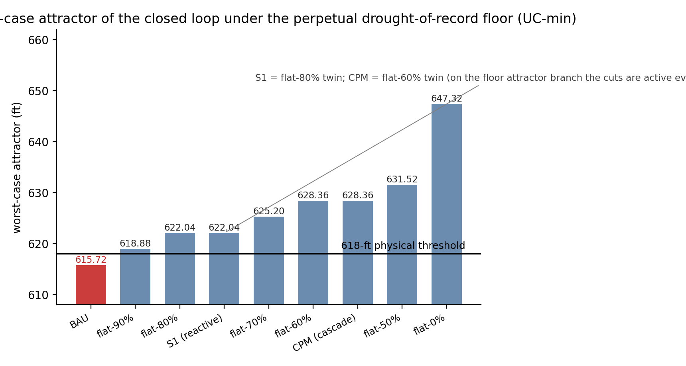

# Governance operators and viability kernels of the Edwards Aquifer: an intervention-selection test at J-17

**Prepared in the format of Groundwater (Wiley/NGWA)**

## Abstract

**Problem.** Drought management in permitted groundwater systems relies on triggers and pumping reductions, yet comparative protection under adverse recharge is rarely scored against a fixed criterion.

**Approach.** Robust viability kernels of J-17 annual-mean head were computed for a declared policy family — business-as-usual, flat caps 0–90%, Stage I reactive rule, critical-period-management cascade — under persistent drought-floor recharge. A non-BAU policy was retained only if at least as protective as BAU and more permissive than the most protective matched flat cap, under a frozen protocol.

**Results.** At the 618-ft physical threshold, BAU's worst-case attractor (615.72 ft) lies below the threshold and its kernel empties beyond about 13 years under a perpetual worst-year floor, while every flat cut of 10% or deeper and both reactive rules make the safe set robustly invariant (smallest securing cut: interpolated 7.2%). At the 660-ft institutional threshold, reactive rules are invisible to the viability kernel of their own trigger constraint, flat caps extend the viable horizon without invariance, and the threshold is protected by wet years, not by the pumping family. Certified kernels are defect-bound: every positive-pumping policy empties beyond T = 3 years; zero pumping reaches T = 4–5. The reactive rules are retained at the nominal level: 3.3% (Stage I) and 0.4% (cascade) more permitted supply than the kernel-matched flat-90% cap.

**Implications.** On the measured J-17 record, reactive rules match flat-cap robust protection while preserving more supply; the institutional threshold is not demand-manageable to invariance, and certified claims stay limited by the fitted model defect.

**Keywords:** Edwards Aquifer; drought management; pumping policies; viability; certified protection
**Article Impact Statement.** Reactive trigger rules on the Edwards Aquifer match flat-cap protection at J-17 with 3.3% and 0.4% more permitted supply, but the 660-ft threshold is protected by wet years, not by pumping rules.

## 1. Introduction

Drought management in permitted groundwater systems is built on triggers: index-well or springflow thresholds at which pumping reductions activate. Trigger design has a long evaluation literature — drought indicators and triggers are properly assessed as stochastic objects, with explicit attention to how indicator levels, trigger thresholds, and drought stages interact (Steinemann 2003) — and robustness has been a recurring concern of water-resources planning since the recognition that optimal solutions can be brittle to the hydrologic assumptions that produce them (Watkins and McKinney 1997). The operational question for a district that already operates triggers is narrower and comparative: given a declared family of pumping rules, which rules deliver protection under adverse recharge, and at what cost in permitted supply?

The Edwards (Balcones Fault Zone) Aquifer of south-central Texas is the most fully institutionalized example of trigger-based groundwater governance in North America. Its critical-period management program stages pumping reductions at index-well thresholds to protect springflow at Comal and San Marcos Springs, whose endangered-species requirements are administered through the Edwards Aquifer Habitat Conservation Plan, the subject of a standing scientific review by the National Academies (National Research Council 2015). The aquifer's regional behavior has long been represented — and debated — through lumped and equivalent-porous-media models, from the Barton Springs groundwater availability model (Scanlon et al. 2003) to its recalibration by the Texas Water Development Board (Hutchison and Hill 2011). This study scores, rather than asserts, the protection supplied by a declared family of pumping rules on the measured J-17 record.

The instrument is the robust viability kernel: the set of initial heads from which a closed-loop pumping rule keeps the system inside a declared safe set under every disturbance in a declared class. Viability methods have an established lineage in natural-resource management, where constraints rather than objectives define the policy question (Krawczyk and Pharo 2013), and their computational tractability on management-scale problems is documented by fishery case studies (Krawczyk et al. 2013). The declared safe set here is a floor on the productive store rather than on a year's yield: the head threshold marks the level below which springflow at Comal and San Marcos approaches cessation, so the policy question is the protection of the base that regenerates the yield, and a trigger's function is to keep the store from being drawn down to that floor at the cost of near-term permitted supply. Here the governed object is the one-pool affine head map fitted in a companion forecast-evaluation study on the same series (under separate review). That study ended in a negative certificate — a machine-verified non-retention finding, distinct from a statistical null result — with last-value persistence unbeaten by the causal ladder, and it located the unexplained forecast gap in the information layer: given realized recharge and pumpage, the map reaches 7.55-ft RMSE against persistence's 13.23 ft and the retained AR(1)'s 12.84 ft. This study asks the governance question the forecast study could not: whether a declared pumping rule changes the viability kernel of the real system as represented by the fitted map, and at what cost in permitted supply.

The complete comparison — object, defect declaration, disturbance classes, policy family, and retention rule — was frozen in a dated protocol (2026-08-26) before any score was computed. A companion intervention study on a marine fishery stock (Northern cod) applies the same design and reaches the mirror verdict; the two systems' scores are never pooled.

## 2. Methods

### 2.1 Object and dynamics

The object is that of the companion forecast evaluation: J-17 annual-mean head z_t (ft above mean sea level), San Antonio Pool, 1934–2023, from the registered twenty-column analysis panel. z is a measured well level, not an assessment inversion. Recharge R (USGS-estimated, Puente method; Umphres and Choi 2025) and pumpage P (Edwards Aquifer Authority Table 1) are the fluxes. No new data.

Dynamics: the causal stock-flow class of the companion forecast study, one pool, affine,

$$\Delta H_t = \alpha + \beta R_t + \gamma P_t + \delta H_{t-1},$$

fitted by ordinary least squares on 1934–1990 (56 transitions). The fit is α = 163.49, β = 0.0198 ft per 10³ acre-ft, γ = −0.02844 ft per 10³ acre-ft, δ = −0.2539, so a = 1 + δ = 0.7461 — a contraction with 25.4% per year mean reversion. Residual SD 5.60 ft; training maximum 15.41 ft. Out-of-sample (1991–2023, audit only, no refitting): SD 8.40 ft, maximum 21.81 ft — which exceeds the declared defect, a fact recorded below and not repaired, per protocol.

Information pattern: the manager ends year t knowing (H_t, R_t, P_t) and sets P_{t+1} = π(H_t); R_{t+1} is unknown at decision time and is treated adversarially within a declared persistent floor.

### 2.2 Uncertainty classes and safe sets

The disturbance classes are persistent recharge floors computed on the training window: UC-min = 43.7 (the 1956 drought-of-record year, held perpetually), UC-q05 = 166.5, UC-q10 = 179.1 × 10³ acre-ft yr⁻¹. The persistent-floor regimes are harsher than any single recorded year; they are certification geometry, not recharge forecasts.

The safe sets are the two declared normative thresholds, fixed in the frozen protocol: K*_phys = 618 ft (Comal Springs cessation proximity) and K*_inst = 660 ft (the post-2007 Stage I trigger, not applied to pre-2007 history). The model domain is [610, 710] ft; upward exits above 710 ft are model-domain exits, not threshold violations.

### 2.3 Governance family

Business-as-usual (BAU) holds pumping at the training mean, P ≡ P̄ = 282.16 × 10³ acre-ft yr⁻¹ — a flat 100% cap, not the historical pumpage path. Flat caps prescribe ρP̄ with ρ ∈ {0.9, 0.8, 0.7, 0.6, 0.5, 0}. The Stage-I reactive rule (S1) cuts pumping 20% when H < 660 ft (the reduction verified against the Authority's published rule). The critical-period-management (CPM) cascade prescribes cumulative stage totals of 20/30/35/40% cuts at H < 660/650/640/630 ft (cumulative, not stacked); Stage I is verified, and stages II–IV are declared scenarios, not verified institutions. The CPM supply figure below is the stage-weighted evaluation on the observed occupancies of the training era (1934–1990, n = 57 years): Stage I (H < 660 ft) 20 years (35.1%), Stage II (H < 650 ft) 12 (21.1%), Stage III (H < 640 ft) 5 (8.8%), and Stage IV (H < 630 ft) 1 (1.8%; 1956); the cumulative 20/30/35/40% cascade evaluated on these occupancies reproduces the replay's mean prescribed pumping exactly (254.93 × 10³ acre-ft yr⁻¹). Out of sample (1991–2023, n = 33 years) the occupancies are 33.3%, 15.2%, 6.1%, and 0.0% — Stages II and III recur out of sample (15.2%, 6.1%), Stage IV does not (0.0%; 1956 alone is below 630 ft).

For each policy and disturbance class, the robust T-step viability kernel of the safe set is computed by iterating the worst-case closed loop; the nominal kernel is reported without erosion, and the certified layer applies the defect-to-margin conversion in the form the fitted map admits. The term is used in its closed-loop reading — the robust positively invariant set of a fixed declared policy — not in the classical viability reading of Aubin (1991), which is existential over controls: no control choice enters the kernel computation, only the evaluation of declared rules under the disturbance floor. With the declared policies all deterministic functions of the observed head, each robust kernel reduces to the invariance statement of a one-dimensional closed loop — attractor and domain-top arithmetic rather than control synthesis — and the word is retained because the object answers the same question ("from which states can the constraint be held") in the policy-fixed form.

### 2.4 Retention rule and certified layer

A non-BAU policy is retained only if its robust kernel is at least as protective as BAU's at every reading (compared on the kernel lower boundary; empty = worst) and it permits more pumping than the most protective flat cap with matched protection. The scoring regimes are declared here rather than left implicit: **protection is scored under the disturbance classes** (the perpetual floors of Section 2.3), and **supply is scored as the 1934–1990 historical replay mean** — the retention verdict is therefore a hybrid, worst-case protection at historical-mean entitlement, not a within-scenario dominance, and under the floor classes alone the reactive rules are identically their matched flat caps (the cut is active every year) and carry no supply margin. When several flat caps share the same kernel, "most protective with matched protection" is resolved as the largest-supply member of the matched class. The retention decision is made at the nominal level and re-checked at the certified level, and the certified re-check holds only over the horizons where the certified kernels are nonempty — a horizon-truncated object, stated as such whenever it is invoked.

The certified layer converts the declared uniform defect ε = 15.41 ft (the training maximum) into an erosion margin using the closed loop's contraction rate a = 0.7461: r_T = ε(1 − a^T)/(1 − a), giving r₁ = 15.41, r₃ = 35.49, r₅ = 46.66, r_∞ = 60.70 ft. The certified kernel at horizon T is the nominal kernel of K* + r_T.

## 3. Results

### 3.1 Worst-case attractors and the minimal cut

**Table 1.** Worst-case attractors of the closed loop (ft), by policy and recharge floor.

| Policy | UC-min | UC-q05 | UC-q10 |
|---|---:|---:|---:|
| BAU | 615.72 | 625.31 | 626.29 |
| flat-90% | 618.88 | 628.47 | 629.45 |
| flat-80% | 622.04 | 631.63 | 632.61 |
| S1 (20% cut < 660 ft) | 622.04 | 631.63 | 632.61 |
| flat-70% | 625.20 | 634.79 | 635.77 |
| CPM cascade | 628.36 | 636.37 | 637.35 |
| flat-60% | 628.36 | 637.95 | 638.93 |
| flat-50% | 631.52 | 641.11 | 642.09 |
| flat-0 (zero pumping) | 647.32 | 656.91 | 657.90 |

**Figure 1.** Worst-case attractor of the closed loop under the perpetual drought-of-record floor (UC-min) by policy, from the registered kernel computation (Table 1). BAU's attractor (615.72 ft) sits below the 618-ft physical threshold; every cut policy — flat caps of 10% and deeper, the Stage I reactive rule, and the critical-period-management cascade — holds its attractor at or above the threshold. The reactive rules coincide with their attractor twins (S1 = flat-80%, CPM = flat-60%), the cuts being active on the entire floor attractor branch.

Under a perpetual 1956-recharge floor, BAU's attractor (615.72 ft) sits below the physical threshold; the smallest flat cut whose attractor clears 618 ft is an interpolated **7.2%** of mean pumping (outside the declared family). The Stage-I reactive rule's attractor equals flat-80%'s (the cut is active on the entire attractor branch).

### 3.2 Nominal kernels

At the physical threshold (618 ft) under UC-min, BAU's kernel boundary climbs 618.8 (T = 1) → 625.6 (T = 5) → 658.4 (T = 10), and the kernel is **empty** beyond T ≈ 13 years — the T = 12 boundary is 692.6 ft (continuous crossover 12.7 years), and the emptiness is a domain-top event: the boundary reaches the declared safe-set ceiling (710 ft), above which no state is scored, rather than an attractor event. Business-as-usual is not robustly viable against a perpetual drought-of-record. Every cut policy in the family — a 10% flat cap, S1, CPM, and deeper — makes [618, 710] **robustly invariant**: the whole declared safe set is the kernel at every horizon, including the infinite horizon. Under UC-q05/UC-q10 the safe set is already invariant at BAU (attractors 625.3/626.3 ft): governance differentiates the kernel only under the drought-floor class.

At the institutional threshold (660 ft) the result is a **negative certificate**, and the kernel-invariance statement must be split by policy class. For the **reactive rules** (S1, CPM) the equality with BAU is exact at every horizon: the boundaries (675.1 at T = 1, 695.3 at T = 2 under UC-min; empty from T = 3) lie strictly above the first-stage trigger (660 ft, the highest — and therefore easiest to reach — of the four declared trigger levels), so no reactive rule fires in the viable region and the kernel is policy-invariant for them. That equality is an institutional design fact, not a drought fact: a trigger placed on the boundary of a constraint is invisible to the viability kernel of that same constraint, and no rule that cuts only below 660 ft can improve the invariance of {H ≥ 660}. For the **flat caps** the equality is false: they move the finite-horizon boundaries (flat-80% reads ≈673 at T = 1 against BAU's 675.1) and extend the viable horizon — zero pumping has an empty nominal kernel only beyond T ≈ 6 (UC-min) / T ≈ 11 (UC-q10), because its worst-case attractor (647.3/657.9 ft) still sits below 660 ft. Demand management therefore extends the viable **horizon, not invariance**, and the 660-ft certificate states that the threshold is protected by wet years, not by the declared pumping family — which is exactly the frequency-management rationale the actual CPM rule implements, and that rationale is outside the robust-kernel frame.

### 3.3 Certified kernels

With the erosion of Section 2.4 applied, every demand-management policy in the family has an empty certified kernel beyond **T = 3 years** at the physical threshold and beyond T = 1 year at the institutional threshold. Zero pumping is the exception: its certified physical-threshold kernel is nonempty through T = 4 under UC-min (lower boundary ≈687.9 ft from the certified-kernel algebra; the registered horizon grid {1, 2, 3, 5, 8, 10, 15, 20, ∞} does not sample T = 4, so the archived infinite-horizon emptiness is consistent with the analytic boundary exceeding the domain top at T = 5) and through T = 5 under UC-q05/UC-q10. The certified boundaries at T = 3, UC-min, 618 ft: flat-0 662.2 < flat-80 697.8 < BAU = S1 = CPM 706.7 ft. The certified-level inference is drawn explicitly: at the one certified horizon tabulated, the reactive rules inherit BAU's boundary (706.7) — strictly above flat-80%'s (697.8) — so certified dominance of S1 over its matched flat cap fails, the +3.3%/+16.2% supply margins are nominal-level comparisons, and certified retention is a different, horizon-truncated object from nominal retention (Section 2.4). The binding constraint on certified intervention claims is the **model defect, not the governance** — the information-layer limitation identified by the companion forecast evaluation, here measured on the intervention leg.

### 3.4 Supply and retention

**Table 2.** Mean prescribed pumping (actual-head replay, 1934–1990) and cut-active fraction.

| Policy | Supply (10³ acre-ft yr⁻¹) | Cut active |
|---|---:|---:|
| BAU | 282.16 | 0% |
| flat-90% | 253.94 | 100% |
| flat-80% | 225.73 | 100% |
| flat-70% | 197.51 | 100% |
| S1 | **262.36** | 35.1% |
| CPM | **254.93** | 35.1% |
| flat-60% | 169.29 | 100% |
| flat-50% | 141.08 | 100% |

Out-of-sample replay (audit only, over the 1991→2022 transitions; the 2023 terminal year has no successor): S1 264.5 and CPM 260.6 × 10³ acre-ft yr⁻¹; every flat policy prescribes its cap throughout, so its training and out-of-sample supplies coincide.

- **S1: retained (nominal, UC-min, 618 ft).** It matches the flat caps' robust invariance (kernel = whole safe set at all horizons) while supplying 262.36 versus flat-90%'s 253.94 (+8.4 × 10³ acre-ft yr⁻¹, **+3.3%**) and flat-80%'s 225.73 (+36.6, **+16.2%**). The scoring regimes are the hybrid declared in Section 2.4 — protection under the perpetual worst-year recharge floor, supply as the 1934–1990 historical replay mean — and the reading of the retention is exactly "worst-case protection at historical-mean entitlement," not a within-scenario dominance: under the floor itself S1 is identically flat-80% (the cut is active every year, and its floor-attractor supply equals flat-80%'s), so the supply margin exists only in wet years that the robust class excludes, and against flat-90% the floor comparison is the sharper one — S1 is always −20% where flat-90% is always −10%, at identical invariance. The reactive architecture justifies its additional structure on the hybrid criterion, not on the robust criterion alone.
- **CPM: retained (nominal, same threshold and class).** Attractor 628.36 ft (equal to flat-60%'s) at supply 254.93 versus flat-60%'s 169.29 (**+50.6%**).
- **Certified level:** certified retention is horizon-truncated: at the one tabulated certified horizon the reactive rules inherit BAU's boundary (706.7 ft, Section 3.3) and fail the certified re-check, and the +36.6/+85.6 supply figures are nominal-level comparisons, not certified retention.
- **Institutional threshold: nothing retained.** The reactive rules are identically BAU at every horizon (trigger-on-boundary invisibility, Section 3.2); the flat caps are more protective at finite horizons and extend the viable horizon, and no policy meets the retention test there.

### 3.5 Classification and stress replays

The T = 5 nominal kernel (UC-min, 618 ft): BAU excludes exactly one actual year from its viable set — 1956, the drought-of-record year (623.15 ft annual mean). S1 and CPM exclude none: the entire 90-year actual record is robustly 5-year viable under the cut rules. The T = 5 certified kernels are empty, so no actual year is certified 5-year viable under any policy; this is the boundary of the certified analysis.

A 1950s open-loop diagnostic (model driven by actual R, P versus actual heads, 1951–1956) records the map's drought bias: the affine map under-predicts the decline, model 659.5 → 631.3 versus actual 659.5 → 623.2 ft, maximum error 8.1 ft, biased high. The model-based policy replays from the observed 1950 head keep all policies above 618 ft (BAU minimum 629.7, S1 634.9, CPM 637.1 ft), but the open-loop bias means the true margins are smaller than the replay suggests; this is recorded, and no correction is applied.

### 3.6 Finite-duration recharge floors and floor-class supply

Two declared post-freeze layers extend the persistent-floor object. The first asks how long a drought-class episode must last before the safe set contracts: the class floor holds for $n$ years, recharge then returns to its training mean (the zero-residual analogue of the cod paper's finite floors), and the infinite-horizon lower boundary at the 618-ft threshold is pulled back by exact backward recursion through the $n$ floor years. The second computes the floor-class supply — the closed loop from the observed 1934 head with recharge held at each class floor — supplying the declared-scoring half that the historical replay cannot: the paper's retention criterion is worst-case protection at historical-mean entitlement, and the entitlement leg of that hybrid is measured only on the historical replay, where the reactive rules' cuts are inactive in wet years.

**Table 4.** Finite-duration floors: infinite-horizon lower boundary (ft) at the 618-ft threshold after $n$ years at the class floor followed by training-mean recharge. The BAU row at $n=5$ and $n=10$ reproduces the registered $T=5$ and $T=10$ nominal boundaries (625.6 and 658.4 ft); $n=15$ emptiness reproduces the registered 13-year horizon bound.

| Policy | UC_min, $n{=}5$ | UC_min, $n{=}10$ | UC_min, $n{=}15$ | UC_q05/q10, any $n$ |
|---|---:|---:|---:|---:|
| BAU | 625.6 | 658.4 | empty | 618.0 |
| flat-90% and deeper; S1; CPM | 618.0 | 618.0 | 618.0 | 618.0 |

Duration differentiates exactly one policy: under the drought-class floor, business-as-usual is the only policy whose boundary moves with episode length, while every cut policy holds the whole safe set at every duration — the cuts' floor attractors sit at or above the threshold (618.9–647.3 ft, Section 3.1, Table 1), so a finite drought episode followed by normal recharge pulls nothing back beyond 618 ft. Under the two milder classes the safe set is already invariant at BAU (Section 3.2), and duration is inert for every policy.

**Table 5.** Floor-class supply: closed loop from the observed 1934 head (670.4 ft), recharge held at the class floor, mean prescribed pumping (10³ acre-ft yr⁻¹) over the training span (1934–1990) and the full span (1934–2023); end head at 2023.

| Policy | UC_min supply (train/full) | UC_min end head | UC_q05 supply (train) | UC_q10 supply (train) |
|---|---:|---:|---:|---:|
| BAU | 282.16 / 282.16 | 615.7 | 282.16 | 282.16 |
| flat-90% | 253.94 / 253.94 | 618.9 | 253.94 | 253.94 |
| flat-80% | 225.73 / 225.73 | 622.0 | 225.73 | 225.73 |
| S1 | 226.72 / 226.36 | 622.0 | 226.72 | 226.72 |
| flat-60% | 169.30 / 169.30 | 628.4 | 169.30 | 169.30 |
| CPM | 174.49 / 172.59 | 628.4 | 187.36 | 187.61 |
| flat-0 | 0 / 0 | 647.3 | 0 | 0 |

The table quantifies the scoring-regime reading of Section 2.4: under the floors the reactive rules converge to their matched flat-cap attractors (S1 to flat-80%'s 622.04 ft, CPM to flat-60%'s 628.36 ft — the cut active every year on the attractor branch, Section 3.4), and their closed-loop span-mean supply exceeds the matched caps only by the trigger-lag margin of the descent from the observed 1934 head — S1 +0.4% over flat-80% (226.7 versus 225.7 × 10³ acre-ft yr⁻¹), CPM +3.1% over flat-60% (174.5 versus 169.3). The hybrid criterion's margins (3.3% and 0.4% against the kernel-matched flat-90% cap) exist only in the wet years that the robust classes exclude; the floor-class supply leg is the margin's own measure of how little it would buy inside the class.

## 4. Discussion

The complete evaluation loop — measured state, calibrated stock-flow map, declared governance operators, declared uncertainty classes, viability kernels with explicit declared-defect erosion, a held-out defect audit, and a fixed retention rule — yields a **positive selection result**: the reactive architecture matches flat-cap protection at 3.3% (S1) and 0.4% (cascade) more permitted supply than the kernel-matched flat-90% cap — 16.2% and 50.6% against their attractor-twin caps — and an interpolated 7.2% mean cut (outside the declared family) secures the physical threshold against a perpetual drought-of-record where business-as-usual fails. It also yields two negative findings: the institutional threshold is not demand-manageable to invariance under the declared classes, and the certified content is defect-bound to T ≤ 3 years.

The reactive result is system-dependent, not architectural. Its mechanism is the aquifer's physics: high transmissivity and rapid karst recharge make wet-year recovery fast, so a flat cap permanently taxes recoveries that a reactive rule harvests — the supply margin exists only in the wet years that the robust classes exclude (Section 3.4). A companion intervention study on Northern cod applies the identical design and retains nothing: there the reactive rules cut catch exactly where the moratorium already protects, and the mirror verdict is a negative selection. The framework's deliverable is the scored comparison itself — which governance architecture earns its complexity is a property of the system, and the two scored systems bound the answer.

Two layers of results must be kept distinct. The robust-kernel findings are statements about the declared pumping family under the declared floor classes; the certified-kernel findings are a different layer, produced by applying the erosion conversion to the declared training defect. With ε = 15.41 ft — exceeded out of sample at 21.81 ft — every demand-management policy's certified kernel is empty beyond T = 3 years. At the out-of-sample defect the erosion margin would be proportionally larger and the certified horizon correspondingly narrower, so the protocol's bound is optimistic, not conservative, on this object. The certified emptiness is a bound on what the fitted map can certify, not a robustness statement about the physical system; and the erosion margin is set by the training maximum residual (15.41 ft), larger than the companion's information-layer gap (12.84 versus 7.55 ft), so certified emptiness is not a forecast-layer artefact and the unexplained forecast gap lies again in the information layer. The conversion also credits no feedback: it applies the autonomous contraction rate uniformly, so a defect that pushes a reactive rule across its trigger cannot be dampened by the cut the rule then imposes. The certified comparison is therefore conservative against the state-dependent rules — their certified emptiness is a bound under an erosion rule that ignores the very mechanism those rules were built to provide.

The negative certificate at 660 ft also reads correctly against the institution it describes. The actual CPM rule manages **frequency** — the fraction of time the head spends in critical stages — not robust invariance, and the finding that no pumping rule can hold the institutional threshold under a perpetual drought floor is consistent with that design intent: the rule cannot make wet years, it prices dry ones. The National Academies' review of the Habitat Conservation Plan (National Research Council 2015) was likewise organized around monitoring and modeling adequacy under drought; the horizon-not-invariance distinction is the robust-kernel expression of the same boundary.

The karst honesty of the object is inherited from its forecast-study companion and from the modeling lineage it descends from: the one-pool affine map is the simplest member of the lumped family whose regional adequacy was tested on the Barton Springs segment (Scanlon et al. 2003; Hutchison and Hill 2011). Conduits, the Uvalde–San Antonio divide, and unconfined recharge-zone storage remain in the residual; San Antonio and Uvalde recharge and pumpage are lumped; the actual CPM triggers are 10-day averages, so the annual-mean rule is a coarse relative of the real institution; and stages II–IV are declared scenarios, not verified institutions. Nominal kernels carry no defect margin, and the certified kernels use a training defect that the out-of-sample audit exceeds. The counterfactual swap from the largely unregulated 1934–1990 fitting era to state-dependent rules carries a declared econometric boundary: the fitted coefficients absorb the historical, unregulated behavioral coupling between pumping and weather, and ordinary least squares cannot separate the aquifer's physical response from the pumpers' historical reactions — imposing the critical-period architecture under those coefficients assumes the physics–behavior separation the estimator does not guarantee (Lucas 1976). The UC floors are certification geometry, not forecasts; the 1950s replay is biased high by 8.1 ft. Nothing in this leg promotes or demotes any forecast module, and no two-pool, karst, or solute claim is made.

## 5. Conclusions

On the measured J-17 record, reactive trigger rules outperform flat caps at matched robust protection: the Stage-I rule delivers the same robust invariance of the 618-ft threshold at 3.3% more permitted supply than the kernel-matched flat-90% cap (16.2% against its attractor-twin flat-80% cap), and the cascade at 0.4% more than flat-90% (50.6% against its attractor-twin flat-60% cap). An interpolated 7.2% mean cut (outside the declared family) secures the threshold against a perpetual drought-of-record, where business-as-usual fails within roughly 13 years. Two boundaries are equally part of the result: the 660-ft institutional threshold is protected by wet years rather than by the declared pumping family, and every certified claim is defect-bound to three years. The deliverable is the scored comparison on one measured system.

## Data Availability Statement

All input data, analysis scripts, and result files are archived in the public repository at https://github.com/MIKEAA2020/general-sustainability. J-17 daily highs: Texas Water Development Board well 6837203. Recharge: Umphres and Choi (2025), USGS data release, https://doi.org/10.5066/P1BI62NY. Pumpage: Edwards Aquifer Authority (2024/25), Table 1. The full intervention protocol — object, defect declaration, disturbance classes, policy family, and retention rule — was frozen and dated 2026-08-26 before any kernel, boundary, replay, or retention score was computed; it is archived with the analysis code as the preregistration record, alongside the companion forecast-evaluation protocols dated 2026-08-25. The analysis is fully deterministic: re-executing the registered runner regenerates both output files, and a verification re-execution in a fresh environment reproduced both byte for byte. The machine-readable outputs include the nominal and certified retention fields and the certified-horizon record. The Section 3.6 layers (finite-duration floors; floor-class supply) are produced by `rerun_campaigns/campaign_e4_elevation.py`, archived alongside their outputs, and regenerate them exactly.

## References

Aubin, J.-P., 1991. Viability Theory. Birkhäuser, Boston.

Edwards Aquifer Authority. 2024/25. *2023 Groundwater Discharge and Usage*, Table 1 (after USGS letter report, 5 April 2024). https://www.edwardsaquifer.org/wp-content/uploads/2025/05/2023-Groundwater-Discharge-and-Usage.pdf

Edwards Aquifer Authority. Critical Period / Drought Management. https://www.edwardsaquifer.org/groundwater-users/critical-period-drought-management/

Hutchison, W.R., and Hill, M.E. 2011. *Recalibration of the Edwards BFZ (Barton Springs Segment) Aquifer Groundwater Flow Model*. Texas Water Development Board, Austin, Texas, 121 p.

Krawczyk, J.B., and Pharo, A. 2013. Viability theory: An applied mathematics tool for achieving dynamic systems' sustainability. *Mathematica Applicanda* 41: 97–126.

Krawczyk, J.B., Pharo, A., Serea, O.S., and Sinclair, S. 2013. Computation of viability kernels: A case study of by-catch fisheries. *Computational Management Science* 10: 365–396.

Lucas, R.E., Jr., 1976. Econometric policy evaluation: A critique. *Carnegie-Rochester Conference Series on Public Policy* 1: 19–46.

National Research Council. 2015. *Review of the Edwards Aquifer Habitat Conservation Plan: Report 1*. The National Academies Press, Washington, DC. https://doi.org/10.17226/21699

Puente, C. 1978. *Method of estimating natural recharge to the Edwards Aquifer in the San Antonio area, Texas*. U.S. Geological Survey, Austin, Texas.

Scanlon, B.R., Mace, R.E., Barrett, M.E., and Smith, B. 2003. Can we simulate regional groundwater flow in a karst system using equivalent porous media models? Case study, Barton Springs Edwards aquifer, USA. *Journal of Hydrology* 276: 137–158.

Steinemann, A.C. 2003. Drought indicators and triggers: A stochastic approach to evaluation. *Journal of the American Water Resources Association* 39: 1217–1233. https://doi.org/10.1111/j.1752-1688.2003.tb03704.x

Texas Water Development Board. Water Data for Texas, well 6837203 (J-17). https://waterdatafortexas.org/groundwater/well/6837203

Umphres, G.D., and Choi, N.J. 2025. Estimated Annual Recharge to the Edwards Aquifer in the San Antonio Area, by Stream Basin or Ungaged Area, 1934–2024. U.S. Geological Survey data release. https://doi.org/10.5066/P1BI62NY

Watkins, D.W., Jr., and McKinney, D.C. 1997. Finding robust solutions to water resources problems. *Journal of Water Resources Planning and Management* 123: 49–58.
