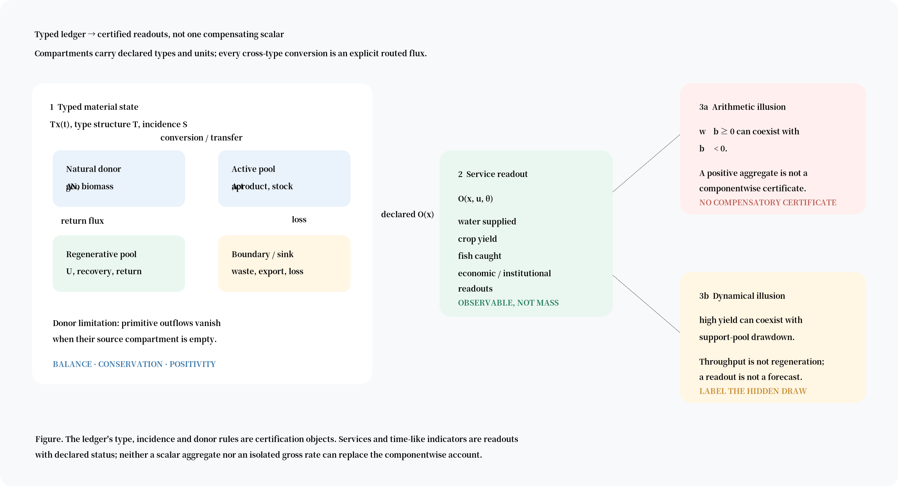

# Typed material-flow ledgers for componentwise sustainability diagnostics

## Abstract

Material-flow accounting can close a balance while leaving the physical question unresolved: which substance class is conserved, which conversions are declared, and whether a service is being maintained by regeneration or by drawdown of a supporting stock. The same ambiguity appears when reserve-life ratios, anomaly-trend indices and removals-only timescales are all reported as “time to depletion”. We present a typed stock–flow ledger in which compartments carry declared substance types and units, cross-type conversions are explicit routed fluxes, and services are readouts rather than conserved mass. Three separately reportable certification layers—accounting balance, conservation and barrier safety—are joined to donor-limited positivity and an envelope certificate. A non-compensatory result shows why a positive scalar aggregate cannot certify componentwise adequacy on a general feasible balance domain. We then classify three public-data records: G3P groundwater anomaly persistence, the USGS phosphate reserve-life ratio, and a fisheries removals-only pressure time. They have similar units but answer different questions. The framework supplies an auditable route from material-flow declarations to status-labelled diagnostics: what the record establishes, what remains unestablished, and what is not applicable. Formal proofs, extended data-vintage records and executable reproduction exhibits are supplied in the accompanying technical supplement and full-length deposit.

**Keywords:** material flow analysis; typed ledger; stocks and flows; double counting; componentwise sustainability; depletion indicators; ecological industrial systems

## 1. Introduction: the accounting problem behind apparently comparable times

Material-flow analysis (MFA) provides a disciplined language for tracking physical inputs, outputs, stocks and residuals (Brunner and Rechberger, 2004; Eurostat, 2001; Fischer-Kowalski et al., 2011). Yet a closed balance is not by itself a conservation proof, a positivity proof or a sustainability certificate. Those properties refer to different objects. A mass-balanced table can silently drop a moiety through an incomplete yield route; a physically admissible flow can violate a declared critical-stock barrier; and a scalar sustainability index can hide a deficit in one component behind a surplus elsewhere.

A second problem concerns quantities reported in years. A reserve-life ratio divides an economically declared reserve by current production. A groundwater anomaly index extrapolates a fitted trend to a product's historical minimum. A fisheries calculation can divide a logarithmic biomass margin by current fishing mortality while omitting recruitment, growth and future policy. Each is a legitimate descriptive construction when its boundary is stated. None is automatically a physical exhaustion time.

This paper gives a material-accounting framework for keeping those questions separate. It makes four contributions. First, it types compartments and conversions so that unlike substance classes are not added merely because they share a numerical unit. Second, it separates accounting balance, conservation and barrier safety and gives a compact certification state. Third, it proves a non-compensation obstruction: a nonnegative weighted sum cannot, in general, certify that every component meets its threshold. Fourth, it gives a common classification table for three published time-like records and states the question each does—and does not—answer.

The paper is a compressed journal version. Full theorem statements and proofs, the extended application records, parameter-status tables, data-vintage evidence and the executable reproduction exhibits are deposited as the technical supplement and full-length record. The compression changes exposition, not the definitions or the status of the classified records.

## 2. A typed ledger for material-flow accounting

Let $x(t)\in\mathbb{R}_+^n$ be the vector of compartment stocks, $v(t)\in\mathbb{R}_+^J$ the primitive fluxes, and $b(t)$ the declared boundary schedule. The balance law is

$$\dot x = S_{\mathcal T}v+b.$$

The incidence operator $S_{\mathcal T}$ is not only a bookkeeping matrix; it shares a formal language with compartmental and reaction-network representations (Jacquez and Simon, 1993; Feinberg, 2019). It is generated from a type structure $\mathcal T$: a set of substance types, a declared type and unit for each compartment, and a set of conversion coefficients. A transfer has signed unit entries within one type class. A conversion has the declared stoichiometric coefficient on the source and the corresponding routed output on the destination. A cross-type sum is not admitted without that conversion declaration.

A moiety-composition matrix $C$ maps compartments to conserved substance classes, $S=Cx$. Services and other institutional outputs are readouts $O(x,u,\theta)$ of the physical state and operating variables. They are not silently inserted into $x$ as if a crop yield, a monetary measure or a biodiversity index were another conserved mass compartment.

The practical consequence is a boundary discipline. Every transformation with yield below one must route the omitted fraction to a represented compartment or an explicitly declared boundary flow. A primitive outflow must have a source, and the donor-limitation condition makes it vanish when that source is empty. These rules prevent two familiar errors: phantom mass from an unbooked residual, and apparent positivity obtained by allowing an empty donor to export material.

### 2.1 Incidence, closure and double counting

The incidence operator makes a material-flow account auditable at the column level. For a transfer within one type class, the source receives $-1$ and the destination $+1$. For a conversion, the source carries the declared coefficient and the product receives its routed unit. A column cannot be both a transfer and a conversion. This prevents a convenient but ambiguous practice in which unlike entries are added first and interpreted later.

The same representation supports closure analysis. Let $D$ be a declared demand vector and $P$ the matrix that maps primitive return fluxes to the uses they cover. The closure programme searches for the largest $\lambda$ such that the internal balance closes and $\lambda D\le Pv$. If $\lambda\ge1$, the declared use can be covered by the declared return capacity. If $\lambda<1$, the shortfall is not evidence that the material is intrinsically unrecoverable; it identifies the gap between the declared demand and the declared return network. A dual cut can name the subset of uses whose return capacity is insufficient (Ahuja et al., 1993).

This is the relevant distinction for circular-economy claims. A system may report a high recycling percentage while importing the material that makes the percentage possible, omitting a loss stream or counting a service output as a returned material. The typed account does not prescribe the target percentage. It requires the target, return route, losses and boundary inputs to be represented before “closed loop” is used as a physical claim.

The operator also makes reporting boundaries explicit. Reclassifying a material from an asset category to a waste or service category does not, by itself, change the conserved moiety. A physical conversion or boundary transfer must do that work. Conversely, changing the type declaration changes the ledger and therefore the admissible flux set; it is not a harmless relabelling. This is why the type structure belongs beside the data table, not in a footnote after aggregation.

**Figure 1.** Typed compartments and routed fluxes produce separately certified readouts. A service is observable output, not conserved mass. A positive scalar aggregate and a high current yield are both compatible with component deficits or support-pool drawdown, so neither is a componentwise certificate.

## 3. Three certificates and the non-compensation result

The framework reports a certification vector rather than a single pass score:

$$\mathrm{Cert}=(\mathsf{Typed},\mathsf{Balanced},\mathsf{Conserved},\mathsf{Positive},\mathsf{Admissible},\mathsf{Safe},\mathsf{Adequate\ service},\mathsf{Closed}).$$

The statuses are `established`, `not established` and `not applicable`; an undeclared obligation is not called refuted. The first three layers are the core of the present article:

1. **Accounting consistency:** $\dot x=S_{\mathcal T}v+b$ holds on the declared trajectory.
2. **Conservation consistency:** every declared conserved covector satisfies $\ell^\top S_{\mathcal T}=0$.
3. **Barrier safety:** the readout remains inside declared componentwise bounds, $\underline B(t)\le Cx(t)\le\overline B(t)$.

The flux-reconstruction identity integrates the balance law and therefore reconstructs moiety trajectories from declared fluxes and boundary terms. The conservation reduction integrates a left-null vector and separates internal routing from boundary change. The envelope certificate bounds every trajectory compatible with declared flux boxes; it is conservative when the box includes jointly unrealizable combinations, and it is not a forecast.

The central aggregation result is elementary but operationally important. It complements the noncompensatory composite-indicator literature (Munda and Nardo, 2009) and the critical-natural-capital argument that a threshold cannot be repaired by an arbitrary compensating surplus (Ekins et al., 2003; Neumayer, 2013). Let $b$ be a feasible balance vector and let $w\ge0$. If the feasible domain contains a vector with $b_i<0$ while $w^\top b>0$, then the scalar condition does not imply componentwise adequacy. The construction can be made for every nonzero nonnegative $w$ by increasing one component enough to compensate a deficit in another. Therefore a weighted aggregate may communicate or rank, but it cannot replace the conjunction of componentwise barriers without an additional domain theorem.

A two-component witness makes the point without a dataset. Let $w=(1/2,1/2)$ and $b=(-2,3)$. The aggregate is $w^\top b=0.5$, yet the first component is below zero. The aggregate has not certified the first component; it has only concealed the deficit behind the second component. The same obstruction survives any nonnegative weights by rescaling the surplus component. A second witness separates aggregate and event times: two states $(2,98)$ and $(50,50)$ both produce $Z(t)=100e^{-t}$ under componentwise decay, but their first threshold crossings at the unit barrier are $\log 2$ and $\log 50$. An aggregate trajectory cannot transport a component event time. These are arithmetic witnesses, not empirical examples, and the executable script in the supplement reproduces them.

This is the accounting form of the double-counting discipline. One balance is written per moiety; conversions are explicit; residuals are routed; and a classification label such as “reserve” is not allowed to determine a material route. The full proof, including the attainable witness and the five routing rules, is in Supplementary Notes S1–S3.

### A reader's route from data to a status-labelled result

A practitioner supplies a compartment table, a flux table, an incidence operator, boundary terms and declarations of types, units, conversions, barriers and horizon. The procedure is:

1. construct and type-check $S_{\mathcal T}$;
2. test the balance and conserved covectors;
3. test donor-limited positivity and declared barrier safety;
4. solve the closure or envelope programme when its inputs exist;
5. attach a source vintage and an evidence status to every readout.

Companion A gives the exact input schema, negative-output semantics and solver programmes. The status vocabulary is part of the result: failure to identify a parameter is not the same as a refuted law, and a predicate that is not live for a descriptive record is not a failed predicate.

### 3.1 A material-flow audit in five questions

The three layers become practical when asked as five sequential questions. **What is the object?** Is each row a stock, a flow, a service readout, an economic classification or a boundary term? **What is the type?** Do entries share a moiety and unit, or is a conversion coefficient needed? **Where does the material go?** Does every transformation route its yield and residual, including waste and export? **What does the account certify?** Is the result a balance, a conserved quantity, a positivity property, a barrier statement or only a descriptive ratio? **What remains open?** Which stock, rate, barrier or feedback would be needed to promote the result to a stronger claim?

The fifth question is essential for public indicators. A record can be accurately computed and still be unable to identify a parameter or barrier. The status should then say `not established`, not “bad data” and not “forecast”. Conversely, `not applicable` means that the object has no live obligation—for example, a descriptive anomaly index has no declared physical stock equation to which a positivity theorem could apply. This is the same discipline that distinguishes a missing boundary declaration from a failed conservation identity.

The route also supports comparison across studies. Two MFA accounts can be placed on a common audit surface without forcing their substantive boundaries to be identical. The comparison reports which types, conversions, residuals and barriers are common, which differ, and which outputs are only readouts. A disagreement can therefore be located at the declaration, data or inference layer rather than being hidden in one composite number.

### 3.2 What the delegated proofs establish

The proof supplement retains the distinctions that are most useful to an MFA reader. For the closed finite-donor natural block, the natural-block mass $M$ obeys

$$\dot M=-qEN-C^{A,\mathrm{lim}}.$$

Thus the only terms that change the natural-block total are the declared extraction and limiting boundary loss. Internal routing cancels column by column. The same incidence and donor conditions give forward invariance of the nonnegative orthant: an outflow cannot carry a coordinate below zero because its primitive rate vanishes on the empty donor face. Positive extraction excludes an interior rest point for the closed natural block; the vanishing-extraction rest set contains the extinction, carrying-capacity and frozen-biomass faces described in the full proof. Finally, extraction is integrable over every finite donor budget. These are not claims that any public-data indicator has supplied a calibrated dynamic model; they are structural results for the declared ledger.

The envelope theorem is likewise a certificate about a declared uncertainty box, not a prediction. Its throughput interpretation is consistent with the ecological-economics distinction between resource depletion and the flow of production (Daly, 1990), but the theorem itself is an accounting result. For each moiety row, the positive and negative parts of $CS_{\mathcal T}$ give lower and upper derivative bounds, which integrate to an interval containing every compatible trajectory. When the box contains combinations that the coupled dynamics cannot jointly realise, the interval is conservative. The tighter object is a linear programme over the admissible flux polytope, and infeasibility has a dual interpretation: a named return-capacity cut is insufficient for the declared demand.

The extended supplement also proves why an open institutional system cannot be silently substituted for the closed ledger. The shared identity $qEN-R=-\dot N$ is an interface identity, not a reduction theorem. A delay-driven working system can carry an omitted turnover or imposed recharge that is absent from the closed primitive state. Its cycles, equilibria or Hopf crossings therefore do not become properties of the closed mass ledger merely because one output equation has the same symbols. This matters for industrial-ecology models that couple physical stocks to economic controls: the coupling has to declare which flows are physical, which are institutional and which are diagnostic.

## 4. Three depletion readings, one comparison table

A time unit does not determine the object being measured. For an active pool $A$ above a declared threshold $A_{\min}$, the framework separates:

$$J_A^{\mathrm{gross}}=g(X,A)/A,\qquad H_A^{\mathrm{gross}}=(A-A_{\min})/g(X,A),$$

which measure gross throughput or support coverage;

$$H_A^{\mathrm{loc}}(t)=\frac{A(t)-A_{\min}}{[-\dot A(t)]_+},$$

which is a frozen current net-rate ratio; and

$$T_A(x_0;\pi,d)=\inf\{t\ge0:A^{\pi,d}(t;x_0)\le A_{\min}\},$$

which is a scenario-conditioned first-passage time. The third requires a model, policy, disturbance history and barrier. Under a declared uniform drift bracket the local ratio and the hitting time can be bounded relative to one another; without that bracket, the ratio is not a forecast. Internal transfers do not exhaust a conserved moiety: a finite crossing concerns a declared compartment, barrier or readout, not total mass.

| Public record | Input object | Reported quantity | What it answers | What it does not answer |
|---|---|---|---|---|
| G3P groundwater product | basin anomaly series, reference window and fitted trend | anomaly-persistence index: approximately 2.7, 7.9, 9.5 and 21.4 years for four basins | how long the fitted anomaly takes to reach that series' historical minimum under the declared convention | physical aquifer exhaustion or an identified storage threshold |
| USGS phosphate record | economic reserve class and annual production | reserve-life ratio, approximately 309 years on the pinned record | arithmetic size of the declared reserve class at the quoted rate | geological exhaustion, a forecast, or a fixed physical inventory |
| RAM Legacy fisheries record | SSB, reference biomass and current fishing mortality | removals-only pressure time, selected-cohort median approximately 1.8 years; public-release broad cohort 3.39 years | isolated gross-loss margin under the stated comparison process | demographic or population-model hitting time |

The records are deliberately not forced into the same ledger status. The G3P value is a record-relative statistical index. The phosphate value is a ratio of an economic classification whose membership changes with technology, price, exploration and regulation. The fisheries value omits recruitment, growth, maturation, natural mortality, density dependence, environmental forcing and future policy. The numerical similarity of their units is therefore not evidence of interchangeability.

### 4.1 How the three records enter the accounting discipline

The groundwater record illustrates the difference between a time unit and an asset stock. G3P v1.12 (Güntner et al., 2024) supplies monthly groundwater-storage anomalies relative to a reference period. For a basin mean, the statistic is the distance from the latest anomaly to the product's historical minimum divided by the fitted negative trend. The value changes if the window, basin mask, anomaly reference or trend convention changes. A physical local ratio would require an absolute stock estimate and a net derivative; the anomaly product alone does not identify either. The appropriate output is therefore a record-relative statistical index, with its product and fitting conventions attached.

The phosphate record illustrates the difference between a reserve class and a geological donor. The reserve/resource distinction is standard in mineral economics (Tilton, 2003; Tilton and Lagos, 2007), and the recent phosphate discussion is explicitly tied to the single-source exhaustion reading (Illakwahhi et al., 2024). On the pinned record (U.S. Geological Survey, 2026), approximately $74{,}000{,}000$ kt of world reserves divided by approximately $240{,}000$ kt/yr of production gives about 309 years. A separate resource-threshold calculation gives approximately 1,125 years under its own declared 10% convention. The two numbers are not competing estimates of one exhaustion event. The first is a ratio of an economic classification; the second is a resource-based scenario quantity. Reclassification, price, exploration, recycling and technology are part of the reserve boundary. Treating the 309-year quotient as a fixed donor budget would be an unannounced change of ledger.

The fisheries record illustrates gross pressure without demographic closure. The source record is the RAM Legacy database (Ricard et al., 2012). With current spawning biomass $\mathrm{SSB}_{\mathrm{now}}$, reference $B_{\lim}$ and fishing mortality $F_{\mathrm{now}}$, the reported comparison is

$$\Theta_F=\frac{\log(\mathrm{SSB}_{\mathrm{now}}/B_{\lim})}{F_{\mathrm{now}}}.$$

It is the hitting time of the deliberately incomplete process $\dot B=-F_{\mathrm{now}}B$. The selected 43-stock record has a median of approximately 1.8 years under the zero convention for stocks at or below the reference; the positive sub-cohort has a median of approximately 2.9 years. Running the same protocol on the broad public release gives 3.39 years across 454 stocks. The spread is evidence of cohort and version dependence, not an uncertainty interval around a demographic forecast. A stage-structured model would need recruitment, growth, maturation, natural mortality, density dependence and future management as declared components.

This record-by-record reading is the point at which a material-flow account becomes decision-relevant. The groundwater result identifies the missing stock measurement; the phosphate result identifies the classification and reclassification assumptions; and the fisheries result identifies the missing population dynamics. Each output tells the next analyst what must be measured or modelled before a stronger claim can be made.

### 4.2 When the clocks can coincide—and when they cannot

The local ratio and a true hitting time coincide only under a declared rate condition. Suppose the active-pool decline satisfies

$$(1-\varepsilon)v_0\le -\dot A(t)\le(1+\varepsilon)v_0$$

until the threshold is reached. Then the first crossing $H$ is bracketed by

$$\frac{H_0}{1+\varepsilon}\le H\le\frac{H_0}{1-\varepsilon},\qquad H_0=\frac{A(0)-A_{\min}}{v_0}.$$

The bracket is a result about a declared drift class. It fails when depletion reverses, the rate approaches zero or feedback moves the trajectory outside the class. A simple one-dimensional family makes the direction of the error visible. If $\dot A=-\varphi(A)$ and $\varphi$ is nondecreasing in the stock, the true horizon is at least the frozen-rate ratio; if $\varphi$ is nonincreasing, the inequality reverses. For proportional decline, the true time to a zero barrier is infinite while the frozen ratio is finite. A positive extraction term therefore does not imply finite exhaustion.

The reserve-life example supplies the same warning in economic form. If reserves decline at $(1-\eta)$ times an exponentially growing production rate, the exhaustion time is

$$T=g^{-1}\log\left(1+g\tau/(1-\eta)\right),$$

where $\tau=R_0/P_0$. On the pinned phosphate record, $\tau\approx309$ years and $g=0.03$ per year. At every admissible reclassification elasticity $0\le\eta\le1$, the fixed-ratio reading is not a demonstrated horizon. Reclassification is part of the classification rule, not a hidden constant in a physical donor equation.

These results provide a compact test for future MFA indicators. Before calling a time-like quotient a horizon, the analyst must show the stock, barrier, rate class and feedback assumptions that make the quotient a bound. Otherwise the correct label is gross turnover, local ratio, index or pressure time.

## 5. What the classification changes for industrial ecology

The practical gain is not another universal indicator. It is a more informative account of what a published number can support.

**Material-flow studies.** The typed ledger adds a check between a conventional balance and a conservation claim. It asks whether the rows belong to one moiety class, whether a transformation coefficient is declared, and where the residual goes. A material balance can then be reported together with the exact conservation and boundary assumptions that make it meaningful.

**Circularity and closure.** A cycle closes only relative to a declared demand, return capacity and time horizon. The closure programme reports whether the return network can cover the demanded use; when it cannot, the dual cut identifies the set of uses whose return capacity is insufficient. A recycled flow is not a licence to merge unlike substance classes or to treat an external draw as internal regeneration.

**Services and natural capital.** Water supplied, fish caught and crop yield are readouts from the state and its operations. They can remain high while a support pool is drawn down. The framework therefore keeps throughput, regeneration and service output on different lines. This is the material-accounting form of the productivity illusion: a system can look productive while liquidating the stock that makes the throughput possible.

**Decision use.** The three application records suggest three different next measurements. A groundwater anomaly index calls for absolute storage, geometry and storage-parameter evidence before it can be read as a physical stock ratio. A reserve-life ratio calls for the reserve-class convention, resources, reclassification and recycling assumptions. A removals-only fisheries time calls for a population model if the decision concerns demographic thresholds. The framework prevents the descriptive number from being silently promoted to the decision object.

### 5.1 Relation to established flow-accounting practice

The framework is a formal refinement, not a replacement for economy-wide MFA. Standard MFA supplies classifications, data conventions and aggregation rules for material and energy flows. The typed ledger adds an explicit operator-level question: which rows share a moiety, which columns are transfers or conversions, and which residual or boundary term carries the unreturned material? That question is useful precisely because a published account can be statistically balanced while leaving a physical routing convention implicit.

The relation to industrial-ecology work is therefore complementary. A conventional MFA can populate the compartment and flux tables; the typed layer tests the declarations required before conservation, closure or barrier claims are made. A systems-of-production or circular-economy study can use the closure programme to distinguish a return route that covers declared demand from an external draw that merely makes the account look closed. The framework does not decide whether a social or economic trade-off is valuable. It states when a claimed physical substitution has not yet been represented as a conversion with a coefficient and a destination.

The same boundary applies to environmental services. An account can record a service flow or an ecosystem-asset measure, but the service remains a readout of an underlying state and use process in this framework. It is not added to a conserved material total. This is why a service improvement can coexist with a declining support pool and why a circularity claim must name the returned material, time scale and donor boundary.

### 5.2 An industrial-ecology reading of the productivity illusion

The framework distinguishes two statements that are often merged in discussions of resource productivity. The arithmetic statement is that a scalar score can look adequate because one component has a surplus. The dynamical statement is that output can remain high because a support pool is being liquidated. The first requires a componentwise account; the second requires a donor and regeneration account. A footprint or efficiency improvement can be real as a readout and still be accompanied by a decline in a non-replaced support stock.

The distinction changes how a study would report improvement. A study can state that throughput per unit service has fallen, that a return route has increased, or that a waste residual has been reduced. It should not infer from that statement alone that the underlying material stock is safer, that a cycle is closed or that a time-like indicator is a forecast. Those stronger inferences require the type, donor, barrier and closure declarations. In this sense the ledger is not anti-efficiency; it is anti-conflation.

The result also gives an explicit place for institutional variables. Price, technology, legal reserve status, review frequency and management effort can change a classification or readout without being physical fluxes. They belong in $u$ or $\theta$ and in the scenario attached to a hitting time. Keeping them outside the incidence columns prevents an institutional change from being misread as conservation or regeneration.

## 6. Evidence, implementation and scope

The main article's claims are accompanied by four kinds of evidence: algebraic proofs for the typed ledger, exact arithmetic for the public-data classifications, source-vintage records and executable reproduction exhibits. The code reproduces the persistence-index simulation, curvature and reserve-life arithmetic, aggregation obstruction and certificate vectors. It is a reproduction bundle rather than a supported software package; the full-length deposit records the environment, checksums, source restrictions and run outputs.

The applied records are descriptive. The article does not claim that the groundwater two-pool template is empirically identified, that the phosphate calculation is a geological-reserve model, or that the fisheries calculation is a stage-structured model. The stochastic first-passage processes are declared surrogates and do not conserve the ledger's mass compartments. These limits are not qualifications added after the result; they are part of the status-labelled method.

## 7. Conclusion

A material-flow balance is necessary but not sufficient for a componentwise sustainability claim. Typing makes unlike substance classes and conversions visible; the incidence structure makes conservation checkable; donor limitation makes positivity a structural condition; and barriers remain a separate safety predicate. The same discipline applies to time-like indicators. Gross turnover, a frozen local ratio and a scenario-conditioned hitting time may all be reported in years while answering different questions. A typed ledger does not abolish judgment. It records where the judgment enters, what the data establish, and which claim has not been made.

### Data and code availability

The complete mathematical proofs, extended public-data records, source-vintage material, code and analysis records are supplied in the technical supplement and full-length Figshare-ready deposit. The full-length article also has an author-supplied public Figshare preprint record at https://doi.org/10.6084/m9.figshare.33942451. The journal version uses no data beyond the records and sources already pinned in the full-length line.

## Declaration of generative AI and AI-assisted technologies in the writing process

Qwen (Alibaba Cloud) and DeepSeek AI aided with exploratory proof generations and iterative review. The author has reviewed and edited the outputs and takes responsibility for the work.

## Competing interests

The author declares no competing interests.

## Funding

None.

## CRediT author statement

Following the CRediT author statement guidance at https://www.elsevier.com/researcher/author/policies-and-guidelines/credit-author-statement, A.A. conceptualized the entire work, wrote the manuscript, and reviewed and edited the manuscript.

## References

Ahuja, R.K., Magnanti, T.L., Orlin, J.B., 1993. *Network Flows: Theory, Algorithms, and Applications*. Prentice-Hall.

Brunner, P.H., Rechberger, H., 2004. *Practical Handbook of Material Flow Analysis*. Lewis Publishers.

Daly, H.E., 1990. Toward some operational principles of sustainable development. *Ecological Economics* 2, 1–6.

Ekins, P., Simon, S., Deutsch, L., Folke, C., De Groot, R., 2003. A framework for the practical application of the concepts of critical natural capital and strong sustainability. *Ecological Economics* 44, 165–185.

Eurostat, 2001. *Economy-wide Material Flow Accounts and Derived Indicators: A Methodological Guide*. Eurostat.

Feinberg, M., 2019. *Foundations of Chemical Reaction Network Theory*. Springer.

Fischer-Kowalski, M., Krausmann, F., Giljum, S., et al., 2011. Methodology and indicators of economy-wide material flow accounting: state of the art and reliability across sources. *Journal of Industrial Ecology* 15, 855–876.

Güntner, A., Sharifi, E., Haas, J., et al., 2024. Global Gravity-based Groundwater Product (G3P), v1.12. GFZ Data Services. https://doi.org/10.5880/G3P.2024.001

Illakwahhi, D.T., Vegi, M.R., Srivastava, B.B.L., 2024. Phosphorus' future insecurity, the horror of depletion, and sustainability measures. *International Journal of Environmental Science and Technology* 21, 9265–9280. https://doi.org/10.1007/s13762-024-05664-y

Jacquez, J.A., Simon, C.P., 1993. Qualitative theory of compartmental systems. *SIAM Review* 35, 43–79.

Munda, G., Nardo, M., 2009. Noncompensatory/nonlinear composite indicators for ranking countries: a defensible setting. *Applied Economics* 41, 1513–1523.

Neumayer, E., 2013. *Weak versus Strong Sustainability: Exploring the Limits of Two Opposing Paradigms*, 4th ed. Edward Elgar.

Ricard, D., Minto, C., Jensen, O.P., Baum, J.K., 2012. Examining the knowledge base and status of commercially exploited marine species with the RAM Legacy Stock Assessment Database. *Fish and Fisheries* 13, 380–398.

Tilton, J.E., 2003. *On Borrowed Time? Assessing the Threat of Mineral Depletion*. Resources for the Future.

Tilton, J.E., Lagos, G., 2007. Assessing the long-run availability of copper. *Resources Policy* 32, 19–23.

U.S. Geological Survey, 2026. *Mineral Commodity Summaries 2026: Phosphate Rock*. USGS.

