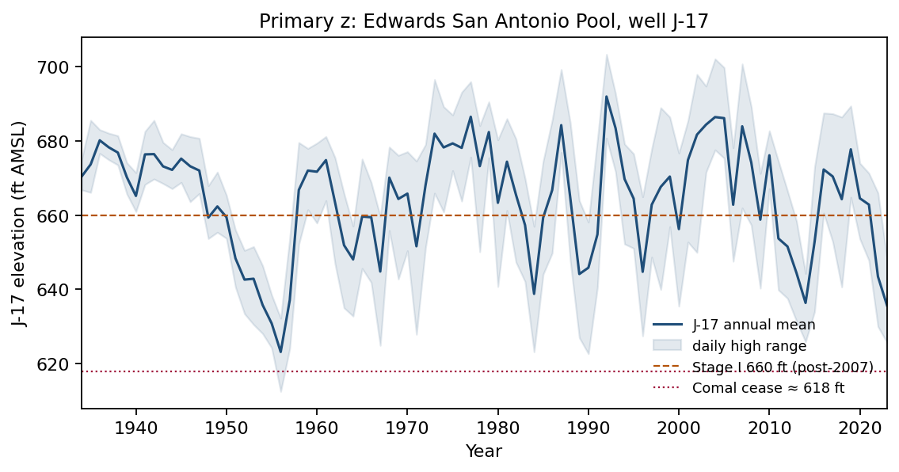
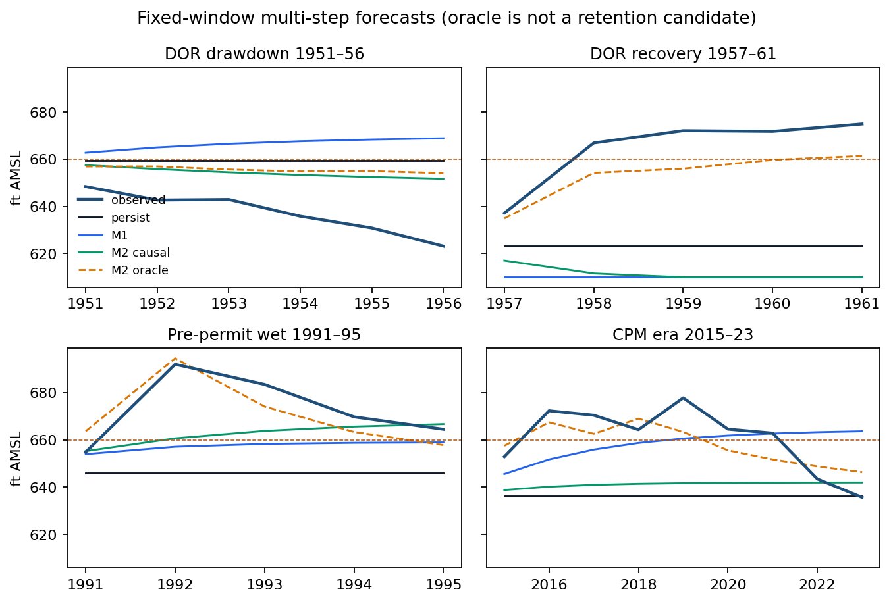
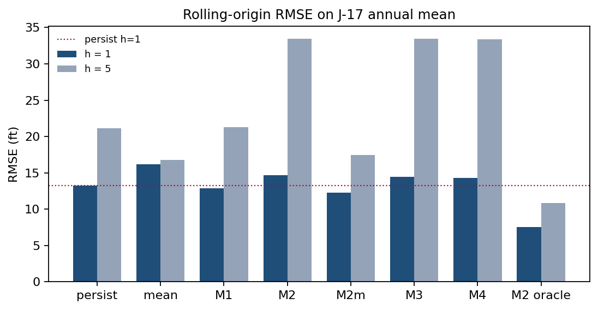
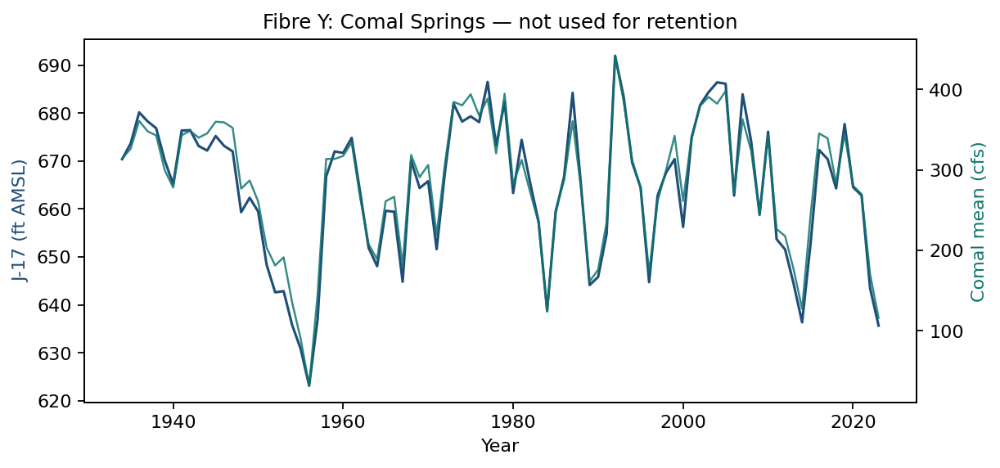

# Does a one-pool water-balance model improve forecasts of Edwards Aquifer head? A scored test at J-17

*Series:* J-17 annual-mean elevation, TWDB 6837203 / EAA AY-68-37-203, 1934–2023. *Status:* one scored specification $\Omega_{\mathrm{SA}}$; causal stock-flow is not retained, causal recharge forecasts are not retained, and the oracle water-balance is a diagnostic certificate excluded from retention. *Specification sheet:* `wave_e_edwards/SPECIFICATION.md` ($\Omega_{\mathrm{SA}}$ Pass 1 + Pass 2 + the intervention-leg object); the artifact-level specification match is verified by 36 machine checks (`batch 4/WAVE_E_SPEC_MATCH.md`).

## Abstract

The general theory of sustainability admits additional model structure only when that structure improves early warning, out-of-sample prediction, or intervention selection. This paper applies that test to the San Antonio Pool of the Edwards Aquifer, Texas.

The predictand is the calendar-year mean of daily-high water elevation at the J-17 index well (TWDB 6837203), 1934--2023. Nested models issue fixed-window and rolling-origin forecasts. Recharge (USGS/Puente) and well pumpage (Edwards Aquifer Authority Table 1) enter as candidate drivers. Comal Springs discharge is scored only after model retention is frozen.

One-year rolling root-mean-square error (RMSE) is 13.23 ft for last-value persistence and 12.84 ft for a univariate AR(1). The causal stock-flow specification, which persists the most recent recharge and pumpage, has RMSE 14.70 ft. Residual and delayed variants do not improve on persistence. Recharge has lag-1 correlation 0.17; using last year's recharge as next year's recharge therefore adds variation that is only weakly related to the increment being forecast. When the same map is given realized future recharge and pumpage, RMSE falls to 7.55 ft. Climate-informed recharge forecasts known at the origin---AR(1) on recharge, September--November Niño 3.4, lagged climate-division precipitation, and their combination---lie within 0.13 ft of AR(1) at the one-year horizon and have higher RMSE than persistence at the five-year horizon. Contemporaneous precipitation tracks recharge ($r=0.78$), but next year's precipitation is not known at the forecast origin. ENSO and last year's precipitation are not substitutes for it.

No two-pool, solute, or institutional-kernel claim is made. The specification is an R04.Cor2 approximation of a one-pool head map. The two-pool A005 module remains conditionally admissible.

**Keywords:** viability; forecast evaluation; Edwards Aquifer; J-17; model ablation; persistence

---

## 1. Introduction

Comparative model evaluation is required before additional structure is retained for prediction or control (general theory §15). Complexity is kept only if it improves a preregistered score. R04 prefers groundwater unless the readiness matrix fails, and the San Antonio Pool passes: a measured basin state, independent recharge, dated implementable use, a declared threshold, and a measured service series.

The question is whether stock-flow, residual, delay, or climate-informed recharge modules reduce forecast error of J-17 annual-mean head relative to last-value persistence and to a univariate AR(1). A companion evaluation on Northern cod (NAFO 2J3KL) is reported separately and is not pooled with these scores.

The paper does not assess whether the aquifer is sustainable, does not close the two-pool blocking list of module A005, and does not treat springflow or reconstructed storage as co-primary predictands. Phosphorus is not opened.

---

## 2. Data and specification

Claim types in Table 1 follow the programme taxonomy: D, data; E, empirical construct; M, model; N, normative threshold.

**Table 1.** Specification $\Omega_{\mathrm{SA}}$.

| Field | Contents | Type |
|---|---|---|
| System | Edwards Aquifer, San Antonio Pool, indexed by J-17 | D |
| $z_t$ | Calendar-year mean of daily-high J-17 elevation (ft AMSL) | D |
| Well | TWDB 6837203 / EAA AY-68-37-203 | D |
| Domain | San Antonio Pool; calendar years 1934--2023 | D |
| Physical threshold | Head high enough that Comal Springs does not cease ($\approx 618$ ft; 1956 daily minimum $612.51$ ft) | N / E |
| Institutional threshold | EAA Stage I, 10-day mean J-17 $< 660$ ft (in force after 2007) | N |
| Disturbance | Recharge pulses; unmodeled karst; Uvalde--San Antonio exchange | M |
| Implementable use | Pre-EAA pumping; post-1996/2007 permits and critical-period management | E |
| Service series | USGS 08168710 Comal Springs annual mean discharge (cfs) | D |

The predictand is a measured well series. It is not a GRACE or G3P storage reconstruction, a MODFLOW or GWSIM inversion, EAA reconstructed storage, the J-27 Uvalde index, San Marcos Springs, or total spring discharge.

Stage I at 660 ft is a 2007 institutional rule and is not applied as if it existed in 1956. Cessation of Comal Springs near 618 ft is a physical service bound. The indicator $\mathbf{1}\{H<660\}$ on the annual mean is a coarse Brier proxy, not the Authority's 10-day declaration.

Annual means use all available daily highs. Years with fewer than 240 observations are dropped. 1935 ($n=258$) and 1939 ($n=242$) are incomplete-coverage means. Missing days are not interpolated. The published pre-continuous composite (Beverly Lodges extension) is used as issued. Values from 2023 onward include provisional TWDB status `R`. The complete estimation panel ends in 2023.

Recharge $R$ is USGS total San Antonio-area recharge ($10^3$ acre-ft yr$^{-1}$), estimated by the Puente (1978) stream-loss method and independent of J-17 (Umphres and Choi 2025). Pumpage $P$ is well discharge from Edwards Aquifer Authority Table 1. Total spring discharge is stored and is not used as a driver. Climate predictors, used only in Section 5.4, are September--November Niño 3.4 (HadISST, anomaly relative to 1991--2020) and calendar-year precipitation in Texas climate divisions 06 and 07 (NCEI nClimDiv).

---

## 3. Forecast models

The one-pool map, with head clipped to $[610,710]$ ft, is

\[
H_{t+1}=\bigl[H_t+\alpha+\beta\tilde R_{t+1}+\gamma\tilde P_{t+1}+\delta H_t\bigr]_{\mathrm{clip}}.
\]

Forecasts are issued at the end of year $t$ from $(H,R,P)$ through $t$.

**Table 2.** Model ladder.

| ID | Class | Fluxes at $t+k$ | Role |
|---|---|---|---|
| persist | baseline | --- | $\hat H_{t+h}=H_t$ |
| mean | baseline | --- | training-window mean |
| M1 | autonomous | --- | $H_{t+1}=a+\varphi H_t$ |
| M2 | causal stock-flow | last $(R_t,P_t)$ persisted | candidate for retention |
| M2m | climatological stock-flow | training-mean $(R,P)$ | affine AR(1) |
| M3 | residual | as M2 | AR(1) residual on $\Delta H$ |
| M4 | delay | as M2 | starts from $H_{t-1}$ |
| M2\_oracle | diagnostic | realized future $R,P$ | excluded from retention |

With constant fluxes, M2m reduces to $H_{t+1}=(1+\delta)H_t+\mathrm{const}$ and is therefore the same affine class as M1. A numerical advantage for M2m is not extra structure.

Climate-informed variants (Section 5.4) replace persisted $R$ by a one-step forecast of $R$ from information known at $t$: AR(1) on $R$, lagged Niño 3.4, lagged climate-division precipitation, or all three. A precipitation-oracle variant uses year $t+h$ precipitation and is excluded from retention. For horizons $h>1$, the one-step recharge forecast is held constant.

---

## 4. Evaluation

The primary score is RMSE of annual-mean J-17, in feet. Secondary scores are mean absolute error; Brier score for $\mathbf{1}\{\hat H<660\}$, interpreted only for origins $\ge 2007$; and the sign-hit rate of $\Delta H$ on fixed windows.

Fixed windows:

1. Drought of record, drawdown: train 1934--1950, test 1951--1956.
2. Drought of record, recovery: train 1934--1956, test 1957--1961.
3. Pre-permit wet interval: train 1980--1990, test 1991--1995.
4. Critical-period era: train 1997--2014, test 2015--2023.

Rolling origin: minimum 15 training years; horizons $h=1$ and $h=5$; $n=75$ and $n=71$ respectively.

A causal module is retained only if its primary RMSE is strictly less than that of persistence and strictly less than that of the next-simpler causal model. Diagnostic oracles are excluded from retention. The Comal series is excluded from retention. Retention is decided on $z$ only; the service series is scored after that decision is frozen.

The scoring protocol is recorded in `protocol.md` and `protocol_pass2.md`. Windows and scores were specified before the corresponding RMSE tables were computed. The design is a fixed computational protocol rather than a prospective clinical-style registration.

---

## 5. Results

### 5.1 Series



**Figure 1.** J-17 annual mean and daily-high range. 1956 mean $623.15$ ft, daily minimum $612.51$ ft. 1992 mean $691.96$ ft, daily maximum $703.31$ ft. 2023 mean $635.68$ ft. Annual mean is below 660 ft in 31 of 90 years. Daily minimum is below 618 ft in one year (1956).

### 5.2 Fixed windows



**Figure 2.** Multi-step forecasts from the end of each training window. The oracle (dashed) is diagnostic.

**Table 3.** Fixed-window RMSE (ft).

| Window | persist | M1 | M2 | M2m | oracle |
|---|---:|---:|---:|---:|---:|
| Drawdown 1951--56 | 23.75 | 30.94 | **18.11** | 27.44 | 19.69 |
| Recovery 1957--61 | 43.62 | 56.24 | 55.32 | 37.74 | **12.26** |
| Pre-permit wet 1991--95 | 30.13 | 20.02 | 16.67 | 23.47 | **7.18** |
| Critical-period era 2015--23 | 27.41 | 15.62 | 23.37 | 14.79 | **8.70** |

The 1950s drawdown is a continuing low-recharge path. The last observed $R$ is already low, so causal M2 has lower RMSE than persistence (18 versus 24 ft) and also lower RMSE than the oracle. The linear map trained on 1934--1950 has the wrong sign on pumpage ($\gamma=+0.021$): pumping rose as the drought deepened, so the short window cannot identify a supply response.

The 1957--61 recovery is a recharge pulse ($R_{1956}=43.7$, $R_{1957}=1142.6$). Persistence stays at the 1956 floor (RMSE 44 ft). Causal M2 persists drought recharge and falls further (RMSE 55 ft). The oracle, given the 1957 flood year, tracks the rise (RMSE 12 ft). Recoveries on this specification are recharge events, not autonomous mean reversion and not a change in the pumping regime.

The 1992 peak and the 2015--23 window repeat the same split: the oracle follows the recharge year; persistence and persisted recharge do not.

### 5.3 Rolling origin



**Figure 3.** Rolling-origin RMSE. The oracle is excluded from retention.

**Table 4.** Rolling-origin summary (ft).

| Model | $h=1$ RMSE | $h=1$ MAE | $h=5$ RMSE |
|---|---:|---:|---:|
| persist | 13.23 | 10.73 | 21.11 |
| mean | 16.17 | 13.17 | **16.80** |
| M1 | 12.84 | 10.72 | 21.25 |
| M2 | 14.70 | 11.45 | 33.49 |
| M2m | 12.28 | 10.22 | 17.44 |
| M3 | 14.46 | 11.12 | 33.46 |
| M4 | 14.30 | 11.17 | 33.39 |
| M2\_oracle | 7.55 | 5.79 | 10.87 |

Full-sample correlations: $\mathrm{corr}(H_t,H_{t-1})=0.64$ with AR(1) coefficient $\hat\varphi=0.66$; $\mathrm{corr}(R_t,R_{t-1})=0.17$; $\mathrm{corr}(\Delta H_t,R_t)=0.74$. Full-sample $(\hat\beta,\hat\gamma)=(0.017,-0.026)$ have the expected signs when the sample is long. The water-balance class is not empty, but recharge is not persistent.

**Table 5.** Retention on rolling $h=1$ RMSE.

| Model | Versus persist | Distinct structure | Decision |
|---|---|---|---|
| M1 | $12.84<13.23$ | output only | retained (margin 0.39 ft) |
| M2 | $14.70>13.23$ | causal fluxes | reject |
| M2m | $12.28<13.23$ | no (affine AR(1)) | list only; not extra structure |
| M3, M4 | worse than persist | yes | reject |
| M2\_oracle | $7.55$ | uses future $R,P$ | excluded |

M1 is retained by the point-RMSE rule. The margin is 0.39 ft on $n=75$. That is not a confirmation of stock-flow structure; it is a slightly mean-reverting head series. M2m is listed by the same rule and then demoted on class grounds fixed in the protocol (constant fluxes reduce it to AR(1)); its numerical advantage does not constitute additional structure. No stock-flow, residual, or delay module is retained.

At $h=5$, the training mean (16.80 ft) has lower RMSE than persistence (21.11 ft). Five-year forecasts on this basin are climatology, not last value and not persisted recharge.

On post-2007 origins only ($n=16$, $h=1$): persist 13.09, M1 12.16, M2 13.31, oracle 8.03. The ranking is unchanged. The 660-ft Brier scores are 0.31 (persist), 0.25 (M1), and 0.19 (oracle). The annual-mean proxy is not the 10-day rule.

### 5.4 Climate-informed recharge

Information known at 31 December of year $t$ comprises $R_t$, the September--November Niño 3.4 anomaly of year $t$, and calendar-year precipitation in Texas climate divisions 06 and 07. December--February precipitation that includes January of $t+1$ is not used.


**Figure 4.** Rolling RMSE on J-17 for climate-informed recharge. The precipitation oracle uses year $t+h$ precipitation and cannot be retained.

**Table 6.** Rolling RMSE, climate-informed recharge.

| Model | $H$, $h=1$ | $H$, $h=5$ | $R$, $h=1$ ($10^3$ acre-ft) |
|---|---:|---:|---:|
| persist $H$ / persist $R$ | 13.23 | **21.11** | 702 |
| M1 | 12.84 | 21.25 | --- |
| M2\_Rar | 13.25 | 25.38 | 561 |
| M2\_enso | 12.82 | 24.42 | 528 |
| M2\_precip | 12.80 | 25.38 | 545 |
| M2\_combo | 12.71 | 26.88 | 538 |
| rain climatology | --- | --- | 556 |
| rain oracle | 10.56 | 16.91 | **354** |

Same-year $\mathrm{corr}(R,\bar P)=0.78$, which is why the precipitation oracle reduces head RMSE to 10.56 ft. It remains worse than the full $(R,P)$ oracle (7.55 ft): the linear rain map misses 1957-scale extremes.

Lagged precipitation and September--November Niño 3.4 have modest skill on $R$ relative to climatology (528--545 versus 556 $\times 10^3$ acre-ft). They do not constitute forecast structure on $z$:

- the point-RMSE rule lists ENSO, lagged precipitation, and the combination (each less than persist and less than M1);
- margins versus M1 are 0.02, 0.04, and 0.13 ft;
- at $h=5$ all three have RMSE 3--6 ft higher than persistence;
- they are M2m with a weakly adjusted intercept and do not constitute additional forecast structure.

M2\_Rar loses at $h=1$ (13.25 ft). Autoregression on nearly white recharge is not a recharge forecast.

On the 1957--61 recovery, no causal climate-informed module has lower RMSE than persistence (persist 43.6 ft; best causal about 48.8 ft; precipitation oracle 33.7 ft). September--November 1956 is La Niña ($-0.92$) and does not announce $R_{1957}=1143$.

No climate-informed recharge module is retained. Closing the gap between persistence and the oracle would require next year's recharge, which is not available at the annual forecast origin.

### 5.5 Service series after freeze



**Figure 5.** Comal annual mean versus J-17. Contemporaneous $r=0.986$. The fibre is a measured service, not an independent information source.

The map $Q=c_0+c_1 H$ was fitted on 1934--1950 only ($c_0=-2876$, $c_1=4.77$) and applied to already-issued $\hat H$. One-year Comal RMSE: persist 71.9 cfs, M1 69.0, M2m 68.7, M2 74.8, oracle 45.3.

The service series does not change retention. It cannot: it is nearly a linear transform of $z$. Comal is an independent measurement (a USGS spring gauge, not used to construct J-17). It is not an independent information source. Gravimetric storage or the J-27 Uvalde index would be different objects, not a second fibre of this specification. Eastern-basin recharge was stored and not used.

---

## 6. Discussion

The one-pool increment $\Delta H$ tracks recharge ($r=0.74$). Oracle RMSE is about half of persistence at both $h=1$ and $h=5$. The map accounts for contemporaneous increments when the year's water is known.

As a one-year forecast, causal stock-flow fails because the dominant increment is not persistent. Residual and delayed variants inherit that timing error. Recoveries in 1957 and 1992 are missed by every causal model and captured by the oracle. The identified driver has the wrong timing for an annual origin: the same pattern appears on the companion Northern cod evaluation, where a more accurate catch series does not rescue constant-productivity surplus production. The two score tables are not pooled.

The 1950s decline is not a Stage I event. The 660 ft line is a 2007 rule. 1956 is a physical near-cessation at Comal (annual mean springflow 32 cfs; daily J-17 minimum 612.51 ft). Slack to 660 ft is the wrong leading indicator for 1951--56, just as the 2016 cod LRP was the wrong leading indicator for 1983--90.

Two-pool exchange, solute, and barrier bookkeeping were not fitted and cannot be retained. In the A005 parameterization, $q_{\mathrm{rel}}$ is removed, leakage is not applicable, and no $B_k$ or $\chi$ term is fitted; the blocking list is not closed by this paper. Post-1997 pumpage no longer spikes with drought as in 1956 (321 kaf wells); that change is already in $P_t$. A separate critical-period switch does not add a degree of freedom beyond the pumpage series.

Limitations follow the data and the map. The annual affine one-pool specification is not a karst model: conduits, the Uvalde--San Antonio divide, and unconfined recharge-zone storage remain in the residual. Total-area $R$ and $P$ mix the San Antonio and Uvalde pools; that is a declared approximation defect. Recharge is a Puente estimate; pumpage includes unreported domestic, livestock, and federal use. Neither series is $z$. M4 is a one-year information delay, not a set-valued conservative filter. The sample is 90 years with four short test windows; the 0.39 ft AR(1) margin is not a significance claim.

The specification is an R04.Cor2 approximation of a one-pool head map. It does not transfer an interval-verified linear template (E5 is not this specification), does not instantiate a closed-loop information filter, and does not close A005. Model selection used $z$ only. No programme gate is treated as closed without specification matching and independent verification.

On this evidence, modules that are not identified on the training data, or whose drivers arrive too late to be causal at the annual origin, do not reduce forecast error. The retained forecast is persistence with a small AR(1) correction; the water-balance map serves as a certificate for a year whose recharge is already known.

---

## 7. Conclusions

On locked J-17 annual-mean head, last-value persistence is more accurate than a causal one-pool balance that persists last year's recharge. Univariate AR(1) improves one-year RMSE by 0.39 ft and is retained as an output-only model. The same balance, given realized recharge and pumpage, cuts error nearly in half. Climate variables known at the annual origin do not recover that gap.

The paper reports a forecast comparison. It does not conclude that the aquifer is unsustainable, and it does not conclude that the general theory is empirically confirmed on this basin.

Reopening the climate module with additional indices (PDO, AMO) on this annual origin would re-instantiate the rejected structure; a mid-year nowcast would require a new evaluation protocol.

---

## Data and code availability

Input data, scoring scripts, and result files are in `wave_e_edwards/` at <https://github.com/MIKEAA2020/general-sustainability>; the specification sheet is `wave_e_edwards/SPECIFICATION.md`. J-17 daily highs: Texas Water Development Board well 6837203. Recharge: Umphres and Choi (2025), DOI 10.5066/P1BI62NY. Pumpage: Edwards Aquifer Authority (2024/25), Table 1. Comal: USGS 08168710. Niño 3.4: NOAA PSL HadISST (committed raw file `data/psl_nino34_long.data`). Precipitation: NCEI nClimDiv `climdiv-pcpndv-v1.0.0-20260806` — not distributed with the repository (provenance URL in `data/SOURCES.md`); the three `pcp_*` columns of the fixed panel are therefore not reproducible from the committed code alone, while the two Niño columns rebuild from the committed PSL file to machine precision. Scoring Pass 1/2 from the committed `data/annual_panel.csv` does not require the nClimDiv file. An independent execution of the scoring scripts reproduced the committed result files (`batch 4/WAVE_E_RERUN.md`), and the artifact-level specification match is verified by 36 machine checks (`batch 4/WAVE_E_SPEC_MATCH.md`).

```
python3 src/build_panel.py && python3 src/build_climate.py
python3 src/run_ladder.py && python3 src/run_recharge.py
python3 src/make_figures.py
```

`build_panel.py` writes head, recharge, and pumpage to a scratch file and leaves the fixed twenty-column panel in place when those columns already match. `build_climate.py` rebuilds the two Niño 3.4 columns from the committed PSL raw file; rebuilding the three precipitation columns additionally requires the omitted nClimDiv file and leaves the fixed panel in place when those columns already match.

---

## References

Edwards Aquifer Authority. 2024/25. *2023 Groundwater Discharge and Usage*. Table 1, after USGS letter report 5 April 2024. <https://www.edwardsaquifer.org/wp-content/uploads/2025/05/2023-Groundwater-Discharge-and-Usage.pdf>

Edwards Aquifer Authority. Critical Period / Drought Management. <https://www.edwardsaquifer.org/groundwater-users/critical-period-drought-management/>

Puente, C. 1978. *Method of estimating natural recharge to the Edwards Aquifer in the San Antonio area, Texas.* U.S. Geological Survey.

Texas Water Development Board. Water Data for Texas, well 6837203 (J-17). <https://waterdatafortexas.org/groundwater/well/6837203>

Umphres, G. D., and Choi, N. J. 2025. Estimated Annual Recharge to the Edwards Aquifer in the San Antonio Area, by Stream Basin or Ungaged Area, 1934--2024. U.S. Geological Survey data release. <https://doi.org/10.5066/P1BI62NY>

U.S. Geological Survey. National Water Information System, site 08168710, Comal Springs at New Braunfels, Texas.

NOAA Physical Sciences Laboratory. Niño 3.4 monthly SST (HadISST). <https://psl.noaa.gov/data/timeseries/month/data/nino34.long.data>

NOAA National Centers for Environmental Information. nClimDiv precipitation, file `climdiv-pcpndv-v1.0.0-20260806`. <https://www.ncei.noaa.gov/pub/data/cirs/climdiv/climdiv-pcpndv-v1.0.0-20260806>
